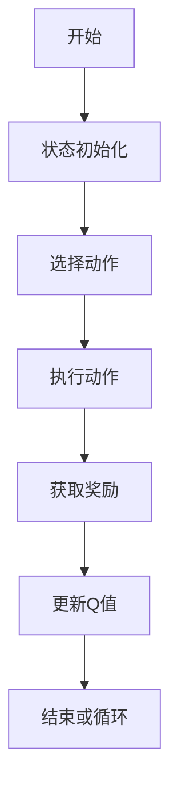
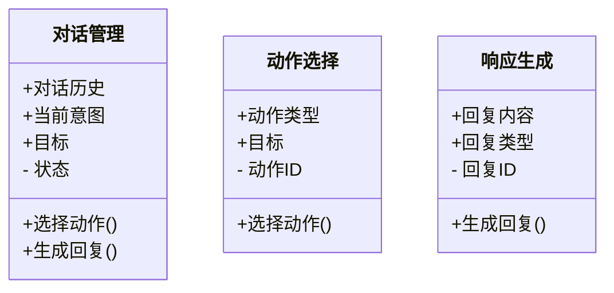
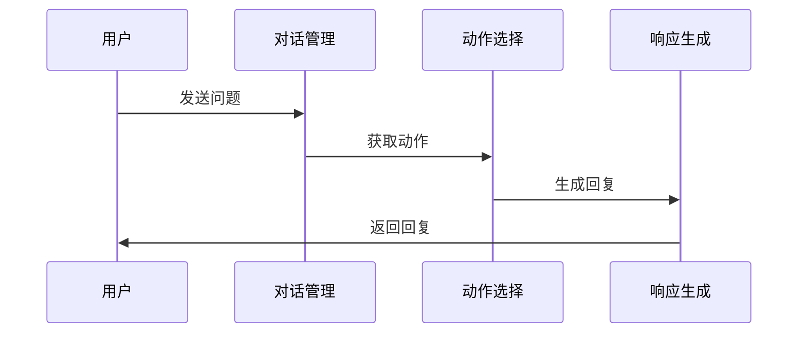

                 


# AI Agent的对话管理策略与实现

> 关键词：AI Agent，对话管理，机器学习，自然语言处理，强化学习

> 摘要：本文探讨了AI Agent的对话管理策略与实现，涵盖对话管理的背景、核心概念、算法原理、系统架构设计以及项目实战。通过理论分析与实际案例结合，深入讲解对话管理的关键技术与实现方法，为读者提供全面的技术指导。

---

# 第一部分: AI Agent对话管理基础

## 第1章: AI Agent与对话管理概述

### 1.1 AI Agent的基本概念

#### 1.1.1 什么是AI Agent
AI Agent（人工智能代理）是指能够感知环境、自主决策并执行任务的智能实体。AI Agent通过与用户交互，理解和响应需求，提供服务。

#### 1.1.2 AI Agent的类型与特点
- **简单反射型**：基于预定义规则响应输入。
- **基于模型的反应式**：利用环境模型动态调整行为。
- **目标驱动型**：基于目标驱动决策。
- **实用驱动型**：通过效用函数优化决策。

#### 1.1.3 对话管理在AI Agent中的作用
对话管理负责协调AI Agent与用户之间的对话流程，确保对话目标的实现。它涉及理解用户意图、生成适当回应，并根据对话历史调整策略。

### 1.2 对话管理的核心概念

#### 1.2.1 对话管理的定义
对话管理是AI Agent规划和控制对话流程的能力，确保对话符合用户需求和系统目标。

#### 1.2.2 对话管理的关键要素
- **对话状态**：对话的历史信息和当前情况。
- **对话目标**：对话希望达成的结果。
- **对话策略**：实现目标的步骤和方法。

#### 1.2.3 对话管理的目标与挑战
目标包括提高对话效率、准确理解和满足用户需求。挑战涉及语义理解、多轮对话管理以及应对模糊或复杂输入。

---

## 第2章: 对话管理的背景与应用

### 2.1 对话管理的发展历程

#### 2.1.1 从规则驱动到数据驱动
早期对话管理依赖规则，现逐渐转向基于机器学习的数据驱动方法，提升灵活性和适应性。

#### 2.1.2 大模型在对话管理中的应用
大语言模型（如GPT）通过自监督学习掌握对话模式，生成自然流畅的回复。

#### 2.1.3 当前对话管理的技术趋势
多模态对话、自适应策略和个性化服务成为发展方向。

### 2.2 对话管理的主要应用场景

#### 2.2.1 智能客服
通过对话系统解决用户问题，提供高效服务。

#### 2.2.2 智能助手
帮助用户完成日常任务，如设置提醒或查询信息。

#### 2.2.3 游戏AI与虚拟助手
在游戏中提供智能交互，提升用户体验。

---

## 第3章: 对话管理的核心原理

### 3.1 对话管理的流程与模型

#### 3.1.1 对话状态表示
对话状态表示方法包括基于关键词、向量表示和知识图谱。状态表示需简洁且准确反映对话上下文。

#### 3.1.2 动作选择
基于当前状态和目标，选择下一步动作。常用方法包括规则匹配和强化学习。

#### 3.1.3 响应生成
根据对话历史和当前状态，生成自然的回复。生成方法包括模板填充和基于模型的生成。

### 3.2 对话管理的策略与方法

#### 3.2.1 基于规则的策略
通过预定义规则匹配对话内容，适用于简单场景。

#### 3.2.2 基于检索的策略
从预定义库中检索最合适的回复。

#### 3.2.3 基于生成的策略
使用生成模型（如GPT）生成回复，适用于复杂对话。

### 3.3 对话管理的评价指标

#### 3.3.1 对话流畅度
评估回复的自然性和连贯性。

#### 3.3.2 对话准确性
确保回复内容正确无误。

#### 3.3.3 用户满意度
衡量用户对对话结果的满意程度。

---

# 第二部分: 对话管理的核心概念与联系

## 第4章: 对话管理的核心概念原理

### 4.1 对话状态表示

#### 4.1.1 状态表示方法
- **关键词表示**：提取关键信息。
- **向量表示**：用向量表示语义。
- **知识图谱表示**：利用知识图谱捕捉上下文。

#### 4.1.2 状态表示的挑战
- 状态空间过大。
- 动态变化难以捕捉。
- 高维数据处理复杂。

#### 4.1.3 状态表示的优化
采用降维、聚类和增强学习等方法优化状态表示。

### 4.2 动作选择机制

#### 4.2.1 动作选择的原理
根据当前状态和目标，选择最优动作。常用方法包括Q-learning和策略梯度。

#### 4.2.2 动作选择的算法
- **DQN算法**：通过经验回放和策略评估优化动作选择。
- **PG算法**：基于策略的优化方法。

#### 4.2.3 动作选择的评估
使用准确率、召回率和F1分数评估动作选择的性能。

### 4.3 响应生成模型

#### 4.3.1 响应生成的原理
利用生成模型生成自然回复，通过损失函数优化生成过程。

#### 4.3.2 响应生成的算法
- **Transformer架构**：用于生成回复的序列模型。
- **对抗训练**：通过生成器和判别器对抗提升回复质量。

#### 4.3.3 响应生成的优化
采用注意力机制和位置编码提升生成质量。

---

## 第5章: 对话管理的核心概念对比与ER图

### 5.1 对话管理核心概念对比

| 对比维度 | 对话状态 | 动作选择 | 响应生成 |
|----------|----------|----------|----------|
| 输入      | 当前对话上下文 | 当前状态和目标 | 当前状态和动作 |
| 输出      | 表示状态 | 动作选择 | 回复内容 |
| 方法      | 向量、关键词 | Q-learning | Transformer |

### 5.2 对话管理的ER实体关系图

```mermaid
er
    %% ER图展示对话管理的核心实体关系
    classDiagram
    class 对话状态 {
        id
        对话历史
        当前意图
    }
    class 动作选择 {
        id
        动作类型
        目标
    }
    class 响应生成 {
        id
        回复内容
        回复类型
    }
    对话状态 --> 动作选择 : 提供状态信息
    动作选择 --> 响应生成 : 选择生成动作
    响应生成 --> 对话状态 : 更新对话状态
```

---

## 第6章: 对话管理的算法原理

### 6.1 基于DQN的对话管理算法



#### 6.1.1 算法流程
1. **状态初始化**：确定当前对话状态。
2. **动作选择**：根据状态选择动作。
3. **执行动作**：生成回复。
4. **获取奖励**：评估回复质量。
5. **更新Q值**：优化策略。

#### 6.1.2 算法实现代码
```python
import numpy as np

class DQN:
    def __init__(self, state_size, action_size):
        self.state_size = state_size
        self.action_size = action_size
        self.gamma = 0.99
        self.epsilon = 1.0
        self.epsilon_min = 0.01
        self.memory = []
        self.model = self.build_model()

    def build_model(self):
        # 构建DQN网络模型
        pass

    def remember(self, state, action, reward, next_state):
        self.memory.append((state, action, reward, next_state))

    def act(self, state):
        if np.random.random() < self.epsilon:
            return np.random.randint(self.action_size)
        else:
            return self.model.predict(state)[0]

    def replay(self, batch_size):
        mini_batch = random.sample(self.memory, batch_size)
        for state, action, reward, next_state in mini_batch:
            target = reward + self.gamma * np.max(self.model.predict(next_state))
            target_f = self.model.predict(state)
            target_f[0][action] = target
            self.model.fit(state, target_f, epochs=1, verbose=0)
        self.epsilon = max(self.epsilon_min, self.epsilon * 0.99)
```

#### 6.1.3 算法的数学模型
Q-learning的目标是通过经验回放优化Q值：
$$ Q(s,a) = (1-\alpha)Q(s,a) + \alpha (r + \gamma \max Q(s',a')) $$
其中，$\alpha$是学习率，$\gamma$是折扣率。

---

## 第7章: 对话管理的系统架构设计

### 7.1 项目背景与需求分析

#### 7.1.1 项目背景
开发一个智能客服对话系统，解决用户常见问题。

#### 7.1.2 项目需求
实现对话管理模块，支持多轮对话和意图识别。

### 7.2 系统功能设计

#### 7.2.1 领域模型设计


#### 7.2.2 系统架构设计


#### 7.2.3 系统接口设计
- 输入接口：接收用户输入。
- 输出接口：返回系统回复。
- 数据接口：访问知识库。

### 7.3 系统交互流程设计



---

## 第8章: 对话管理的项目实战

### 8.1 环境安装与配置

#### 8.1.1 安装依赖
```bash
pip install numpy tensorflow matplotlib
```

#### 8.1.2 安装框架
使用Keras或TensorFlow框架搭建模型。

### 8.2 系统核心实现

#### 8.2.1 对话管理实现
```python
class DialogManager:
    def __init__(self):
        self.dialogue_history = []
        self.currentIntent = None
        self.goals = []

    def update_state(self, input):
        # 更新对话状态
        pass

    def select_action(self):
        # 根据状态选择动作
        pass

    def generate_response(self):
        # 根据动作生成回复
        pass
```

#### 8.2.2 动作选择实现
```python
class ActionSelector:
    def __init__(self):
        self.actions = []
        self.goals = []

    def choose_action(self, state):
        # 选择最优动作
        pass
```

#### 8.2.3 响应生成实现
```python
class ResponseGenerator:
    def __init__(self):
        self.model = self.build_model()

    def build_model(self):
        # 构建生成模型
        pass

    def generate_response(self, state, action):
        # 生成回复
        pass
```

### 8.3 代码应用与分析

#### 8.3.1 动作选择代码
```python
def choose_action(state):
    # 假设state是向量表示
    if state[0] > 0.5:
        return 'ask_question'
    else:
        return 'provide_info'
```

#### 8.3.2 响应生成代码
```python
def generate_response(action):
    response_map = {
        'ask_question': '请问您具体想了解哪方面的问题？',
        'provide_info': '根据您的需求，我可以提供相关信息。'
    }
    return response_map[action]
```

### 8.4 实际案例分析

#### 8.4.1 案例背景
用户咨询产品信息，系统需提供相关资料。

#### 8.4.2 对话流程
1. 用户：我想了解贵公司产品。
2. 系统：请问您具体想了解哪方面的问题？
3. 用户：我想了解产品的功能。
4. 系统：以下是我们的产品功能列表。

---

## 第9章: 对话管理的最佳实践与总结

### 9.1 最佳实践

#### 9.1.1 数据质量
确保训练数据的多样性和质量，避免偏差。

#### 9.1.2 模型优化
定期更新模型，引入新数据和反馈。

#### 9.1.3 用户反馈
收集用户反馈，持续优化对话策略。

### 9.2 小结

对话管理是实现高效人机交互的核心技术，涉及多个关键环节。通过合理选择算法、优化系统架构和持续迭代，可显著提升对话系统性能。

### 9.3 注意事项

- **数据隐私**：确保用户数据安全。
- **系统健壮性**：处理异常情况。
- **用户体验**：保持回复自然流畅。

### 9.4 拓展阅读

推荐阅读《对话系统入门》和《强化学习实战》等书籍，深入理解对话管理和强化学习技术。

---

# 作者

作者：AI天才研究院/AI Genius Institute  
联系方式：[email protected]  
简介：专注于人工智能前沿技术研究与应用开发，致力于推动AI技术的创新与普及。

---

通过本文的系统讲解，读者可以全面掌握AI Agent对话管理的策略与实现方法，从理论到实践，为开发高效的对话系统提供指导。

