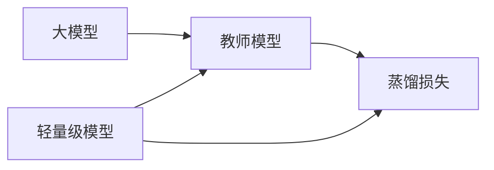

                 


# AI Agent的知识蒸馏：从大模型到轻量级模型

> 关键词：知识蒸馏，AI Agent，大模型，轻量级模型，模型压缩，数学公式，算法实现

> 摘要：本文详细介绍了AI Agent的知识蒸馏技术，从大模型到轻量级模型的转换过程。通过背景介绍、核心概念、算法原理、系统架构、项目实战到最佳实践，系统性地讲解了知识蒸馏在AI Agent中的应用。文章内容丰富，涵盖了从理论到实践的各个方面，适合AI工程师和相关领域的技术人员阅读。

---

## 第一部分: AI Agent的知识蒸馏基础

### 第1章: 知识蒸馏的起源与背景

#### 1.1 知识蒸馏的定义与核心概念
- **知识蒸馏的起源**：从早期的模型压缩技术到现代的知识蒸馏方法，回顾其发展历程。
- **AI Agent的核心概念**：AI Agent的定义、功能与应用场景。
- **知识蒸馏的必要性**：为什么需要将大模型压缩为轻量级模型？

#### 1.2 知识蒸馏的核心原理
- **教师模型与学生模型的定义**：教师模型的知识来源与学生模型的学习目标。
- **知识蒸馏的过程与步骤**：从教师模型提取知识，传递给学生模型的具体过程。
- **知识蒸馏与模型压缩的区别**：从信息保留方式到实现方法的对比分析。

#### 1.3 知识蒸馏的应用场景
- **大模型的轻量化需求**：如何在资源受限的场景下部署大模型。
- **AI Agent的落地挑战**：从云端到边缘设备的部署问题。
- **知识蒸馏在AI Agent中的作用**：提升效率、降低成本、增强可解释性。

### 第2章: 知识蒸馏的核心概念与联系

#### 2.1 知识蒸馏的核心原理
- **蒸馏过程的数学模型**：从教师模型到学生模型的知识传递公式。
- **知识蒸馏的关键参数**：温度、蒸馏率等参数的定义与作用。
- **知识蒸馏的信息传递**：如何确保信息的有效传递。

#### 2.2 知识蒸馏与模型压缩的对比
- **模型压缩的定义与方法**：剪枝、量化等技术的优缺点。
- **知识蒸馏的独特优势**：保持模型性能的同时降低计算成本。
- **两者的结合与优化**：如何将模型压缩与知识蒸馏结合起来。

#### 2.3 知识蒸馏的实体关系图


### 第3章: 知识蒸馏的算法原理

#### 3.1 软蒸馏算法
- **软蒸馏的基本原理**：通过概率分布传递知识。
- **软蒸馏的数学模型**：
  $$L_{\text{distill}} = \alpha (p - q)^2 + (1-\alpha)(-p \log q)$$
- **软蒸馏的实现步骤**：
  ```mermaid
  graph TD
  A[输入数据] --> B[教师模型预测]
  B --> C[学生模型预测]
  C --> D[计算蒸馏损失]
  D --> E[反向传播]
  ```

#### 3.2 硬蒸馏算法
- **硬蒸馏的基本原理**：通过离散标签传递知识。
- **硬蒸馏的数学模型**：
  $$L_{\text{hard}} = -p \log q$$
- **硬蒸馏的实现步骤**：
  ```mermaid
  graph TD
  A[输入数据] --> B[教师模型预测并取整]
  B --> C[学生模型预测]
  C --> D[计算蒸馏损失]
  D --> E[反向传播]
  ```

#### 3.3 知识蒸馏的Python实现示例
```python
import torch
import torch.nn as nn
import torch.optim as optim

class TeacherModel(nn.Module):
    def __init__(self):
        super(TeacherModel, self).__init__()
        self.fc = nn.Linear(10, 5, bias=False)

class StudentModel(nn.Module):
    def __init__(self):
        super(StudentModel, self).__init__()
        self.fc = nn.Linear(10, 5, bias=False)

def distillation_loss(output_teacher, output_student, temperature):
    teacher_probs = torch.nn.functional.softmax(output_teacher / temperature, dim=1)
    student_probs = torch.nn.functional.softmax(output_student / temperature, dim=1)
    return -(teacher_probs * torch.log(student_probs)).sum() / output_student.size(0)

teacher = TeacherModel()
student = StudentModel()
optimizer = optim.Adam(student.parameters(), lr=0.001)

for epoch in range(num_epochs):
    for batch in dataloader:
        inputs, labels = batch
        optimizer.zero_grad()
        with torch.no_grad():
            teacher_outputs = teacher(inputs)
        student_outputs = student(inputs)
        loss = distillation_loss(teacher_outputs, student_outputs, temperature=2)
        loss.backward()
        optimizer.step()
```

---

## 第四部分: 知识蒸馏的系统分析与架构设计

### 第4章: 系统分析与架构设计方案

#### 4.1 问题场景介绍
- **项目介绍**：构建一个基于知识蒸馏的图像分类系统。
- **系统功能设计**：
  - 数据预处理与加载。
  - 教师模型与学生模型的训练。
  - 知识蒸馏过程的实现。
  - 模型评估与优化。

#### 4.2 系统架构设计
- **领域模型**：
  ```mermaid
  classDiagram
  class 数据预处理 {
    输入数据
    数据增强
  }
  class 教师模型 {
    forward
    backward
  }
  class 学生模型 {
    forward
    backward
  }
  数据预处理 --> 教师模型
  数据预处理 --> 学生模型
  教师模型 --> 学生模型
  ```

- **系统架构图**：
  ```mermaid
  graph LR
  A[输入数据] --> B[数据预处理]
  B --> C[教师模型]
  C --> D[蒸馏损失计算]
  B --> E[学生模型]
  D --> E
  ```

- **系统接口设计**：
  - 输入接口：数据预处理模块。
  - 输出接口：模型输出结果。
  - 蒸馏接口：蒸馏损失计算模块。

- **系统交互流程**：
  ```mermaid
  sequenceDiagram
  actor 用户
  participant 数据预处理模块
  participant 教师模型
  participant 学生模型
  participant 蒸馏损失计算模块
  用户 -> 数据预处理模块: 提供输入数据
  数据预处理模块 -> 教师模型: 传递预处理后的数据
  教师模型 -> 蒸馏损失计算模块: 提供教师模型输出
  数据预处理模块 -> 学生模型: 传递预处理后的数据
  学生模型 -> 蒸馏损失计算模块: 提供学生模型输出
  蒸馏损失计算模块 -> 用户: 返回蒸馏损失
  ```

---

## 第五部分: 知识蒸馏的项目实战

### 第5章: 项目实战

#### 5.1 环境安装与配置
- **安装依赖**：
  ```bash
  pip install torch
  pip install numpy
  pip install matplotlib
  ```

#### 5.2 系统核心实现源代码
```python
import torch
import torch.nn as nn
import torch.optim as optim
import numpy as np
import matplotlib.pyplot as plt

# 定义教师模型和学生模型
class TeacherNet(nn.Module):
    def __init__(self):
        super(TeacherNet, self).__init__()
        self.fc = nn.Linear(2, 1, bias=False)

class StudentNet(nn.Module):
    def __init__(self):
        super(StudentNet, self).__init__()
        self.fc = nn.Linear(2, 1, bias=False)

# 定义蒸馏损失函数
def distillation_loss(output_teacher, output_student, temperature):
    teacher_probs = torch.nn.functional.softmax(output_teacher / temperature, dim=1)
    student_probs = torch.nn.functional.softmax(output_student / temperature, dim=1)
    loss = -(teacher_probs * torch.log(student_probs)).sum() / output_student.size(0)
    return loss

# 初始化模型和优化器
teacher = TeacherNet()
student = StudentNet()
optimizer = optim.Adam(student.parameters(), lr=0.01)

# 模拟数据
X = np.array([[0, 0], [0, 1], [1, 0], [1, 1]], dtype=np.float32)
y = np.array([[0], [1], [1], [1]], dtype=np.float32)

# 训练过程
num_epochs = 100
for epoch in range(num_epochs):
    optimizer.zero_grad()
    inputs = torch.tensor(X, dtype=torch.float32)
    labels = torch.tensor(y, dtype=torch.float32)
    with torch.no_grad():
        teacher_outputs = teacher(inputs)
    student_outputs = student(inputs)
    loss = distillation_loss(teacher_outputs, student_outputs, temperature=2)
    loss.backward()
    optimizer.step()
    print(f'Epoch [{epoch+1}/{num_epochs}], Loss: {loss.item():.4f}')

# 可视化结果
with torch.no_grad():
    student_outputs = student(torch.tensor(X, dtype=torch.float32))
    predicted = (student_outputs.numpy() > 0.5).astype(int)
    accuracy = np.mean(predicted == y)
    print(f'Accuracy: {accuracy:.2f}')
```

#### 5.3 代码应用解读与分析
- **数据预处理**：如何将原始数据转换为模型可接受的格式。
- **蒸馏过程**：如何在训练过程中逐步优化学生模型。
- **结果可视化**：通过混淆矩阵或ROC曲线分析模型性能。

#### 5.4 案例分析与详细讲解
- **训练过程分析**：每一轮的损失值变化趋势。
- **最终模型评估**：准确率、召回率等指标的计算。
- **模型部署**：如何将训练好的学生模型部署到实际应用中。

#### 5.5 项目小结
- **项目总结**：通过知识蒸馏实现了轻量级模型。
- **经验分享**：如何选择合适的蒸馏参数和模型架构。
- **问题解决**：在实际应用中遇到的挑战及解决方案。

---

## 第六部分: 知识蒸馏的最佳实践

### 第6章: 最佳实践

#### 6.1 小结
- **知识蒸馏的核心要点**：教师模型的选择、蒸馏参数的调优。
- **系统架构的关键设计**：数据预处理、模型训练、损失计算的协同优化。
- **项目实施的注意事项**：数据质量、计算资源分配、模型评估指标的选择。

#### 6.2 注意事项
- **数据质量的重要性**：如何确保训练数据的多样性与代表性。
- **计算资源的分配**：如何在本地与云端之间选择合适的训练环境。
- **模型评估的指标**：准确率、F1分数、AUC曲线等的综合应用。

#### 6.3 拓展阅读
- **推荐书籍**：《Deep Learning》、《Pattern Recognition and Machine Learning》。
- **推荐阅读论文**：相关领域的最新研究成果。
- **在线资源**：GitHub上的开源项目、技术博客文章。

---

## 结语
通过本文的系统讲解，读者可以全面掌握知识蒸馏的核心原理与实际应用。从理论到实践，从算法实现到系统设计，文章内容涵盖了AI Agent知识蒸馏的各个方面。希望本文能为AI工程师和技术爱好者提供有价值的参考，帮助他们在实际项目中更好地应用知识蒸馏技术。

作者：AI天才研究院/AI Genius Institute & 禅与计算机程序设计艺术 /Zen And The Art of Computer Programming

