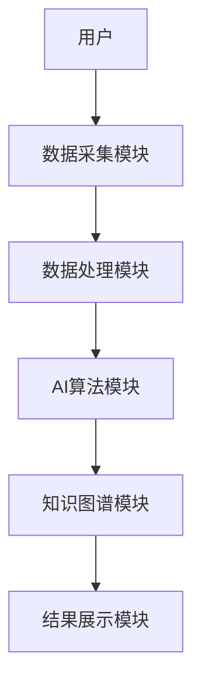
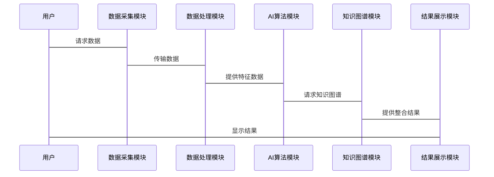

                 


# AI辅助企业并购整合规划：文化融合与业务协同路径的智能设计

> 关键词：AI辅助、企业并购、整合规划、文化融合、业务协同、智能设计

> 摘要：本文探讨了人工智能在企业并购整合中的应用，重点分析了文化融合与业务协同路径的智能设计。通过结合自然语言处理、机器学习和数据挖掘等技术，提出了一套高效的AI辅助企业并购整合方案，涵盖了从并购前的分析到并购后的整合全过程。文章还详细介绍了系统架构设计和实际案例，为企业的并购整合提供了实践指导。

---

# 第一部分：企业并购整合的背景与挑战

## 第1章：企业并购整合的基本概念

### 1.1 并购整合的定义与分类

#### 1.1.1 并购的定义与分类
- **并购**（Mergers and Acquisitions，M&A）是指一家企业与其他企业合并或收购其资产、股权等行为。
- **分类**：
  - **横向并购**：同一行业内的并购。
  - **纵向并购**：上下游产业的并购。
  - **混合并购**：跨行业并购。

#### 1.1.2 并购的动机与目的
- **动机**：
  - 拓展市场。
  - 获取新技术或资源。
  - 降低成本。
- **目的**：
  - 实现规模经济。
  - 提高市场竞争力。
  - 优化资源配置。

#### 1.1.3 并购的历史演变
- 从早期的简单合并到现代的多元化并购，企业并购经历了从“数量扩张”到“价值创造”的转变。

### 1.2 企业整合的核心要素

#### 1.2.1 业务整合
- **目标**：实现业务流程的协同。
- **方法**：优化组织结构，共享资源。

#### 1.2.2 文化整合
- **目标**：消除文化冲突，形成统一的企业文化。
- **方法**：文化评估、培训和沟通。

#### 1.2.3 资源整合
- **目标**：最大化资源利用效率。
- **方法**：统一管理、共享资源。

---

## 第2章：传统企业并购整合的挑战

### 2.1 传统并购整合的痛点

#### 2.1.1 信息不对称问题
- **表现**：目标企业的真实情况难以全面了解。
- **影响**：可能导致并购失败或价值低估。

#### 2.1.2 文化冲突与融合困难
- **表现**：不同企业文化差异导致员工抵触。
- **影响**：整合效果不佳，员工效率下降。

#### 2.1.3 业务协同效率低下
- **表现**：业务流程重复，资源浪费。
- **影响**：整合成本增加，收益减少。

### 2.2 传统并购整合的局限性

#### 2.2.1 管理复杂性
- **表现**：多层级管理导致决策迟缓。
- **影响**：难以快速响应市场变化。

#### 2.2.2 资源浪费与成本高昂
- **表现**：重复投资，资源分配不合理。
- **影响**：企业利润下降，竞争力减弱。

#### 2.2.3 并购失败的高概率
- **表现**：并购后企业绩效未达预期。
- **影响**：企业声誉受损，投资者信心下降。

### 2.3 传统并购整合的改进方向

#### 2.3.1 提高信息透明度
- **方法**：建立信息共享平台，确保双方信息对称。

#### 2.3.2 加强文化管理
- **方法**：制定文化融合计划，加强员工培训。

#### 2.3.3 优化业务协同流程
- **方法**：引入协同工具，实现业务流程标准化。

---

# 第二部分：AI在企业并购整合中的应用

## 第3章：AI辅助企业并购整合的核心技术

### 3.1 自然语言处理在并购中的应用

#### 3.1.1 文本分析与信息提取
- **技术**：利用NLP技术从企业年报、新闻中提取关键信息。
- **应用**：评估企业财务状况、市场地位。

#### 3.1.2 文化匹配度评估
- **技术**：分析企业文化文本，计算相似度。
- **应用**：评估并购后文化冲突风险。

#### 3.1.3 业务协同预测
- **技术**：基于关键词匹配预测协同可能性。
- **应用**：优化业务流程，提高效率。

### 3.2 机器学习在并购中的应用

#### 3.2.1 并购风险预测模型
- **技术**：构建基于历史数据的分类模型。
- **应用**：预测并购失败风险，制定应对策略。

#### 3.2.2 业务协同效率优化
- **技术**：使用聚类算法优化业务流程。
- **应用**：减少重复劳动，降低成本。

#### 3.2.3 并购成功概率评估
- **技术**：基于特征向量计算并购成功的概率。
- **应用**：指导并购决策，降低失败风险。

### 3.3 数据挖掘与知识图谱

#### 3.3.1 数据清洗与特征提取
- **技术**：去除噪声数据，提取关键特征。
- **应用**：提高模型准确率。

#### 3.3.2 知识图谱构建
- **技术**：建立企业关系图谱。
- **应用**：发现潜在并购机会，评估关联风险。

#### 3.3.3 数据驱动的决策支持
- **技术**：基于知识图谱提供决策支持。
- **应用**：辅助管理层制定整合策略。

---

## 第4章：AI辅助企业并购整合的流程

### 4.1 并购前的AI辅助分析

#### 4.1.1 目标企业筛选
- **方法**：基于NLP和机器学习模型筛选优质目标。
- **步骤**：
  1. 收集目标企业信息。
  2. 进行财务分析和风险评估。
  3. 生成目标企业清单。

#### 4.1.2 财务风险评估
- **方法**：利用财务指标和机器学习模型预测风险。
- **步骤**：
  1. 收集财务数据。
  2. 建立风险预测模型。
  3. 输出风险评估报告。

#### 4.1.3 文化匹配度分析
- **方法**：基于文本分析和相似度计算评估文化匹配度。
- **步骤**：
  1. 收集企业文化信息。
  2. 计算文化匹配度分数。
  3. 提供匹配度报告。

### 4.2 并购中的AI辅助决策

#### 4.2.1 并购价格优化
- **方法**：基于历史数据和市场趋势预测最优价格。
- **步骤**：
  1. 收集历史并购数据。
  2. 建立价格预测模型。
  3. 输出价格建议。

#### 4.2.2 并购条款设计
- **方法**：基于风险预测模型设计条款。
- **步骤**：
  1. 分析目标企业风险因素。
  2. 设计风险控制条款。
  3. 生成并购协议初稿。

#### 4.2.3 并购风险控制
- **方法**：实时监控并购过程中的风险。
- **步骤**：
  1. 建立风险监控系统。
  2. 实时更新风险评估。
  3. 提供风险预警。

### 4.3 并购后的AI辅助整合

#### 4.3.1 业务协同规划
- **方法**：基于协同模型制定整合计划。
- **步骤**：
  1. 分析业务流程。
  2. 优化业务流程。
  3. 制定整合计划。

#### 4.3.2 文化融合策略
- **方法**：基于文化分析结果制定融合策略。
- **步骤**：
  1. 评估企业文化差异。
  2. 制定文化融合方案。
  3. 实施文化融合计划。

#### 4.3.3 整合效果评估
- **方法**：建立评估指标体系，定期评估整合效果。
- **步骤**：
  1. 设定评估指标。
  2. 定期收集数据。
  3. 生成评估报告。

---

# 第三部分：AI辅助企业并购整合的系统架构

## 第5章：系统功能设计

### 5.1 系统功能模块划分

#### 5.1.1 数据采集模块
- **功能**：采集企业数据，包括文本、财务数据等。
- **接口**：与数据源对接，支持多种数据格式。

#### 5.1.2 数据处理模块
- **功能**：清洗数据，提取特征。
- **接口**：接收原始数据，输出 cleaned 数据。

#### 5.1.3 AI算法模块
- **功能**：运行机器学习模型，生成预测结果。
- **接口**：接收数据，输出分析结果。

#### 5.1.4 知识图谱模块
- **功能**：构建企业关系图谱，支持知识查询。
- **接口**：接收查询请求，返回相关信息。

### 5.2 系统功能实现

#### 5.2.1 数据采集模块
- **技术**：使用爬虫技术采集企业公开数据。
- **代码示例**：
  ```python
  import requests
  from bs4 import BeautifulSoup

  def fetch_data(url):
      response = requests.get(url)
      soup = BeautifulSoup(response.text, 'html.parser')
      # 提取数据
      return data
  ```

#### 5.2.2 数据处理模块
- **技术**：使用Pandas进行数据清洗和特征提取。
- **代码示例**：
  ```python
  import pandas as pd

  def preprocess_data(dataframe):
      # 去重、填充缺失值、特征提取
      processed_df = dataframe.drop_duplicates().fillna(method='ffill')
      return processed_df
  ```

#### 5.2.3 AI算法模块
- **技术**：使用TensorFlow构建机器学习模型。
- **代码示例**：
  ```python
  import tensorflow as tf
  from tensorflow.keras import layers

  model = tf.keras.Sequential([
      layers.Dense(64, activation='relu'),
      layers.Dense(1, activation='sigmoid')
  ])
  model.compile(optimizer='adam', loss='binary_crossentropy')
  ```

#### 5.2.4 知识图谱模块
- **技术**：使用图嵌入技术构建知识图谱。
- **代码示例**：
  ```python
  import networkx as nx

  G = nx.Graph()
  G.add_edges_from(edges)
  nx.draw(G, with_labels=True)
  ```

---

## 第6章：系统架构设计

### 6.1 系统架构图



### 6.2 系统功能模块交互



---

## 第7章：系统接口与交互设计

### 7.1 系统接口设计

#### 7.1.1 数据接口
- **输入**：JSON格式的查询请求。
- **输出**：JSON格式的处理结果。

#### 7.1.2 AI算法接口
- **输入**：数据特征向量。
- **输出**：预测结果和概率。

### 7.2 系统交互设计

#### 7.2.1 用户与系统交互
- **流程**：
  1. 用户输入查询请求。
  2. 系统处理并返回结果。

#### 7.2.2 系统内部交互
- **流程**：
  1. 数据采集模块获取数据。
  2. 数据处理模块清洗数据。
  3. AI算法模块运行模型。
  4. 知识图谱模块构建图谱。
  5. 结果展示模块呈现结果。

---

# 第四部分：项目实战与案例分析

## 第8章：项目实战

### 8.1 项目背景与目标

#### 8.1.1 项目背景
- 某跨国企业计划并购一家新兴科技公司，希望利用AI技术辅助整合过程。

#### 8.1.2 项目目标
- 实现并购前的企业评估。
- 制定并购后的整合计划。

### 8.2 环境安装

#### 8.2.1 安装Python
- 使用Anaconda安装Python 3.8及以上版本。

#### 8.2.2 安装依赖库
- `pip install requests pandas tensorflow networkx`

### 8.3 核心实现

#### 8.3.1 数据采集模块实现
- 使用爬虫技术采集目标公司信息。

#### 8.3.2 数据处理模块实现
- 清洗数据，提取关键特征。

#### 8.3.3 AI算法模块实现
- 构建机器学习模型，预测并购风险。

#### 8.3.4 知识图谱模块实现
- 建立企业关系图谱，支持知识查询。

### 8.4 案例分析

#### 8.4.1 案例背景
- 并购双方的企业文化差异较大，业务流程存在重复。

#### 8.4.2 应用AI技术进行整合
- 文化匹配度分析，优化业务流程。

#### 8.4.3 整合效果
- 成功降低整合成本，提高业务协同效率。

---

## 第9章：案例分析与经验总结

### 9.1 案例分析

#### 9.1.1 案例背景
- 一家科技公司并购一家制造公司，利用AI技术进行整合。

#### 9.1.2 分析过程
- 使用NLP分析企业文化，构建知识图谱评估整合风险。

#### 9.1.3 结果展示
- 文化匹配度高，业务协同效率显著提升。

### 9.2 经验总结

#### 9.2.1 关键经验
- 数据质量是AI模型准确性的基础。
- 文化整合是并购成功的关键因素。
- 业务协同的优化需要持续关注和调整。

#### 9.2.2 注意事项
- 确保数据的全面性和准确性。
- 加强员工培训，确保文化融合。
- 定期评估整合效果，及时调整策略。

---

# 第五部分：总结与展望

## 第10章：总结与展望

### 10.1 总结

- AI技术在企业并购整合中的应用显著提高了整合效率和成功率。
- 文化融合和业务协同是整合成功的关键。
- 系统化的方法和工具是实现高效整合的核心。

### 10.2 展望

- **智能化**：AI技术将更加智能化，实现自动化整合。
- **个性化**：根据企业需求定制整合方案。
- **全球化**：AI技术将支持跨国并购，实现全球资源整合。

---

# 作者

**作者：AI天才研究院/AI Genius Institute & 禅与计算机程序设计艺术/Zen And The Art of Computer Programming**

