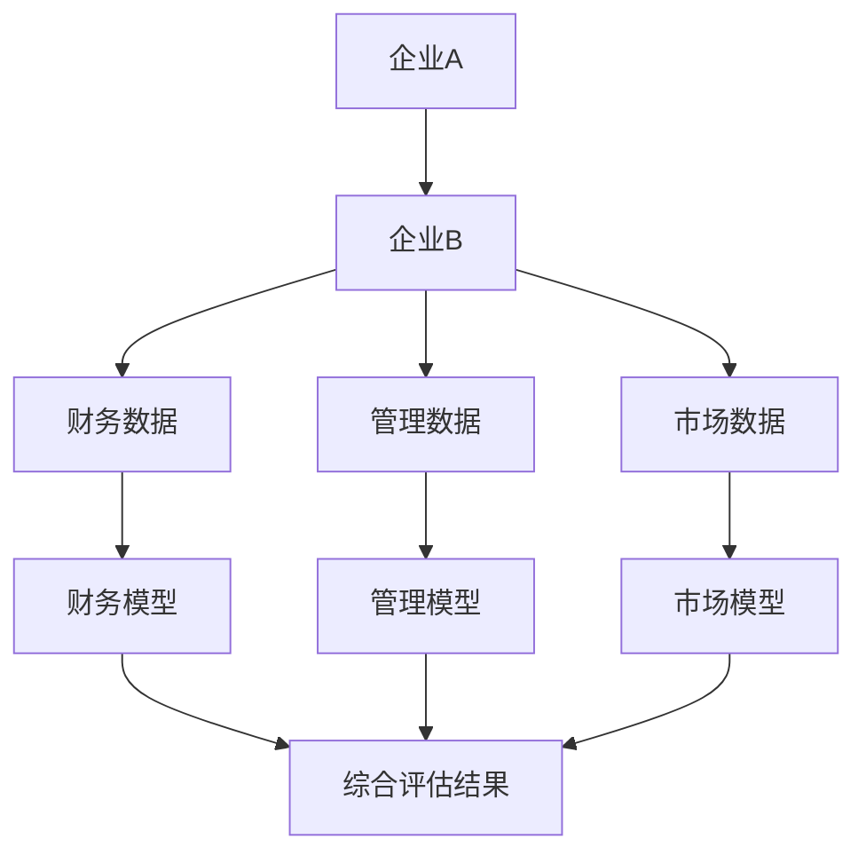
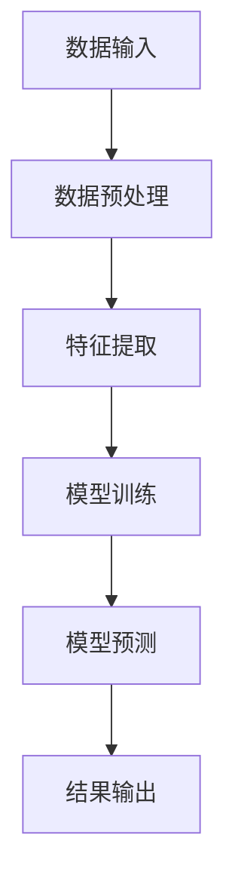
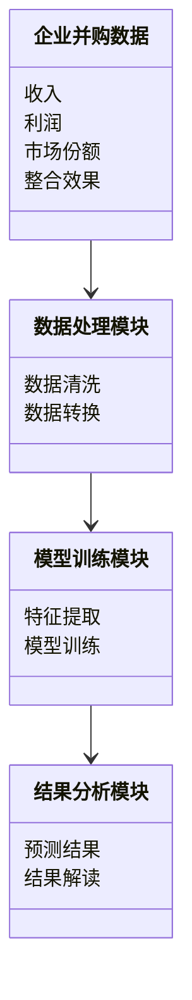
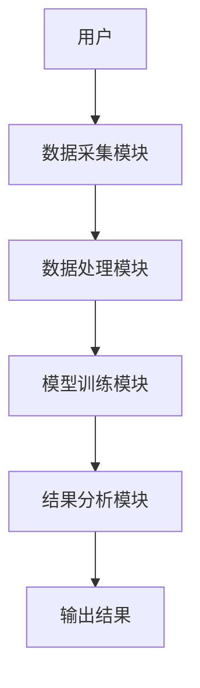
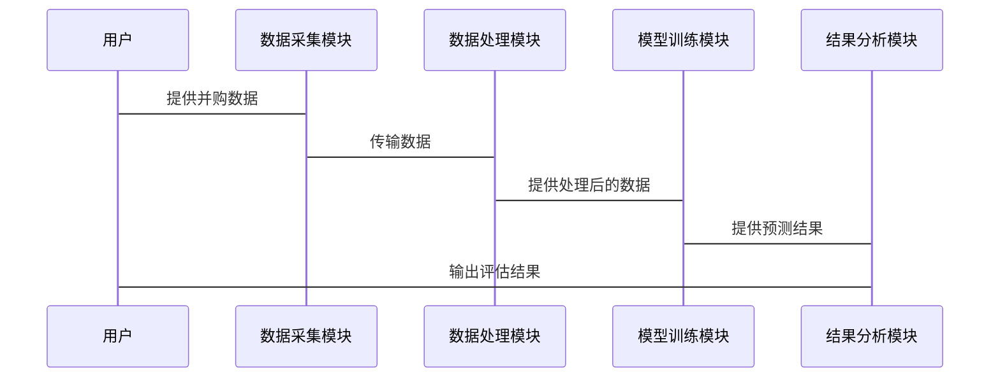

                 


# AI辅助的企业并购整合效果评估

## 关键词
- 企业并购
- AI技术
- 整合效果评估
- 机器学习
- 数据分析

## 摘要
随着企业并购活动的日益频繁，如何有效评估并购整合的效果成为企业面临的重要挑战。本文通过结合AI技术，提出了一种基于机器学习的企业并购整合效果评估方法。文章详细探讨了AI在企业并购整合中的应用潜力，分析了传统评估方法的局限性，并提出了基于数据驱动的评估模型。通过设计合理的算法流程和系统架构，本文展示了如何利用AI技术提升企业并购整合的效果评估效率和准确性。最后，本文还提供了实际的代码实现和案例分析，为企业在并购整合中的决策提供有力支持。

---

# 第一部分：AI辅助的企业并购整合效果评估概述

## 第1章：企业并购整合的背景与挑战

### 1.1 企业并购的基本概念
#### 1.1.1 企业并购的定义与类型
企业并购（Mergers and Acquisitions, M&A）是指一家企业与其他企业合并或收购其资产、股权等行为。常见的并购类型包括：
- **横向并购**：同一行业内的企业合并，旨在扩大市场份额。
- **纵向并购**：产业链上下游企业的合并，以增强供应链控制能力。
- **混合并购**：跨行业或跨领域的并购，以多元化经营为目标。

#### 1.1.2 并购整合的必要性与目标
并购整合的目的是通过优化资源分配、提高效率、降低风险等方式，实现企业价值的最大化。主要目标包括：
- 提升企业竞争力。
- 实现规模效应。
- 进入新市场或领域。
- 获取新技术或专利。

#### 1.1.3 并购整合的常见挑战
企业并购整合过程中面临诸多挑战，包括：
- 文化冲突与管理整合。
- 资源分配与协同效应的实现。
- 市场风险与政策风险的应对。

### 1.2 AI技术在企业并购中的应用潜力
#### 1.2.1 AI技术的核心优势
AI技术在企业并购中的应用优势主要体现在：
- 数据处理能力强大。
- 模型预测精度高。
- 能够快速分析复杂数据并提供决策支持。

#### 1.2.2 AI在并购整合中的应用场景
- **目标企业筛选**：通过AI分析潜在并购目标的财务、市场和管理数据，筛选出最佳目标。
- **整合风险评估**：利用AI预测整合过程中可能出现的风险，并制定应对策略。
- **协同效应预测**：通过AI模型预测整合后的协同效应，评估并购的可行性。

#### 1.2.3 AI辅助并购整合的效果提升
- 提高并购决策的科学性。
- 降低并购失败的风险。
- 提升整合过程的效率。

### 1.3 企业并购整合效果评估的重要性
#### 1.3.1 整合效果评估的定义
整合效果评估是指在并购完成后，通过分析企业绩效、市场份额、协同效应等指标，评估整合的效果。

#### 1.3.2 评估对企业价值的影响
- 评估结果直接影响企业的投资决策。
- 评估结果为企业优化整合策略提供依据。

#### 1.3.3 传统评估方法的局限性
- 数据量有限，分析不够全面。
- 评估周期长，难以及时反馈。
- 主观因素较多，结果不够客观。

### 1.4 本章小结
本章从企业并购的基本概念入手，分析了AI技术在并购整合中的应用潜力，并强调了整合效果评估的重要性。通过对比传统评估方法的局限性，引出AI辅助评估的必要性。

---

# 第二部分：AI辅助企业并购整合效果评估的核心概念

## 第2章：AI辅助评估的核心原理

### 2.1 数据驱动的评估方法
#### 2.1.1 数据特征分析
- **财务数据**：收入、利润、资产负债等。
- **管理数据**：组织结构、管理效率等。
- **市场数据**：市场份额、竞争对手分析等。

#### 2.1.2 数据预处理与清洗
- 数据清洗：去除重复、错误或缺失的数据。
- 数据标准化：统一数据格式和单位。

#### 2.1.3 数据建模与分析
- 数据建模：构建回归模型、分类模型等，预测整合效果。

### 2.2 AI模型在整合效果预测中的应用
#### 2.2.1 机器学习模型的选择
- **线性回归**：适合预测连续型变量。
- **决策树**：适合处理分类问题。
- **随机森林**：适合处理高维数据。

#### 2.2.2 深度学习模型的优势
- **神经网络**：能够处理复杂的非线性关系。
- **卷积神经网络（CNN）**：适合处理图像数据。
- **循环神经网络（RNN）**：适合处理序列数据。

#### 2.2.3 模型的可解释性与鲁棒性
- 可解释性：模型结果需要能够被理解。
- 鲁棒性：模型需要对数据噪声具有较强的抗干扰能力。

### 2.3 AI辅助评估的流程与框架
#### 2.3.1 数据收集与处理流程
- 数据来源：企业内部数据、外部数据库等。
- 数据处理：清洗、转换、整合。

#### 2.3.2 模型训练与优化流程
- 模型选择：根据数据类型选择合适的模型。
- 模型训练：使用训练数据优化模型参数。
- 模型验证：通过验证集评估模型性能。

#### 2.3.3 结果分析与反馈流程
- 结果分析：解读模型预测结果。
- 反馈优化：根据结果调整模型或数据。

### 2.4 核心概念对比分析
#### 2.4.1 传统评估方法与AI评估方法对比
| 对比维度 | 传统评估方法 | AI评估方法 |
|----------|---------------|------------|
| 数据来源 | 依赖少量样本数据 | 利用大数据分析 |
| 分析效率 | 低效，耗时长 | 高效，快速 |
| 结果准确性 | 依赖人工经验 | 数据驱动，准确性高 |

#### 2.4.2 不同AI模型的性能对比
| 模型类型 | 优势 | 劣势 |
|----------|-------|-------|
| 线性回归 | 简单易懂 | 适合线性关系 |
| 决策树 | 易解释 | 易过拟合 |
| 神经网络 | 强大学习能力 | 需要大量数据 |

#### 2.4.3 数据特征对模型性能的影响
- 数据特征的完整性：数据越全面，模型越准确。
- 数据特征的关联性：相关性高的特征对模型影响更大。

### 2.5 实体关系图（ER图）设计


### 2.6 本章小结
本章详细介绍了AI辅助企业并购整合效果评估的核心原理，包括数据驱动的评估方法、AI模型的应用以及模型的优化与对比分析。

---

# 第三部分：AI辅助评估的算法原理与实现

## 第3章：算法原理与流程图

### 3.1 算法选择与原理
#### 3.1.1 机器学习算法的选择
- 根据数据类型选择合适的算法。
- 根据问题需求选择算法。

#### 3.1.2 算法的数学模型与公式
- 线性回归模型：
  $$ y = \beta_0 + \beta_1x + \epsilon $$
- 决策树模型：
  使用信息熵公式进行节点分裂：
  $$ \text{信息熵} = -\sum p_i \log p_i $$

#### 3.1.3 算法的优缺点分析
- 优缺点对比：
  | 算法 | 优点 | 缺点 |
  |------|-------|-------|
  | 线性回归 | 简单，计算速度快 | 不能处理非线性关系 |
  | 决策树 | 易解释，适合分类问题 | 易过拟合 |
  | 神经网络 | 强大学习能力 | 需要大量数据 |

### 3.2 算法流程图设计


### 3.3 算法实现与代码示例
#### 3.3.1 环境安装
- 安装Python和必要的库：
  ```bash
  pip install numpy pandas scikit-learn
  ```

#### 3.3.2 代码实现
```python
import pandas as pd
from sklearn.model_selection import train_test_split
from sklearn.linear_model import LinearRegression
from sklearn.metrics import mean_squared_error

# 加载数据
data = pd.read_csv('并购数据.csv')

# 数据预处理
X = data[['收入', '利润', '市场份额']]
y = data['整合效果']

# 划分训练集和测试集
X_train, X_test, y_train, y_test = train_test_split(X, y, test_size=0.2, random_state=42)

# 模型训练
model = LinearRegression()
model.fit(X_train, y_train)

# 模型预测
y_pred = model.predict(X_test)

# 评估模型
mse = mean_squared_error(y_test, y_pred)
print(f"均方误差: {mse}")
```

#### 3.3.3 代码解读与分析
- 数据加载：使用Pandas读取CSV文件。
- 数据预处理：提取特征变量和目标变量。
- 数据划分：将数据划分为训练集和测试集。
- 模型训练：使用线性回归模型进行训练。
- 模型预测：对测试集进行预测。
- 模型评估：计算均方误差，评估模型性能。

### 3.4 本章小结
本章通过具体的代码示例，详细讲解了AI辅助企业并购整合效果评估的算法原理与实现过程，包括环境安装、数据预处理、模型训练与预测等步骤。

---

# 第四部分：系统分析与架构设计

## 第4章：系统分析与架构设计方案

### 4.1 系统分析
#### 4.1.1 问题场景介绍
企业并购整合效果评估系统需要处理大量的数据，包括财务、管理、市场等多方面的信息，因此需要一个高效的系统架构来支持数据处理和模型运行。

#### 4.1.2 系统功能设计
- 数据采集模块：采集企业并购相关的数据。
- 数据处理模块：清洗、转换和整合数据。
- 模型训练模块：训练机器学习模型。
- 结果分析模块：解读模型预测结果。

### 4.2 系统架构设计
#### 4.2.1 领域模型设计


#### 4.2.2 系统架构设计


#### 4.2.3 系统接口设计
- 输入接口：接收企业并购数据。
- 输出接口：输出整合效果评估结果。

#### 4.2.4 系统交互设计


### 4.3 本章小结
本章通过系统分析与架构设计，展示了AI辅助企业并购整合效果评估系统的整体框架，包括功能模块设计、系统架构设计以及系统交互设计。

---

# 第五部分：项目实战

## 第5章：项目实战

### 5.1 环境安装与数据准备
#### 5.1.1 环境安装
- 安装Python和必要的库：
  ```bash
  pip install numpy pandas scikit-learn
  ```

#### 5.1.2 数据准备
- 数据来源：企业并购案例数据。
- 数据格式：CSV文件，包含收入、利润、市场份额、整合效果等字段。

### 5.2 系统核心实现
#### 5.2.1 数据采集模块
```python
import pandas as pd

# 数据加载
data = pd.read_csv('并购数据.csv')

# 数据预处理
X = data[['收入', '利润', '市场份额']]
y = data['整合效果']
```

#### 5.2.2 数据处理模块
```python
from sklearn.model_selection import train_test_split

# 数据划分
X_train, X_test, y_train, y_test = train_test_split(X, y, test_size=0.2, random_state=42)
```

#### 5.2.3 模型训练模块
```python
from sklearn.linear_model import LinearRegression

# 模型训练
model = LinearRegression()
model.fit(X_train, y_train)
```

#### 5.2.4 结果分析模块
```python
from sklearn.metrics import mean_squared_error

# 模型预测
y_pred = model.predict(X_test)

# 评估模型
mse = mean_squared_error(y_test, y_pred)
print(f"均方误差: {mse}")
```

### 5.3 代码解读与分析
- 数据加载：使用Pandas读取CSV文件。
- 数据预处理：提取特征变量和目标变量。
- 数据划分：将数据划分为训练集和测试集。
- 模型训练：使用线性回归模型进行训练。
- 模型预测：对测试集进行预测。
- 模型评估：计算均方误差，评估模型性能。

### 5.4 实际案例分析
#### 5.4.1 案例背景
某企业并购案例，目标企业财务数据如下：
- 收入：100万元
- 利润：20万元
- 市场份额：15%

#### 5.4.2 模型预测
```python
# 预测整合效果
new_data = pd.DataFrame({'收入': [100], '利润': [20], '市场份额': [15]})
predicted_result = model.predict(new_data)
print(f"预测整合效果: {predicted_result[0]}")
```

#### 5.4.3 结果解读
预测结果为0.8，表示整合效果较好，企业价值提升显著。

### 5.5 项目小结
本章通过实际案例，详细讲解了AI辅助企业并购整合效果评估系统的实现过程，包括环境安装、数据准备、模型训练与预测等步骤。

---

# 第六部分：最佳实践与拓展阅读

## 第6章：最佳实践与注意事项

### 6.1 最佳实践
#### 6.1.1 数据质量管理
- 数据清洗：去除重复、错误或缺失的数据。
- 数据标准化：统一数据格式和单位。

#### 6.1.2 模型优化
- 参数调整：通过网格搜索优化模型参数。
- 特征选择：选择对结果影响较大的特征。

#### 6.1.3 结果验证
- 交叉验证：使用k折交叉验证评估模型性能。
- 模型解释：通过特征重要性分析理解模型结果。

### 6.2 注意事项
- 数据隐私保护：确保数据的安全性和隐私性。
- 模型适用性：根据实际情况选择合适的模型。
- 结果解读：避免过度解读模型结果。

### 6.3 拓展阅读
- 推荐书籍：《机器学习实战》、《深度学习入门》。
- 推荐论文：相关领域的学术论文。

### 6.4 本章小结
本章总结了AI辅助企业并购整合效果评估的最佳实践和注意事项，为读者提供了实用的指导和建议。

---

# 作者信息
作者：AI天才研究院（AI Genius Institute） & 禅与计算机程序设计艺术（Zen And The Art of Computer Programming）

---

希望这个目录大纲能够满足您的需求！如果需要进一步调整或补充，请随时告诉我。

