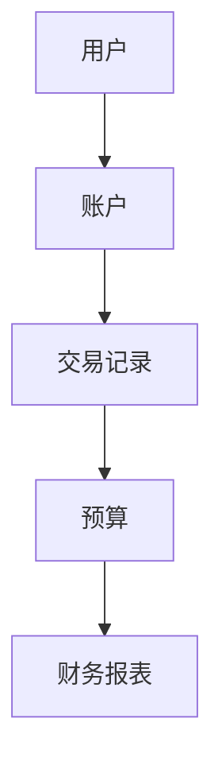
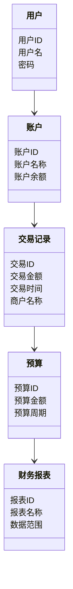
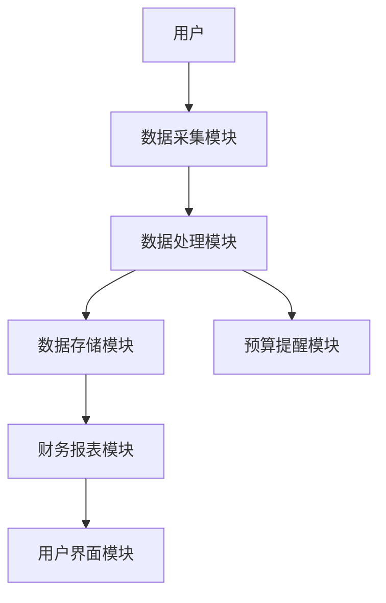
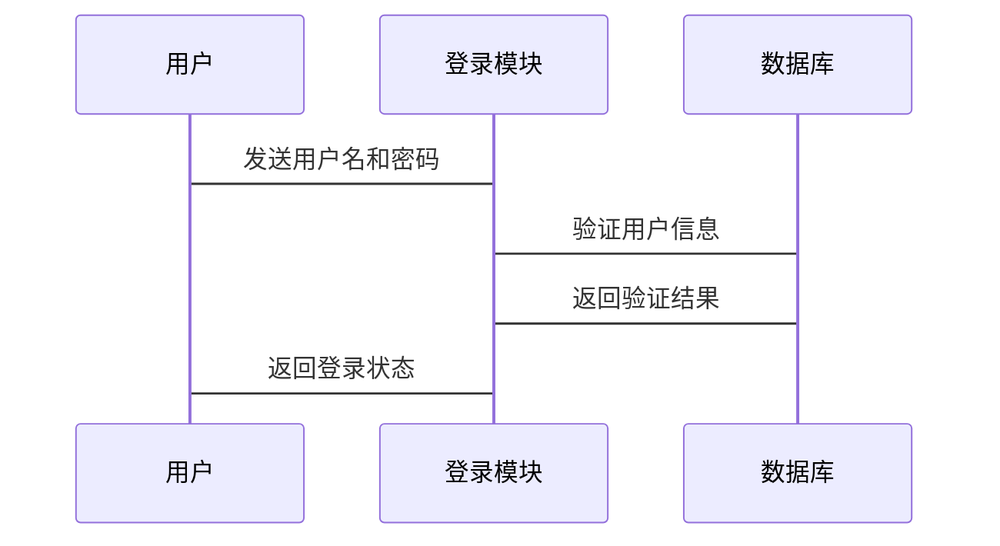

                 


# 个人财务管理工具集成

> 关键词：个人财务管理，工具集成，API，数据同步，安全性

> 摘要：个人财务管理工具集成是指将多种财务工具和服务整合到一个统一的系统中，以实现数据的统一管理、自动化处理和高效分析。本文将从背景、核心概念、算法原理、系统架构、项目实战和未来展望等多个方面，详细阐述个人财务管理工具集成的实现方法和应用场景，帮助读者更好地理解和应用这一技术。

---

# 第一部分：个人财务管理工具集成概述

# 第1章：个人财务管理工具集成的背景与意义

## 1.1 个人财务管理的重要性

### 1.1.1 个人财务管理的核心问题
- 数据分散：个人的财务数据可能分布在多个平台（如银行账户、支付宝、微信支付等），难以统一管理。
- 数据冗余：重复记录同一笔交易，导致数据冗余和不一致。
- 数据安全：不同平台的数据孤岛可能导致数据泄露或丢失。
- 管理效率：手动记录和分析财务数据，效率低下且容易出错。

### 1.1.2 当前财务管理工具的现状
- 现有工具的功能局限性：单一工具通常只能处理部分财务数据，缺乏跨平台的集成能力。
- 数据同步问题：不同平台的API接口和数据格式不统一，导致数据同步困难。
- 用户体验问题：复杂的操作流程和不友好的界面设计降低了用户的使用体验。

### 1.1.3 工具集成对个人财务管理的提升作用
- 提高效率：通过集成工具，实现数据的自动同步和分类，减少人工操作。
- 数据统一：将分散的数据整合到一个平台，便于统一管理和分析。
- 智能分析：通过集成工具提供的智能算法，实现预算提醒、支出分析等高级功能。

## 1.2 工具集成的意义

### 1.2.1 提高财务管理效率
- 自动化处理：通过集成工具，实现交易记录的自动分类、账单的自动汇总和预算的自动提醒。
- 数据可视化：通过图表和报表，直观展示财务数据，帮助用户快速了解收支状况。

### 1.2.2 实现数据的统一管理
- 数据集中化：将分散在不同平台的财务数据整合到一个数据库中，便于统一管理和查询。
- 数据清洗：通过集成工具，自动清洗和去重数据，确保数据的准确性和一致性。

### 1.2.3 降低财务管理成本
- 减少人工操作：通过自动化工具，减少人工记录和核对数据的时间和成本。
- 提高决策效率：通过智能分析，帮助用户快速做出财务决策，降低误判风险。

## 1.3 本章小结

本章主要介绍了个人财务管理工具集成的背景和意义，分析了当前财务管理工具的局限性，并提出了工具集成对个人财务管理的提升作用。通过集成工具，可以显著提高财务管理的效率，降低管理成本，并实现数据的统一管理。

---

# 第2章：个人财务管理工具集成的核心概念

## 2.1 核心概念与定义

### 2.1.1 个人财务管理工具的定义
个人财务管理工具是指用于记录、分析和管理个人财务数据的软件或服务，例如记账软件、预算工具、财务分析平台等。

### 2.1.2 工具集成的定义
工具集成是指将多个财务工具和服务整合到一个统一的系统中，通过API或其他接口实现数据的同步和功能的协同。

### 2.1.3 集成的核心要素
- 数据同步：通过API实现不同平台之间的数据交互。
- 数据存储：将整合后的数据存储在一个统一的数据库中。
- 功能协同：不同工具的功能协同工作，例如自动分类、智能提醒等。

## 2.2 核心概念的属性对比

### 2.2.1 工具功能对比表

| 工具名称 | 主要功能 | 优点 | 缺点 |
|----------|----------|------|------|
| 记账软件 | 记录收支、生成报表 | 使用简单、数据可视化好 | 功能单一、缺乏智能分析 |
| 预算工具 | 制定预算、提醒超支 | 帮助控制消费 | 数据来源单一、无法与银行账户同步 |
| 财务分析平台 | 分析支出、资产配置 | 功能全面、数据深度分析 | 使用复杂、学习成本高 |

### 2.2.2 集成方式对比表

| 集成方式 | 描述 | 优点 | 缺点 |
|----------|------|------|------|
| API对接 | 通过公开API实现数据同步 | 数据实时性高、兼容性强 | 开发复杂、依赖第三方API稳定性 |
| 数据导出 | 将数据从各平台导出到统一数据库 | 实现数据集中管理 | 数据同步延迟、数据格式转换复杂 |

### 2.2.3 数据格式对比

| 数据格式 | 描述 | 优点 | 缺点 |
|----------|------|------|------|
| JSON | 轻量级数据交换格式 | 易读性高、跨平台支持好 | 数据结构复杂时难以解析 |
| CSV | 简单的文本格式 | 易读性好、数据结构简单 | 不支持复杂数据类型 |
| XML | 结构化的数据格式 | 数据层次清晰 | 文件体积大、解析效率低 |

## 2.3 核心概念的ER实体关系图



## 2.4 本章小结

本章详细阐述了个人财务管理工具集成的核心概念，包括工具的定义、集成的核心要素以及不同工具和集成方式的对比分析。通过ER实体关系图，展示了用户、账户、交易记录、预算和财务报表之间的关系，为后续的系统设计奠定了基础。

---

# 第3章：个人财务管理工具集成的算法原理

## 3.1 算法原理概述

### 3.1.1 数据同步算法
数据同步算法用于将不同平台的交易记录同步到统一的数据库中，确保数据的准确性和一致性。

### 3.1.2 自动分类算法
自动分类算法根据交易记录中的商户信息，自动将交易分类到指定的类别中，例如餐饮、购物、转账等。

### 3.1.3 预算提醒算法
预算提醒算法根据用户的预算设置，实时监控消费情况，并在超支时触发提醒。

## 3.2 数据同步算法的实现

### 3.2.1 数据同步流程
1. 获取各平台的交易记录数据。
2. 对比本地数据库和远程数据，找出新增或更新的记录。
3. 将新增或更新的记录同步到本地数据库。

### 3.2.2 数据同步的实现代码
```python
def sync_transactions(api, local_db):
    remote_transactions = api.fetch_transactions()
    local_transactions = local_db.get_all()
    new_transactions = []
    for t in remote_transactions:
        if t not in local_transactions:
            new_transactions.append(t)
    local_db.add_transactions(new_transactions)
```

## 3.3 自动分类算法的实现

### 3.3.1 分类规则
- 根据交易记录中的商户名称匹配预定义的分类规则。
- 如果匹配不到，则根据交易金额和描述进行智能分类。

### 3.3.2 分类算法的实现代码
```python
def classify_transaction(transaction, rules):
    for category, pattern in rules.items():
        if re.match(pattern, transaction['merchant']):
            return category
    return 'uncategorized'
```

## 3.4 预算提醒算法的实现

### 3.4.1 预算检查流程
1. 计算当前月的总支出。
2. 与预设的预算进行比较。
3. 如果超出预算，触发提醒。

### 3.4.2 预算提醒的实现代码
```python
def check_budget(current_spending, budget):
    if current_spending > budget:
        return "超支提醒"
    else:
        return "预算正常"
```

## 3.5 本章小结

本章详细讲解了个人财务管理工具集成中的关键算法，包括数据同步算法、自动分类算法和预算提醒算法。通过具体的实现代码和流程图，展示了这些算法的工作原理和应用场景。

---

# 第4章：个人财务管理工具集成的系统架构设计

## 4.1 系统架构概述

### 4.1.1 系统功能模块划分
- 数据采集模块：负责从各平台获取交易记录。
- 数据存储模块：将数据存储到数据库中。
- 数据处理模块：实现数据的分类、汇总和分析。
- 用户界面模块：提供友好的用户界面，展示分析结果。

### 4.1.2 系统架构的分层设计
- 表示层：用户界面和交互。
- 业务逻辑层：实现核心功能，如数据同步、分类和提醒。
- 数据访问层：与数据库和API进行交互。

## 4.2 领域模型设计



## 4.3 系统架构设计

### 4.3.1 系统架构图



## 4.4 系统接口设计

### 4.4.1 API接口
- `GET /api/transactions`：获取交易记录。
- `POST /api/sync`：同步数据到本地数据库。
- `POST /api/classify`：自动分类交易记录。

## 4.5 系统交互设计

### 4.5.1 用户登录流程



## 4.6 本章小结

本章详细设计了个人财务管理工具集成的系统架构，包括功能模块划分、领域模型设计、系统架构图和API接口设计。通过系统的分层设计和模块化实现，确保了系统的可扩展性和可维护性。

---

# 第5章：个人财务管理工具集成的项目实战

## 5.1 环境安装

### 5.1.1 安装Python和相关库
- 安装Python 3.8及以上版本。
- 安装`requests`库：`pip install requests`

### 5.1.2 安装数据库
- 使用SQLite或MySQL数据库。

## 5.2 系统核心实现

### 5.2.1 数据采集模块实现

```python
import requests

def fetch_transactions(api_key):
    headers = {'Authorization': f'Bearer {api_key}'}
    response = requests.get('https://api.example.com/transactions', headers=headers)
    return response.json()
```

### 5.2.2 数据存储模块实现

```python
import sqlite3

def store_transactions(transactions, db_path):
    conn = sqlite3.connect(db_path)
    cursor = conn.cursor()
    cursor.execute('''
        CREATE TABLE IF NOT EXISTS transactions (
            id INTEGER PRIMARY KEY AUTOINCREMENT,
            amount REAL,
            time TEXT,
            merchant TEXT
        )
    ''')
    for t in transactions:
        cursor.execute('''
            INSERT INTO transactions (amount, time, merchant)
            VALUES (?, ?, ?)
        ''', (t['amount'], t['time'], t['merchant']))
    conn.commit()
    conn.close()
```

### 5.2.3 自动分类模块实现

```python
import re

def classify_transaction(transaction, rules):
    for category, pattern in rules.items():
        if re.match(pattern, transaction['merchant']):
            return category
    return 'uncategorized'
```

## 5.3 代码应用解读与分析

### 5.3.1 数据采集模块
- 使用`requests`库通过API获取交易记录数据。
- 返回JSON格式的数据。

### 5.3.2 数据存储模块
- 使用SQLite数据库存储交易记录。
- 创建`transactions`表，包含金额、时间和商户信息。

### 5.3.3 自动分类模块
- 根据预定义的分类规则，匹配商户名称进行分类。
- 使用正则表达式进行模式匹配。

## 5.4 实际案例分析

### 5.4.1 案例背景
用户希望通过集成工具将支付宝、微信支付和银行账户的交易记录整合到一个系统中，并实现自动分类和预算提醒。

### 5.4.2 实施步骤
1. 获取各平台的API密钥。
2. 使用数据采集模块获取交易记录。
3. 将交易记录存储到数据库中。
4. 使用自动分类模块将交易记录分类到指定的类别。
5. 设置预算提醒规则，当消费超过预算时触发提醒。

## 5.5 本章小结

本章通过具体的代码实现和案例分析，展示了个人财务管理工具集成的实际应用场景。通过环境安装、模块实现和代码解读，帮助读者快速上手并实现类似的系统。

---

# 第6章：个人财务管理工具集成的未来展望

## 6.1 集成工具的关键点

### 6.1.1 数据安全
- 数据加密存储。
- API权限控制。

### 6.1.2 功能扩展
- 支持多平台同步。
- 实现智能投资建议。

## 6.2 未来的研究方向

### 6.2.1 AI驱动的财务管理
- 使用机器学习算法进行消费预测和风险评估。
- 自动优化预算方案。

### 6.2.2 区块链技术的应用
- 通过区块链实现财务数据的不可篡改性。
- 提高数据的安全性和透明度。

## 6.3 本章小结

本章展望了个人财务管理工具集成的未来发展方向，包括数据安全、功能扩展和AI驱动的财务管理。通过技术的进步，个人财务管理工具将更加智能化和高效化。

---

# 作者

作者：AI天才研究院/AI Genius Institute & 禅与计算机程序设计艺术 /Zen And The Art of Computer Programming

---

以上是《个人财务管理工具集成》的技术博客文章的完整目录和内容框架。通过详细阐述核心概念、算法原理、系统架构和项目实战，本文为读者提供了全面的技术指导和实践参考。

