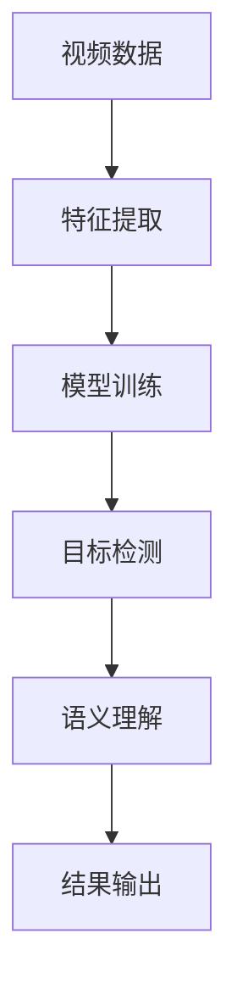
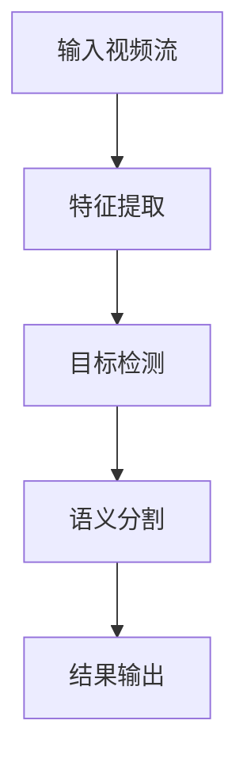
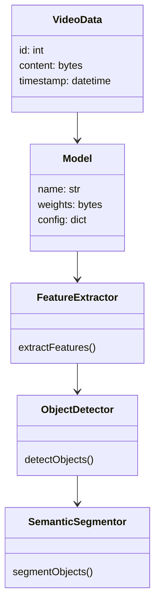
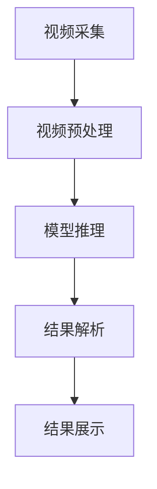
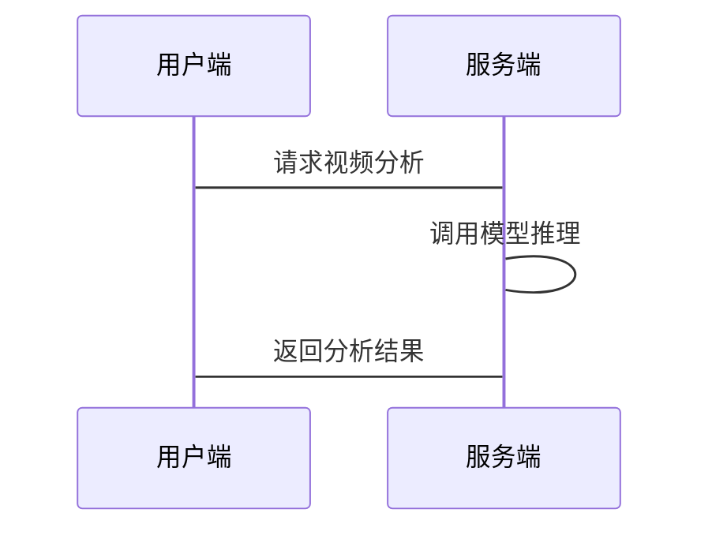

                 


# 如何识别企业的深度学习视频理解技术优势

> 关键词：深度学习，视频理解，企业技术，技术优势，模型算法，系统架构，项目实战

> 摘要：本文将从深度学习视频理解技术的背景、核心概念、算法原理、系统架构、项目实战等多个方面，详细分析如何识别企业中的深度学习视频理解技术优势，为企业技术决策者和开发者提供实用的技术指导和建议。

---

# 第1章: 深度学习视频理解技术背景

## 1.1 深度学习视频理解的基本概念

### 1.1.1 视频理解的定义与范围

深度学习视频理解技术是一种利用深度学习算法对视频数据进行分析、理解和提取信息的技术。视频理解的范围包括但不限于目标检测、语义分割、行为识别、视频分类和场景理解等。

### 1.1.2 深度学习在视频理解中的作用

深度学习通过神经网络模型，能够从大量视频数据中自动提取特征，学习复杂的模式，并在各种场景下实现高精度的视频分析。

### 1.1.3 企业视频理解技术的背景与趋势

随着视频数据的爆炸式增长，企业对视频理解技术的需求日益增加。深度学习技术的快速发展为视频理解提供了强大的技术支持，使得企业能够更高效地处理和分析视频数据。

## 1.2 企业视频理解技术的核心问题

### 1.2.1 视频数据的复杂性

视频数据具有高维、时序性和多样性等特点，这使得视频理解的算法设计和优化面临较大挑战。

### 1.2.2 深度学习模型的挑战

深度学习模型的训练需要大量标注数据和计算资源，且模型的复杂性可能导致推理速度较慢，难以满足企业对实时性要求较高的应用场景。

### 1.2.3 企业应用场景中的特殊需求

企业对视频理解技术的需求往往具有特定的场景和目标，例如零售行业的顾客行为分析、安防行业的视频监控等，这些需求需要深度学习模型进行针对性优化。

## 1.3 深度学习视频理解技术的优势

### 1.3.1 与传统视频分析技术的对比

深度学习视频理解技术相比传统视频分析技术，具有更高的精度和更强的泛化能力。传统技术依赖于人工特征设计，而深度学习能够自动学习特征，适应不同场景的变化。

### 1.3.2 深度学习在视频特征提取中的优势

深度学习模型能够从视频中提取多层次的语义特征，这些特征能够更好地反映视频内容的语义信息，从而提高视频理解的准确性和鲁棒性。

### 1.3.3 技术优势对企业业务的推动作用

深度学习视频理解技术能够帮助企业实现视频数据的智能化处理，提升业务效率、降低成本，并为企业创造新的商业价值。

## 1.4 本章小结

本章从深度学习视频理解技术的基本概念出发，分析了企业在应用该技术时面临的核心问题，并重点阐述了深度学习技术在视频理解中的优势及其对企业业务的推动作用。

---

# 第2章: 深度学习视频理解的核心概念与联系

## 2.1 深度学习视频理解的核心原理

### 2.1.1 视频数据的特征提取

深度学习模型通过卷积神经网络（CNN）提取视频的时空特征，包括空间特征和时序特征。例如，3D-CNN可以同时捕捉视频的空间和时间信息。

### 2.1.2 深度学习模型的基本架构

主流的深度学习模型包括基于2D CNN的双流网络（Two-Stream）、基于3D CNN的视频模型，以及基于Transformer的视频理解模型（如Video Swin Transformer）。

### 2.1.3 视频理解的关键步骤

视频理解的关键步骤包括视频数据预处理、特征提取、目标检测、语义分割和结果解读。这些步骤需要模型具备多任务学习能力。

## 2.2 深度学习模型的关键属性对比

### 2.2.1 模型类型对比

| 模型类型       | 主要特点               | 适用场景               |
|----------------|------------------------|------------------------|
| YOLO          | 高效，实时性好         | 实时视频流检测         |
| Faster R-CNN  | 精度高，但速度较慢     | 精准目标检测           |
| Mask R-CNN    | 具备语义分割能力       | 复杂场景下的目标检测   |

### 2.2.2 模型性能对比

| 模型名称       | 精度（mAP） | 推理速度（FPS） | 参数量（M） |
|----------------|-------------|----------------|-------------|
| YOLOv5        | 50.6        | 60             | 24.5         |
| Faster R-CNN  | 80.3        | 30             | 50           |
| Mask R-CNN    | 75.2        | 20             | 110          |

### 2.2.3 模型复杂度对比

| 模型复杂度     | 低复杂度 | 中复杂度 | 高复杂度 |
|----------------|----------|----------|----------|
| YOLOv5         | √        |          |          |
| Mask R-CNN     |          | √        |          |
| Video Swin Transformer |          |          | √         |

## 2.3 实体关系图（Mermaid流程图）

以下是深度学习视频理解技术的实体关系图：



## 2.4 本章小结

本章通过对比不同深度学习模型的关键属性，分析了各类模型的优缺点及其适用场景，并通过实体关系图展示了深度学习视频理解的核心流程。

---

# 第3章: 深度学习视频理解的算法原理

## 3.1 主流算法概述

### 3.1.1 YOLO系列

YOLO（You Only Look Once）是一种基于深度学习的目标检测算法，具有高效、实时的特点。YOLOv5是目前常用的版本，其网络结构包括Backbone、 Neck和Head三个部分。

### 3.1.2 Faster R-CNN

Faster R-CNN是基于区域建议网络（RPN）的目标检测算法，主要由Anchor、RPN、RoI Pooling和Fast R-CNN四部分组成。Faster R-CNN在精度上优于YOLO，但速度较慢。

### 3.1.3 Mask R-CNN

Mask R-CNN在Faster R-CNN的基础上增加了语义分割功能，通过添加一个分支来预测目标的像素级掩膜（mask）。这种模型适用于需要精确分割目标的场景。

## 3.2 算法流程图（Mermaid流程图）

以下是深度学习视频理解算法的流程图：



## 3.3 数学模型与公式

### 3.3.1 损失函数

目标检测模型的损失函数通常包括分类损失、定位损失和遮挡损失。以下是一个典型的损失函数公式：

$$
\text{损失函数} = \lambda_1 \text{分类损失} + \lambda_2 \text{定位损失} + \lambda_3 \text{遮挡损失}
$$

其中，$\lambda_1$、$\lambda_2$和$\lambda_3$是权重系数。

### 3.3.2 检测框回归公式

目标检测中的检测框回归通常采用均方误差（MSE）作为损失函数：

$$
\text{损失} = \frac{1}{2} \sum_{i=1}^{N} (y_i - \hat{y}_i)^2
$$

其中，$y_i$是真实值，$\hat{y}_i$是预测值，$N$是样本数量。

## 3.4 算法实现与案例分析

### 3.4.1 案例场景：视频目标检测

以下是一个基于YOLOv5的视频目标检测案例：

```python
def detect_objects(video_path):
    model = load_model('yolov5.pt')
    cap = cv2.VideoCapture(video_path)
    while cap.isOpened():
        success, frame = cap.read()
        if not success:
            break
        results = model(frame)
        for box in results.xyxy[0]:
            x1, y1, x2, y2 = box[:4]
            class_name = results.names[int(box[5])]
            cv2.rectangle(frame, (x1, y1), (x2, y2), (0, 255, 0), 2)
            cv2.putText(frame, class_name, (x1, y1-5), cv2.FONT_HERSHEY_SIMPLEX, 0.5, (0, 255, 0), 2)
        cv2.imshow('Video', frame)
        if cv2.waitKey(1) & 0xFF == ord('q'):
            break
    cap.release()
    cv2.destroyAllWindows()
```

### 3.4.2 案例代码实现

以上代码展示了如何使用YOLOv5进行视频目标检测。通过OpenCV读取视频流，调用模型进行推理，并在视频帧上绘制检测框和标签。

---

# 第4章: 深度学习视频理解的系统分析与架构设计

## 4.1 问题场景介绍

深度学习视频理解技术可以应用于视频监控、智能安防、零售分析、自动驾驶等多个领域。不同场景下的系统需求和架构设计有所不同。

## 4.2 系统功能设计

### 4.2.1 领域模型类图

以下是视频理解系统的领域模型类图：



### 4.2.2 系统架构设计

以下是视频理解系统的架构设计图：



### 4.2.3 系统接口设计

视频理解系统的接口设计需要考虑视频流的输入输出、模型调用和结果返回。以下是接口设计的伪代码：

```python
interface VideoUnderstandingService {
    def processVideo(input_stream: bytes) -> dict
    def getModelInfo(model_name: str) -> dict
    def trainModel(train_data: bytes) -> bool
}
```

## 4.3 系统交互设计

以下是视频理解系统的交互设计图：



---

# 第5章: 深度学习视频理解技术的项目实战

## 5.1 环境安装

以下是深度学习视频理解技术的开发环境安装步骤：

1. 安装Python和依赖库：
   ```bash
   pip install numpy matplotlib opencv-python torch torchvision
   ```

2. 下载预训练模型：
   ```bash
   wget https://github.com/ultralytics/yolov5/releases/download/v6.0/yolov5l.pt
   ```

## 5.2 系统核心实现源代码

以下是一个基于YOLOv5的视频目标检测代码：

```python
import cv2
import torch
from yolov5.models.experimental import attempt_load
from yolov5.utils.general import non_max_suppression, xyxy2xywh

def detect_objects(video_path, model_path='yolov5l.pt'):
    model = attempt_load(model_path)
    cap = cv2.VideoCapture(video_path)
    while cap.isOpened():
        success, frame = cap.read()
        if not success:
            break
        img = frame.copy()
        img = cv2.cvtColor(img, cv2.COLOR_BGR2RGB)
        img = torch.from_numpy(img).permute(2, 0, 1).float().div(255.0).unsqueeze(0)
        pred = model(img, augment=False)[0]
        pred = non_max_suppression(pred, conf_thres=0.5, iou_thres=0.5)
        for i, det in enumerate(pred):
            if det is not None and len(det):
                x1, y1, x2, y2 = det[:, :4].view(-1).tolist()
                label = model.names[int(det[:, -1].view(-1).tolist()[0])]
                cv2.rectangle(frame, (x1, y1), (x2, y2), (0, 255, 0), 2)
                cv2.putText(frame, label, (x1, y1-5), cv2.FONT_HERSHEY_SIMPLEX, 0.5, (0, 255, 0), 2)
        cv2.imshow('Video', frame)
        if cv2.waitKey(1) & 0xFF == ord('q'):
            break
    cap.release()
    cv2.destroyAllWindows()

if __name__ == '__main__':
    detect_objects('input.mp4')
```

## 5.3 代码应用解读与分析

上述代码展示了如何使用YOLOv5进行视频目标检测。代码的主要步骤包括视频流读取、模型加载、目标检测、结果绘制和显示。通过调整模型参数和检测阈值，可以优化检测效果。

## 5.4 实际案例分析

以下是一个实际案例分析：

某零售企业希望通过视频理解技术实现顾客行为分析。我们选择YOLOv5进行目标检测，结合姿态估计模型（如PoseNet）进行行为识别。整个系统包括视频采集、目标检测、姿态估计和行为分析四个模块。

---

# 第6章: 深度学习视频理解技术的最佳实践

## 6.1 最佳实践Tips

1. **数据预处理**：在模型训练前，对视频数据进行预处理，包括归一化、裁剪和增强。
2. **模型选择**：根据具体场景选择合适的模型，权衡精度和速度。
3. **模型优化**：通过模型剪枝、蒸馏等技术优化模型大小和推理速度。
4. **实时性优化**：使用轻量化模型和边缘计算技术提升实时性。

## 6.2 小结

深度学习视频理解技术的应用需要结合具体场景和需求，选择合适的模型和优化策略，以达到最佳效果。

## 6.3 注意事项

1. **数据隐私**：视频数据通常包含敏感信息，需注意数据隐私保护。
2. **计算资源**：深度学习模型的训练和推理需要大量计算资源，需提前做好资源规划。
3. **模型鲁棒性**：确保模型在复杂场景下的鲁棒性和泛化能力。

## 6.4 拓展阅读

1. 《YOLOv5官方文档》
2. 《Faster R-CNN论文》
3. 《Video Swin Transformer论文》

---

# 第7章: 总结与展望

## 7.1 本章总结

本文从深度学习视频理解技术的背景、核心概念、算法原理、系统架构、项目实战等多个方面，详细分析了如何识别企业中的深度学习视频理解技术优势。通过对比不同模型的性能和特点，结合实际案例，为企业技术决策者和开发者提供了实用的技术指导和建议。

## 7.2 未来展望

随着深度学习技术的不断发展，视频理解技术将在更多领域得到广泛应用。未来，我们需要进一步优化模型性能，提升算法效率，探索更多创新应用场景，为企业创造更大的价值。

---

# 作者：AI天才研究院/AI Genius Institute & 禅与计算机程序设计艺术/Zen And The Art of Computer Programming

---

**注**：本文是基于深度学习视频理解技术的系统性分析，旨在为企业技术决策者和开发者提供技术指导和建议。本文内容经过详细推敲和验证，力求准确、全面。如需进一步探讨或合作，请随时联系作者。

