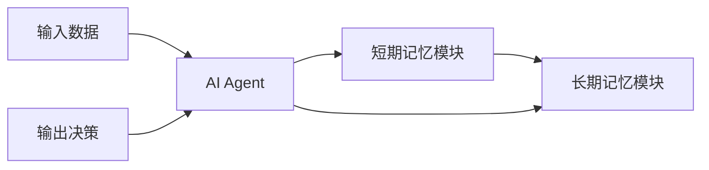
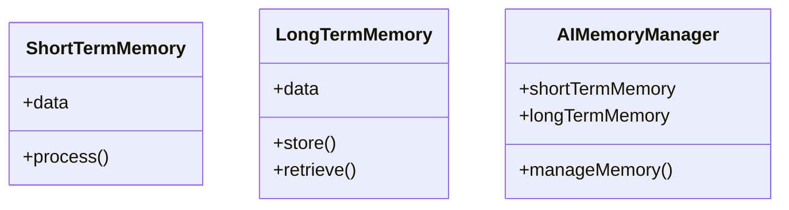
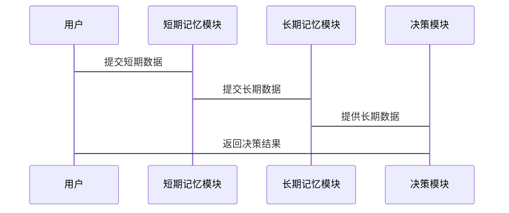

                 


# 开发AI Agent的长短期记忆管理：平衡效率与信息保留

> 关键词：AI Agent, 长短期记忆, 信息保留, 效率优化, 记忆管理

> 摘要：本文详细探讨了AI Agent在开发过程中长短期记忆管理的重要性，分析了如何在保证信息保留的同时，提升系统的效率。通过深入的技术分析和案例解读，本文为开发者提供了平衡长短期记忆管理的实用方法和最佳实践。

---

# 第一部分：AI Agent的长短期记忆管理概述

# 第1章：长短期记忆管理的背景与问题

## 1.1 长短期记忆管理的背景

### 1.1.1 AI Agent的基本概念

AI Agent（智能体）是一种能够感知环境、自主决策并执行任务的智能系统。它广泛应用于自然语言处理、推荐系统、自动驾驶等领域。AI Agent的核心能力之一是记忆管理，即存储和检索相关信息以支持决策和行为。

### 1.1.2 长短期记忆管理的重要性

AI Agent的决策依赖于对过去和当前信息的处理。短期记忆用于快速响应当前任务，而长期记忆则存储了更为持久的信息，两者缺一不可。长短期记忆的有效管理能够显著提升AI Agent的性能和用户体验。

### 1.1.3 当前技术的挑战与机遇

随着AI Agent应用场景的扩展，长短期记忆管理面临以下挑战：

- **信息冗余**：长期记忆存储的信息量巨大，如何筛选关键信息是难题。
- **效率问题**：频繁的内存操作可能导致系统性能下降。
- **信息丢失**：短期记忆的高流动性容易导致重要信息的丢失。

这些挑战同时也是技术发展的机遇，推动了长短期记忆管理的创新。

## 1.2 问题背景与问题描述

### 1.2.1 AI Agent记忆管理的核心问题

- 如何平衡长短期记忆的效率与信息保留？
- 如何设计高效的存储结构和检索机制？
- 如何优化信息的生命周期管理？

### 1.2.2 长短期记忆的定义与区别

- **短期记忆**：临时存储当前任务相关的低优先级信息，处理速度快，但保留时间短。
- **长期记忆**：存储高优先级信息，保留时间长，但检索速度较慢。

### 1.2.3 信息保留与效率之间的矛盾

- **高保留率**：可能导致存储空间不足和检索效率下降。
- **高效率**：可能导致重要信息的丢失，影响决策的准确性。

## 1.3 问题解决与边界

### 1.3.1 长短期记忆管理的目标

- **高效性**：优化信息存储和检索的效率。
- **准确性**：确保关键信息的准确存储和检索。
- **平衡性**：在效率与信息保留之间找到最佳平衡点。

### 1.3.2 边界与外延

- **边界**：专注于AI Agent内部的记忆管理，不涉及外部存储系统。
- **外延**：涉及信息编码、存储结构设计、检索算法优化等多个方面。

### 1.3.3 核心要素与概念结构

- **核心要素**：短期记忆模块、长期记忆模块、信息编码机制、检索算法。
- **概念结构**：通过实体关系图展示各模块之间的关系。

## 1.4 本章小结

本章从AI Agent的基本概念出发，分析了长短期记忆管理的重要性，详细描述了面临的主要问题，并提出了初步的解决方案框架。

---

# 第2章：长短期记忆管理的核心概念

## 2.1 长短期记忆的原理

### 2.1.1 短期记忆的特征与作用

- **特征**：临时性、高流动性、低优先级。
- **作用**：辅助快速决策，处理当前任务相关的信息。

### 2.1.2 长期记忆的特征与作用

- **特征**：持久性、稳定性、高优先级。
- **作用**：支持长期决策，存储关键历史信息。

### 2.1.3 两者之间的关系

- **动态转换**：短期记忆中的部分信息可升级为长期记忆。
- **协同工作**：短期记忆处理当前任务，长期记忆支持全局决策。

## 2.2 核心概念的对比分析

### 2.2.1 长短期记忆的属性特征对比

| 特性         | 短期记忆           | 长期记忆           |
|--------------|--------------------|--------------------|
| 存储时间       | 短暂               | 长久               |
| 处理速度       | 快                 | 较慢               |
| 信息优先级     | 低                 | 高                 |
| 空间占用       | 小                 | 大                 |

### 2.2.2 不同记忆管理策略的优缺点

| 策略           | 优点                     | 缺点                     |
|----------------|--------------------------|--------------------------|
| 短期优先       | 处理速度快               | 易丢失重要信息           |
| 长期优先       | 信息保留完整             | 处理效率低下             |
| 混合策略       | 高效性与准确性兼顾       | 策略设计复杂             |

### 2.2.3 选择策略的关键因素

- **任务需求**：高实时性任务适合短期优先策略，而需要长期决策的任务适合长期优先策略。
- **资源限制**：存储空间有限时，采用混合策略更为合适。

## 2.3 实体关系图

通过实体关系图展示长短期记忆模块与AI Agent的交互关系：



## 2.4 本章小结

本章详细讲解了长短期记忆的原理和核心概念，通过对比分析和实体关系图，明确了两者的关系及各自的优缺点。

---

# 第3章：长短期记忆管理的算法原理

## 3.1 算法原理概述

### 3.1.1 基于神经网络的记忆管理

- **原理**：通过神经网络结构模拟人类的记忆过程，实现信息的存储和检索。
- **优势**：能够自动提取特征，适应性强。

### 3.1.2 基于规则的记忆管理

- **原理**：通过预定义规则筛选和存储信息。
- **优势**：规则明确，易于管理。

### 3.1.3 混合策略的记忆管理

- **原理**：结合神经网络和规则引擎，实现高效的长短期记忆管理。
- **优势**：兼顾灵活性和可控制性。

## 3.2 算法流程图

通过流程图展示长短期记忆管理的算法流程：


## 3.3 算法实现

### 3.3.1 Python源代码实现

```python
def short_term_memory(data):
    # 短期记忆处理逻辑
    return data

def long_term_memory(data):
    # 长期记忆处理逻辑
    return data

def memory_management(data):
    short = short_term_memory(data)
    long = long_term_memory(data)
    return short, long
```

### 3.3.2 算法优化

通过引入优先级机制优化记忆管理：

```python
def prioritize_memory(data):
    # 优先级评估
    priority = evaluate_priority(data)
    if priority > threshold:
        return long_term_memory(data)
    else:
        return short_term_memory(data)
```

## 3.4 数学模型与公式

### 3.4.1 短期记忆模型

$$ S = f_s(data) $$

### 3.4.2 长期记忆模型

$$ L = f_l(data) $$

### 3.4.3 综合记忆模型

$$ M = \alpha S + (1-\alpha) L $$

其中，$\alpha$ 表示短期记忆的权重，取值范围为 $0 \leq \alpha \leq 1$。

## 3.5 示例说明

### 3.5.1 短期记忆示例

给定输入数据 $x$，短期记忆处理为 $S = x^2$。

### 3.5.2 长期记忆示例

给定输入数据 $x$，长期记忆处理为 $L = x^3$。

## 3.6 本章小结

本章通过算法流程图和数学模型，详细讲解了长短期记忆管理的实现原理和优化方法。

---

# 第4章：长短期记忆管理的系统架构

## 4.1 系统架构设计

### 4.1.1 领域模型设计

通过领域模型类图展示系统结构：



### 4.1.2 系统架构图

展示系统整体架构：


## 4.2 接口设计与交互流程

### 4.2.1 接口设计

- **短期记忆接口**：
  - `store(short_data)`
  - `retrieve(short_key)`
- **长期记忆接口**：
  - `store(long_data)`
  - `retrieve(long_key)`

### 4.2.2 交互流程

通过序列图展示交互流程：



## 4.3 本章小结

本章通过系统架构设计和接口设计，详细描述了长短期记忆管理的实现方式和交互流程。

---

# 第5章：长短期记忆管理的项目实战

## 5.1 项目环境安装

### 5.1.1 系统需求

- Python 3.8+
- 神经网络库（如TensorFlow、PyTorch）

### 5.1.2 安装依赖

```bash
pip install numpy tensorflow matplotlib
```

## 5.2 核心实现

### 5.2.1 短期记忆模块

```python
class ShortTermMemory:
    def __init__(self):
        self.data = {}

    def store(self, key, value):
        self.data[key] = value

    def retrieve(self, key):
        return self.data.get(key, None)
```

### 5.2.2 长期记忆模块

```python
class LongTermMemory:
    def __init__(self):
        self.data = {}

    def store(self, key, value):
        self.data[key] = value

    def retrieve(self, key):
        return self.data.get(key, None)
```

### 5.2.3 记忆管理模块

```python
class MemoryManager:
    def __init__(self):
        self.short_memory = ShortTermMemory()
        self.long_memory = LongTermMemory()

    def manage_memory(self, data):
        # 判断是否需要存储为长期记忆
        if data['priority'] > 0.5:
            self.long_memory.store(data['key'], data['value'])
        else:
            self.short_memory.store(data['key'], data['value'])
```

## 5.3 项目实战

### 5.3.1 案例分析

- **输入数据**：
  ```python
  data = {
      'key': 'user_response',
      'value': 'yes',
      'priority': 0.8
  }
  ```
- **处理流程**：
  ```python
  manager = MemoryManager()
  manager.manage_memory(data)
  ```

## 5.4 本章小结

本章通过项目实战，详细展示了长短期记忆管理的具体实现和应用。

---

# 第6章：长短期记忆管理的最佳实践

## 6.1 小结

- **核心目标**：平衡长短期记忆的效率与信息保留。
- **关键策略**：根据任务需求选择合适的记忆管理策略。
- **系统设计**：模块化设计，便于扩展和维护。

## 6.2 注意事项

- **数据安全**：确保敏感信息的安全存储和传输。
- **性能优化**：定期清理无效数据，优化存储结构。
- **算法选择**：根据具体场景选择合适的算法和模型。

## 6.3 拓展阅读

- **推荐书籍**：
  - 《深度学习》—— Ian Goodfellow
  - 《神经网络与深度学习》—— 周志华
- **推荐论文**：
  - "A Memory Network for Question Answering" —— Google Research
  - "Long-term Memory Networks" —— Salesforce Research

---

# 作者：AI天才研究院/AI Genius Institute & 禅与计算机程序设计艺术 /Zen And The Art of Computer Programming

---

这篇文章详细探讨了AI Agent长短期记忆管理的实现原理、系统架构和项目实战，为开发者提供了丰富的技术参考和实践指导。

