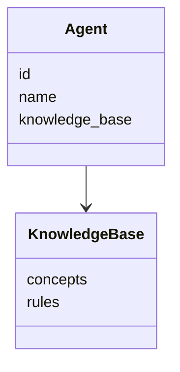
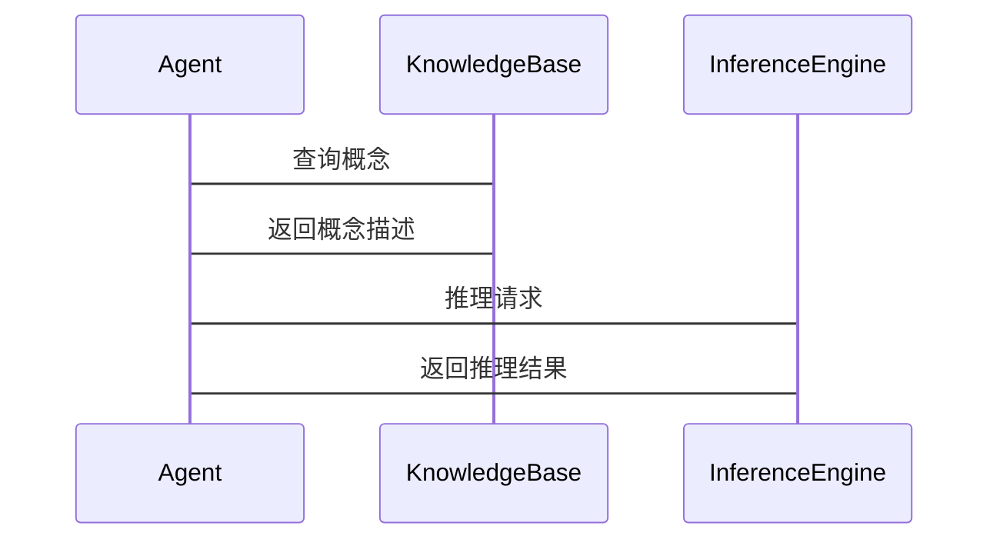

                 


```markdown
# 开发具有抽象思维与概念形成能力的AI Agent

> 关键词：AI Agent，抽象思维，概念形成，知识表示，符号逻辑

> 摘要：本文探讨了开发具有抽象思维与概念形成能力的AI Agent的关键技术与实现方法。通过详细分析抽象思维与概念形成的基本原理、算法实现、系统架构设计及项目实战，本文旨在为AI Agent的开发提供系统化的理论与实践指导。文章还通过具体案例分析，总结了开发中的经验和教训，为后续研究提供了有价值的参考。

---

# 第1章: 背景介绍与问题背景

## 1.1 问题背景

### 1.1.1 从传统AI到具备抽象思维的AI Agent的演进
- 传统AI的局限性：基于规则和数据的简单任务处理能力，缺乏对概念的抽象理解和自主推理能力。
- AI Agent的演进：从简单的任务执行向具备抽象思维和概念形成能力的高级AI Agent发展。

### 1.1.2 当前AI Agent的核心问题与挑战
- 知识表示的局限性：难以处理复杂概念的表示与推理。
- 抽象思维能力的缺失：无法从具体实例中提炼出一般性概念。
- 概念形成与问题解决的结合：如何将概念形成能力与问题解决能力有效结合。

### 1.1.3 抽象思维与概念形成能力的重要性
- 抽象思维是AI Agent实现复杂任务的基础。
- 概念形成能力是AI Agent具备自主学习和推理能力的关键。

## 1.2 问题描述

### 1.2.1 AI Agent的定义与分类
- AI Agent的定义：具备自主决策和问题解决能力的智能体。
- 分类：基于知识表示、推理方式和学习能力的不同，AI Agent可以分为多种类型。

### 1.2.2 抽象思维与概念形成能力的定义
- 抽象思维：从具体实例中提炼出一般性概念的能力。
- 概念形成：通过归纳推理形成新的概念。

### 1.2.3 问题解决与目标实现的关系
- 抽象思维能力是AI Agent实现复杂问题解决的基础。
- 概念形成能力是AI Agent具备自主学习和推理能力的关键。

## 1.3 问题解决与边界

### 1.3.1 抽象思维在问题解决中的作用
- 抽象思维帮助AI Agent从具体实例中提炼出一般性规律。
- 通过抽象思维，AI Agent能够更好地理解问题的本质。

### 1.3.2 概念形成能力的边界与外延
- 概念形成能力的边界：AI Agent能够处理的概念类型和复杂度。
- 概念形成能力的外延：与知识表示、符号逻辑等其他技术的结合。

### 1.3.3 AI Agent能力的结构与核心要素
- 知识表示：概念表示的载体。
- 推理机制：概念形成的基础。
- 学习能力：概念更新和扩展的关键。

## 1.4 本章小结
- 本章介绍了AI Agent的发展背景、核心问题与挑战，以及抽象思维与概念形成能力的重要性。
- 明确了问题解决与目标实现的关系，为后续章节的深入分析奠定了基础。

---

# 第2章: 核心概念与联系

## 2.1 抽象思维与概念形成的基本原理

### 2.1.1 抽象思维的定义与特征
- 抽象思维的定义：从具体实例中提炼出一般性规律的能力。
- 抽象思维的特征：概括性、抽象性和逻辑性。

### 2.1.2 概念形成的机制
- 概念形成的机制：通过观察和归纳推理，形成对事物的共同特征和规律的认知。
- 概念形成的关键步骤：感知、分类、归纳、抽象。

### 2.1.3 抽象思维与概念形成的联系
- 抽象思维是概念形成的基础。
- 概念形成是抽象思维的结果。

## 2.2 核心概念属性对比

### 2.2.1 抽象思维与具体思维的对比
| 特性       | 抽象思维                 | 具体思维                 |
|------------|--------------------------|--------------------------|
| 定义       | 从具体中提炼一般规律      | 处理具体实例             |
| 作用       | 理解问题本质             | 解决具体问题             |
| 示例       | 分析问题背后的原因       | 处理问题的具体步骤       |

### 2.2.2 概念形成与知识表示的对比
| 特性       | 概念形成                 | 知识表示                 |
|------------|--------------------------|--------------------------|
| 定义       | 形成对事物的共同特征认知 | 表示知识的结构与内容     |
| 方法       | 归纳推理                 | 符号逻辑、语义网络       |
| 应用       | 提供问题解决的框架       | 支持概念的推理与应用     |

### 2.2.3 核心概念的ER实体关系图

```mermaid
er
actor(Agent) {
    id: string
    name: string
    knowledge: string
}
```

---

## 2.3 本章小结
- 本章详细阐述了抽象思维与概念形成的基本原理，通过对比分析，明确了它们的定义、特征和相互关系。
- 通过ER实体关系图，展示了核心概念的结构与联系。

---

# 第3章: 抽象思维与概念形成能力的算法原理

## 3.1 概念形成算法

### 3.1.1 概念形成的定义
- 概念形成：通过归纳推理，形成对事物的共同特征认知的过程。

### 3.1.2 概念形成算法的流程
1. 输入：一组实例和特征。
2. 输出：形成的概念描述。
3. 算法步骤：
   - 从实例中提取特征。
   - 通过归纳推理，形成概念描述。
   - 验证并优化概念描述。

### 3.1.3 概念形成算法的数学模型
- 概念形成可以通过形式逻辑表示，例如：
$$
\text{概念} = \{x | x \text{满足所有实例的共同特征}\}
$$

## 3.2 抽象推理模型

### 3.2.1 抽象推理的定义
- 抽象推理：基于概念形成的结果，进行更高层次的推理与决策。

### 3.2.2 抽象推理的算法流程
1. 输入：概念描述和推理规则。
2. 输出：推理结果。
3. 算法步骤：
   - 基于概念描述，建立推理规则。
   - 进行推理，得出结论。
   - 验证推理结果的合理性。

### 3.2.3 抽象推理模型的数学公式
- 抽象推理可以通过符号逻辑表示，例如：
$$
\text{结论} = \text{推理规则} \implies \text{前提}
$$

## 3.3 算法实现的Python代码示例

### 3.3.1 概念形成算法的代码实现
```python
def concept_forming_algorithm(instances):
    # 提取特征
    features = set()
    for instance in instances:
        for feature in instance['features']:
            features.add(feature)
    # 归纳推理
    concept = {}
    for feature in features:
        count = 0
        for instance in instances:
            if feature in instance['features']:
                count += 1
        if count == len(instances):
            concept[feature] = True
        else:
            concept[feature] = False
    return concept
```

### 3.3.2 抽象推理模型的代码实现
```python
def abstract_reasoning_model(concepts, rules):
    # 建立推理规则
    inference_rules = {}
    for rule in rules:
        inference_rules[rule['premise']] = rule['conclusion']
    # 进行推理
    conclusions = []
    for premise in concepts:
        if premise in inference_rules:
            conclusions.append(inference_rules[premise])
    return conclusions
```

## 3.4 本章小结
- 本章详细讲解了概念形成与抽象推理的算法原理，并通过Python代码示例展示了算法实现。
- 通过数学公式，明确了概念形成与抽象推理的逻辑基础。

---

# 第4章: 抽象思维与概念形成能力的系统分析与架构设计

## 4.1 系统场景介绍
- 系统目标：开发具备抽象思维与概念形成能力的AI Agent。
- 系统范围：涵盖知识表示、推理机制和学习能力。
- 目标用户：开发者、研究人员和最终用户。

## 4.2 系统功能设计

### 4.2.1 领域模型mermaid类图


### 4.2.2 系统架构设计mermaid架构图


### 4.2.3 系统接口设计
- 输入接口：接收用户输入和实例数据。
- 输出接口：返回推理结果和概念描述。

### 4.2.4 系统交互mermaid序列图


## 4.3 本章小结
- 本章通过系统分析与架构设计，明确了AI Agent的系统结构和功能模块。
- 使用mermaid图展示了系统的类图、架构图和交互流程图。

---

# 第5章: 项目实战

## 5.1 环境搭建与核心实现

### 5.1.1 环境搭建
- Python环境：Python 3.8+
- 开发工具：PyCharm、VS Code
- 依赖库：numpy、scikit-learn

### 5.1.2 核心实现
- 知识表示：符号逻辑与语义网络。
- 推理机制：基于规则的推理与归纳推理。

## 5.2 代码实现与案例分析

### 5.2.1 概念形成算法实现
```python
def concept_forming_algorithm(instances):
    features = set()
    for instance in instances:
        for feature in instance['features']:
            features.add(feature)
    concept = {}
    for feature in features:
        count = 0
        for instance in instances:
            if feature in instance['features']:
                count += 1
        concept[feature] = (count == len(instances))
    return concept
```

### 5.2.2 抽象推理模型实现
```python
def abstract_reasoning_model(concepts, rules):
    inference_rules = {}
    for rule in rules:
        inference_rules[rule['premise']] = rule['conclusion']
    conclusions = []
    for premise in concepts:
        if premise in inference_rules:
            conclusions.append(inference_rules[premise])
    return conclusions
```

## 5.3 案例分析与总结

### 5.3.1 案例分析
- 案例描述：基于实例数据的概念形成与推理。
- 实施步骤：环境搭建、数据准备、算法实现、结果验证。

### 5.3.2 项目总结
- 项目成果：成功实现了具备抽象思维与概念形成能力的AI Agent。
- 经验总结：算法实现的关键点和系统设计的注意事项。

---

# 第6章: 案例分析与最佳实践

## 6.1 案例分析

### 6.1.1 案例一：智能助手开发
- 案例描述：基于概念形成与抽象推理的智能助手开发。
- 实施步骤：需求分析、系统设计、算法实现、测试优化。

### 6.1.2 案例二：医疗诊断系统
- 案例描述：基于概念形成与抽象推理的医疗诊断系统。
- 实施步骤：知识库构建、推理规则设计、系统实现与测试。

## 6.2 最佳实践

### 6.2.1 数据质量
- 数据的全面性与准确性是概念形成的关键。
- 数据的多样性有助于提高抽象推理能力。

### 6.2.2 模型训练
- 模型的训练数据要多样化。
- 模型的训练过程要进行充分的验证与优化。

### 6.2.3 伦理与安全
- 确保AI Agent的行为符合伦理规范。
- 加强数据安全与隐私保护。

## 6.3 本章小结
- 本章通过具体案例分析，展示了具备抽象思维与概念形成能力的AI Agent在实际应用中的潜力。
- 总结了开发中的经验和教训，提出了最佳实践的建议。

---

# 第7章: 总结与展望

## 7.1 总结
- 本文详细探讨了开发具有抽象思维与概念形成能力的AI Agent的关键技术与实现方法。
- 通过系统分析与项目实战，明确了AI Agent的系统结构和功能模块。

## 7.2 展望
- 抽象思维与概念形成能力的进一步提升。
- AI Agent在复杂场景中的应用拓展。
- 多模态数据的融合与处理。

---

# 附录

## 附录A: 术语表
- AI Agent：具备自主决策和问题解决能力的智能体。
- 抽象思维：从具体实例中提炼出一般性规律的能力。
- 概念形成：通过归纳推理，形成对事物的共同特征认知的过程。

## 附录B: 参考文献
1. Russell, S., & Norvig, P. (2010). Artificial Intelligence: A Modern Approach.
2. Newell, A., & Simon, H. A. (1972). Human Problem Solving.
3. Sowa, J. F. (1984). Conceptual Structures: Information Processing in Mind and Machine.

---

# 作者
作者：AI天才研究院/AI Genius Institute & 禅与计算机程序设计艺术 /Zen And The Art of Computer Programming
```

