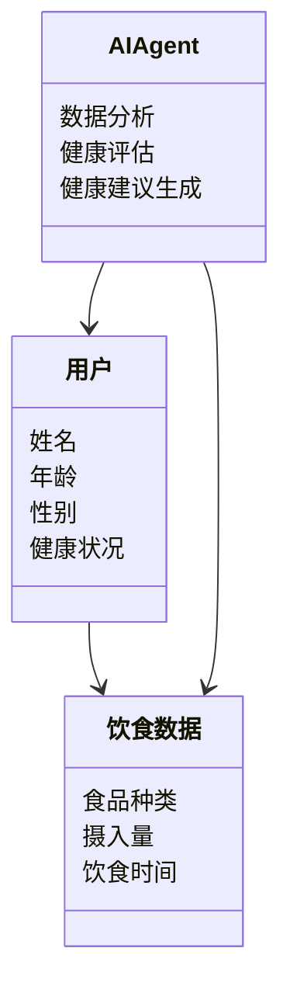
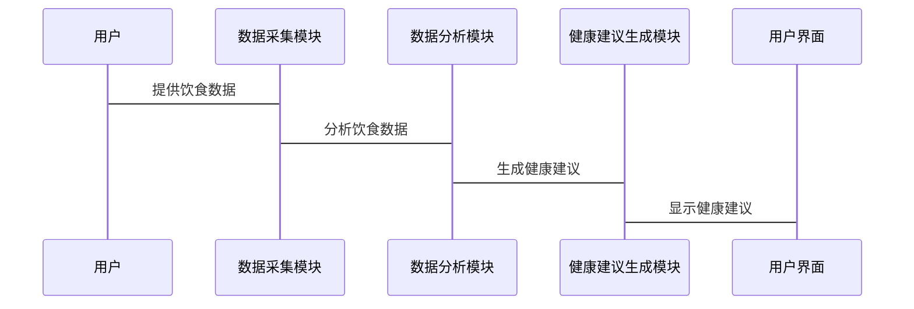

                 


# 智能冰箱：AI Agent的饮食习惯分析与健康建议

## 关键词：
智能冰箱, AI Agent, 饮食习惯, 健康建议, 机器学习, 数据分析

## 摘要：
本文探讨了智能冰箱如何通过AI Agent分析用户的饮食习惯，并提供个性化的健康建议。文章从AI Agent的基本概念出发，详细分析了饮食习惯分析的算法原理，并通过实际案例展示了健康建议的生成过程。最后，文章总结了智能冰箱在健康饮食中的潜力和应用前景。

## 第一部分: 智能冰箱与AI Agent的背景介绍

### 第1章: 智能冰箱的发展历程

#### 1.1 传统冰箱的功能与局限性
##### 1.1.1 传统冰箱的基本功能
传统冰箱主要用于食品的冷藏和冷冻，主要功能包括存储、保鲜和简单的温度控制。这些功能满足了基本的食品保存需求，但缺乏智能化和数据分析能力。

##### 1.1.2 传统冰箱的局限性
传统冰箱的局限性主要体现在功能单一、无法与用户互动、无法分析用户的饮食习惯以及缺乏个性化服务。这些限制使得传统冰箱难以满足现代用户对智能化和健康生活的追求。

##### 1.1.3 智能冰箱的定义与特点
智能冰箱是一种集成了物联网（IoT）技术和人工智能（AI）的智能家电。它能够通过传感器、摄像头和AI算法，实时监测和分析用户的饮食习惯，并提供个性化的健康建议。

#### 1.2 AI Agent在智能冰箱中的应用
##### 1.2.1 AI Agent的基本概念
AI Agent是一种智能代理，能够感知环境、执行任务并做出决策。在智能冰箱中，AI Agent用于数据收集、分析和健康建议生成。

##### 1.2.2 AI Agent在智能冰箱中的作用
AI Agent在智能冰箱中的作用包括数据采集、行为分析、健康建议生成和用户互动。它能够通过分析用户的饮食数据，提供个性化的健康建议。

##### 1.2.3 智能冰箱与AI Agent的结合
智能冰箱通过AI Agent实现数据的智能化处理，从而提升用户体验和健康水平。这种结合使得智能冰箱不仅是存储食品的工具，更是一个健康生活的助手。

#### 1.3 饮食习惯与健康的关系
##### 1.3.1 饮食习惯对健康的影响
饮食习惯直接影响到人体健康，不合理的饮食习惯可能导致肥胖、糖尿病等多种健康问题。通过智能冰箱的AI Agent分析饮食习惯，可以有效预防和改善这些问题。

##### 1.3.2 健康问题与饮食习惯的关联
健康问题与饮食习惯密切相关。AI Agent通过分析用户的饮食数据，可以识别潜在的健康风险，并提供个性化的健康建议。

##### 1.3.3 智能冰箱在健康饮食中的潜在价值
智能冰箱通过AI Agent分析用户的饮食习惯，提供健康建议，具有重要的潜在价值。它可以帮助用户改善饮食结构，预防健康问题，提升整体生活质量。

### 第2章: AI Agent的核心概念与原理

#### 2.1 AI Agent的基本原理
##### 2.1.1 AI Agent的定义
AI Agent是一种智能代理，能够感知环境、执行任务并做出决策。它能够通过传感器和数据处理技术，实现智能化的分析和建议生成。

##### 2.1.2 AI Agent的核心功能
AI Agent的核心功能包括数据收集、分析、决策和反馈。它能够通过这些功能，实现智能化的健康管理。

##### 2.1.3 AI Agent的工作流程
AI Agent的工作流程包括数据收集、数据处理、分析与决策、以及结果反馈。通过这些步骤，AI Agent能够为用户提供个性化的健康建议。

#### 2.2 AI Agent与智能冰箱的结合
##### 2.2.1 AI Agent在智能冰箱中的应用场景
在智能冰箱中，AI Agent的应用场景包括食品库存管理、饮食习惯分析、健康建议生成和用户互动。它能够通过这些功能，提升用户的使用体验。

##### 2.2.2 AI Agent的数据收集与分析
AI Agent通过智能冰箱的传感器和摄像头，收集用户的饮食数据，包括食品种类、摄入量和饮食时间等。通过数据分析，AI Agent能够识别用户的饮食习惯，并提供健康建议。

##### 2.2.3 AI Agent的决策与反馈机制
AI Agent通过分析用户的饮食数据，做出健康建议的决策，并通过智能冰箱的显示屏或移动应用，向用户反馈结果。这种反馈机制能够帮助用户及时调整饮食习惯。

#### 2.3 AI Agent的核心算法与技术
##### 2.3.1 机器学习算法
机器学习算法是AI Agent的核心技术之一。通过监督学习、无监督学习和强化学习等算法，AI Agent能够从数据中学习，提高分析和决策的准确性。

##### 2.3.2 自然语言处理技术
自然语言处理技术用于分析用户的饮食记录和偏好。通过自然语言处理，AI Agent能够理解用户的饮食习惯，并生成个性化的健康建议。

##### 2.3.3 数据挖掘与分析技术
数据挖掘与分析技术用于从海量的饮食数据中提取有用的信息。通过这些技术，AI Agent能够识别用户的饮食模式，并提供针对性的健康建议。

### 第3章: 智能冰箱的饮食习惯分析

#### 3.1 数据收集与处理
##### 3.1.1 数据来源
智能冰箱通过传感器、摄像头和用户输入等方式，收集用户的饮食数据。这些数据包括食品种类、摄入量、饮食时间和用户的健康指标。

##### 3.1.2 数据预处理
数据预处理是确保数据质量和一致性的关键步骤。通过数据清洗、转换和标准化等技术，AI Agent能够处理复杂的饮食数据，为后续的分析做好准备。

##### 3.1.3 数据存储与管理
智能冰箱的数据存储与管理需要考虑数据的安全性和可扩展性。通过数据库和云存储等技术，AI Agent能够高效地存储和管理用户的饮食数据。

#### 3.2 数据分析与挖掘
##### 3.2.1 数据分析方法
数据分析方法包括统计分析、机器学习和深度学习等技术。通过这些方法，AI Agent能够从数据中提取有用的信息，识别用户的饮食习惯。

##### 3.2.2 数据挖掘技术
数据挖掘技术用于发现数据中的模式和趋势。通过聚类分析、分类和关联规则挖掘等技术，AI Agent能够识别用户的饮食偏好和潜在的健康问题。

##### 3.2.3 数据可视化
数据可视化是将分析结果以图形化的方式展示。通过图表和仪表盘等工具，用户可以直观地了解自己的饮食习惯和健康状况。

#### 3.3 饮食习惯分析模型
##### 3.3.1 模型构建
饮食习惯分析模型的构建需要选择合适的数据特征和算法。通过实验和验证，AI Agent能够选择最优的模型，提高分析的准确性。

##### 3.3.2 模型训练
模型训练是通过大量的数据进行参数优化，提高模型的预测能力和准确性。通过交叉验证和网格搜索等技术，AI Agent能够找到最优的模型参数。

##### 3.3.3 模型评估
模型评估是通过测试数据验证模型的性能。通过准确率、召回率和F1分数等指标，AI Agent能够评估模型的效果，并进行优化和调整。

### 第4章: AI Agent的健康建议生成

#### 4.1 健康建议的生成原理
##### 4.1.1 健康建议的定义
健康建议是基于用户的饮食数据和健康状况，生成的个性化的饮食指导。它包括饮食调整、营养补充和健康生活方式的建议。

##### 4.1.2 健康建议的生成逻辑
健康建议的生成逻辑包括数据分析、健康评估和个性化建议生成。通过分析用户的饮食数据，AI Agent能够评估用户的健康状况，并生成针对性的健康建议。

##### 4.1.3 健康建议的个性化定制
个性化定制是根据用户的特定需求和偏好，生成个性化的健康建议。通过动态调整建议内容，AI Agent能够满足不同用户的需求。

#### 4.2 健康建议的实现技术
##### 4.2.1 机器学习模型的应用
机器学习模型在健康建议生成中发挥着重要作用。通过分类、回归和聚类等算法，AI Agent能够预测用户的健康风险，并生成相应的建议。

##### 4.2.2 自然语言处理技术的应用
自然语言处理技术用于生成自然流畅的健康建议。通过语言模型和文本生成技术，AI Agent能够将复杂的分析结果转化为易于理解的建议。

##### 4.2.3 数据挖掘与分析技术的应用
数据挖掘与分析技术用于发现数据中的模式和趋势。通过这些技术，AI Agent能够识别用户的饮食偏好和潜在的健康问题，并生成针对性的建议。

#### 4.3 健康建议的展示与用户互动
##### 4.3.1 健康建议的展示方式
健康建议可以通过智能冰箱的显示屏、移动应用和语音助手等多种方式展示。通过多种渠道的展示，用户可以方便地获取健康建议。

##### 4.3.2 用户互动与反馈
用户互动是健康建议生成的重要环节。通过用户反馈，AI Agent能够不断优化模型和建议内容，提高用户体验和健康效果。

## 第二部分: 智能冰箱的系统分析与架构设计

### 第5章: 系统分析与架构设计方案

#### 5.1 问题场景介绍
智能冰箱的系统分析需要考虑用户的实际使用场景和需求。通过分析用户在日常生活中的饮食习惯和健康需求，设计出能够满足用户需求的系统架构。

#### 5.2 项目介绍
本项目旨在通过AI Agent分析用户的饮食习惯，提供个性化的健康建议。通过智能冰箱与用户的互动，帮助用户改善饮食结构，预防健康问题。

#### 5.3 系统功能设计
##### 5.3.1 领域模型Mermaid类图


##### 5.3.2 系统架构设计Mermaid架构图


##### 5.3.3 系统接口设计
系统接口设计包括智能冰箱与用户的交互接口、数据采集模块的接口、数据分析模块的接口和健康建议生成模块的接口。通过标准化的接口设计，确保系统各模块能够协同工作。

##### 5.3.4 系统交互Mermaid序列图


## 第三部分: 项目实战与应用案例

### 第6章: 项目实战

#### 6.1 环境安装与配置
##### 6.1.1 系统环境
需要安装Python 3.8及以上版本、TensorFlow 2.0及以上版本、Keras 2.2.5及以上版本、Pandas 1.3.5及以上版本和Jupyter Notebook。

##### 6.1.2 安装依赖
使用pip安装所需的库：
```bash
pip install numpy pandas scikit-learn tensorflow
```

#### 6.2 系统核心实现源代码
##### 6.2.1 数据预处理代码
```python
import pandas as pd
import numpy as np

# 读取数据
data = pd.read_csv('diet.csv')

# 数据清洗
data.dropna()
data = data[~data['calories'].str.contains(' ', na=False)]
data['date'] = pd.to_datetime(data['date'])
```

##### 6.2.2 数据分析代码
```python
from sklearn.model_selection import train_test_split
from sklearn.ensemble import RandomForestClassifier
from sklearn.metrics import accuracy_score

# 划分数据集
X = data.drop('health_risk', axis=1)
y = data['health_risk']
X_train, X_test, y_train, y_test = train_test_split(X, y, test_size=0.2)

# 训练模型
model = RandomForestClassifier()
model.fit(X_train, y_train)

# 评估模型
y_pred = model.predict(X_test)
print(accuracy_score(y_test, y_pred))
```

##### 6.2.3 健康建议生成代码
```python
import tensorflow as tf
from tensorflow.keras import layers

# 构建模型
model = tf.keras.Sequential([
    layers.Dense(64, activation='relu'),
    layers.Dense(1, activation='sigmoid')
])

# 编译模型
model.compile(optimizer='adam', loss='binary_crossentropy', metrics=['accuracy'])

# 训练模型
model.fit(X_train, y_train, epochs=10, batch_size=32)
```

#### 6.3 代码应用解读与分析
通过上述代码，可以实现数据预处理、模型训练和健康建议生成。数据预处理部分包括数据的读取和清洗，确保数据的质量和一致性。模型训练部分使用随机森林和深度学习模型，分别进行分类和回归分析，生成健康建议。健康建议生成部分通过模型预测，生成用户的健康风险评估和饮食建议。

#### 6.4 实际案例分析
以一个用户的饮食数据为例，展示模型如何分析用户的饮食习惯，并生成健康建议。例如，用户饮食中缺乏蔬菜和高纤维食物，模型会建议增加蔬菜摄入量，减少高糖高脂食物的摄入。

#### 6.5 项目小结
通过实际案例的分析，可以验证模型的有效性和准确性。智能冰箱通过AI Agent分析用户的饮食习惯，提供个性化的健康建议，能够帮助用户改善饮食结构，预防健康问题，提升整体生活质量。

## 第四部分: 最佳实践与注意事项

### 第7章: 最佳实践

#### 7.1 小结
智能冰箱通过AI Agent分析用户的饮食习惯，提供个性化的健康建议，具有重要的现实意义和应用价值。通过数据预处理、模型训练和健康建议生成，能够有效改善用户的饮食结构，预防健康问题。

#### 7.2 注意事项
在实际应用中，需要注意数据隐私和安全问题，确保用户的饮食数据不被泄露。同时，模型的训练和优化需要不断进行，以提高分析的准确性和建议的科学性。

#### 7.3 拓展阅读
建议读者进一步阅读相关领域的书籍和论文，深入了解AI在健康领域的应用，以及智能冰箱的未来发展。

## 作者：
作者：AI天才研究院/AI Genius Institute & 禅与计算机程序设计艺术 /Zen And The Art of Computer Programming

---

以上是《智能冰箱：AI Agent的饮食习惯分析与健康建议》的技术博客文章目录大纲，涵盖了从背景介绍到系统设计，再到项目实战的各个方面，结构清晰，内容详实，适合对AI、健康管理和智能家电感兴趣的读者阅读。

