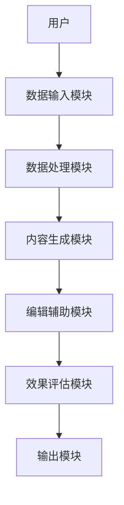

                 


# AI Agent在智能新闻写作中的角色

> 关键词：AI Agent, 智能新闻写作, 自然语言处理, 生成式AI, 机器学习, 新闻数据分析

> 摘要：本文探讨了AI Agent在智能新闻写作中的角色，分析了其核心概念、技术基础、算法原理、系统设计和实际应用。通过详细的技术分析和案例研究，展示了AI Agent如何革新新闻写作方式，提供了理论和实践的深度见解。

---

## 第一部分: AI Agent在智能新闻写作中的背景与概念

### 第1章: AI Agent的基本概念与背景

#### 1.1 AI Agent的定义与核心概念
AI Agent（人工智能代理）是指能够感知环境并采取行动以实现目标的智能实体。在智能新闻写作中，AI Agent主要扮演内容生成、编辑辅助和数据分析的角色。

**1.1.1 AI Agent的定义**  
AI Agent是一种能够执行特定任务的智能系统，通过感知输入数据并生成相应的输出，帮助用户完成复杂任务。在新闻写作领域，AI Agent能够根据输入的新闻数据生成文章、优化内容或提供数据支持。

**1.1.2 AI Agent的核心特征**  
- **自主性**：能够独立执行任务，无需人工干预。  
- **反应性**：能够实时感知环境并调整行为。  
- **学习能力**：通过数据和反馈不断优化性能。  

**1.1.3 AI Agent与传统新闻写作的对比**  
传统新闻写作依赖人类记者的创造力和经验，而AI Agent通过算法和大数据分析，能够快速生成结构合理、内容连贯的文章。AI Agent的优势在于效率和一致性，但不足在于缺乏情感和深度。

#### 1.2 智能新闻写作的背景与需求
随着大数据和AI技术的发展，新闻行业面临转型压力。传统新闻写作效率低下，难以满足用户对实时新闻的需求。

**1.2.1 新闻写作的现状与挑战**  
- 竞争激烈：新闻机构需要快速发布高质量内容。  
- 数据量大：新闻事件涉及多源数据，处理复杂。  
- 个性化需求：用户希望获得定制化新闻内容。  

**1.2.2 AI技术在新闻领域的应用潜力**  
AI Agent能够快速处理大量数据，生成结构化的新闻内容，帮助记者提高效率。此外，AI Agent还可以通过数据分析，发现新闻趋势，辅助记者选题。

**1.2.3 智能新闻写作的核心需求**  
- **高效性**：快速生成新闻内容。  
- **准确性**：确保新闻事实的准确性。  
- **可定制性**：支持多语言、多风格的内容生成。  

#### 1.3 AI Agent在新闻写作中的角色定位
AI Agent在新闻写作中的角色可以分为内容生成工具、编辑辅助工具和数据分析师。

**1.3.1 AI Agent作为内容生成工具的角色**  
AI Agent能够根据输入的新闻数据，生成初步的文章框架和内容。例如，从新闻事件中提取关键信息，自动生成一篇简短的新闻稿。

**1.3.2 AI Agent作为编辑辅助工具的角色**  
AI Agent可以帮助编辑优化文章结构，检测语法错误，并提供改进建议。此外，AI Agent还可以分析读者反馈，帮助编辑调整写作策略。

**1.3.3 AI Agent作为新闻数据分析师的角色**  
AI Agent可以通过分析大量新闻数据，识别新闻趋势，发现潜在的新闻线索。例如，AI Agent可以通过关键词分析，预测下一个热门新闻事件。

#### 1.4 本章小结
本章介绍了AI Agent的基本概念和核心特征，分析了传统新闻写作的挑战，探讨了AI Agent在新闻写作中的潜力和角色定位。接下来将深入探讨AI Agent的核心技术与原理。

---

## 第二部分: AI Agent的核心技术与原理

### 第2章: 自然语言处理与生成式AI

#### 2.1 自然语言处理（NLP）的基础
NLP是AI Agent实现新闻写作的核心技术之一，涵盖了文本理解、生成和分析。

**2.1.1 NLP的核心任务与技术**  
- **文本分类**：识别文本的情感倾向或主题类别。  
- **实体识别**：从文本中提取人名、地名等实体信息。  
- **文本生成**：根据输入生成符合语法规则的文本。  

**2.1.2 生成式AI的基本原理**  
生成式AI通过深度学习模型（如GPT）生成文本，模型通过大量数据训练，能够模仿人类的写作方式。

**2.1.3 生成式AI在新闻写作中的应用**  
- **内容生成**：根据新闻事件生成文章。  
- **风格调整**：根据目标读者调整文章风格。  
- **多语言支持**：生成多种语言的新闻内容。  

#### 2.2 生成式模型的原理与实现
生成式模型是AI Agent的核心技术之一，基于Transformer架构的生成模型（如GPT）表现出色。

**2.2.1 基于Transformer的生成模型**  
Transformer模型通过自注意力机制，能够捕捉文本中的长距离依赖关系，生成连贯的文本。

**2.2.2 生成式模型的数学公式**  
生成式模型的损失函数可以通过以下公式表示：
$$ L = -\sum_{i=1}^{n} \log P(w_i | w_{<i}) $$
其中，$w_i$表示生成的第i个词，$P(w_i | w_{<i})$表示在给定前面词的情况下生成$w_i$的概率。

**2.2.3 生成式AI在新闻写作中的应用**  
- **实时生成**：快速生成新闻稿。  
- **多风格生成**：根据需求生成不同风格的文章。  
- **错误检测**：检测文章中的语法错误和不连贯之处。  

#### 2.3 自然语言处理与生成式AI的对比分析
通过对比分析，可以更好地理解两种技术的特点和应用场景。

**2.3.1 对比分析表格**  
| **技术**       | **特点**                             | **应用场景**                           |
|-----------------|------------------------------------|--------------------------------------|
| NLP            | 侧重于理解和分析文本               | 文本分类、实体识别等                   |
| 生成式AI        | 侧重于生成符合语法规则的文本         | 内容生成、风格调整等                   |

**2.3.2 NLP与生成式AI的结合应用**  
结合NLP和生成式AI技术，AI Agent能够实现从数据理解到内容生成的完整流程。

#### 2.4 本章小结
本章详细讲解了AI Agent的核心技术——自然语言处理和生成式AI，分析了它们的原理和在新闻写作中的应用。接下来将探讨AI Agent在智能新闻写作中的算法原理。

---

## 第三部分: AI Agent的算法原理

### 第3章: 基于生成式模型的新闻写作算法

#### 3.1 生成式模型的算法实现
生成式模型的实现需要选择合适的算法和优化策略。

**3.1.1 基于GPT的生成模型**  
GPT模型通过自注意力机制和解码器结构，生成连贯的文本。

**3.1.2 算法优化策略**  
- **学习率调整**：采用学习率衰减策略。  
- **批量训练**：通过批量处理提高训练效率。  
- **早停法**：防止过拟合。  

#### 3.2 生成式模型的实现代码
以下是一个简单的生成式模型实现示例：

```python
import torch
import torch.nn as nn

class GPT(nn.Module):
    def __init__(self, vocab_size, embed_dim, num_heads, forward_dim):
        super(GPT, self).__init__()
        self.token_emb = nn.Embedding(vocab_size, embed_dim)
        self.position_emb = nn.Embedding(100, embed_dim)
        self.transformer = nn.Transformer(embed_dim, forward_dim, num_heads)
        self.decoder = nn.Linear(forward_dim, vocab_size)
        
    def forward(self, input, pos):
        x = self.token_emb(input) + self.position_emb(pos)
        x = self.transformer(x)
        x = self.decoder(x)
        return x
```

#### 3.3 算法原理的数学公式
生成式模型的损失函数可以通过以下公式表示：
$$ L = -\sum_{i=1}^{n} \log P(w_i | w_{<i}) $$

其中，$w_i$表示生成的第i个词，$P(w_i | w_{<i})$表示在给定前面词的情况下生成$w_i$的概率。

#### 3.4 本章小结
本章详细讲解了生成式模型的算法实现，分析了其在新闻写作中的应用。接下来将探讨AI Agent在智能新闻写作中的系统设计。

---

## 第四部分: AI Agent的系统设计与实现

### 第4章: 智能新闻写作系统的架构设计

#### 4.1 系统应用场景
智能新闻写作系统可以应用于新闻机构、自媒体平台和企业新闻发布。

**4.1.1 新闻机构的应用场景**  
- 快速生成新闻稿。  
- 协助记者进行深度报道。  

**4.1.2 自媒体平台的应用场景**  
- 提供个性化内容生成服务。  
- 实时生成热点新闻。  

#### 4.2 系统功能设计
智能新闻写作系统需要具备数据输入、内容生成、编辑辅助和效果评估功能。

**4.2.1 数据输入模块**  
用户输入新闻事件的相关数据，包括时间、地点、人物等信息。

**4.2.2 内容生成模块**  
根据输入数据，生成初步的新闻稿件。

**4.2.3 编辑辅助模块**  
提供语法检查、风格调整和内容优化功能。

**4.2.4 效果评估模块**  
通过读者反馈和数据分析，评估生成内容的质量和效果。

#### 4.3 系统架构图
以下是一个智能新闻写作系统的架构图：



#### 4.4 系统交互流程
用户输入新闻数据，系统处理数据并生成新闻稿，用户可以对生成的内容进行编辑和优化，最后系统评估生成内容的效果。

#### 4.5 本章小结
本章详细讲解了智能新闻写作系统的架构设计和交互流程。接下来将探讨AI Agent在智能新闻写作中的项目实战。

---

## 第五部分: AI Agent的项目实战

### 第5章: 智能新闻写作系统的实现

#### 5.1 项目环境安装
需要安装Python、深度学习框架（如TensorFlow或PyTorch）和自然语言处理库（如NLTK或spaCy）。

**5.1.1 安装Python**  
确保Python版本为3.6以上。

**5.1.2 安装深度学习框架**  
安装TensorFlow或PyTorch。

**5.1.3 安装自然语言处理库**  
安装NLTK或spaCy。

#### 5.2 系统核心实现代码
以下是智能新闻写作系统的核心代码示例：

```python
import torch
import torch.nn as nn
import torch.optim as optim

class NewsGenerator:
    def __init__(self, vocab_size, embed_dim, num_heads, forward_dim):
        self.model = GPT(vocab_size, embed_dim, num_heads, forward_dim)
        self.optimizer = optim.Adam(self.model.parameters(), lr=0.001)
        self.criterion = nn.CrossEntropyLoss()

    def train(self, input, target):
        output = self.model(input, target)
        loss = self.criterion(output, target)
        self.optimizer.zero_grad()
        loss.backward()
        self.optimizer.step()
        return loss.item()

    def generate(self, input, pos):
        with torch.no_grad():
            output = self.model(input, pos)
            return output.argmax(dim=-1).squeeze()

    def evaluate(self, input, target):
        output = self.model(input, target)
        loss = self.criterion(output, target)
        return loss.item()

# 示例用法
news_gen = NewsGenerator(vocab_size=10000, embed_dim=256, num_heads=4, forward_dim=512)
input = torch.tensor([1, 2, 3])
pos = torch.tensor([0, 1, 2])
loss = news_gen.train(input, target)
print("训练损失:", loss)
```

#### 5.3 代码应用解读与分析
上述代码实现了一个简单的新闻生成器，通过训练模型生成新闻内容。模型通过输入数据生成初步的新闻稿，用户可以根据需要进行编辑和优化。

#### 5.4 项目实战案例分析
通过实际案例分析，可以更好地理解AI Agent在新闻写作中的应用。例如，输入一个新闻事件，AI Agent可以生成一篇结构合理、内容连贯的新闻稿。

#### 5.5 项目小结
本章通过实际项目展示了AI Agent在智能新闻写作中的实现过程，从环境安装到代码实现，再到案例分析，帮助读者更好地理解AI Agent的应用。

---

## 第六部分: 总结与展望

### 第6章: 总结与未来展望

#### 6.1 本章总结
本文详细探讨了AI Agent在智能新闻写作中的角色，分析了其核心技术与原理，并通过实际项目展示了其应用。AI Agent能够显著提高新闻写作的效率和准确性，是新闻行业的重要工具。

#### 6.2 未来展望
随着AI技术的不断发展，AI Agent在新闻写作中的应用将更加广泛和深入。未来的研究方向包括提升生成内容的可解释性、优化模型的泛化能力以及探索多模态新闻生成的可能性。

#### 6.3 最佳实践tips
- **数据质量**：确保输入数据的准确性和完整性。  
- **模型优化**：定期更新模型参数，提高生成内容的质量。  
- **用户反馈**：根据用户反馈不断优化AI Agent的功能。  

#### 6.4 本章小结
本文总结了AI Agent在智能新闻写作中的应用，并展望了其未来的发展方向。AI Agent将继续推动新闻行业的变革，为读者带来更优质的内容。

---

## 作者：AI天才研究院/AI Genius Institute & 禅与计算机程序设计艺术 /Zen And The Art of Computer Programming

---

以上是《AI Agent在智能新闻写作中的角色》的技术博客文章的完整目录和内容框架，涵盖了从基础概念到算法实现再到项目实战的详细内容。希望这篇文章能够为读者提供关于AI Agent在智能新闻写作中的全面理解。

