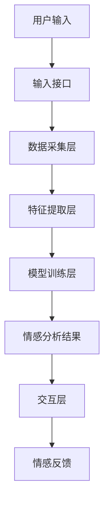

                 


# AI Agent的情感计算与应用

> 关键词：人工智能代理（AI Agent）、情感计算、自然语言处理、人机交互、机器学习

> 摘要：本文系统性地探讨了AI Agent在情感计算领域的应用，从理论基础到实际应用，结合具体案例分析，深入阐述了情感计算在AI Agent中的关键技术和应用价值。文章首先介绍了AI Agent和情感计算的基本概念，然后详细分析了情感计算的核心原理与算法，接着从系统架构角度探讨了AI Agent的情感计算实现，最后通过项目实战展示了情感计算在实际场景中的应用，并总结了相关经验与最佳实践。

---

## 第1章: AI Agent与情感计算概述

### 1.1 AI Agent的基本概念

#### 1.1.1 AI Agent的定义与特点
AI Agent（人工智能代理）是指能够感知环境、自主决策并执行任务的智能实体。它具备以下特点：
- **自主性**：能够在没有外部干预的情况下自主运行。
- **反应性**：能够根据环境变化实时调整行为。
- **目标导向**：具有明确的目标，并通过行动实现目标。
- **社交能力**：能够与人类或其他AI Agent进行有效交互。

#### 1.1.2 情感计算的定义与目标
情感计算（Affective Computing）是研究如何构建能够识别、理解和响应人类情感的计算机系统。其目标是通过技术手段，模拟和增强人类情感交互的能力，使计算机系统能够理解并响应用户的情感状态。

#### 1.1.3 AI Agent与情感计算的关系
AI Agent与情感计算的结合，使得AI Agent能够具备情感理解与表达能力，从而在人机交互中提供更自然、更个性化的服务。情感计算为AI Agent提供了感知和理解用户情感的能力，而AI Agent则为情感计算提供了应用和实现的平台。

### 1.2 情感计算的发展历程

#### 1.2.1 情感计算的起源与演变
情感计算的概念最早由MIT的ffective Computing Group提出，研究如何通过技术手段模拟和理解人类情感。随着人工智能技术的发展，情感计算逐渐从理论研究走向实际应用。

#### 1.2.2 AI Agent技术的进步与挑战
AI Agent技术的进步，特别是自然语言处理和深度学习的发展，为情感计算在AI Agent中的应用提供了技术基础。然而，情感计算的复杂性仍然面临诸多挑战，如情感的多模态表达、情感理解的准确性等。

#### 1.2.3 情感计算在AI Agent中的应用
情感计算在AI Agent中的应用日益广泛，如智能客服、教育机器人、情感陪伴机器人等领域，显著提升了用户体验和交互效果。

### 1.3 情感计算的应用领域

#### 1.3.1 情感计算在人机交互中的应用
通过情感计算，AI Agent能够更准确地理解用户的情感状态，从而提供更智能、更个性化的交互服务。

#### 1.3.2 情感计算在智能客服中的应用
智能客服通过情感计算技术，能够识别用户的情感状态，提供更具同理心的解决方案，提升客户满意度。

#### 1.3.3 情感计算在教育与医疗中的应用
在教育领域，情感计算可以帮助AI教育机器人根据学生的情绪状态调整教学策略；在医疗领域，情感计算能够辅助医生更好地理解患者的心理状态，提供更有效的治疗方案。

## 1.4 本章小结
本章从AI Agent和情感计算的基本概念出发，探讨了情感计算的发展历程及其在不同领域的应用，为后续章节的深入分析奠定了基础。

---

## 第2章: AI Agent的情感计算核心概念

### 2.1 情感计算的核心原理

#### 2.1.1 情感分析的基本流程
情感分析的基本流程包括数据采集、预处理、特征提取、模型训练与评估。通过这些步骤，系统能够对文本、语音或图像中的情感信息进行分类和识别。

#### 2.1.2 情感计算的关键技术
- **文本情感分析**：基于自然语言处理技术，识别文本中的情感倾向。
- **语音情感识别**：通过语音信号处理技术，提取情感特征并进行分类。
- **图像情感识别**：基于计算机视觉技术，分析面部表情、姿态等视觉信息，判断情感状态。

#### 2.1.3 AI Agent中情感计算的实现方式
AI Agent可以通过以下方式实现情感计算：
- **基于规则的方法**：利用预定义的规则和情感词典，进行情感分析。
- **基于机器学习的方法**：利用分类算法（如SVM、随机森林）训练情感分类模型。
- **基于深度学习的方法**：利用神经网络（如RNN、CNN）进行情感分析。

### 2.2 情感计算与AI Agent的关系

#### 2.2.1 情感计算在AI Agent中的作用
情感计算为AI Agent提供了以下能力：
- **情感感知**：识别用户的情感状态，如快乐、愤怒、悲伤等。
- **情感理解**：理解用户情感背后的需求和意图。
- **情感表达**：通过语言、语气或行为，表达情感回应。

#### 2.2.2 AI Agent如何利用情感计算提升智能性
AI Agent通过情感计算可以实现更智能的交互，例如：
- 根据用户的情感状态调整对话策略。
- 提供更具个性化的服务，增强用户体验。

#### 2.2.3 情感计算对人机交互的影响
情感计算显著改善了人机交互的体验，使交互更加自然、人性化。通过情感计算，AI Agent能够更好地理解用户需求，提供更贴心的服务。

### 2.3 情感计算的核心要素

#### 2.3.1 情感数据的采集与处理
- **数据采集**：通过文本、语音、图像等多种模态的数据采集方式，获取情感相关信息。
- **数据预处理**：对采集到的数据进行清洗、标注和特征提取。

#### 2.3.2 情感分析模型的构建
- **特征工程**：提取与情感相关的特征，如文本中的情感词汇、语音的声学特征等。
- **模型训练**：利用机器学习或深度学习算法，训练情感分类模型。

#### 2.3.3 情感反馈的机制与应用
- **情感反馈机制**：根据用户的情感状态，实时调整交互策略。
- **情感应用**：将情感信息应用于实际场景，如个性化推荐、情感陪伴等。

### 2.4 本章小结
本章详细分析了情感计算的核心原理及其在AI Agent中的应用，探讨了情感计算的关键技术和实现方式，为后续章节的系统架构设计和项目实战奠定了理论基础。

---

## 第3章: 情感计算的算法原理与数学模型

### 3.1 情感计算的算法原理

#### 3.1.1 基于文本的情感分析算法
- **文本预处理**：分词、去除停用词、词干提取等。
- **特征提取**：使用TF-IDF、词袋模型或词嵌入（如Word2Vec）提取文本特征。
- **模型训练**：使用朴素贝叶斯、支持向量机（SVM）、随机森林等算法训练情感分类模型。

#### 3.1.2 基于语音的情感识别算法
- **语音特征提取**：提取语音的声学特征，如音调、音量、语速等。
- **特征处理**：对语音特征进行归一化处理。
- **模型训练**：使用分类算法（如KNN、SVM）训练情感分类模型。

#### 3.1.3 基于图像的情感计算算法
- **图像预处理**：图像增强、人脸检测等。
- **特征提取**：提取面部表情特征，如 eyebrow、mouth 等。
- **模型训练**：使用深度学习模型（如CNN）进行情感分类。

### 3.2 情感计算的数学模型

#### 3.2.1 情感评分模型
$$ \text{情感评分} = \sum_{i=1}^{n} w_i \cdot f_i $$
其中，\( w_i \) 是特征 \( f_i \) 的权重。

#### 3.2.2 情感分类模型
常用的情感分类模型包括：
- **线性分类器**：如逻辑回归（Logistic Regression）。
- **支持向量机（SVM）**：适用于高维特征空间的分类。
- **随机森林**：基于决策树的集成学习方法。

#### 3.2.3 情感计算的向量空间模型
向量空间模型将文本表示为高维向量，计算文本之间的相似性。例如，使用余弦相似度：
$$ \text{相似度} = \frac{\vec{A} \cdot \vec{B}}{|\vec{A}| \cdot |\vec{B}|} $$

### 3.3 情感计算算法的实现

#### 3.3.1 文本情感分析的Python实现
```python
from sklearn.feature_extraction.text import TfidfVectorizer
from sklearn.svm import SVC

# 数据预处理
text_data = [...]  # 文本数据
labels = [...]      # 情感标签

# 特征提取
vectorizer = TfidfVectorizer()
X = vectorizer.fit_transform(text_data)

# 模型训练
model = SVC()
model.fit(X, labels)

# 预测
test_text = "..."
test_X = vectorizer.transform([test_text])
print(model.predict(test_X))
```

#### 3.3.2 情感计算的数学模型示例
假设我们有一个简单的二分类情感分析模型，使用逻辑回归进行训练：
$$ P(y=1|x) = \frac{1}{1 + e^{-\beta x}} $$
其中，\( \beta \) 是模型参数，\( x \) 是输入特征。

### 3.4 本章小结
本章详细介绍了情感计算的算法原理，包括文本、语音和图像情感分析的具体实现方法，并通过Python代码示例展示了情感计算的实现过程。同时，还介绍了情感计算的数学模型，为后续章节的系统架构设计和项目实战提供了理论支持。

---

## 第4章: AI Agent的系统架构与情感计算实现

### 4.1 系统架构设计

#### 4.1.1 问题场景介绍
本章以一个智能客服系统为例，探讨AI Agent在情感计算中的系统架构设计。

#### 4.1.2 系统功能设计
- **情感识别模块**：识别用户的情感状态。
- **情感理解模块**：理解用户情感背后的需求。
- **情感反馈模块**：根据情感状态调整交互策略。

#### 4.1.3 系统架构设计
系统架构包括数据采集层、特征提取层、模型训练层和交互层。各层通过接口进行数据传递和交互。

#### 4.1.4 接口设计
- **输入接口**：接收用户的输入数据。
- **输出接口**：输出情感分析结果和交互反馈。

#### 4.1.5 交互设计
通过图形用户界面或自然语言交互，实现用户与AI Agent之间的情感交互。

### 4.2 系统架构的Mermaid图


### 4.3 系统实现细节

#### 4.3.1 数据流分析
- 用户输入数据通过输入接口进入系统，经过数据采集层进行预处理。
- 特征提取层对数据进行特征提取，生成特征向量。
- 模型训练层利用特征向量训练情感分类模型，生成情感分析结果。
- 交互层根据情感分析结果，生成交互反馈，通过输出接口返回给用户。

#### 4.3.2 系统功能实现
- **数据采集层**：负责接收和存储用户输入数据。
- **特征提取层**：对数据进行特征提取，生成可用于模型训练的特征向量。
- **模型训练层**：利用机器学习或深度学习算法训练情感分类模型。
- **交互层**：根据模型输出的情感分析结果，生成交互反馈，如文本回复、语音反馈等。

### 4.4 本章小结
本章从系统架构的角度，详细探讨了AI Agent中情感计算的实现方式，分析了系统的功能模块和交互流程，为后续章节的项目实战奠定了基础。

---

## 第5章: 项目实战——基于情感计算的智能客服系统

### 5.1 项目背景与目标

#### 5.1.1 项目背景
随着人工智能技术的发展，智能客服系统逐渐成为企业提升客户服务质量的重要工具。然而，传统智能客服系统往往缺乏情感理解能力，难以提供个性化的服务。

#### 5.1.2 项目目标
本项目旨在开发一个具备情感计算能力的智能客服系统，能够识别用户的情感状态，提供更具同理心的解决方案，提升客户满意度。

### 5.2 项目环境与工具

#### 5.2.1 环境配置
- **操作系统**：Linux/Windows/MacOS
- **编程语言**：Python
- **深度学习框架**：TensorFlow/PyTorch
- **自然语言处理库**：spaCy/Stanford NLP
- **机器学习库**：scikit-learn
- **开发工具**：Jupyter Notebook/PyCharm

### 5.3 项目核心代码实现

#### 5.3.1 数据采集与预处理
```python
import pandas as pd
from sklearn.model_selection import train_test_split
from sklearn.feature_extraction.text import TfidfVectorizer
from sklearn.svm import SVC

# 数据加载
data = pd.read_csv('customer_reviews.csv')
text_data = data['review'].tolist()
labels = data['sentiment'].tolist()

# 数据分割
X_train, X_test, y_train, y_test = train_test_split(text_data, labels, test_size=0.2, random_state=42)

# 特征提取
vectorizer = TfidfVectorizer(max_features=5000)
X_train_vec = vectorizer.fit_transform(X_train)
X_test_vec = vectorizer.transform(X_test)

# 模型训练
model = SVC()
model.fit(X_train_vec, y_train)

# 模型评估
print(model.score(X_test_vec, y_test))
```

#### 5.3.2 情感分析模型的构建与训练
```python
from sklearn.metrics import classification_report

# 模型预测
y_pred = model.predict(X_test_vec)

# 模型评估
print(classification_report(y_test, y_pred))
```

#### 5.3.3 系统交互设计与实现
```python
def customer_interaction():
    while True:
        user_input = input("请输入您的反馈：")
        # 数据预处理
        processed_input = user_input.lower()
        # 情感分析
        input_vec = vectorizer.transform([processed_input])
        sentiment = model.predict(input_vec)[0]
        # 情感反馈
        if sentiment == 1:
            print("感谢您的正面反馈！有什么可以继续帮您的吗？")
        else:
            print("非常抱歉给您带来不好的体验，我们会努力改进！有什么可以帮您的吗？")

customer_interaction()
```

### 5.4 项目实战案例分析

#### 5.4.1 案例分析
以实际客服对话为例，分析系统如何根据用户情感状态调整交互策略。

#### 5.4.2 系统运行结果与分析
展示系统在不同情感输入下的输出结果，并分析其准确性和智能性。

### 5.5 项目小结
本章通过一个实际的智能客服系统项目，详细展示了情感计算在AI Agent中的应用。通过项目实战，读者可以更好地理解情感计算的核心技术和实现方法。

---

## 第6章: 情感计算的最佳实践与未来展望

### 6.1 最佳实践

#### 6.1.1 数据处理建议
- 数据清洗：去除噪音数据，确保数据质量。
- 数据标注：对情感数据进行人工标注，提高模型训练效果。
- 数据增强：通过数据增强技术，增加数据多样性。

#### 6.1.2 模型选择建议
- 根据具体场景选择合适的模型：文本情感分析适合使用深度学习模型（如BERT），语音情感识别适合使用CRNN模型等。
- 模型调优：通过交叉验证和网格搜索，优化模型参数。

#### 6.1.3 系统设计建议
- 模块化设计：将系统划分为独立的功能模块，便于维护和扩展。
- 可扩展性设计：确保系统能够支持多种情感计算任务，如多模态情感分析。

### 6.2 注意事项

#### 6.2.1 情感计算的局限性
- 情感计算的准确性受数据质量和模型复杂度的影响。
- 情感计算难以处理复杂的情感场景，如讽刺、隐喻等。

#### 6.2.2 数据隐私与伦理问题
- 保护用户隐私：在情感计算中，需要妥善处理用户数据，确保隐私安全。
- 遵守伦理规范：避免滥用情感计算技术，尊重用户情感隐私。

### 6.3 未来展望

#### 6.3.1 多模态情感计算的发展
未来的感情计算将更加注重多模态数据的融合，如文本、语音、图像等多种信息的结合，提升情感理解的准确性。

#### 6.3.2 情感计算的智能化升级
随着人工智能技术的发展，情感计算将更加智能化，具备自适应和自学习能力，能够更好地理解和满足用户的情感需求。

#### 6.3.3 情感计算在更多领域的应用
未来，情感计算将在教育、医疗、娱乐等多个领域得到更广泛的应用，为人类社会带来更多的便利和福祉。

### 6.4 本章小结
本章总结了情感计算在实际应用中的最佳实践，提出了未来发展的方向和建议，为读者提供了宝贵的经验和启示。

---

## 附录

### 附录A: 情感计算相关术语表

- **情感计算（Affective Computing）**：研究如何构建能够识别、理解和响应人类情感的计算机系统。
- **AI Agent（人工智能代理）**：能够感知环境、自主决策并执行任务的智能实体。
- **情感分类（Affective Classification）**：将文本、语音或图像等数据分类到不同情感类别中的技术。
- **情感分析（Sentiment Analysis）**：通过技术手段分析文本中的情感倾向。

### 附录B: 参考文献

- Russell, J. A. (1980). A circumscriptive theory of emotion. *Psychology Review*, 87(2), 116-143.
- Cowie, R., & Scherer, K. R. (2001). *Affective Computing: Designing Systems That Recognize and Respond to Human Emotions*. The MIT Press.
-HLT, N. (2015). *Emotion recognition in text: A survey*. *Pattern Recognition Letters*, 62, 59-74.

---

## 作者信息

作者：AI天才研究院/AI Genius Institute & 禅与计算机程序设计艺术 /Zen And The Art of Computer Programming

---

以上是《AI Agent的情感计算与应用》的文章大纲，按照您的要求详细展开每一部分的内容，确保每部分内容详实、逻辑清晰，并符合您的格式要求。如果需要进一步详细讲解某一部分，请随时告诉我！

