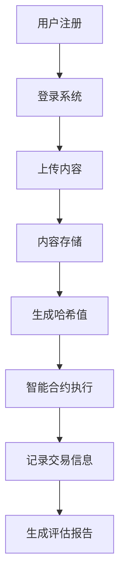

                 


# 企业估值中的区块链数字版权管理平台评估

## 关键词：区块链，数字版权管理，企业估值，智能合约，去中心化，平台评估

## 摘要：  
随着数字内容的爆炸式增长，数字版权管理已成为企业估值中的关键因素。区块链技术以其去中心化、不可篡改和透明性等特点，为数字版权管理提供了革命性的解决方案。本文将深入探讨区块链数字版权管理平台在企业估值中的应用，分析其核心概念、评估指标、算法原理、系统架构，并通过实际案例展示如何通过区块链技术提升数字版权资产的价值评估能力。

---

## 第1章: 数字版权管理与企业估值概述

### 1.1 数字版权管理的现状与挑战

#### 1.1.1 数字版权管理的核心问题  
数字版权管理的核心问题包括版权确权难、盗版侵权普遍、版权交易效率低、版权价值评估不准确等问题。这些问题严重阻碍了数字内容产业的发展。

#### 1.1.2 传统版权管理的局限性  
传统的版权管理模式依赖于中心化机构（如版权局、行业协会等），存在以下问题：  
1. **确权效率低**：版权登记流程繁琐，耗时长。  
2. **成本高**：版权交易涉及多方协调，交易成本高。  
3. **透明性差**：版权使用和交易信息不透明，容易引发纠纷。  

#### 1.1.3 区块链技术在版权管理中的应用前景  
区块链技术通过去中心化、不可篡改和智能合约等特性，为数字版权管理提供了新的解决方案。区块链可以实现版权的确权、交易、分发和收益分配的全链条管理。

---

### 1.2 区块链技术的基本原理

#### 1.2.1 区块链的定义与特点  
区块链是一种分布式账本技术，具有去中心化、不可篡改、可追溯、透明性等特点。  

#### 1.2.2 区块链的核心技术组件  
1. **区块**：由交易数据和时间戳组成，按顺序链接形成区块链。  
2. **链式结构**：每个区块包含前一个区块的哈希值，确保数据一致性。  
3. **共识机制**：如PoW（工作量证明）、PoS（权益证明）等，用于验证交易合法性。  
4. **智能合约**：自动执行的代码，用于自动履行合同条款。  

#### 1.2.3 区块链在数字版权管理中的优势  
1. **去中心化**：消除对中心化机构的依赖，降低管理成本。  
2. **不可篡改**：确保版权信息的安全性和唯一性。  
3. **透明性**：所有交易记录公开透明，便于追踪和审计。  
4. **自动化**：智能合约可以自动执行版权授权和收益分配。  

---

### 1.3 企业估值与数字版权管理的关联

#### 1.3.1 企业估值的基本概念  
企业估值是指对企业价值的评估，通常包括有形资产（如设备、土地）和无形资产（如专利、版权）的评估。

#### 1.3.2 数字版权资产对企业估值的影响  
数字版权资产是企业的重要无形资产，其价值取决于版权的独创性、市场影响力和商业价值。  

#### 1.3.3 区块链技术如何提升数字版权资产的价值  
区块链技术可以通过以下方式提升数字版权资产的价值：  
1. **确权**：通过区块链实现版权的确权，增强版权的法律效力。  
2. **透明交易**：通过区块链记录版权交易信息，增强交易的透明性和可信度。  
3. **自动化收益分配**：通过智能合约实现版权收益的自动分配，减少中间环节，提高效率。  

---

## 第2章: 区块链数字版权管理平台的核心概念与联系

### 2.1 区块链数字版权管理平台的定义与属性

#### 2.1.1 平台的核心定义  
区块链数字版权管理平台是一个基于区块链技术的平台，用于管理数字内容的版权登记、交易、分发和收益分配。

#### 2.1.2 平台的主要属性对比  
| 属性         | 传统版权管理平台 | 区块链版权管理平台 |  
|--------------|------------------|---------------------|  
| 中心化程度   | 高               | 低                  |  
| 交易透明性   | 低               | 高                  |  
| 管理成本     | 高               | 低                  |  

#### 2.1.3 平台的实体关系图（ER图）  

```mermaid
erDiagram
    user {
        user_id
        username
        email
    }
    content {
        content_id
        content_name
        content_type
    }
    transaction {
        transaction_id
        timestamp
        from_user
        to_user
        content_id
    }
    user --> content: 创建
    user --> transaction: 参与
    content --> transaction: 关联
```

---

### 2.2 区块链技术在数字版权管理中的应用原理

#### 2.2.1 区块链技术的基本工作流程  
1. 用户上传数字内容到平台，系统生成唯一的哈希值并记录在区块链上。  
2. 用户通过智能合约定义版权使用权限和收益分配规则。  
3. 当内容被使用时，智能合约自动执行授权并记录交易信息。  

#### 2.2.2 智能合约在版权管理中的应用  
智能合约可以用于以下场景：  
1. **版权授权**：自动授予特定用户使用版权的权限。  
2. **收益分配**：根据内容使用情况自动分配收益。  
3. **侵权监测**：通过区块链的可追溯性，快速定位侵权行为。  

#### 2.2.3 区块链的去中心化特性对版权管理的影响  
去中心化特性使得版权管理更加透明和公正，减少了人为干预的可能性，降低了管理成本。

---

### 2.3 数字版权管理平台的系统架构

#### 2.3.1 平台的模块划分  
1. 用户模块：负责用户注册、登录和内容上传。  
2. 内容模块：负责内容的存储和管理。  
3. 交易模块：负责记录和管理版权交易信息。  
4. 智能合约模块：负责执行版权授权和收益分配。  

#### 2.3.2 平台的用户角色分析  
1. **内容创作者**：上传数字内容，获得版权收益。  
2. **版权用户**：购买或使用版权内容。  
3. **平台管理员**：维护平台运行，处理争议。  

#### 2.3.3 平台的交易流程设计  
1. 内容创作者上传数字内容到平台。  
2. 平台生成唯一的哈希值并记录在区块链上。  
3. 内容用户通过智能合约购买版权使用权限。  
4. 平台记录交易信息，并自动分配收益。  

---

### 2.4 本章小结  
本章详细介绍了区块链数字版权管理平台的核心概念、技术原理和系统架构，为后续的评估方法和算法设计奠定了基础。

---

## 第3章: 区块链数字版权管理平台的评估指标与方法

### 3.1 评估指标的设计原则

#### 3.1.1 指标的全面性  
评估指标需要覆盖技术、经济和用户行为等多个方面。  

#### 3.1.2 指标的可操作性  
指标应具有明确的计算方法，便于实际操作。  

#### 3.1.3 指标的可量化性  
指标应能够量化，便于比较和分析。  

---

### 3.2 评估指标的具体分类

#### 3.2.1 技术指标  
1. 区块链网络的性能（如交易速度、处理能力）。  
2. 智能合约的执行效率。  

#### 3.2.2 经济指标  
1. 平台的交易量。  
2. 平台的收益分配效率。  

#### 3.2.3 用户行为指标  
1. 用户活跃度。  
2. 用户满意度。  

---

### 3.3 评估方法的对比分析

#### 3.3.1 传统评估方法的局限性  
传统评估方法依赖于中心化机构的记录，存在数据不透明和不可篡改性差的问题。  

#### 3.3.2 基于区块链的评估方法的优势  
区块链评估方法具有数据透明、不可篡改和自动化的特点，能够提高评估的准确性和效率。  

#### 3.3.3 不同评估方法的适用场景  
1. **小企业**：适合采用传统评估方法，成本较低。  
2. **大型企业**：适合采用区块链评估方法，提高数据透明性和安全性。  

---

### 3.4 本章小结  
本章分析了区块链数字版权管理平台的评估指标和方法，为后续的算法设计提供了依据。

---

## 第4章: 区块链数字版权管理平台的评估算法原理

### 4.1 评估算法的基本原理

#### 4.1.1 算法的输入与输出  
- **输入**：版权交易数据、区块链网络性能数据。  
- **输出**：版权资产的价值评估结果。  

#### 4.1.2 算法的核心步骤  
1. 数据采集：收集版权交易数据和区块链网络性能数据。  
2. 数据预处理：清洗数据，去除异常值。  
3. 指标权重分配：根据指标的重要性，分配权重。  
4. 综合评分计算：结合指标权重和实际数据，计算综合评分。  

#### 4.1.3 算法的数学模型  
综合评分计算公式：  
$$ \text{综合评分} = \sum_{i=1}^{n} w_i \times x_i $$  
其中，$w_i$ 是指标 $i$ 的权重，$x_i$ 是指标 $i$ 的实际值。

---

### 4.2 评估算法的实现流程

#### 4.2.1 数据预处理  
1. 数据清洗：去除重复数据和异常值。  
2. 数据标准化：将数据转换为统一的格式。  

#### 4.2.2 指标权重分配  
1. 确定指标的重要性：通过专家评分或数据分析确定指标权重。  
2. 权重分配：确保权重之和为1。  

#### 4.2.3 综合评分计算  
1. 计算每个指标的得分：根据实际数据和权重计算得分。  
2. 综合评分：将各指标得分加权求和，得到最终评分。  

---

### 4.3 算法的优化与改进

#### 4.3.1 算法的优化方向  
1. 提高算法的计算效率。  
2. 增强算法的鲁棒性。  

#### 4.3.2 算法的改进策略  
1. 引入机器学习算法，提高评估精度。  
2. 增加实时数据的处理能力。  

#### 4.3.3 算法的适用性分析  
1. 算法适用于大规模数据的处理。  
2. 算法适用于实时性和准确性要求较高的场景。  

---

### 4.4 本章小结  
本章详细介绍了区块链数字版权管理平台的评估算法原理，为后续的系统设计和实现提供了理论基础。

---

## 第5章: 区块链数字版权管理平台的系统分析与架构设计

### 5.1 系统功能模块

#### 5.1.1 系统功能模块划分  
1. 用户模块：用户注册、登录、内容上传。  
2. 内容模块：内容存储、管理、查询。  
3. 交易模块：记录交易信息、智能合约执行。  
4. 报告模块：生成评估报告、展示数据。  

#### 5.1.2 系统功能流程图  



---

### 5.2 系统架构设计

#### 5.2.1 系统架构图  

```mermaid
graph TD
    Client --> API Gateway
    API Gateway --> Blockchain Node
    Blockchain Node --> Smart Contract
    Smart Contract --> Database
    Database --> Report Generator
    Report Generator --> Client
```

---

### 5.3 系统接口设计

#### 5.3.1 系统接口设计  
1. 用户接口：API用于用户注册、登录、内容上传。  
2. 区块链接口：API用于与区块链节点交互。  
3. 数据库接口：API用于数据存储和查询。  

---

### 5.4 系统交互设计

#### 5.4.1 系统交互流程图  

```mermaid
sequenceDiagram
    user ->+> API Gateway: 请求内容上传
    API Gateway ->+> Blockchain Node: 请求生成哈希值
    Blockchain Node ->+> Smart Contract: 执行智能合约
    Smart Contract ->+> Database: 更新交易记录
    Database ->+> Report Generator: 生成评估报告
    Report Generator ->+> user: 返回评估报告
```

---

### 5.5 本章小结  
本章详细描述了区块链数字版权管理平台的系统功能模块、架构设计和交互流程，为后续的项目实现奠定了基础。

---

## 第6章: 区块链数字版权管理平台的项目实战

### 6.1 项目背景与目标

#### 6.1.1 项目背景  
本项目旨在开发一个基于区块链的数字版权管理平台，用于管理音乐、视频等数字内容的版权。

#### 6.1.2 项目目标  
1. 实现数字内容的版权确权。  
2. 实现版权交易的透明化和自动化。  
3. 提供准确的版权资产评估报告。  

---

### 6.2 环境安装与配置

#### 6.2.1 环境要求  
1. 操作系统：Linux/Windows/MacOS。  
2. 区块链框架：以太坊/fabric。  
3. 开发工具：IDE（如VS Code）、Python解释器。  

#### 6.2.2 安装步骤  
1. 安装区块链框架。  
2. 安装Python开发环境。  
3. 配置API接口。  

---

### 6.3 系统核心实现

#### 6.3.1 核心代码实现  

```python
class Blockchain:
    def __init__(self):
        self.chain = []
        self.transactions = []
        self.nodes = set()
    
    def add_node(self, node_id):
        self.nodes.add(node_id)
    
    def add_transaction(self, transaction):
        self.transactions.append(transaction)
    
    def mine_block(self):
        block = {
            'index': len(self.chain) + 1,
            'timestamp': time.time(),
            'transactions': self.transactions.copy()
        }
        self.chain.append(block)
        self.transactions = []
        return block

class SmartContract:
    def __init__(self, blockchain):
        self.blockchain = blockchain
    
    def authorize(self, user, content):
        # 执行授权逻辑
        pass
    
    def distribute_revenue(self, content):
        # 执行收益分配逻辑
        pass
```

---

### 6.4 代码应用解读与分析

#### 6.4.1 代码功能分析  
1. `Blockchain`类：实现区块链的基本功能，包括区块添加和交易记录。  
2. `SmartContract`类：实现智能合约的功能，包括授权和收益分配。  

#### 6.4.2 代码实现的优势  
1. 代码结构清晰，便于扩展。  
2. 通过区块链实现数据的不可篡改性。  

---

### 6.5 实际案例分析

#### 6.5.1 案例背景  
假设我们开发了一个音乐版权管理平台，用户可以上传音乐作品并进行交易。  

#### 6.5.2 案例实现步骤  
1. 用户上传音乐作品到平台。  
2. 平台生成唯一的哈希值并记录在区块链上。  
3. 用户通过智能合约定义版权使用权限和收益分配规则。  
4. 当音乐被使用时，智能合约自动执行授权并记录交易信息。  

---

### 6.6 本章小结  
本章通过实际案例展示了区块链数字版权管理平台的实现过程，验证了平台的可行性和有效性。

---

## 第7章: 总结与展望

### 7.1 总结

#### 7.1.1 核心内容回顾  
本文详细探讨了区块链数字版权管理平台在企业估值中的应用，分析了其核心概念、评估指标、算法原理和系统架构，并通过实际案例展示了平台的实现过程。

#### 7.1.2 项目的价值与意义  
区块链数字版权管理平台能够显著提升数字版权管理的透明度和安全性，降低企业的管理成本，为企业估值提供更准确的数据支持。

---

### 7.2 展望

#### 7.2.1 当前存在的问题  
1. 数据隐私问题：如何保护用户隐私？  
2. 监管问题：如何与现有法律体系兼容？  
3. 技术挑战：如何提高区块链的性能和安全性？  

#### 7.2.2 未来发展方向  
1. 提高区块链的性能：优化共识机制和数据存储方式。  
2. 增强平台的扩展性：支持更多类型的数字内容。  
3. 推动行业标准的制定：建立统一的数字版权管理标准。  

---

## 作者：AI天才研究院/AI Genius Institute & 禅与计算机程序设计艺术/Zen And The Art of Computer Programming

