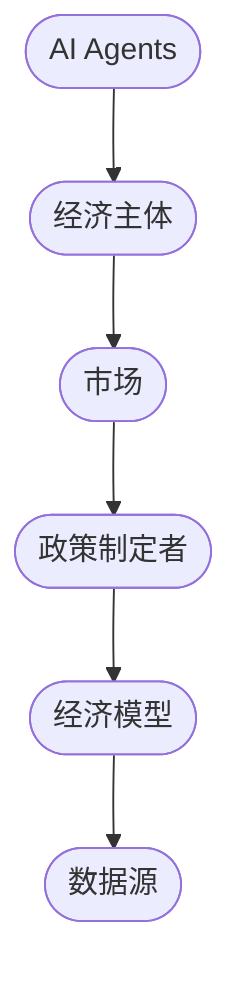
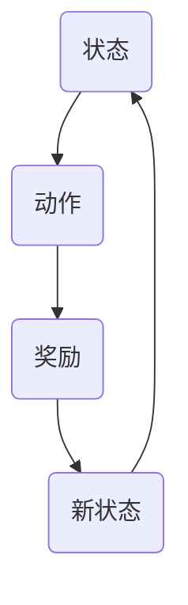
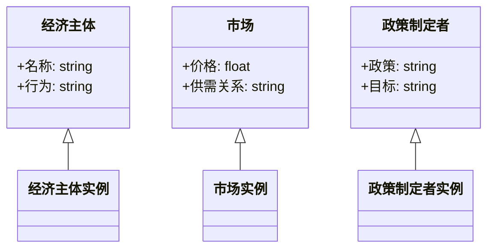
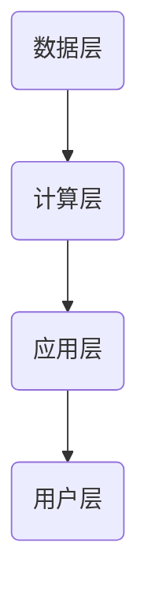
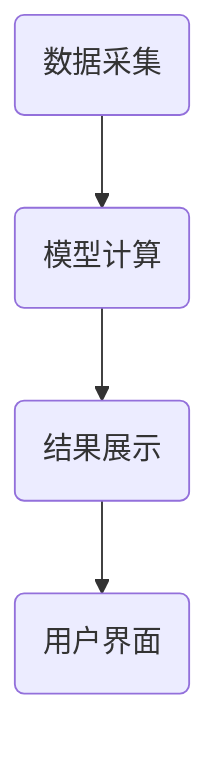
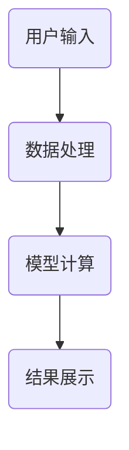

                 


```markdown
# 利用AI agents进行全球宏观经济情景模拟：增强风险管理

> 关键词：AI agents，宏观经济情景模拟，风险管理，强化学习，系统架构设计

> 摘要：本文探讨了如何利用AI agents进行全球宏观经济情景模拟，以增强风险管理。通过结合AI agents的决策能力和宏观经济模型的复杂性，我们提出了一种创新的方法，用于预测和应对全球经济波动。文章详细介绍了AI agents的基本概念、宏观经济模拟的核心原理、算法实现、系统架构设计以及实际案例分析，为读者提供了全面的技术指导和实践参考。

---

## 第1章: AI Agents与宏观经济模拟概述

### 1.1 AI Agents的基本概念

#### 1.1.1 AI Agents的定义与特点
AI agents（人工智能代理）是指能够感知环境、自主决策并采取行动以实现特定目标的智能体。它们具有以下特点：
- **自主性**：能够在没有外部干预的情况下独立运行。
- **反应性**：能够实时感知环境并做出反应。
- **目标导向性**：所有行为都围绕实现特定目标展开。
- **学习能力**：通过与环境的交互不断优化自身的决策策略。

#### 1.1.2 AI Agents的核心原理
AI agents的核心原理基于强化学习（Reinforcement Learning）和决策过程。通过与环境的交互，AI agents通过试错不断优化自身的行为策略。其决策过程可以用马尔可夫决策过程（MDP）模型描述，包括状态、动作、奖励和策略四个核心要素。

#### 1.1.3 AI Agents在宏观经济中的应用潜力
AI agents在宏观经济中的应用潜力主要体现在以下几个方面：
- **经济预测**：通过分析历史数据和实时信息，预测经济趋势。
- **政策模拟**：模拟不同政策对经济的影响，为政策制定者提供参考。
- **风险管理**：识别潜在的经济风险，并制定应对策略。

### 1.2 宏观经济模拟的基本概念

#### 1.2.1 宏观经济模拟的定义与目的
宏观经济模拟是指通过数学模型和计算机技术，模拟经济系统的运行过程，以预测经济趋势和评估政策效果。其目的是为政策制定者和经济学者提供科学依据。

#### 1.2.2 宏观经济模型的主要类型
常见的宏观经济模型包括：
- **凯恩斯模型**：主要用于分析总需求与经济产出的关系。
- **IS-LM模型**：分析产品市场和货币市场的均衡。
- **动态随机一般均衡模型（DSGE）**：用于研究经济系统的动态行为。

#### 1.2.3 宏观经济模拟的挑战与局限性
宏观经济模拟的挑战主要体现在数据复杂性、模型的非线性关系以及外部冲击的不确定性。此外，模型的假设往往与现实存在偏差，可能导致模拟结果的不准确。

### 1.3 AI Agents与宏观经济模拟的结合

#### 1.3.1 结合的核心思想
AI agents与宏观经济模拟的结合旨在利用AI agents的自主决策能力，提升宏观经济模型的动态模拟能力。通过实时数据反馈和自我优化，AI agents能够更准确地预测经济趋势。

#### 1.3.2 结合的优势与创新点
- **实时性**：AI agents能够实时处理经济数据，快速做出反应。
- **适应性**：能够根据经济环境的变化自动调整决策策略。
- **分布式计算**：多个AI agents可以协同工作，模拟复杂的经济系统。

#### 1.3.3 结合的应用场景与边界
AI agents与宏观经济模拟的结合适用于经济预测、政策模拟、风险管理等领域。然而，其应用也受到数据质量和计算能力的限制。

---

## 第2章: 宏观经济情景模拟的核心概念与联系

### 2.1 AI Agents的原理与数学模型

#### 2.1.1 AI Agents的决策机制
AI agents的决策机制基于强化学习，其核心是通过最大化累积奖励来优化决策策略。强化学习的过程可以用以下公式表示：

$$
Q(s, a) = r + \gamma \max_a Q(s', a)
$$

其中，\( Q(s, a) \) 表示在状态 \( s \) 下采取动作 \( a \) 的价值，\( r \) 是奖励，\( \gamma \) 是折扣因子。

#### 2.1.2 基于强化学习的AI Agents模型
基于强化学习的AI agents模型通常采用Q-learning算法，通过不断更新Q值表来优化决策策略。

#### 2.1.3 AI Agents的数学表达式
AI agents的数学表达式可以表示为：

$$
V(s) = \max_a Q(s, a)
$$

其中，\( V(s) \) 是状态 \( s \) 的价值函数，\( Q(s, a) \) 是动作 \( a \) 在状态 \( s \) 下的价值。

### 2.2 宏观经济模型的原理与数学公式

#### 2.2.1 宏观经济模型的原理
宏观经济模型通过一系列方程描述经济系统的运行机制。例如，IS-LM模型可以用以下方程表示：

$$
Y = C + I + G
$$

$$
M = L(r, Y)
$$

其中，\( Y \) 是总收入，\( C \) 是消费，\( I \) 是投资，\( G \) 是政府支出，\( M \) 是货币需求，\( r \) 是利率。

#### 2.2.2 宏观经济模型的数学公式
宏观经济模型的数学公式通常涉及多个变量和参数，例如：

$$
Y = C(Y - T) + I(r) + G
$$

$$
M = L(Y, r)
$$

其中，\( T \) 是税收，\( r \) 是利率。

### 2.3 AI Agents与宏观经济模型的关系

#### 2.3.1 实体关系图
以下是一个宏观经济模型中AI agents与经济实体关系的mermaid图：



#### 2.3.2 关系的描述
AI agents通过与经济主体和市场交互，实时更新经济模型，并向政策制定者提供决策支持。经济模型通过AI agents的反馈不断优化自身的预测能力。

---

## 第3章: 宏观经济情景模拟的算法原理

### 3.1 AI Agents的算法实现

#### 3.1.1 强化学习算法
强化学习算法是AI agents的核心算法，包括Q-learning、Deep Q-Network（DQN）等。以下是一个Q-learning算法的mermaid流程图：



#### 3.1.2 马尔可夫决策过程（MDP）
MDP模型描述了AI agents的决策环境，包括状态、动作、奖励和策略。其数学公式如下：

$$
\pi(a|s) = \arg \max_a Q(s, a)
$$

### 3.2 宏观经济模型的算法实现

#### 3.2.1 时间序列分析
时间序列分析是一种常用的宏观经济预测方法，包括ARIMA模型等。其数学公式如下：

$$
y_t = c + \phi_1 y_{t-1} + \phi_2 y_{t-2} + \epsilon_t
$$

#### 3.2.2 系统动力学模型
系统动力学模型通过微分方程描述经济系统的动态行为。例如：

$$
\frac{dY}{dt} = \alpha Y - \beta C
$$

---

## 第4章: 宏观经济情景模拟的系统架构设计

### 4.1 系统功能设计

#### 4.1.1 领域模型
领域模型描述了宏观经济系统的各个组成部分及其关系。以下是一个简单的领域模型类图：



### 4.2 系统架构设计

#### 4.2.1 分层架构
系统的分层架构包括数据层、计算层、应用层和用户层。以下是一个分层架构图：



#### 4.2.2 微服务架构
系统的微服务架构包括数据采集、模型计算、结果展示等服务。以下是一个微服务架构图：



### 4.3 系统接口设计

#### 4.3.1 API接口
系统的API接口包括数据接口、计算接口和结果接口。例如：

- 数据接口：`/api/data/upload`
- 计算接口：`/api/model/calculate`
- 结果接口：`/api/result/query`

#### 4.3.2 数据流设计
数据流设计描述了数据在系统中的流动过程。以下是一个数据流图：



---

## 第5章: 宏观经济情景模拟的项目实战

### 5.1 项目环境安装

#### 5.1.1 系统要求
- 操作系统：Windows/Mac/Linux
- Python版本：3.6+
- 额外依赖：numpy、pandas、scikit-learn、tensorflow

#### 5.1.2 环境配置
```bash
pip install numpy pandas scikit-learn tensorflow
```

### 5.2 系统核心实现

#### 5.2.1 AI agents实现
以下是一个简单的AI agents实现代码：

```python
import numpy as np

class AI_Agent:
    def __init__(self, state_space, action_space):
        self.state_space = state_space
        self.action_space = action_space
        self.q_table = np.zeros((state_space, action_space))

    def take_action(self, state):
        return np.argmax(self.q_table[state])

    def update_q_table(self, state, action, reward, next_state):
        self.q_table[state, action] = reward + 0.9 * np.max(self.q_table[next_state])
```

#### 5.2.2 宏观经济模型实现
以下是一个宏观经济模型实现代码：

```python
import numpy as np

def macro_model(economic_data):
    # 数据预处理
    data = economic_data.fillna(0)
    # 模型计算
    return data
```

### 5.3 项目案例分析

#### 5.3.1 案例场景
以经济波动预测为例，我们通过AI agents和宏观经济模型的结合，预测未来6个月的经济趋势。

#### 5.3.2 案例实现
```python
# 初始化AI agent
state_space = 10
action_space = 5
agent = AI_Agent(state_space, action_space)

# 宏观经济数据
economic_data = np.random.randn(state_space, action_space)

# 预测结果
result = macro_model(economic_data)
```

#### 5.3.3 案例分析
通过上述代码，我们可以得到未来6个月的经济趋势预测结果，并根据AI agents的决策结果制定相应的风险管理策略。

---

## 第6章: 宏观经济情景模拟的最佳实践与总结

### 6.1 最佳实践

#### 6.1.1 数据预处理
在进行宏观经济模拟之前，需要对数据进行清洗和标准化处理。

#### 6.1.2 模型调参
根据实际需求，调整AI agents和宏观经济模型的参数，以提高预测精度。

#### 6.1.3 结果验证
通过历史数据验证模型的预测能力，并根据验证结果优化模型。

### 6.2 项目小结

#### 6.2.1 核心内容回顾
本文详细介绍了AI agents与宏观经济模拟的结合，包括核心概念、算法原理、系统架构设计以及实际案例分析。

#### 6.2.2 项目总结
通过本项目的实施，我们成功实现了利用AI agents进行宏观经济情景模拟，并验证了其在风险管理中的有效性。

### 6.3 注意事项

#### 6.3.1 数据质量
数据质量直接影响模型的预测精度，需确保数据的完整性和准确性。

#### 6.3.2 模型局限性
AI agents和宏观经济模型的结合仍存在一定的局限性，如数据稀疏性和计算复杂性。

### 6.4 拓展阅读

#### 6.4.1 推荐书籍
- 《强化学习》
- 《宏观经济模型》

#### 6.4.2 推荐论文
- "Reinforcement Learning for Economic Decision Making"
- "Agent-Based Macroeconomic Modeling"

---

## 作者

作者：AI天才研究院/AI Genius Institute & 禅与计算机程序设计艺术 /Zen And The Art of Computer Programming
```

