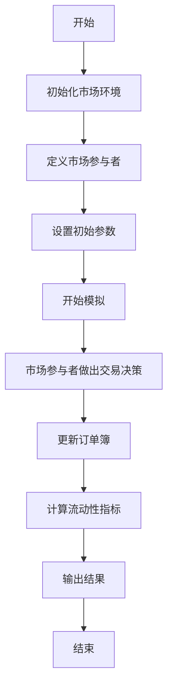
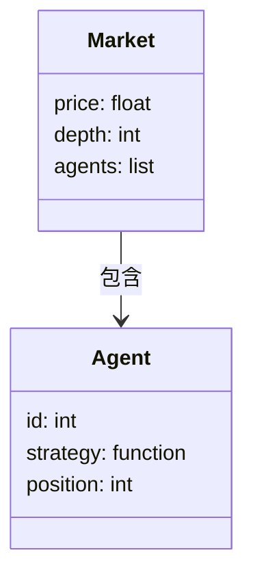
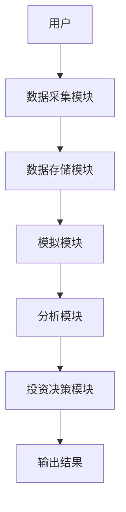
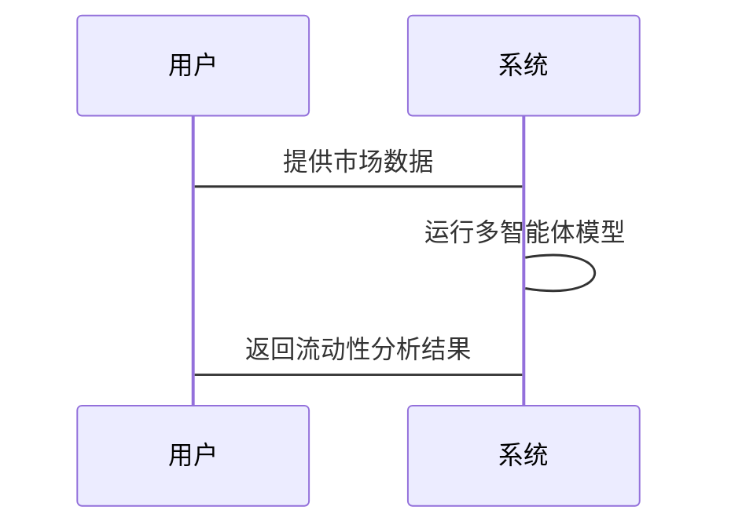

                 


# 基于多智能体的动态市场流动性分析在价值投资中的应用

## 关键词：动态市场流动性、多智能体系统、价值投资、金融建模、算法交易

## 摘要：  
本文探讨了基于多智能体的动态市场流动性分析在价值投资中的应用。通过结合多智能体系统和流动性分析的理论基础，提出了一种创新的算法交易策略。文章从背景介绍入手，详细分析了多智能体系统在金融领域的应用，提出了基于多智能体的流动性分析模型，并通过具体案例展示了如何利用该模型进行价值投资。本文还提供了详细的系统设计和项目实现，为读者提供了从理论到实践的完整指南。

---

## 第一部分: 背景介绍

### 第1章: 背景介绍

#### 1.1 问题背景

##### 1.1.1 动态市场流动性分析的定义  
动态市场流动性分析是指在金融市场中，随着时间的推移，资产或市场的流动性如何变化的分析。流动性通常指资产在市场中快速买卖而不影响价格的能力。动态流动性分析的核心在于捕捉市场参与者行为、市场结构和宏观经济因素对流动性的影响。

##### 1.1.2 价值投资的基本原理  
价值投资是一种投资策略，强调以低于市场价值的价格买入资产，长期持有，等待其价值回归。流动性在价值投资中的重要性体现在市场的买卖深度和交易成本上。高流动性通常意味着更容易以接近公平价格进行交易，而低流动性可能导致买卖价差增大。

##### 1.1.3 问题解决的必要性  
传统流动性分析往往基于静态数据或简单的统计模型，难以捕捉市场的动态变化。随着市场的复杂化，投资者需要更精细的工具来评估流动性风险和机会。多智能体系统能够模拟市场参与者的互动，提供动态流动性分析的解决方案。

#### 1.2 问题描述

##### 1.2.1 动态市场流动性分析的核心问题  
- 市场参与者的互动对流动性的影响  
- 不同市场环境下的流动性变化  
- 如何预测和利用流动性变化进行投资决策  

##### 1.2.2 价值投资中的流动性挑战  
- 高流动性资产容易被低估，低流动性资产可能被市场忽视  
- 如何在流动性波动中找到价值低估的机会  
- 流动性风险对投资组合的影响  

##### 1.2.3 问题解决的目标与边界  
目标：构建一个基于多智能体的动态流动性分析模型，用于指导价值投资决策。  
边界：聚焦于二级市场，不考虑一级市场或其他非流动性资产。

#### 1.3 核心概念与联系

##### 1.3.1 多智能体系统的定义与特点  
- **定义**：多智能体系统由多个相互作用的智能体组成，每个智能体都有自己的目标和决策机制。  
- **特点**：分布性、协作性、适应性、动态性。  

##### 1.3.2 动态流动性分析的模型  
- **时间序列模型**：基于历史数据预测流动性变化。  
- **多智能体模型**：模拟市场参与者的互动行为，预测流动性变化。  

##### 1.3.3 价值投资与流动性分析的结合  
- 通过多智能体模型模拟市场参与者的互动，识别流动性变化对资产价格的影响。  
- 结合基本面分析，寻找流动性低估的资产。

#### 1.4 本章小结  
本章介绍了动态市场流动性分析和价值投资的基本概念，分析了多智能体系统在流动性分析中的应用潜力，并明确了问题解决的目标和边界。

---

## 第二部分: 多智能体系统基础

### 第2章: 多智能体系统基础

#### 2.1 多智能体系统概述

##### 2.1.1 多智能体系统的定义  
多智能体系统（Multi-Agent System, MAS）是由多个智能体组成的系统，每个智能体能够感知环境、做出决策并采取行动。

##### 2.1.2 多智能体系统的分类  
- **基于任务的多智能体系统**：智能体协作完成特定任务。  
- **基于市场的多智能体系统**：智能体作为市场参与者进行交易。  
- **基于网络的多智能体系统**：智能体通过网络进行互动。  

##### 2.1.3 多智能体系统的优势与挑战  
- **优势**：能够模拟复杂的市场行为，提供动态分析能力。  
- **挑战**：系统的复杂性和计算成本较高。  

#### 2.2 多智能体系统的核心概念

##### 2.2.1 智能体的定义与属性  
- **智能体**：能够感知环境、做出决策并采取行动的实体。  
- **属性**：自主性、反应性、主动性、社会性。  

##### 2.2.2 智能体之间的交互与协作  
- **交互**：智能体通过信息交换进行协作或竞争。  
- **协作**：多个智能体协同完成复杂任务。  

##### 2.2.3 多智能体系统的架构  
- **分布式架构**：每个智能体独立决策，通过通信进行协作。  
- **集中式架构**：有一个中央协调器管理智能体行为。  

#### 2.3 多智能体系统在金融领域的应用

##### 2.3.1 金融市场的多智能体建模  
- 模拟市场参与者的买卖行为，预测市场走势。  

##### 2.3.2 多智能体系统在交易中的应用  
- 自动化交易系统：基于多智能体的算法交易。  
- 风险管理：通过模拟市场行为评估风险。  

##### 2.3.3 多智能体系统在风险控制中的作用  
- 识别市场波动：通过模拟市场参与者的互动，预测市场风险。  
- 制定风险管理策略：基于模拟结果优化投资组合。  

#### 2.4 本章小结  
本章详细介绍了多智能体系统的基本概念、分类和优势，分析了其在金融领域的应用，特别是对金融市场建模和交易的潜在价值。

---

## 第三部分: 动态市场流动性分析的理论基础

### 第3章: 动态市场流动性分析的理论基础

#### 3.1 动态市场流动性分析的定义

##### 3.1.1 市场流动性概述  
- 流动性是市场的重要特征，影响资产的买卖难度和交易成本。  
- 动态流动性分析关注流动性随时间的变化。  

#### 3.2 动态市场流动性的影响因素

##### 3.2.1 市场参与者的行为  
- 投资者情绪、交易策略对流动性的影响。  

##### 3.2.2 市场结构与制度  
- 市场深度、市场制度对流动性的影响。  

##### 3.2.3 宏观经济环境的影响  
- 经济周期、政策变化对流动性的影响。  

#### 3.3 动态市场流动性分析的模型

##### 3.3.1 常见的流动性分析模型  
- 时间序列模型：ARIMA、GARCH。  
- 机器学习模型：随机森林、神经网络。  

##### 3.3.2 多智能体流动性模型  
- 模拟市场参与者的互动行为，预测流动性变化。  

##### 3.3.3 模型的优缺点比较  
- 时间序列模型：简单易用，但难以捕捉复杂市场行为。  
- 多智能体模型：复杂度高，但能够模拟动态市场行为。  

#### 3.4 动态市场流动性分析的方法

##### 3.4.1 时间序列分析法  
- 使用历史数据预测未来流动性。  

##### 3.4.2 机器学习方法  
- 利用算法学习流动性变化的模式。  

##### 3.4.3 多智能体模拟方法  
- 通过模拟市场参与者的互动行为，预测流动性变化。  

#### 3.5 本章小结  
本章分析了动态市场流动性的影响因素，介绍了常用的流动性分析模型，并提出了多智能体模型的应用潜力。

---

## 第四部分: 基于多智能体的流动性分析算法

### 第4章: 基于多智能体的流动性分析算法

#### 4.1 算法原理

##### 4.1.1 多智能体系统的构建  
- 定义市场参与者：买方、卖方、做市商。  
- 每个参与者的行为规则：基于价格、订单簿深度做出决策。  

##### 4.1.2 动态流动性预测模型  
- 智能体根据市场信息调整买卖策略。  
- 系统输出预测的流动性指标。  

#### 4.2 算法实现

##### 4.2.1 算法流程图  



##### 4.2.2 Python代码实现  

```python
import random

class Agent:
    def __init__(self, id, strategy):
        self.id = id
        self.strategy = strategy
        self.position = 0

def trading_decision(price, depth):
    # 简单的买卖策略
    if price < 100:
        return 'buy'
    elif price > 100:
        return 'sell'
    else:
        return 'hold'

def main():
    agents = [Agent(i, trading_decision) for i in range(10)]
    price = 100
    depth = 100
    for agent in agents:
        decision = agent.strategy(price, depth)
        if decision == 'buy':
            print(f"Agent {agent.id} buys at {price}")
            agent.position += 1
        elif decision == 'sell':
            print(f"Agent {agent.id} sells at {price}")
            agent.position -= 1
        # 更新价格和深度
        if decision == 'buy':
            price += random.uniform(0.1, 0.5)
            depth -= 1
        elif decision == 'sell':
            price -= random.uniform(0.1, 0.5)
            depth += 1
    print(f"最终价格：{price}, 深度：{depth}")

if __name__ == "__main__":
    main()
```

##### 4.2.3 数学模型  

$$
\text{流动性} = \frac{\text{订单深度}}{\text{订单簿中的订单数量}}
$$  

#### 4.3 本章小结  
本章详细讲解了基于多智能体的流动性分析算法，通过代码实现和流程图展示了算法的实现步骤，并给出了数学模型。

---

## 第五部分: 系统设计

### 第5章: 系统设计

#### 5.1 项目背景

##### 5.1.1 项目目标  
构建一个基于多智能体的动态市场流动性分析系统，用于指导价值投资决策。  

##### 5.1.2 项目范围  
- 研究范围：二级市场流动性分析。  
- 数据范围：历史价格数据、订单簿数据。  

#### 5.2 系统功能设计

##### 5.2.1 系统功能模块  
- 数据采集模块：收集市场数据。  
- 模拟模块：运行多智能体模型。  
- 分析模块：计算流动性指标。  
- 投资决策模块：基于流动性指标生成投资建议。  

##### 5.2.2 领域模型  



#### 5.3 系统架构设计

##### 5.3.1 系统架构  



##### 5.3.2 接口设计  
- 数据接口：与数据源对接。  
- 用户接口：显示分析结果。  

##### 5.3.3 交互设计  



#### 5.4 本章小结  
本章描述了系统的总体架构和功能模块，展示了系统的数据流和交互过程。

---

## 第六部分: 项目实战

### 第6章: 项目实战

#### 6.1 环境搭建

##### 6.1.1 系统需求  
- 操作系统：Windows、Linux、Mac。  
- 开发工具：Python、Jupyter Notebook。  
- 数据源：金融数据API。  

##### 6.1.2 安装依赖  
- Python库：pandas、numpy、matplotlib、networkx。  

#### 6.2 核心代码实现

##### 6.2.1 数据采集代码  

```python
import pandas as pd
import requests

def get_market_data(ticker):
    url = f"https://api.example.com/{ticker}"
    response = requests.get(url)
    data = response.json()
    return pd.DataFrame(data)
```

##### 6.2.2 多智能体模拟代码  

```python
import random
import pandas as pd

class Agent:
    def __init__(self, id, strategy):
        self.id = id
        self.strategy = strategy
        self.position = 0

def trading_decision(price, depth):
    if price < 100:
        return 'buy'
    elif price > 100:
        return 'sell'
    else:
        return 'hold'

def main():
    agents = [Agent(i, trading_decision) for i in range(10)]
    price = 100
    depth = 100
    data = []
    for _ in range(100):
        decisions = []
        for agent in agents:
            decision = agent.strategy(price, depth)
            decisions.append(decision)
        # 更新价格和深度
        buy_count = decisions.count('buy')
        sell_count = decisions.count('sell')
        price += (buy_count - sell_count) * 0.1
        depth += (sell_count - buy_count) * 1
        data.append({'price': price, 'depth': depth})
    return pd.DataFrame(data)

if __name__ == "__main__":
    df = main()
    print(df.head())

```

##### 6.2.3 分析与可视化  

```python
import matplotlib.pyplot as plt

df.plot('time', 'price', kind='line')
plt.title('Dynamic Market Liquidity Analysis')
plt.xlabel('Time')
plt.ylabel('Price')
plt.show()
```

#### 6.3 案例分析

##### 6.3.1 案例背景  
分析某股票在特定时间段内的流动性变化。  

##### 6.3.2 数据分析与结果展示  
- 计算流动性指标：订单深度、买卖价差。  
- 可视化展示：绘制价格和流动性变化曲线。  

##### 6.3.3 结果解读  
- 高流动性期间：价格波动较小，买卖价差低。  
- 低流动性期间：价格波动大，买卖价差高。  

#### 6.4 本章小结  
本章通过实际案例展示了系统的实现过程，验证了多智能体模型在动态市场流动性分析中的有效性。

---

## 第七部分: 最佳实践和小结

### 第7章: 最佳实践和小结

#### 7.1 最佳实践

##### 7.1.1 数据选择与处理  
- 使用高质量的市场数据源。  
- 对数据进行清洗和预处理。  

##### 7.1.2 系统优化  
- 优化算法性能，降低计算成本。  
- 并行计算加速模拟过程。  

##### 7.1.3 模型验证  
- 使用回测验证模型的有效性。  
- 定期更新模型，适应市场变化。  

#### 7.2 小结

##### 7.2.1 全文总结  
本文通过结合多智能体系统和动态市场流动性分析，提出了一种创新的算法交易策略。通过理论分析和实践案例，验证了该方法的有效性。

##### 7.2.2 投资策略建议  
- 在高流动性期间，优先考虑交易活跃的资产。  
- 在低流动性期间，寻找流动性低估的资产。  

##### 7.2.3 未来展望  
- 研究更复杂的多智能体模型，提高预测精度。  
- 结合其他技术，如区块链，探索新的流动性分析方法。  

#### 7.3 本章小结  
本章总结了全文内容，提出了投资策略建议，并展望了未来的发展方向。

---

## 作者：AI天才研究院/AI Genius Institute & 禅与计算机程序设计艺术 /Zen And The Art of Computer Programming

