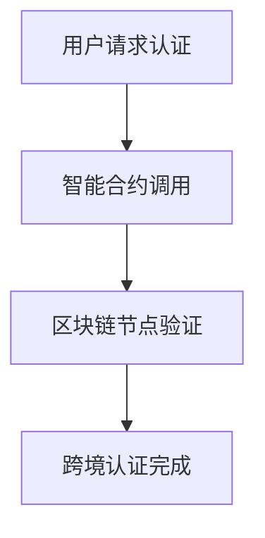

                 


# 如何评估企业的区块链数字身份跨境认证应用

**关键词**：区块链、数字身份、跨境认证、技术评估、系统架构、安全性、互操作性

**摘要**：本文将从技术原理到实际应用，详细分析企业区块链数字身份跨境认证应用的评估方法。通过核心概念、算法原理、系统架构、项目实战和最佳实践等多维度展开，帮助读者全面理解如何评估此类应用，并提供实用的评估指标和建议。

---

## 第一部分: 区块链数字身份跨境认证应用的背景与核心概念

### 第1章: 区块链数字身份跨境认证概述

#### 1.1 问题背景与定义

##### 1.1.1 数字身份认证的现状与挑战
- 当前数字身份认证的痛点：安全性不足、数据孤岛、跨平台互操作性差。
- 跨境认证的核心问题：不同国家和地区之间的身份认证标准不统一，数据孤岛问题突出，信任机制缺失。

##### 1.1.2 区块链技术的引入与作用
- 区块链技术的特点：去中心化、不可篡改、透明性。
- 区块链在跨境认证中的优势：提供信任机制，实现数据共享，降低交易成本。

##### 1.1.3 区块链数字身份跨境认证的定义
- 区块链数字身份：基于区块链技术的去中心化身份验证方式。
- 跨境认证：在不同区块链网络之间实现身份验证的过程。

#### 1.2 区块链技术基础

##### 1.2.1 区块链的基本概念
- 分布式账本：记录所有交易的不可篡改的 ledger。
- 去中心化：避免单一中心的控制，降低单点故障风险。
- 共识机制：确保所有节点达成一致的协议，如 PoW、PoS。

##### 1.2.2 区块链的核心技术特征
- 分布式存储：数据分布在多个节点上，确保数据冗余和可靠性。
- 加密签名：通过公钥和私钥实现数据的加密和解密。
- 智能合约：自动执行的代码，确保规则的自动履行。

#### 1.3 数字身份与跨境认证的关联

##### 1.3.1 数字身份的定义与属性
- 数字身份：用户在数字空间中的唯一标识，通常基于公钥和私钥对。
- 属性：唯一性、不可伪造性、可验证性。

##### 1.3.2 跨境认证的核心流程
1. 用户发起认证请求。
2. 系统验证用户的数字签名。
3. 跨链查询用户身份信息。
4. 返回认证结果。

##### 1.3.3 区块链在跨境认证中的优势
- 提供跨平台互操作性。
- 保证数据的安全性和一致性。
- 降低信任成本。

#### 1.4 本章小结
- 介绍了数字身份认证的现状和挑战。
- 阐述了区块链技术在跨境认证中的作用和优势。
- 明确了区块链数字身份跨境认证的定义和核心特征。

---

## 第二部分: 区块链数字身份跨境认证的核心概念与联系

### 第2章: 区块链数字身份跨境认证的核心概念与联系

#### 2.1 核心概念原理

##### 2.1.1 区块链的分布式账本
- 分布式账本的结构：区块、链式结构、 Merkel 树。
- 数据一致性：通过共识机制确保所有节点的数据一致。

##### 2.1.2 数字签名的原理
- 数字签名的生成：私钥加密用户的认证请求。
- 数字签名的验证：公钥解密签名，验证数据完整性。

##### 2.1.3 跨链交互的实现
- 跨链通信：通过中继节点或桥接技术实现不同区块链之间的交互。
- 跨链互操作性：确保不同区块链之间能够互相理解和信任。

#### 2.2 核心概念对比表

| 概念       | 属性                     | 描述                                             |
|------------|--------------------------|--------------------------------------------------|
| 区块链     | 分布式、去中心化         | 数据存储和验证的基础设施                         |
| 数字身份   | 加密、唯一性             | 用户身份的数字化表示                             |
| 跨境认证   | 跨链交互、互操作性       | 不同区块链之间的身份验证                         |

#### 2.3 实体关系图（Mermaid）


#### 2.4 本章小结
- 分析了区块链分布式账本、数字签名和跨链交互的核心概念。
- 使用对比表和实体关系图展示了这些概念之间的联系和作用。

---

## 第三部分: 区块链数字身份跨境认证的算法原理

### 第3章: 区块链数字身份跨境认证的算法原理

#### 3.1 共识机制的选择与实现

##### 3.1.1 共识机制的分类
- 工作量证明（PoW）：通过计算找到哈希值来验证区块。
- 权益证明（PoS）：通过持有代币的多少来决定记账权。
- 拜占庭容错（BFT）：通过投票机制达成共识。

##### 3.1.2 跨链共识的实现方式
- 中继链：通过中继链连接不同的区块链网络。
- 侧链：通过侧链技术实现不同区块链之间的交互。

#### 3.2 加密算法的实现

##### 3.2.1 椭圆曲线加密原理
- 椭圆曲线加密（ECC）：基于椭圆曲线上的点操作实现公钥和私钥对。
- 加密公式：$y^2 = x^3 + ax + b \bmod p$，其中 $a$ 和 $b$ 是椭圆曲线的参数，$p$ 是模数。

##### 3.2.2 数字签名的生成与验证
- 签名生成：使用私钥对数据进行哈希，生成数字签名。
- 签名验证：使用公钥验证数字签名的有效性。

##### 3.2.3 加密算法的性能优化
- 优化目标：降低加密解密的时间复杂度。
- 优化方法：选择合适的椭圆曲线参数，减少计算量。

#### 3.3 智能合约的设计与实现

##### 3.3.1 智能合约的定义
- 智能合约：部署在区块链上的自动执行代码，用于实现特定的业务逻辑。

##### 3.3.2 合约的编译与部署
- 编译工具：使用 Solidity 编写智能合约，并编译成 bytecode。
- 部署方式：通过区块链节点将智能合约部署到区块链网络。

##### 3.3.3 合约的安全性保障
- 安全性问题：避免代码漏洞，确保智能合约的逻辑正确。
- 安全性保障：定期进行代码审计，修复潜在漏洞。

#### 3.4 算法流程图（Mermaid）



#### 3.5 本章小结
- 阐述了共识机制的选择和实现方式。
- 详细讲解了椭圆曲线加密和数字签名的实现原理。
- 分析了智能合约的设计与实现过程。

---

## 第四部分: 区块链数字身份跨境认证的数学模型与公式

### 第4章: 区块链数字身份跨境认证的数学模型与公式

#### 4.1 数学模型概述

##### 4.1.1 区块链网络的数学建模
- 网络模型：将区块链网络建模为图结构，节点代表区块链节点，边代表节点之间的通信。
- 节点之间的关系：通过共识机制建立信任关系。

##### 4.1.2 数字签名的数学基础
- 椭圆曲线加密的数学公式：$y^2 = x^3 + ax + b \bmod p$。
- 离散对数问题：$y = g^x \bmod p$，其中 $g$ 是生成元，$x$ 是私钥。

##### 4.1.3 跨链交互的数学模型
- 跨链通信的数学模型：通过哈希函数实现数据的唯一标识。
- 跨链互操作性的数学模型：通过签名验证实现数据的可信传递。

#### 4.2 数学公式的详细推导

##### 4.2.1 椭圆曲线加密的公式推导
- 点加法公式：给定点 $P$ 和点 $Q$，计算点 $R = P + Q$。
- 点倍法公式：计算点 $P$ 的倍数，如 $2P$、$3P$ 等。

##### 4.2.2 数字签名的验证公式
- 签名生成：$signature = Sign(private\_key, message)$。
- 签名验证：$Verify(public\_key, message, signature)$。

##### 4.2.3 跨链通信的哈希函数
- 哈希函数的数学模型：$H(message) = hash\_value$。
- 签名验证公式：$signature = H(message)^{private\_key} \bmod p$。

#### 4.3 本章小结
- 阐述了区块链网络、数字签名和跨链交互的数学模型。
- 详细推导了椭圆曲线加密和数字签名的数学公式。

---

## 第五部分: 区块链数字身份跨境认证的系统分析与架构设计

### 第5章: 区块链数字身份跨境认证的系统分析与架构设计

#### 5.1 系统分析

##### 5.1.1 系统功能需求
- 用户身份认证：支持用户通过数字身份进行认证。
- 跨链交互：支持不同区块链网络之间的身份验证。
- 数据共享：实现不同区块链网络之间的数据共享。

##### 5.1.2 系统性能需求
- 响应时间：用户请求的响应时间应小于 1 秒。
- 处理能力：系统应支持每秒 thousands 次的认证请求。

#### 5.2 系统架构设计

##### 5.2.1 系统功能模块
- 用户模块：负责用户身份的注册、登录和管理。
- 区块链节点模块：负责区块链网络的维护和数据存储。
- 跨链通信模块：负责不同区块链网络之间的交互。

##### 5.2.2 系统架构图（Mermaid）


##### 5.2.3 系统交互流程
1. 用户发起身份认证请求。
2. 用户模块生成数字签名。
3. 区块链节点模块验证数字签名。
4. 跨链通信模块实现不同区块链网络之间的交互。
5. 目标区块链节点返回认证结果。

#### 5.3 系统接口设计

##### 5.3.1 API 接口定义
- 注册接口：`POST /api/register`
- 登录接口：`POST /api/login`
- 跨链认证接口：`POST /api/cross_chain_auth`

##### 5.3.2 接口实现
- 使用 RESTful API 实现接口。
- 使用 JSON 格式传递数据。

#### 5.4 本章小结
- 阐述了系统的功能需求和性能需求。
- 绘制了系统的架构图，并描述了系统交互流程。

---

## 第六部分: 区块链数字身份跨境认证的项目实战

### 第6章: 区块链数字身份跨境认证的项目实战

#### 6.1 环境安装

##### 6.1.1 安装区块链框架
- 使用以太坊的 Geth 或其他区块链框架。
- 安装 Solidity 编译器。

##### 6.1.2 安装开发工具
- 使用 VS Code 或其他代码编辑器。
- 安装区块链节点的 CLI 工具。

#### 6.2 核心代码实现

##### 6.2.1 数字签名的实现
```python
from cryptography.hazmat.primitives.asymmetric import ec

# 生成椭圆曲线密钥对
private_key = ec.generate_private_key(ec.SECP256K1())
public_key = private_key.public_key()
```

##### 6.2.2 跨链通信的实现
```python
def cross_chain_communication(source_chain, target_chain):
    # 获取源链的区块头
    source_block = source_chain.get_latest_block()
    # 将区块头哈希后传递到目标链
    target_chain.receive_hash(source_block.hash())
```

##### 6.2.3 智能合约的实现
```solidity
pragma solidity ^0.8.0;

contract IdentityAuthentication {
    function authenticate(bytes memory signature) public pure returns (bool) {
        return verify_signature(signature);
    }
}
```

#### 6.3 案例分析与代码解读

##### 6.3.1 项目背景
- 某跨国企业需要实现员工的数字身份认证。
- 需要支持不同国家和地区的身份认证。

##### 6.3.2 项目实施
- 使用以太坊区块链实现数字身份认证。
- 使用智能合约实现身份验证逻辑。

##### 6.3.3 项目总结
- 通过区块链技术实现了员工的数字身份认证。
- 实现了跨国公司的身份认证需求。

#### 6.4 本章小结
- 介绍了项目实战的环境安装和核心代码实现。
- 提供了实际案例分析和代码解读。

---

## 第七部分: 区块链数字身份跨境认证的最佳实践与总结

### 第7章: 区块链数字身份跨境认证的最佳实践与总结

#### 7.1 评估指标

##### 7.1.1 安全性指标
- 数字签名的强度：选择合适的椭圆曲线参数。
- 跨链通信的安全性：确保数据在传输过程中的安全性。

##### 7.1.2 性能指标
- 认证请求的响应时间：确保系统能够支持高并发请求。
- 系统的可扩展性：确保系统能够支持未来的扩展需求。

##### 7.1.3 用户体验指标
- 界面的友好性：确保用户能够方便地进行身份认证。
- 操作的便捷性：减少用户操作步骤，提升用户体验。

#### 7.2 注意事项

##### 7.2.1 安全性注意事项
- 避免私钥泄露：确保私钥的安全存储和传输。
- 定期进行代码审计：发现并修复智能合约中的漏洞。

##### 7.2.2 性能优化注意事项
- 优化共识机制：选择适合的共识机制，提升系统性能。
- 优化网络通信：减少网络延迟，提升系统响应速度。

#### 7.3 未来展望

##### 7.3.1 技术发展
- 新型共识机制的出现：如 PoW、PoS、BFT 等。
- 多链协同技术的进一步发展：实现更加高效的跨链交互。

##### 7.3.2 应用场景扩展
- 支持更多的应用场景：如金融、医疗、教育等。
- 实现更加智能化的认证方式：如 AI 驱动的认证流程。

#### 7.4 本章小结
- 总结了区块链数字身份跨境认证的评估指标。
- 提出了安全性、性能和用户体验方面的注意事项。
- 展望了未来的技术发展和应用场景。

---

## 作者：AI天才研究院/AI Genius Institute & 禅与计算机程序设计艺术/Zen And The Art of Computer Programming

---

**总结**：本文通过多维度的分析，详细阐述了如何评估企业的区块链数字身份跨境认证应用。从技术原理到实际应用，帮助读者全面理解评估的关键点，并提供了实用的评估指标和建议。希望本文能够为企业的区块链数字身份跨境认证应用的评估和实施提供有价值的参考。

