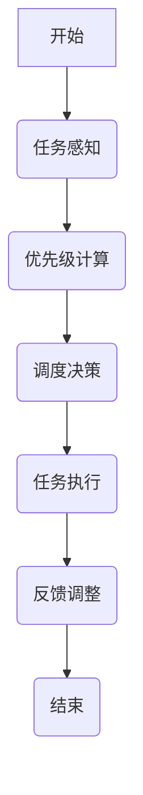
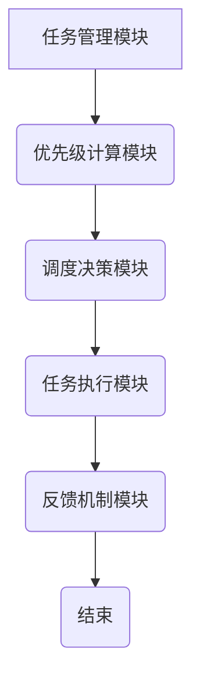

                 


# 实现AI Agent的动态任务优先级调度

## 关键词：AI Agent，动态任务优先级，调度算法，系统架构，任务管理

## 摘要：本文详细探讨了AI Agent动态任务优先级调度的核心概念、算法原理、系统架构设计及实现方法。通过分析任务优先级的动态变化，结合实际应用场景，提出了一种高效的调度算法，并通过系统设计和项目实战验证了其可行性和有效性。文章最后总结了最佳实践和未来研究方向。

---

# 第1章: 动态任务优先级调度的背景与问题描述

## 1.1 动态任务优先级调度的背景

### 1.1.1 AI Agent的发展与应用
AI Agent（人工智能代理）是一种能够感知环境、自主决策并执行任务的智能实体。随着人工智能技术的快速发展，AI Agent已广泛应用于自动驾驶、智能助手、机器人控制等领域。在这些场景中，AI Agent需要同时处理多个任务，且任务优先级可能会因环境变化、用户需求或时间约束而动态调整。

### 1.1.2 动态任务优先级调度的定义
动态任务优先级调度是指在AI Agent执行任务的过程中，根据实时反馈和环境变化，动态调整任务优先级的机制。其核心目标是在多任务环境中，合理分配计算资源，确保高优先级任务优先执行，从而提高系统的效率和性能。

### 1.1.3 问题背景与挑战
在多任务环境中，AI Agent需要同时处理多个任务，每个任务的优先级可能因时间、资源可用性和环境变化而动态调整。然而，传统的静态优先级调度方法无法适应这些动态变化，导致资源分配不均、任务执行效率低下等问题。因此，研究动态任务优先级调度算法具有重要的理论和实践意义。

---

## 1.2 动态任务优先级调度的核心概念

### 1.2.1 任务优先级的动态变化
任务优先级的动态变化主要受到以下因素的影响：
1. **时间约束**：任务的截止时间临近时，其优先级应提高。
2. **资源可用性**：资源不足时，优先执行对资源需求较低的任务。
3. **用户需求**：用户实时反馈可能改变任务优先级。
4. **环境变化**：外部环境的变化可能影响任务的重要性和紧急程度。

### 1.2.2 AI Agent的核心能力
AI Agent需要具备以下核心能力：
1. **感知能力**：能够感知环境状态和任务相关信息。
2. **决策能力**：能够根据当前状态和任务优先级动态调整执行策略。
3. **执行能力**：能够高效执行任务并实时反馈执行结果。

### 1.2.3 调度算法的分类与特点
动态任务优先级调度算法主要分为以下几类：
1. **基于时间的调度算法**：根据任务的截止时间动态调整优先级。
2. **基于资源的调度算法**：根据资源可用性动态分配任务优先级。
3. **基于反馈的调度算法**：根据任务执行结果和用户反馈动态调整优先级。

---

## 1.3 问题描述与目标

### 1.3.1 动态任务优先级调度的典型问题
1. **任务冲突**：多个高优先级任务竞争有限资源。
2. **动态变化**：任务优先级的动态变化导致调度算法需要实时调整。
3. **计算复杂度**：动态调度算法的计算复杂度较高，需要在实时性要求较高的场景中高效运行。

### 1.3.2 调度目标与优化方向
1. **目标**：确保高优先级任务优先执行，最大化系统效率和资源利用率。
2. **优化方向**：降低调度算法的计算复杂度，提高动态调度的实时性和准确性。

### 1.3.3 约束条件与边界
1. **时间约束**：任务必须在规定时间内完成。
2. **资源约束**：有限的计算资源和执行能力。
3. **动态变化**：任务优先级和环境状态的实时变化。

---

## 1.4 本章小结
本章从背景、核心概念和问题描述三个方面详细介绍了动态任务优先级调度的基本知识。通过分析AI Agent的动态任务调度需求，明确了调度算法的核心目标和面临的挑战。

---

接下来，我们将深入探讨动态任务优先级调度的核心算法原理和系统架构设计。

---

# 第2章: 动态任务优先级调度的算法原理

## 2.1 动态任务优先级调度的原理

### 2.1.1 动态优先级计算模型
动态优先级计算模型基于以下公式：
$$
P(t) = w_1 \cdot t_d(t) + w_2 \cdot r(t) + w_3 \cdot f(t)
$$
其中：
- $P(t)$：任务$t$的优先级
- $t_d(t)$：任务$t$的剩余时间
- $r(t)$：任务$t$的资源需求
- $f(t)$：任务$t$的反馈得分
- $w_1, w_2, w_3$：权重系数

### 2.1.2 基于反馈的动态调度算法
基于反馈的动态调度算法通过实时任务执行结果和用户反馈调整任务优先级。其核心步骤如下：
1. **任务感知**：获取任务状态和环境信息。
2. **优先级计算**：根据动态优先级计算模型计算任务优先级。
3. **调度决策**：根据优先级和资源状态动态分配任务执行顺序。
4. **反馈调整**：根据任务执行结果和用户反馈调整优先级计算模型。

### 2.1.3 算法流程图


---

## 2.2 算法实现与优化

### 2.2.1 动态优先级计算的数学模型
动态优先级计算的数学模型可以表示为：
$$
P(t) = \alpha \cdot t_d(t) + \beta \cdot r(t) + \gamma \cdot f(t)
$$
其中：
- $\alpha, \beta, \gamma$：权重系数，根据具体场景动态调整。

### 2.2.2 调度算法的优化策略
1. **权重动态调整**：根据任务执行结果动态调整权重系数。
2. **分层调度**：将任务分为高、中、低三个层次，分别进行调度。
3. **预测机制**：引入时间序列预测模型预测任务优先级的变化趋势。

### 2.2.3 代码实现示例
以下是一个动态任务优先级调度算法的Python实现示例：
```python
def dynamic_priority调度算法(tasks):
    for task in tasks:
        # 计算任务优先级
        priority = alpha * task.remaining_time + beta * task.resource_demand + gamma * task.feedback_score
        task.priority = priority
    # 按优先级排序
    tasks.sort(key=lambda x: x.priority, reverse=True)
    return tasks
```

---

## 2.3 算法的性能分析与优化

### 2.3.1 算法复杂度分析
动态任务优先级调度算法的时间复杂度主要取决于任务数量和调度频率。假设任务数量为$n$，调度频率为$f$，则算法的时间复杂度为$O(nf)$。

### 2.3.2 算法优化方向
1. **并行计算**：利用多线程或分布式计算提高调度效率。
2. **启发式优化**：引入启发式规则减少计算复杂度。
3. **自适应调整**：根据任务执行结果动态调整调度策略。

---

## 2.4 本章小结
本章详细探讨了动态任务优先级调度的算法原理和实现方法，提出了基于反馈的动态调度算法，并通过数学模型和代码示例进行了详细说明。

---

接下来，我们将从系统设计的角度分析动态任务优先级调度的实现方案。

---

# 第3章: 动态任务优先级调度的系统架构设计

## 3.1 系统总体架构

### 3.1.1 系统组成
动态任务优先级调度系统主要由以下部分组成：
1. **任务管理模块**：负责任务的创建、删除和状态管理。
2. **优先级计算模块**：负责动态计算任务优先级。
3. **调度决策模块**：负责根据优先级和资源状态进行任务调度。
4. **反馈机制模块**：负责收集任务执行结果和用户反馈。

### 3.1.2 系统架构图


---

## 3.2 系统功能设计

### 3.2.1 任务管理功能
任务管理功能包括任务的创建、删除和状态更新。任务信息包括任务ID、任务描述、截止时间、资源需求等。

### 3.2.2 优先级计算功能
优先级计算功能基于动态优先级计算模型，结合任务的剩余时间、资源需求和反馈得分计算任务优先级。

### 3.2.3 调度决策功能
调度决策功能根据任务优先级和资源状态动态分配任务执行顺序，确保高优先级任务优先执行。

---

## 3.3 系统接口设计

### 3.3.1 系统接口
系统接口包括：
1. **任务管理接口**：用于任务的创建、删除和查询。
2. **优先级计算接口**：用于计算任务优先级。
3. **调度决策接口**：用于任务调度决策。
4. **反馈机制接口**：用于收集任务执行结果和用户反馈。

### 3.3.2 接口交互流程图


---

## 3.4 本章小结
本章从系统架构和功能设计的角度详细分析了动态任务优先级调度的实现方案，提出了系统的总体架构和功能模块设计。

---

接下来，我们将通过一个实际案例分析动态任务优先级调度的实现过程。

---

# 第4章: 动态任务优先级调度的项目实战

## 4.1 项目背景与需求分析

### 4.1.1 项目背景
本项目旨在开发一个动态任务优先级调度系统，应用于多任务环境中的AI Agent任务管理。

### 4.1.2 项目需求
1. 实现实时任务优先级计算。
2. 提供动态任务调度功能。
3. 支持任务执行结果反馈。

---

## 4.2 系统实现

### 4.2.1 环境安装
项目开发环境包括Python 3.8及以上版本、PyTorch 1.9及以上版本和相关开发工具。

### 4.2.2 核心代码实现
以下是动态任务优先级调度系统的Python核心代码实现：
```python
class Task:
    def __init__(self, task_id, description, deadline, resource_demand):
        self.task_id = task_id
        self.description = description
        self.deadline = deadline
        self.resource_demand = resource_demand
        self.priority = 0
        self.feedback_score = 0

class DynamicPriorityScheduler:
    def __init__(self, alpha=0.5, beta=0.3, gamma=0.2):
        self.alpha = alpha
        self.beta = beta
        self.gamma = gamma

    def compute_priority(self, task):
        # 计算任务优先级
        task.priority = self.alpha * task.deadline.timestamp() + \
                        self.beta * task.resource_demand + \
                        self.gamma * task.feedback_score

    def schedule_tasks(self, tasks):
        # 动态优先级排序
        tasks.sort(key=lambda x: x.priority, reverse=True)
        return tasks

    def update_feedback(self, task, feedback):
        # 更新反馈得分
        task.feedback_score = feedback
```

### 4.2.3 代码实现解读
1. **Task类**：定义任务对象，包含任务ID、描述、截止时间和资源需求。
2. **DynamicPriorityScheduler类**：实现动态优先级调度算法，包含优先级计算、任务调度和反馈更新功能。
3. **compute_priority方法**：根据动态优先级计算模型计算任务优先级。
4. **schedule_tasks方法**：根据优先级对任务进行排序，实现任务调度。
5. **update_feedback方法**：更新任务的反馈得分，用于后续优先级计算。

---

## 4.3 项目案例分析

### 4.3.1 案例描述
假设我们有一个AI Agent需要同时执行三个任务：
1. **任务1**：截止时间10分钟后，资源需求低，反馈得分0.8。
2. **任务2**：截止时间20分钟后，资源需求中等，反馈得分0.6。
3. **任务3**：截止时间5分钟后，资源需求高，反馈得分0.9。

### 4.3.2 动态优先级计算
根据动态优先级计算模型：
$$
P(1) = 0.5 \times 10 + 0.3 \times 1 + 0.2 \times 0.8 = 5.36
$$
$$
P(2) = 0.5 \times 20 + 0.3 \times 2 + 0.2 \times 0.6 = 10.6
$$
$$
P(3) = 0.5 \times 5 + 0.3 \times 3 + 0.2 \times 0.9 = 4.95
$$

### 4.3.3 任务调度结果
根据优先级排序，任务2优先级最高，其次是任务1，最后是任务3。因此，任务调度顺序为任务2、任务1、任务3。

---

## 4.4 项目总结

### 4.4.1 项目成果
通过本项目，我们实现了一个动态任务优先级调度系统，能够根据任务的动态变化实时调整任务优先级，确保高优先级任务优先执行。

### 4.4.2 经验总结
1. 动态优先级计算模型需要根据具体场景动态调整权重系数。
2. 任务反馈机制是提高调度算法准确性的关键。
3. 系统设计需要充分考虑任务动态变化和资源约束条件。

---

# 第5章: 动态任务优先级调度的总结与展望

## 5.1 总结

### 5.1.1 核心内容回顾
动态任务优先级调度是一种根据任务动态变化实时调整优先级的调度方法，能够提高AI Agent在多任务环境中的效率和性能。

### 5.1.2 实践价值
动态任务优先级调度在自动驾驶、智能助手、机器人控制等领域具有重要的应用价值。

---

## 5.2 未来研究方向

### 5.2.1 算法优化
1. **预测机制**：引入时间序列预测模型提高调度算法的准确性。
2. **多目标优化**：在多目标优化场景中实现动态任务优先级调度。

### 5.2.2 系统扩展
1. **分布式调度**：研究分布式环境下的动态任务优先级调度算法。
2. **边缘计算**：将动态任务优先级调度应用于边缘计算场景。

---

## 5.3 最佳实践

### 5.3.1 设计建议
1. **权重动态调整**：根据任务执行结果动态调整优先级计算模型的权重系数。
2. **分层调度**：将任务分为高、中、低三个层次，分别进行调度。

### 5.3.2 注意事项
1. 确保任务调度算法的实时性和准确性。
2. 注意任务优先级计算模型的可解释性和可调整性。

---

## 5.4 本章小结
本章总结了动态任务优先级调度的核心内容和实践价值，提出了未来研究方向和最佳实践建议。

---

# 作者：AI天才研究院/AI Genius Institute & 禅与计算机程序设计艺术 /Zen And The Art of Computer Programming

