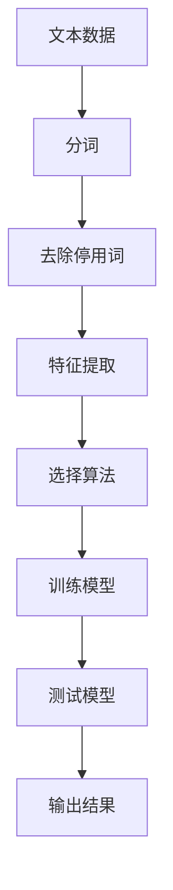
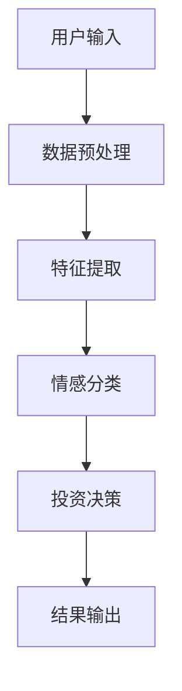
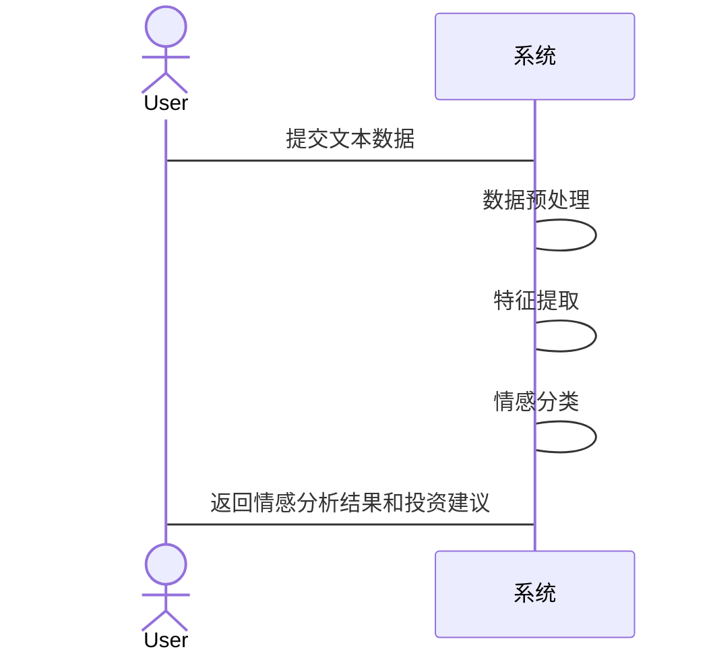

                 


# 情感分析技术在投资决策中的应用与优化

> 关键词：情感分析，投资决策，自然语言处理，机器学习，深度学习，市场情绪

> 摘要：本文系统地探讨了情感分析技术在投资决策中的应用与优化。首先介绍了情感分析的基本概念和投资决策的背景，分析了情感分析与投资决策的关系。然后详细讲解了情感分析的核心算法原理，包括基于机器学习和深度学习的方法，并通过实际案例展示了情感分析在投资中的应用。最后，提出了情感分析技术的优化策略和最佳实践建议。

---

# 第一部分: 情感分析技术基础

## 第1章: 情感分析技术概述

### 1.1 情感分析的基本概念

#### 1.1.1 情感分析的定义
情感分析（Sentiment Analysis），又称情绪分析，是自然语言处理（NLP）中的一个重要分支，旨在识别和理解文本中的情感倾向。通过分析文本内容，情感分析可以判断一段文本是正面、负面还是中性。

#### 1.1.2 情感分析的核心要素
- **文本数据**：情感分析的基础是文本数据，包括社交媒体帖子、新闻标题、评论等。
- **情感倾向**：情感分析的目标是将文本分类为正面、负面或中性。
- **上下文信息**：情感分析需要考虑文本的上下文，例如时间、地点和语境。

#### 1.1.3 情感分析的应用场景
- **社交媒体分析**：分析用户在社交媒体上的评论和帖子，判断用户情绪。
- **舆情监控**：帮助企业监控市场情绪，及时调整营销策略。
- **金融投资**：通过分析市场情绪，辅助投资决策。

### 1.2 投资决策中的情感分析

#### 1.2.1 投资决策的基本概念
投资决策是指投资者在金融市场中做出买入、卖出或持有某种资产的决策。这些决策通常基于市场数据、财务报表、宏观经济指标等信息。

#### 1.2.2 情感分析在投资中的作用
情感分析可以帮助投资者了解市场情绪，从而辅助决策。例如：
- **市场情绪预测**：通过分析社交媒体和新闻，预测市场情绪的变化。
- **风险评估**：通过分析负面情绪，评估投资风险。
- **投资时机选择**：通过分析市场情绪，选择最佳投资时机。

#### 1.2.3 情感分析与投资决策的结合
情感分析可以为投资决策提供以下信息：
- **市场情绪变化**：通过分析社交媒体和新闻，了解市场情绪的变化趋势。
- **情绪强度**：通过分析情绪的强度，判断市场情绪的强弱。
- **情绪分布**：通过分析情绪分布，判断市场的整体情绪状态。

### 1.3 情感分析技术的现状与挑战

#### 1.3.1 情感分析技术的发展历程
情感分析技术起源于20世纪90年代，早期主要基于词典和规则。随着机器学习和深度学习的发展，情感分析技术逐渐成熟。

#### 1.3.2 当前技术的主要挑战
- **数据质量**：情感分析依赖于高质量的文本数据，但实际应用中，数据可能存在噪声。
- **情感模糊性**：文本中的情感可能模糊，例如讽刺、反语等。
- **跨领域适应性**：情感分析模型在不同领域中的表现可能存在差异。

#### 1.3.3 情感分析技术的未来趋势
- **多模态情感分析**：结合图像、视频等多种模态信息，提高情感分析的准确性。
- **实时分析**：开发实时情感分析技术，满足金融市场的实时需求。
- **自适应模型**：开发能够自适应不同领域和场景的模型。

## 第2章: 情感分析的核心概念与联系

### 2.1 情感分析的原理与流程

#### 2.1.1 数据采集与预处理
数据采集是情感分析的第一步，通常包括爬取社交媒体数据、新闻数据等。预处理步骤包括分词、去除停用词、词干提取等。

#### 2.1.2 特征提取与表示
特征提取是情感分析的关键步骤，常用的特征包括词袋模型、TF-IDF、词嵌入（如Word2Vec、GloVe）等。

#### 2.1.3 情感分类与结果输出
情感分类是情感分析的核心，常用的算法包括朴素贝叶斯、支持向量机（SVM）、随机森林、深度学习模型（如LSTM、Transformer）等。

### 2.2 情感分析与投资决策的关系

#### 2.2.1 情感分析在投资中的应用场景
- **社交媒体分析**：通过分析社交媒体上的评论，判断市场情绪。
- **新闻分析**：通过分析新闻标题和内容，判断市场情绪。
- **财报分析**：通过分析财报中的文本，判断公司情绪。

#### 2.2.2 情感分析与市场情绪的关系
市场情绪是投资者决策的重要因素之一。情感分析可以帮助投资者理解市场情绪的变化，从而做出更明智的决策。

#### 2.2.3 情感分析对投资决策的影响
- **情绪驱动投资**：市场情绪可以影响资产价格。
- **情绪风险管理**：通过分析情绪，投资者可以更好地管理风险。
- **情绪预测市场**：通过分析情绪，投资者可以预测市场的未来走势。

### 2.3 情感分析的核心要素与属性对比

#### 2.3.1 情感分析的核心要素
- **文本数据**：情感分析的基础。
- **情感倾向**：情感分析的目标。
- **上下文信息**：情感分析的重要补充。

#### 2.3.2 情感分析的属性特征对比表

| 属性 | 特征 | 说明 |
|------|------|------|
| 数据类型 | 文本数据 | 情感分析的基础 |
| 情感类别 | 正面、负面、中性 | 情感分析的目标 |
| 情感强度 | 强度值（0-1） | 情感的强弱程度 |
| 上下文信息 | 时间、地点、语境 | 情感分析的重要补充 |

#### 2.3.3 情感分析的ER实体关系图

```mermaid
erDiagram
    actor User {
        <属性> 用户ID
        <属性> 用户名称
        <属性> 用户评论
    }
    actor Market {
        <属性> 市场ID
        <属性> 市场情绪
        <属性> 市场趋势
    }
    actor Investment {
        <属性> 投资ID
        <属性> 投资决策
        <属性> 投资结果
    }
    User --> Market: 影响
    Market --> Investment: 驱动
```

## 第3章: 情感分析的算法原理

### 3.1 情感分析的主要算法

#### 3.1.1 基于机器学习的情感分析算法
- **朴素贝叶斯（Naive Bayes）**：基于概率论，计算每个类别的概率。
- **支持向量机（SVM）**：通过构建超平面，将数据分为不同类别。
- **随机森林（Random Forest）**：通过构建多个决策树，提高分类准确率。

#### 3.1.2 基于深度学习的情感分析算法
- **长短期记忆网络（LSTM）**：适合处理序列数据，能够捕捉长距离依赖。
- **Transformer模型**：基于自注意力机制，能够捕捉全局依赖。
- **双向Transformer（BERT）**：结合了双向上下文信息，效果更佳。

#### 3.1.3 其他常用算法对比
| 算法 | 优点 | 缺点 |
|------|------|------|
| 朴素贝叶斯 | 简单高效 | 对特征独立性假设敏感 |
| SVM | 高精度 | 参数敏感 |
| LSTM | 长距离依赖 | 训练复杂 |
| Transformer | 全局依赖 | 计算复杂 |

### 3.2 情感分析算法的流程图



### 3.3 情感分析的数学模型与公式

#### 3.3.1 情感分类的数学模型
情感分类可以看作是一个分类问题，目标是将文本分类为正面、负面或中性。常用模型包括：

- **逻辑回归（Logistic Regression）**：
  $$ P(y=1|x) = \frac{e^{\beta x}}{1 + e^{\beta x}} $$
  
- **支持向量机（SVM）**：
  $$ \text{目标函数} = \sum_{i=1}^{n} \alpha_i y_i (x_i \cdot w + b) + \lambda ||w||^2 $$
  
- **随机森林（Random Forest）**：
  随机森林通过构建多个决策树，投票决定最终结果。

#### 3.3.2 常用损失函数与优化器
- **损失函数**：
  - 交叉熵损失：
    $$ H(y, y') = -\sum_{i=1}^{n} y_i \log(y'_i) + (1-y_i)\log(1-y'_i) $$
  - 均方误差：
    $$ MSE = \frac{1}{n}\sum_{i=1}^{n} (y_i - y'_i)^2 $$
  
- **优化器**：
  - 随机梯度下降（SGD）：
    $$ w := w - \eta \frac{\partial L}{\partial w} $$
  - Adam优化器：
    结合了动量和自适应学习率。

#### 3.3.3 情感分析的评估指标
- **准确率（Accuracy）**：
  $$ \text{准确率} = \frac{\text{正确预测数}}{\text{总预测数}} $$
  
- **精确率（Precision）**：
  $$ \text{精确率} = \frac{\text{正确预测的正例}}{\text{所有预测的正例}} $$
  
- **召回率（Recall）**：
  $$ \text{召回率} = \frac{\text{正确预测的正例}}{\text{实际的正例}} $$
  
- **F1分数**：
  $$ F1 = \frac{2 \times \text{精确率} \times \text{召回率}}{\text{精确率} + \text{召回率}} $$

## 第4章: 情感分析在投资决策中的系统设计

### 4.1 投资决策系统的需求分析

#### 4.1.1 系统目标与功能需求
- **系统目标**：通过情感分析技术，辅助投资者做出投资决策。
- **功能需求**：
  - 数据采集：从社交媒体、新闻等渠道采集数据。
  - 数据预处理：清洗、分词、去除停用词等。
  - 情感分析：对数据进行情感分类。
  - 投资决策：根据情感分析结果，生成投资建议。

#### 4.1.2 系统的输入与输出
- **输入**：文本数据（社交媒体评论、新闻标题等）。
- **输出**：情感分析结果（正面、负面、中性）和投资建议。

#### 4.1.3 系统的性能指标
- **准确率**：情感分析的准确率。
- **响应时间**：系统处理数据的响应时间。
- **可扩展性**：系统是否支持大规模数据处理。

### 4.2 投资决策系统的架构设计

#### 4.2.1 系统架构设计


#### 4.2.2 系统模块设计
- **数据采集模块**：负责采集文本数据。
- **数据预处理模块**：对数据进行清洗和分词。
- **情感分析模块**：对数据进行情感分类。
- **投资决策模块**：根据情感分析结果，生成投资建议。

### 4.3 系统接口设计与交互流程

#### 4.3.1 系统接口设计
- **输入接口**：文本数据输入接口。
- **输出接口**：情感分析结果和投资建议输出接口。

#### 4.3.2 系统交互流程


## 第5章: 情感分析技术在投资中的实战应用

### 5.1 项目实战：社交媒体情感分析

#### 5.1.1 环境安装
- **Python**：安装Python 3.8及以上版本。
- **库依赖**：
  ```python
  pip install numpy
  pip install pandas
  pip install scikit-learn
  pip install transformers
  pip install matplotlib
  ```

#### 5.1.2 核心代码实现

```python
from sklearn.feature_extraction.text import TfidfVectorizer
from sklearn.svm import SVC
from sklearn.metrics import accuracy_score
from transformers import pipeline

# 数据加载
data = [
    ("This company is doing great!", "positive"),
    ("The product is terrible.", "negative"),
    ("The market is bullish.", "positive"),
    ("The economy is bad.", "negative")
]

# 特征提取
vectorizer = TfidfVectorizer()
X = vectorizer.fit_transform([text for text, label in data])
y = [label for text, label in data]

# 模型训练
model = SVC()
model.fit(X, y)

# 模型预测
test_text = "The company is profitable."
test_X = vectorizer.transform([test_text])
predicted = model.predict(test_X)
print(predicted)
```

#### 5.1.3 案例分析与结果解读
- **案例分析**：分析社交媒体上的评论，判断市场情绪。
- **结果解读**：根据情感分析结果，生成投资建议。

### 5.2 情感分析与投资决策的结合

#### 5.2.1 情感分析在投资中的实际应用
- **市场情绪预测**：通过分析社交媒体和新闻，预测市场情绪。
- **风险评估**：通过分析负面情绪，评估投资风险。
- **投资时机选择**：通过分析市场情绪，选择最佳投资时机。

#### 5.2.2 情感分析结果的实际应用
- **市场情绪指数**：通过计算市场情绪指数，判断市场整体情绪。
- **情绪强度分析**：通过分析情绪强度，判断市场情绪的强弱。
- **情绪分布分析**：通过分析情绪分布，判断市场的整体情绪状态。

## 第6章: 情感分析技术的优化与展望

### 6.1 情感分析技术的优化策略

#### 6.1.1 数据优化
- **数据清洗**：去除噪声数据，提高数据质量。
- **数据增强**：通过数据增强技术，增加数据多样性。

#### 6.1.2 算法优化
- **模型优化**：通过调整模型参数，提高分类准确率。
- **模型融合**：通过融合多个模型的结果，提高分类准确率。

#### 6.1.3 系统优化
- **系统性能优化**：通过优化系统架构，提高系统的响应速度。
- **系统可扩展性优化**：通过优化系统架构，提高系统的可扩展性。

### 6.2 情感分析技术的展望

#### 6.2.1 未来发展趋势
- **多模态情感分析**：结合图像、视频等多种模态信息，提高情感分析的准确性。
- **实时情感分析**：开发实时情感分析技术，满足金融市场的实时需求。
- **自适应模型**：开发能够自适应不同领域和场景的模型。

#### 6.2.2 情感分析技术的挑战
- **数据质量**：情感分析依赖于高质量的文本数据，但实际应用中，数据可能存在噪声。
- **情感模糊性**：文本中的情感可能模糊，例如讽刺、反语等。
- **跨领域适应性**：情感分析模型在不同领域中的表现可能存在差异。

---

# 作者：AI天才研究院/AI Genius Institute & 禅与计算机程序设计艺术 /Zen And The Art of Computer Programming

---

**注**：以上内容是一个详细的目录大纲和部分正文内容的示例，完整文章需要根据实际需求进一步扩展和补充各章节的具体内容。

