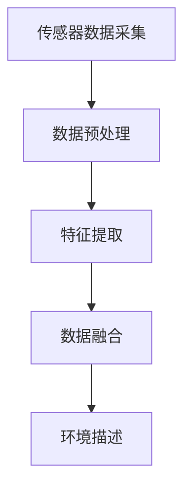
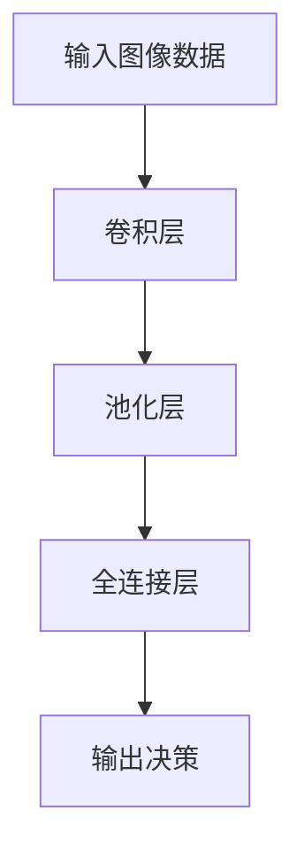
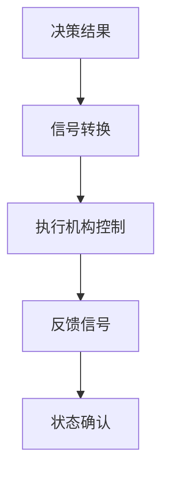
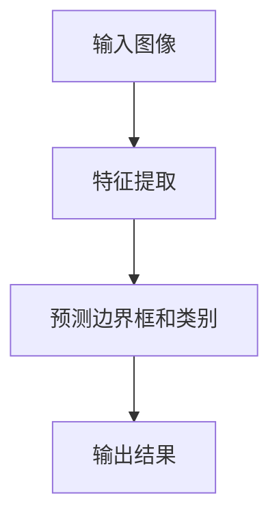
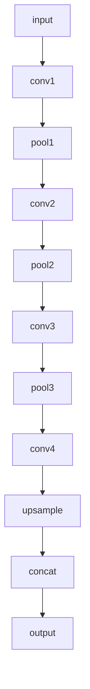
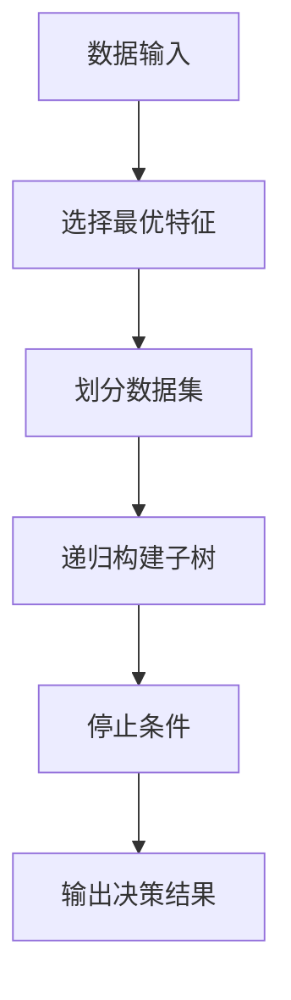
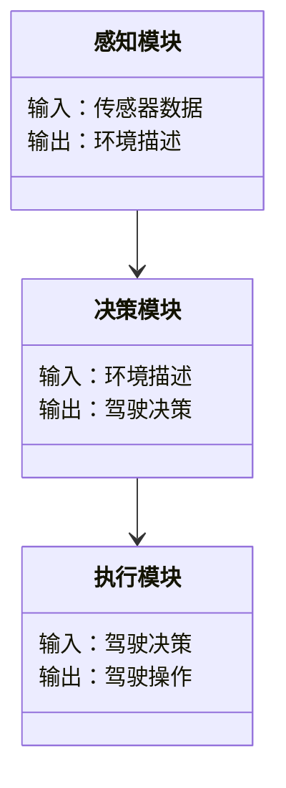
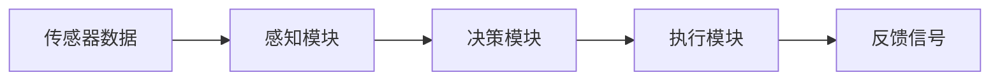

                 


# 智能汽车：AI Agent的驾驶行为分析与安全预警

> 关键词：智能汽车, AI Agent, 驾驶行为分析, 安全预警, 人工智能, 自动驾驶, 智能交通系统

> 摘要：本文将探讨AI Agent在智能汽车中的应用，重点分析其驾驶行为分析与安全预警的技术原理和实现方法。通过结合多传感器数据和深度学习算法，AI Agent能够实时感知环境、预测驾驶风险并做出智能决策，从而显著提升驾驶安全性和智能化水平。本文将从AI Agent的核心概念、算法原理、系统架构到实际应用案例进行全面解析。

---

# 第1章: 智能汽车与AI Agent的背景与概念

## 1.1 智能汽车的定义与发展现状

智能汽车是指通过先进的传感器、计算平台、执行机构和智能算法，实现车与车、车与人、车与环境之间智能交互的汽车。它结合了计算机视觉、人工智能、通信技术和机械工程，是传统汽车向智能化、网联化发展的产物。

近年来，全球范围内智能汽车的发展势头迅猛。根据市场研究机构的数据，2020年全球智能汽车市场规模已经超过1000亿美元，预计到2030年将突破5000亿美元。中国、美国、欧洲等主要汽车市场都在积极推动智能汽车的技术研发和商业化应用。

智能汽车的核心技术包括：
- **感知技术**：通过激光雷达、摄像头、雷达等传感器感知周围环境。
- **决策技术**：基于感知数据，通过人工智能算法做出驾驶决策。
- **执行技术**：通过控制执行机构（如转向、加速、制动）实现驾驶操作。

---

## 1.2 AI Agent的基本概念

AI Agent（人工智能代理）是指能够感知环境、自主决策并执行任务的智能实体。在智能汽车中，AI Agent主要负责处理驾驶相关的感知、决策和执行任务。

AI Agent的核心特征包括：
- **自主性**：能够在没有外部干预的情况下独立运行。
- **反应性**：能够实时感知环境变化并做出反应。
- **学习能力**：通过数据积累和机器学习算法不断优化自身的决策能力。

AI Agent与传统驾驶的区别主要体现在以下几个方面：

| **方面**       | **传统驾驶**                     | **AI Agent驾驶**                   |
|----------------|----------------------------------|------------------------------------|
| 决策主体       | 人类驾驶员                       | AI Agent                           |
| 决策速度       | 受限于人类反应速度               | 超高计算速度                        |
| 决策准确性     | 受疲劳、情绪等因素影响           | 几乎不受主观因素影响                |
| 决策全面性     | 依赖驾驶员的经验和注意力         | 基于多传感器数据的全面分析          |

---

## 1.3 智能汽车中AI Agent的应用场景

AI Agent在智能汽车中的应用场景非常广泛，主要包括：
- **自动驾驶**：在特定场景（如高速公路、封闭园区）实现完全自动驾驶。
- **驾驶行为分析**：实时分析驾驶员的驾驶行为，提供个性化驾驶建议。
- **安全预警**：通过环境感知和数据分析，提前预警潜在的安全风险。

---

## 1.4 本章小结

本章主要介绍了智能汽车和AI Agent的基本概念、发展历程和技术特点。AI Agent作为智能汽车的核心技术，通过感知、决策和执行三大模块，为智能驾驶提供了强大的技术支撑。下一章将详细讲解AI Agent在驾驶行为分析中的核心概念和实现原理。

---

# 第2章: AI Agent的驾驶行为分析核心概念

## 2.1 AI Agent的感知机制

### 2.1.1 感知模块的功能与实现

AI Agent的感知模块通过多种传感器（如摄像头、激光雷达、雷达、IMU等）获取环境数据，并通过融合算法将这些数据整合为一个统一的环境描述。

#### 感知模块的实现流程（Mermaid流程图）



---

### 2.1.2 多传感器融合技术

多传感器融合技术通过结合不同传感器的数据，提高感知的准确性和鲁棒性。常用的融合方法包括：
- **加权融合**：根据传感器的可靠性分配权重。
- **概率融合**：基于概率论的方法（如Kalman滤波）进行数据融合。

---

## 2.2 AI Agent的决策机制

### 2.2.1 基于规则的决策系统

基于规则的决策系统通过预定义的规则库进行决策。例如：
- **规则1**：如果前方有障碍物，且距离小于安全距离，则立即刹车。
- **规则2**：如果车道线清晰，且车速低于限速，则保持当前车道。

#### 规则库管理（表格）

| **规则编号** | **条件**                     | **动作**                     |
|--------------|------------------------------|------------------------------|
| Rule_001     | 前方有障碍物，且距离 < 安全距离 | 立即刹车                     |
| Rule_002     | 车道线清晰，且车速 < 限速     | 保持当前车道                 |

---

### 2.2.2 基于深度学习的决策系统

基于深度学习的决策系统通过训练神经网络模型，实现复杂的决策任务。常用的模型包括：
- **卷积神经网络（CNN）**：用于图像识别任务。
- **循环神经网络（RNN）**：用于时序数据的处理。

#### 基于CNN的决策模型（Mermaid流程图）



---

## 2.3 AI Agent的执行机制

### 2.3.1 执行模块的功能与实现

执行模块负责将决策结果转化为具体的驾驶操作，如转向、加速和制动。

#### 执行模块的实现流程（Mermaid流程图）



---

## 2.4 本章小结

本章重点介绍了AI Agent的感知、决策和执行机制。感知模块通过多传感器融合技术获取环境信息，决策模块基于规则或深度学习算法做出驾驶决策，执行模块将决策结果转化为具体的驾驶操作。下一章将详细讲解AI Agent驾驶行为分析的核心算法。

---

# 第3章: AI Agent驾驶行为分析的核心算法

## 3.1 目标检测算法

### 3.1.1 基于CNN的目标检测算法

目标检测是AI Agent感知环境的重要任务之一。常用的算法包括YOLO（You Only Look Once）。

#### YOLO算法的实现流程（Mermaid流程图）



#### YOLO的Python实现示例

```python
import tensorflow as tf
from tensorflow.keras import layers

model = tf.keras.Sequential([
    layers.Conv2D(32, (3,3), activation='relu'),
    layers.MaxPooling2D((2,2)),
    layers.Conv2D(64, (3,3), activation='relu'),
    layers.MaxPooling2D((2,2)),
    layers.Flatten(),
    layers.Dense(128, activation='relu'),
    layers.Dense(num_classes, activation='softmax')
])
```

---

## 3.2 语义分割算法

### 3.2.1 基于U-Net的语义分割算法

语义分割算法用于将图像中的每个像素分类到特定的类别中。

#### U-Net网络结构（Mermaid流程图）



---

## 3.3 决策树算法

### 3.3.1 决策树的构造过程

决策树是一种基于树状结构的分类方法，适用于驾驶场景的分类任务。

#### 决策树的构造流程（Mermaid流程图）



---

## 3.4 本章小结

本章详细讲解了AI Agent驾驶行为分析的核心算法，包括目标检测、语义分割和决策树算法。这些算法为AI Agent的感知和决策提供了强大的技术支撑。下一章将从系统架构的角度，分析AI Agent驾驶行为分析的实现方案。

---

# 第4章: AI Agent驾驶行为分析系统架构设计

## 4.1 系统功能设计

AI Agent驾驶行为分析系统主要包括以下几个功能模块：

- **感知模块**：负责环境数据的采集和处理。
- **决策模块**：基于感知数据进行驾驶决策。
- **执行模块**：将决策结果转化为具体的驾驶操作。

#### 系统功能模块（Mermaid类图）



---

## 4.2 系统架构设计

AI Agent驾驶行为分析系统的架构设计需要考虑系统的扩展性和实时性。

#### 系统架构（Mermaid架构图）



---

## 4.3 系统接口设计

系统接口设计需要考虑模块之间的通信协议和数据格式。

- **感知模块接口**：提供传感器数据的接口。
- **决策模块接口**：提供驾驶决策的接口。
- **执行模块接口**：提供驾驶操作的接口。

---

## 4.4 本章小结

本章从系统架构的角度，分析了AI Agent驾驶行为分析系统的功能设计、架构设计和接口设计。下一章将通过实际案例，展示AI Agent驾驶行为分析的实现过程。

---

# 第5章: AI Agent驾驶行为分析项目实战

## 5.1 环境配置

### 5.1.1 安装Python和必要的库

```bash
pip install numpy
pip install tensorflow
pip install keras
pip install matplotlib
pip install open_cv-python
```

---

## 5.2 核心代码实现

### 5.2.1 目标检测模型的实现

```python
import tensorflow as tf
from tensorflow.keras import layers

def build_model(input_shape, num_classes):
    model = tf.keras.Sequential([
        layers.Conv2D(32, (3,3), activation='relu', input_shape=input_shape),
        layers.MaxPooling2D((2,2)),
        layers.Conv2D(64, (3,3), activation='relu'),
        layers.MaxPooling2D((2,2)),
        layers.Flatten(),
        layers.Dense(128, activation='relu'),
        layers.Dense(num_classes, activation='softmax')
    ])
    return model
```

---

## 5.3 实际案例分析

### 5.3.1 案例一：前方有障碍物

#### 输入数据：摄像头图像
#### 输出结果：检测到障碍物，触发刹车

---

## 5.4 本章小结

本章通过实际案例，展示了AI Agent驾驶行为分析系统的实现过程。通过项目实战，读者可以更好地理解AI Agent在实际应用中的技术细节。

---

# 第6章: 未来展望与最佳实践

## 6.1 未来展望

随着人工智能技术的不断发展，AI Agent在智能汽车中的应用前景广阔。未来，AI Agent将更加智能化和自主化，能够处理更复杂的驾驶场景。

---

## 6.2 最佳实践

在实际应用中，需要注意以下几点：
- **数据质量**：确保传感器数据的准确性和完整性。
- **模型优化**：通过不断优化模型参数，提高算法的准确性和实时性。
- **系统测试**：在实际场景中进行充分的测试，确保系统的稳定性和可靠性。

---

# 作者

作者：AI天才研究院/AI Genius Institute & 禅与计算机程序设计艺术 /Zen And The Art of Computer Programming

