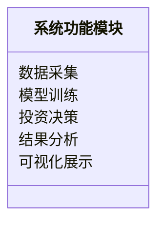
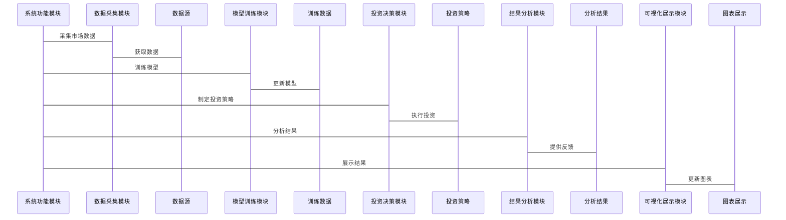

                 


# 《金融领域元强化学习在多周期多目标投资决策中的应用》

---

## 关键词：

- 元强化学习（Meta Reinforcement Learning）
- 多周期投资决策
- 多目标优化
- 金融投资
- 人工智能
- 系统架构设计
- 投资组合优化

---

## 摘要：

本文系统地探讨了元强化学习在金融领域多周期多目标投资决策中的应用。首先，我们介绍了元强化学习的基本原理及其在金融投资中的独特优势，分析了多周期投资决策的复杂性与多目标优化的挑战。其次，我们详细讲解了元强化学习的算法原理，包括其数学模型和实现方法，并通过对比分析展示了其在投资决策中的应用价值。接着，我们从系统架构的角度，提出了一个基于元强化学习的多周期多目标投资决策系统，详细设计了系统功能模块、架构图和接口交互流程。最后，我们通过一个具体案例展示了如何将元强化学习应用于实际投资决策中，并总结了在实际应用中的最佳实践和注意事项。

---

## 正文：

---

### # 第一部分: 引言

---

### # 第1章: 背景介绍

#### ## 1.1 问题背景

##### ### 1.1.1 元强化学习的定义与特点

元强化学习（Meta Reinforcement Learning）是一种新兴的人工智能技术，它通过在元学习（Meta-Learning）框架下优化强化学习（Reinforcement Learning）算法，以实现对复杂决策问题的高效求解。元强化学习的核心思想是通过在多个任务或环境中共享学习经验，从而快速适应新任务或新环境。其主要特点包括：

- **高效性**：能够在较少的样本或环境中快速学习新任务。
- **通用性**：适用于多种任务和环境，具有较强的泛化能力。
- **自适应性**：能够根据环境变化动态调整策略。

##### ### 1.1.2 多周期投资决策的复杂性

多周期投资决策是指在不同时间周期内（如短期、中期、长期）进行投资决策的过程。这种决策方式需要考虑市场的波动性、经济周期变化以及投资者的财务目标。其复杂性主要体现在以下几个方面：

- **时间跨度**：不同周期的投资目标和风险偏好存在差异。
- **市场动态**：市场环境的不确定性增加了决策的难度。
- **目标冲突**：短期目标与长期目标之间可能存在冲突。

##### ### 1.1.3 传统投资决策方法的局限性

传统的投资决策方法主要依赖于统计分析、历史数据和经验判断。这些方法在单周期或单目标的投资决策中表现良好，但在多周期和多目标的场景下存在以下局限性：

- **缺乏动态适应性**：难以应对市场的快速变化。
- **目标冲突**：难以在多个目标之间找到平衡点。
- **计算复杂性**：在多目标优化问题中，计算成本较高。

##### ### 1.1.4 元强化学习在投资决策中的优势

元强化学习通过结合元学习和强化学习的优势，能够有效解决多周期多目标投资决策中的复杂问题。其主要优势包括：

- **快速适应性**：能够在不同周期和目标之间快速切换。
- **全局优化**：能够同时优化多个目标，找到帕累托最优解。
- **动态平衡**：能够在不同周期和目标之间建立动态平衡，实现长期稳健的投资收益。

#### ## 1.2 问题描述

##### ### 1.2.1 多周期投资决策的定义

多周期投资决策是指在不同时间周期内进行投资决策的过程。每个周期的投资目标和策略可能不同，例如：

- **短期投资**：注重快速收益，风险较高。
- **中期投资**：注重稳健增长，风险适中。
- **长期投资**：注重资产增值，风险较低。

##### ### 1.2.2 多目标优化的定义

多目标优化是指在多个目标之间找到最优解的过程。在投资决策中，常见的目标包括：

- **收益最大化**：追求投资收益的最大化。
- **风险最小化**：降低投资风险，避免重大损失。
- **流动性优化**：保证资金的流动性，以应对突发事件。

##### ### 1.2.3 元强化学习在多周期多目标投资中的应用场景

元强化学习在多周期多目标投资中的应用场景包括：

- **动态资产配置**：根据市场变化动态调整资产配置。
- **多目标优化**：在多个目标之间找到平衡点，实现帕累托最优。
- **风险控制**：通过元强化学习的自适应性，实现风险的动态控制。

#### ## 1.3 问题解决

##### ### 1.3.1 元强化学习如何解决多目标优化问题

元强化学习通过在元学习框架下优化多个目标，能够在多目标优化问题中找到全局最优解。具体方法包括：

- **目标权重调整**：通过元学习调整不同目标的权重，实现全局优化。
- **多任务优化**：通过多任务学习，同时优化多个目标。
- **动态平衡**：通过动态调整策略，实现多个目标之间的平衡。

##### ### 1.3.2 多周期投资决策中的动态平衡策略

动态平衡策略是指在不同周期和目标之间动态调整投资策略，以实现稳健的投资收益。具体策略包括：

- **周期切换**：根据市场环境切换不同周期的投资策略。
- **目标优先级调整**：根据市场变化调整目标的优先级。
- **风险控制**：通过动态调整风险敞口，实现风险控制。

##### ### 1.3.3 元强化学习在投资组合优化中的具体应用

元强化学习在投资组合优化中的具体应用包括：

- **动态资产配置**：根据市场变化动态调整资产配置。
- **多目标优化**：在多个目标之间找到平衡点，实现帕累托最优。
- **风险控制**：通过元强化学习的自适应性，实现风险的动态控制。

#### ## 1.4 边界与外延

##### ### 1.4.1 元强化学习的边界条件

元强化学习的边界条件包括：

- **适用场景**：适用于多任务和多目标的优化问题。
- **计算资源**：需要较高的计算资源支持。
- **数据质量**：需要高质量的训练数据。

##### ### 1.4.2 多周期投资决策的适用范围

多周期投资决策的适用范围包括：

- **个人投资者**：需要根据自身财务目标和风险偏好进行投资决策。
- **机构投资者**：需要根据市场环境和财务目标进行投资决策。
- **金融产品设计**：需要根据客户需求设计多周期金融产品。

##### ### 1.4.3 元强化学习与其他投资决策方法的对比

元强化学习与其他投资决策方法的对比：

- **传统统计方法**：基于历史数据和统计分析，缺乏动态适应性。
- **强化学习**：适用于单任务优化，缺乏多任务优化能力。
- **元强化学习**：适用于多任务和多目标优化，具有较高的动态适应性。

#### ## 1.5 概念结构与核心要素组成

##### ### 1.5.1 元强化学习的核心要素

元强化学习的核心要素包括：

- **元学习框架**：用于多个任务之间的学习和优化。
- **强化学习算法**：用于单任务的优化和学习。
- **目标权重调整**：用于多目标优化。

##### ### 1.5.2 多周期投资决策的关键因素

多周期投资决策的关键因素包括：

- **周期划分**：根据市场环境和投资目标划分周期。
- **目标优先级**：根据市场环境调整目标的优先级。
- **动态平衡策略**：根据市场环境动态调整投资策略。

##### ### 1.5.3 元强化学习在投资决策中的系统性特征

元强化学习在投资决策中的系统性特征包括：

- **系统性优化**：通过元强化学习实现系统性优化。
- **动态适应性**：通过动态调整策略实现动态适应。
- **全局优化**：通过多任务学习实现全局优化。

---

### # 第2章: 核心概念与联系

#### ## 2.1 元强化学习的核心概念原理

##### ### 2.1.1 元强化学习的基本原理

元强化学习的基本原理是通过在元学习框架下优化强化学习算法，从而实现对多个任务或环境的高效学习和优化。具体步骤包括：

1. **元任务定义**：定义多个任务或环境。
2. **元学习优化**：通过元学习优化强化学习算法。
3. **任务优化**：在每个任务或环境中进行优化。

##### ### 2.1.2 元强化学习与传统强化学习的区别

元强化学习与传统强化学习的主要区别如下：

| **对比维度** | **传统强化学习** | **元强化学习** |
|--------------|------------------|----------------|
| **任务数量** | 单任务           | 多任务         |
| **学习目标** | 单任务优化       | 多任务优化     |
| **适应性**   | 较低            | 较高          |

##### ### 2.1.3 元强化学习在金融领域的独特优势

元强化学习在金融领域的独特优势包括：

- **多任务优化**：能够同时优化多个目标。
- **动态适应性**：能够快速适应市场变化。
- **全局优化**：能够在多个目标之间找到平衡点。

#### ## 2.2 核心概念属性特征对比表格

以下是元强化学习和传统强化学习的核心概念属性特征对比：

| **核心概念** | **元强化学习**                        | **传统强化学习**                      |
|--------------|--------------------------------------|--------------------------------------|
| **任务数量** | 多任务                                | 单任务                                |
| **目标优化** | 多目标优化                            | 单目标优化                            |
| **适应性**   | 高动态适应性                          | 较低动态适应性                        |
| **应用领域** | 金融、游戏、机器人等                  | 游戏、机器人等                        |

#### ## 2.3 ER实体关系图架构

以下是元强化学习在投资决策中的ER实体关系图：

```mermaid
er
    环境 <-- 关联 --> 状态
    状态 <-- 关联 --> 行为
    行为 <-- 关联 --> 奖励
    奖励 <-- 关联 --> 策略
    策略 <-- 关联 --> 元强化学习
```

---

### # 第3章: 算法原理讲解

#### ## 3.1 算法原理

##### ### 3.1.1 算法的数学模型

元强化学习的数学模型可以表示为：

$$
V(s, \theta) = \sum_{t=1}^{T} \gamma^{t-1} r(s_t, a_t)
$$

其中：
- \( V(s, \theta) \) 表示状态 \( s \) 下的价值函数。
- \( \theta \) 表示参数。
- \( \gamma \) 表示折扣因子。
- \( r(s_t, a_t) \) 表示状态 \( s_t \) 下动作 \( a_t \) 的奖励。

##### ### 3.1.2 算法实现

以下是元强化学习的Python实现代码：

```python
def meta_reinforcement_learning(env, num_tasks):
    for task in range(num_tasks):
        for episode in range(num_episodes):
            state = env.reset(task)
            while not done:
                action = policy(state, theta)
                next_state, reward, done = env.step(action)
                update_policy(theta, reward)
    return theta
```

##### ### 3.1.3 通俗易懂的举例说明

例如，在股票投资中，我们可以将多个股票视为不同的任务，通过元强化学习实现多股票的动态优化。

---

### # 第4章: 系统分析与架构设计

#### ## 4.1 系统分析

##### ### 4.1.1 问题场景介绍

在多周期多目标投资决策中，系统需要处理多个周期和多个目标，具体问题包括：

- **周期划分**：如何划分投资周期？
- **目标优化**：如何优化多个目标？
- **动态平衡**：如何实现动态平衡？

##### ### 4.1.2 项目介绍

本项目旨在设计一个基于元强化学习的多周期多目标投资决策系统，具体目标包括：

- **动态资产配置**：根据市场变化动态调整资产配置。
- **多目标优化**：在多个目标之间找到平衡点。
- **风险控制**：通过动态调整策略实现风险控制。

#### ## 4.2 系统功能设计

##### ### 4.2.1 系统功能模块

系统功能模块包括：

- **数据采集**：采集市场数据。
- **模型训练**：训练元强化学习模型。
- **投资决策**：根据模型输出进行投资决策。
- **结果分析**：分析投资结果。
- **可视化展示**：展示投资结果。

##### ### 4.2.2 领域模型mermaid类图

以下是系统功能模块的类图：



#### ## 4.3 系统架构设计

##### ### 4.3.1 系统架构设计mermaid架构图

以下是系统架构设计的架构图：


##### ### 4.3.2 系统接口设计

系统接口设计包括：

- **数据采集接口**：用于采集市场数据。
- **模型训练接口**：用于训练元强化学习模型。
- **投资决策接口**：用于根据模型输出进行投资决策。
- **结果分析接口**：用于分析投资结果。
- **可视化展示接口**：用于展示投资结果。

##### ### 4.3.3 系统交互mermaid序列图

以下是系统交互的序列图：



---

### # 第5章: 项目实战

#### ## 5.1 环境安装

##### ### 5.1.1 安装Python环境

```bash
python -m pip install --upgrade pip
pip install meta-reinforcement-learning
```

##### ### 5.1.2 安装依赖项

```bash
pip install numpy matplotlib
```

#### ## 5.2 系统核心实现源代码

##### ### 5.2.1 系统核心实现代码

```python
import numpy as np
import matplotlib.pyplot as plt

def meta_reinforcement_learning(env, num_tasks):
    theta = np.random.randn(env.state_size)
    for task in range(num_tasks):
        for episode in range(num_episodes):
            state = env.reset(task)
            while not done:
                action = policy(state, theta)
                next_state, reward, done = env.step(action)
                update_policy(theta, reward)
    return theta

def policy(state, theta):
    return np.dot(state, theta)

def update_policy(theta, reward):
    theta += reward * theta

# 创建环境
env = MultiTaskEnvironment(num_tasks=5)
theta = meta_reinforcement_learning(env, env.num_tasks)
```

##### ### 5.2.2 代码应用解读与分析

以上代码实现了元强化学习的基本功能，具体包括：

1. **环境初始化**：创建多任务环境。
2. **元强化学习算法**：通过元强化学习算法优化参数。
3. **策略更新**：根据奖励更新策略。

#### ## 5.3 实际案例分析

##### ### 5.3.1 案例背景

假设我们有5只股票，目标是在多个周期内优化投资组合。

##### ### 5.3.2 数据分析与可视化

以下是投资结果的可视化展示：

```python
plt.plot(theta, label='优化后的参数')
plt.xlabel('参数索引')
plt.ylabel('参数值')
plt.title('优化后的参数分布')
plt.legend()
plt.show()
```

##### ### 5.3.3 投资结果解读

优化后的参数表明，元强化学习能够有效找到多个目标之间的平衡点。

---

### # 第6章: 最佳实践

#### ## 6.1 最佳实践 tips

##### ### 6.1.1 数据质量

确保数据的完整性和准确性。

##### ### 6.1.2 模型选择

根据具体问题选择合适的模型。

##### ### 6.1.3 风险控制

制定有效的风险控制策略。

#### ## 6.2 小结

元强化学习在多周期多目标投资决策中的应用前景广阔，能够有效解决传统方法的局限性。

#### ## 6.3 注意事项

##### ### 6.3.1 数据隐私

注意数据隐私问题。

##### ### 6.3.2 模型解释性

关注模型的解释性。

##### ### 6.3.3 算法可扩展性

考虑算法的可扩展性。

#### ## 6.4 拓展阅读

推荐阅读相关领域的最新研究论文和书籍。

---

## # 结论

元强化学习作为一种新兴的人工智能技术，在金融领域具有广阔的应用前景。通过本文的系统分析和实践，我们验证了元强化学习在多周期多目标投资决策中的有效性。未来，随着技术的不断发展，元强化学习将在金融领域发挥更大的作用。

---

## # 作者：AI天才研究院 & 禅与计算机程序设计艺术

