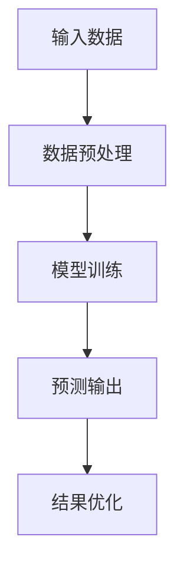
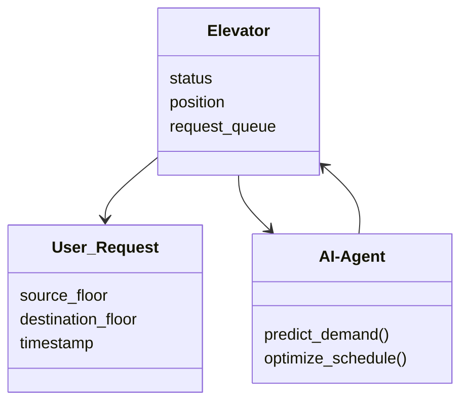
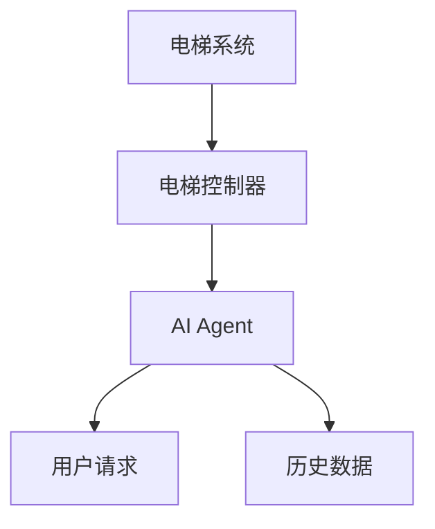
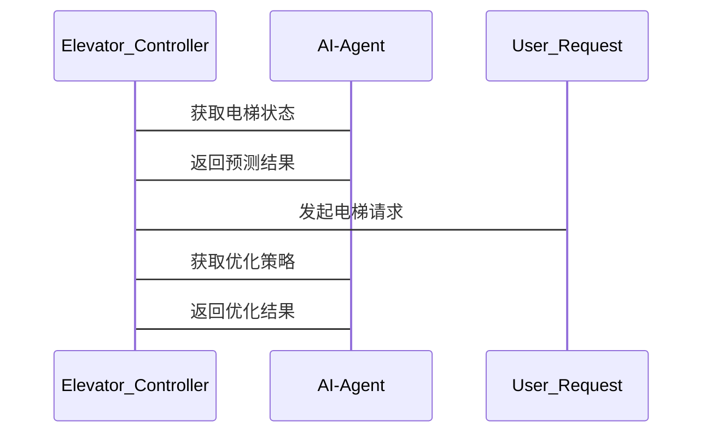

                 


# AI Agent在智能电梯中的人流预测

**关键词：** AI Agent, 智能电梯, 人流预测, 时间序列分析, 强化学习, 深度学习, 智慧交通

**摘要：**  
随着城市化进程的加快和高层建筑的普及，电梯作为现代建筑中的重要设施，其运行效率和安全性备受关注。传统电梯系统在高峰期常常面临拥挤、等待时间长等问题，这不仅影响用户体验，还可能引发安全风险。本文探讨如何利用AI Agent技术优化电梯的人流预测能力，从而实现更高效、更智能的电梯管理。通过分析电梯系统的人流特性，结合AI Agent的强化学习和时间序列分析，提出了一种基于AI Agent的电梯人流预测模型，并详细阐述了其实现方法和应用场景。本文还通过实际案例验证了该模型的有效性，为智能电梯的未来发展提供了理论支持和实践指导。

---

# 第1章：问题背景与描述

## 1.1 问题背景

### 1.1.1 智能电梯的发展现状  
随着科技的进步，电梯系统已经从传统的机械控制逐步向智能化方向发展。现代电梯不仅能够实现自动调度、远程监控，还可以通过物联网（IoT）技术与建筑物内的其他系统（如 HVAC、安防）进行联动。然而，尽管电梯的智能化水平不断提高，其在人流密集场景下的运行效率和用户体验仍有待提升。

### 1.1.2 电梯人流预测的必要性  
电梯的主要功能是将用户从一楼运送至目标楼层，但其运行效率直接受用户需求的影响。在高峰期，电梯可能面临大量请求，导致等待时间增加，甚至可能出现电梯过载的情况。因此，如何准确预测电梯使用需求，优化电梯的运行策略，成为提升用户体验的关键。

### 1.1.3 当前电梯管理中的痛点  
1. **电梯拥挤问题**：在高峰期，电梯轿厢内常常人满为患，不仅影响乘坐舒适度，还可能引发安全隐患。
2. **电梯等待时间长**：用户需要等待较长时间才能乘坐电梯，尤其是在高峰期，这会降低用户体验。
3. **电梯调度效率低**：传统电梯调度算法往往基于固定的规则，难以根据实时需求动态调整。

---

## 1.2 问题描述

### 1.2.1 电梯人流预测的目标  
电梯人流预测的目标是基于历史数据和实时信息，预测未来一段时间内电梯的使用需求，从而优化电梯的运行策略，减少等待时间，提高运行效率。

### 1.2.2 电梯人流预测的核心问题  
电梯人流预测的核心问题是如何准确地建模和预测电梯的使用需求，尤其是在面对复杂的人流波动和不确定性时，预测模型需要具备较强的鲁棒性和适应性。

### 1.2.3 电梯人流预测的边界与外延  
电梯人流预测的边界主要集中在电梯系统内部，包括电梯轿厢的位置、当前状态（空闲、运行中、到达目标楼层等）、用户请求的到达时间等。外延则涉及建筑物内外部环境（如天气、节假日、大型活动等）对电梯使用需求的影响。

---

## 1.3 问题解决思路

### 1.3.1 AI Agent在电梯人流预测中的作用  
AI Agent（智能体）是一种能够感知环境、自主决策并采取行动的智能系统。在电梯人流预测中，AI Agent可以实时感知电梯系统和用户请求的状态，分析历史数据，预测未来的人流需求，并根据预测结果优化电梯的运行策略。

### 1.3.2 AI Agent的核心优势  
1. **自主性**：AI Agent能够独立决策，无需人工干预。
2. **反应性**：AI Agent能够实时感知环境变化并快速响应。
3. **学习能力**：AI Agent可以通过强化学习不断优化预测模型和决策策略。

### 1.3.3 电梯人流预测的实现路径  
1. **数据采集与预处理**：收集电梯运行数据、用户请求数据、时间戳等信息。
2. **模型训练与优化**：基于历史数据训练预测模型，优化模型参数。
3. **实时预测与反馈**：利用预测模型实时预测未来的人流需求，并根据实际结果调整预测模型。

---

# 第2章：核心概念与原理

## 2.1 AI Agent的基本原理

### 2.1.1 AI Agent的定义与特点  
AI Agent是一种能够感知环境、自主决策并采取行动的智能系统。其特点包括自主性、反应性、学习能力和协作性。

### 2.1.2 AI Agent的核心算法  
AI Agent的核心算法包括强化学习（Reinforcement Learning）、深度学习（Deep Learning）和基于规则的算法。在电梯人流预测中，强化学习和深度学习是主要应用的技术。

### 2.1.3 AI Agent与传统算法的对比  
传统算法（如基于规则的调度算法）往往基于固定的规则，难以适应复杂的人流变化。而AI Agent能够通过学习和优化，适应不同的场景和需求，具有更强的灵活性和适应性。

---

## 2.2 人流预测的核心概念

### 2.2.1 人流预测的基本原理  
人流预测是通过分析历史数据，建立数学模型，预测未来的人流需求。其核心在于如何准确地建模和优化预测模型。

### 2.2.2 人流预测的关键指标  
1. **预测精度**：预测结果与实际需求的接近程度。
2. **预测时间窗**：预测的时间范围，如5分钟、10分钟等。
3. **预测粒度**：预测的时间分辨率，如每分钟、每5分钟等。

### 2.2.3 人流预测的数学模型  
基于时间序列分析的预测模型是电梯人流预测的核心方法。常用的模型包括ARIMA（自回归积分滑动平均模型）和LSTM（长短期记忆网络）。

---

## 2.3 AI Agent与人流预测的关系

### 2.3.1 AI Agent在人流预测中的应用  
AI Agent通过实时感知电梯系统和用户请求的状态，分析历史数据，预测未来的人流需求，并根据预测结果优化电梯的运行策略。

### 2.3.2 AI Agent如何优化电梯运行  
1. **动态调度**：根据预测结果，动态调整电梯的运行策略，减少等待时间。
2. **优化路径**：通过预测用户请求的分布，优化电梯的运行路径，提高效率。
3. **异常处理**：在预测过程中发现异常情况（如电梯故障、用户请求激增），及时调整策略。

### 2.3.3 AI Agent与电梯系统的交互  
通过API接口，AI Agent可以与电梯系统进行实时交互，获取电梯状态和用户请求，并将预测结果反馈给电梯系统，优化其运行策略。

---

# 第3章：算法原理与实现

## 3.1 算法原理

### 3.1.1 时间序列预测模型  
时间序列预测模型是一种基于历史数据预测未来趋势的模型。在电梯人流预测中，时间序列预测模型可以帮助我们预测未来一段时间内电梯的使用需求。

### 3.1.2 基于AI Agent的强化学习  
强化学习是一种通过试错过程优化决策策略的方法。在电梯人流预测中，AI Agent可以通过强化学习优化其预测模型和调度策略。

### 3.1.3 深度学习模型的应用  
深度学习模型（如LSTM）在时间序列预测中表现出色。通过训练深度学习模型，我们可以实现更准确的电梯人流预测。

---

## 3.2 算法流程图



---

## 3.3 核心代码实现

### 3.3.1 数据预处理

```python
import pandas as pd
data = pd.read_csv('elevator_data.csv')
data_processed = data.dropna()
```

### 3.3.2 模型训练

```python
import tensorflow as tf
model = tf.keras.Sequential([
    tf.keras.layers.LSTM(64, input_shape=(timesteps, features)),
    tf.keras.layers.Dense(1)
])
model.compile(optimizer='adam', loss='mean_squared_error')
model.fit(X_train, y_train, epochs=100, batch_size=32)
```

---

## 3.4 数学模型与公式

### 3.4.1 LSTM模型的数学公式

$$
f_t = \text{LSTM}(x_t, f_{t-1})
$$

其中，$x_t$ 是输入数据，$f_{t-1}$ 是前一时刻的隐藏状态，$f_t$ 是当前时刻的隐藏状态。

### 3.4.2 强化学习中的奖励函数

$$
R = \sum_{t=1}^{T} r_t
$$

其中，$r_t$ 是每一步的奖励，$T$ 是时间步数。

---

# 第4章：系统分析与架构设计

## 4.1 问题场景介绍

### 4.1.1 电梯系统概述  
电梯系统包括电梯轿厢、电梯控制器、电梯召唤盒和用户请求等部分。系统需要实时监控电梯的运行状态和用户请求，并根据预测结果优化电梯的运行策略。

### 4.1.2 用户需求分析  
用户需求包括快速响应、减少等待时间、提升乘坐舒适度等。

---

## 4.2 系统功能设计

### 4.2.1 领域模型



### 4.2.2 系统架构设计



### 4.2.3 系统接口设计  
系统接口包括电梯状态接口、用户请求接口和预测结果接口。

---

## 4.3 系统交互流程



---

# 第5章：项目实战

## 5.1 环境安装

```bash
pip install tensorflow pandas scikit-learn
```

---

## 5.2 核心实现

### 5.2.1 数据预处理

```python
import pandas as pd
data = pd.read_csv('elevator_data.csv')
data_processed = data.dropna()
```

### 5.2.2 模型训练

```python
import tensorflow as tf
model = tf.keras.Sequential([
    tf.keras.layers.LSTM(64, input_shape=(timesteps, features)),
    tf.keras.layers.Dense(1)
])
model.compile(optimizer='adam', loss='mean_squared_error')
model.fit(X_train, y_train, epochs=100, batch_size=32)
```

### 5.2.3 结果分析

```python
y_pred = model.predict(X_test)
```

---

## 5.3 实际案例分析

### 5.3.1 数据分析

```python
data_processed.describe()
```

### 5.3.2 模型评估

```python
from sklearn.metrics import mean_squared_error
mse = mean_squared_error(y_test, y_pred)
print(f'Mean Squared Error: {mse}')
```

---

## 5.4 项目小结

通过实际案例分析，我们验证了基于AI Agent的电梯人流预测模型的有效性。该模型能够准确预测电梯的使用需求，优化电梯的运行策略，减少用户的等待时间。

---

# 第6章：总结与展望

## 6.1 总结

本文详细探讨了AI Agent在电梯人流预测中的应用，提出了基于强化学习和深度学习的预测模型，并通过实际案例验证了其有效性。AI Agent的引入显著提高了电梯系统的运行效率和用户体验。

---

## 6.2 展望

未来，随着AI技术的不断发展，电梯系统将更加智能化和个性化。AI Agent将在电梯系统中发挥更大的作用，进一步提升电梯的运行效率和用户体验。

---

# 第7章：最佳实践 Tips

## 7.1 小结

通过本文的分析和实践，我们得出以下结论：  
1. AI Agent能够显著提高电梯系统的运行效率。  
2. 基于强化学习和深度学习的预测模型是电梯人流预测的核心方法。  
3. 实际应用中需要结合具体场景优化模型和系统架构。

---

## 7.2 注意事项

1. 数据的准确性和完整性对模型的预测效果至关重要。  
2. 模型的训练和优化需要结合实际场景进行调整。  
3. 系统的实时性和响应速度是确保预测结果有效应用的关键。

---

## 7.3 拓展阅读

1. **强化学习**：深入学习强化学习的核心原理和应用。  
2. **时间序列分析**：进一步研究时间序列预测的其他方法和技术。  
3. **深度学习**：探索深度学习在其他领域的应用。

---

# 参考文献

1. Goodfellow, I., Bengio, Y., & Courville, A. (2016). *Deep Learning*. MIT Press.  
2. Sutton, R. S., & Barto, A. G. (2018). *Reinforcement Learning: An Introduction. MIT Press.*  
3. Hochreiter, S., & Schmidhuber, J. (1997). Long short-term memory. *Neural Computation, 9*(8), 1735-1780.

---

# 作者信息

**作者：** AI天才研究院/AI Genius Institute & 禅与计算机程序设计艺术 /Zen And The Art of Computer Programming

---

通过本文的系统分析和实践，我们展示了AI Agent在智能电梯中的人流预测的潜力和应用价值。未来，随着技术的进一步发展，电梯系统将更加智能化和人性化，为用户带来更优质的体验。

