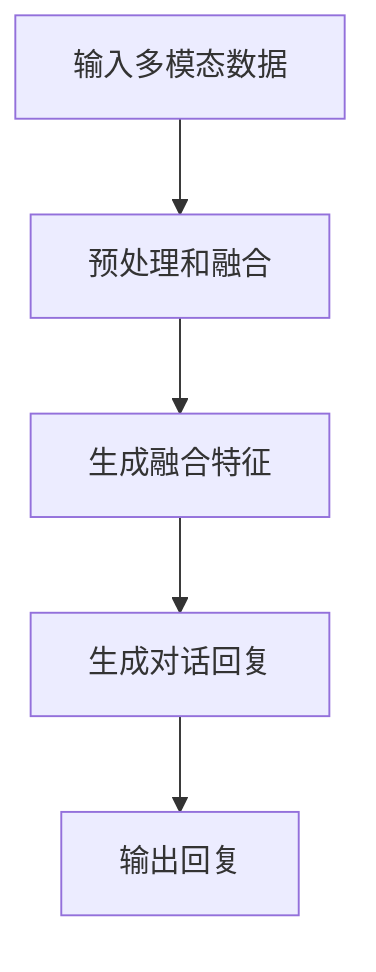
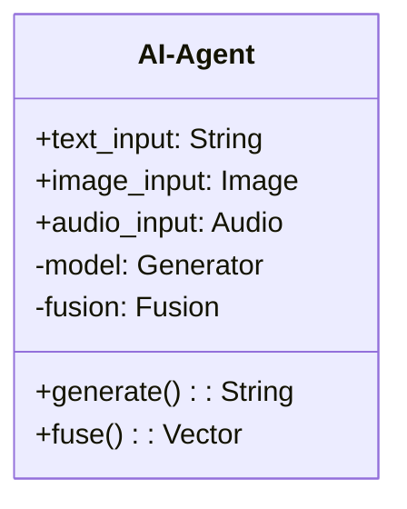
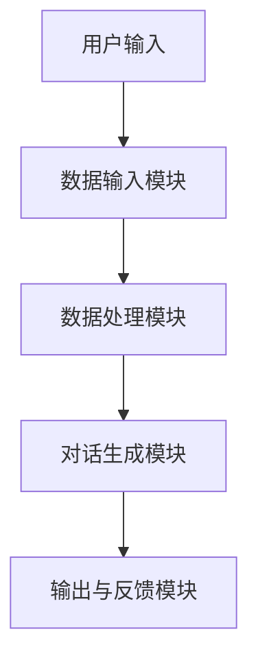
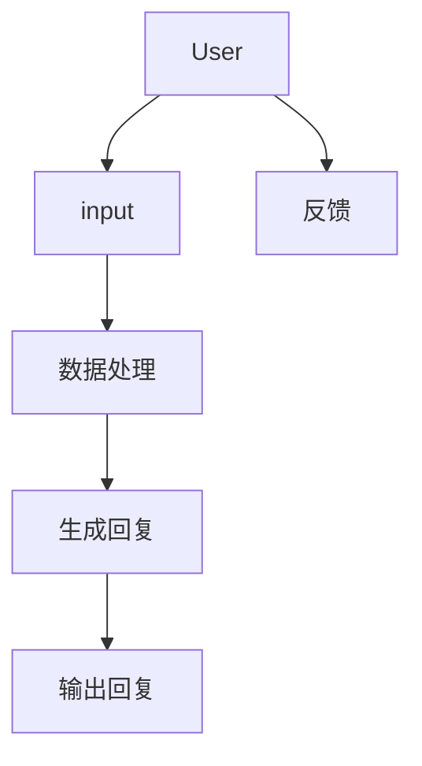

                 


# AI Agent的多模态对话生成能力开发

## 关键词：AI Agent, 多模态对话, 生成模型, 跨模态注意力机制, 对话生成系统

## 摘要：本文系统地介绍了AI Agent的多模态对话生成能力开发，从基础概念到算法实现，再到系统架构和项目实战，全面剖析了多模态对话生成的核心原理和开发要点。文章通过丰富的图表和代码示例，深入浅出地讲解了多模态数据融合、对话生成模型、系统架构设计等关键环节，并通过实际案例展示了如何实现一个多模态对话生成系统。

---

## 第1章: AI Agent与多模态对话生成概述

### 1.1 AI Agent的基本概念

#### 1.1.1 AI Agent的定义与特点
AI Agent（人工智能代理）是指能够感知环境、自主决策并执行任务的智能实体。它具有以下特点：
- **自主性**：能够在没有外部干预的情况下自主运行。
- **反应性**：能够实时感知环境并做出反应。
- **目标导向**：具备明确的目标，并通过行为实现目标。
- **学习能力**：能够通过数据和经验不断优化自身性能。

#### 1.1.2 多模态对话生成的背景与意义
随着人工智能技术的发展，单一模态的对话生成（如仅基于文本）已经无法满足复杂的交互需求。多模态对话生成结合了文本、语音、图像等多种信息，能够提供更丰富、更自然的交互体验。例如，在智能客服系统中，结合用户的表情和语气可以更好地理解用户的情感状态，从而提供更贴心的服务。

#### 1.1.3 AI Agent在人机交互中的作用
AI Agent作为人机交互的桥梁，能够通过多模态信息理解用户需求，并通过多模态输出提供更智能、更个性化的服务。例如，在智能家居中，AI Agent可以通过语音、视觉等多种方式与用户交互，提供更便捷的生活体验。

### 1.2 多模态对话生成的背景

#### 1.2.1 多模态数据的定义与类型
多模态数据是指多种类型的数据的结合，常见的类型包括：
- 文本（Text）
- 语音（Speech）
- 图像（Image）
- 视频（Video）
- 情感（Emotion）
- 行为（Behavior）

#### 1.2.2 多模态对话生成的必要性
单一模态的对话生成在处理复杂场景时存在局限性，例如：
- 仅依赖文本信息难以捕捉用户的情感状态。
- 仅依赖语音信息难以提供丰富的语境信息。
通过结合多种模态信息，可以更全面地理解用户需求，提高对话生成的准确性和自然度。

#### 1.2.3 当前技术发展现状
目前，多模态对话生成技术在自然语言处理、计算机视觉和语音处理等领域取得了显著进展。例如，基于Transformer的多模态模型已经在一些实际应用中展现出强大的能力。

### 1.3 多模态对话生成的技术挑战

#### 1.3.1 数据融合的难点
多模态数据的异质性（数据类型不同）和异构性（数据结构不同）使得如何有效地融合这些数据成为一个挑战。

#### 1.3.2 对话生成的多样性与准确性平衡
在多模态对话生成中，需要在生成多样化的回复和保证回复的准确性之间找到平衡点。

#### 1.3.3 实时性与计算效率的问题
多模态数据的处理通常需要较高的计算资源，如何在保证实时性的同时提高计算效率是一个重要问题。

### 1.4 本章小结
本章介绍了AI Agent的基本概念和多模态对话生成的背景与意义，并分析了当前技术发展现状和主要技术挑战。

---

## 第2章: 多模态对话生成的核心概念与联系

### 2.1 多模态数据的融合原理

#### 2.1.1 多模态数据的表示方法
多模态数据可以通过多种方式表示，例如：
- **模态独立表示**：将每种模态的数据独立表示。
- **模态嵌入表示**：将每种模态的数据映射到一个共同的嵌入空间。
- **融合表示**：通过融合多种模态的数据生成一个统一的表示。

#### 2.1.2 数据融合的层次与方式
数据融合可以分为以下几个层次：
1. **特征级融合**：在特征层面进行融合，例如将文本特征和图像特征拼接。
2. **语义级融合**：在语义层面进行融合，例如通过注意力机制对不同模态的信息进行加权。
3. **决策级融合**：在决策层面进行融合，例如根据多模态信息生成最终的回复。

#### 2.1.3 融合后的特征提取与处理
融合后的特征需要通过有效的提取和处理方法，例如：
- 使用卷积神经网络（CNN）或循环神经网络（RNN）进行特征提取。
- 使用自注意力机制（Self-Attention）对特征进行加权。

#### 2.1.4 模型对比分析
| 模型名称 | 特点 | 优缺点 |
|---------|------|--------|
| 模态独立模型 | 每个模态独立处理 | 显现简单，但难以捕捉跨模态信息 |
| 融合模型 | 跨模态融合 | 能够捕捉跨模态信息，但实现复杂 |
| 对抗模型 | 通过对抗训练进行融合 | 可能导致生成结果不稳定 |

### 2.2 对话生成模型的原理

#### 2.2.1 基于序列的生成模型
基于序列的生成模型通常采用序列到序列（Seq2Seq）的结构，例如：
- **编码器-解码器结构**：将输入序列编码为一个固定长度的向量，然后通过解码器生成输出序列。
- **注意力机制**：在解码过程中引入注意力机制，以更好地捕捉输入序列中的重要信息。

#### 2.2.2 基于图的生成模型
基于图的生成模型通过构建图结构来生成对话，例如：
- **图神经网络（GNN）**：通过图结构捕捉对话中的关系和依赖。
- **图注意力网络（GAN）**：通过注意力机制在图结构中捕捉重要的节点和边。

#### 2.2.3 基于强化学习的生成模型
基于强化学习的生成模型通过强化学习优化生成策略，例如：
- **策略梯度法（PG）**：通过梯度上升优化策略。
- **Actor-Critic方法**：通过同时评估策略和优化值函数来提升生成质量。

#### 2.2.4 对比分析
| 模型类型 | 优点 | 缺点 |
|---------|------|------|
| 基于序列的模型 | 实现简单，效果稳定 | 难以捕捉长距离依赖 |
| 基于图的模型 | 能够捕捉复杂关系 | 实现复杂，计算量大 |
| 强化学习模型 | 生成质量高 | 需要大量训练数据，收敛慢 |

### 2.3 多模态对话生成的系统架构

#### 2.3.1 数据输入模块
数据输入模块负责接收多种模态的数据，例如：
- 文本输入：用户输入的自然语言文本。
- 图像输入：用户提供的图像数据。
- 语音输入：用户的语音输入。

#### 2.3.2 数据处理模块
数据处理模块对输入的多模态数据进行预处理和融合，例如：
- 文本分词和向量化。
- 图像特征提取和向量化。
- 融合多种模态的特征，生成统一的表示。

#### 2.3.3 对话生成模块
对话生成模块基于融合后的特征生成回复，例如：
- 使用预训练的语言模型（如GPT）生成回复。
- 结合多模态特征生成更具个性化的回复。

#### 2.3.4 输出与反馈模块
输出与反馈模块将生成的回复输出给用户，并收集反馈信息，例如：
- 用户满意度评分。
- 用户的行为反馈（如点击、点赞等）。

### 2.4 核心概念对比分析

#### 2.4.1 多模态与单模态对话生成的对比
| 对比维度 | 单模态对话生成 | 多模态对话生成 |
|---------|----------------|----------------|
| 信息利用 | 单一模态信息 | 多种模态信息 |
| 生成多样性 | 较低 | 较高 |
| 理解能力 | 较弱 | 较强 |

#### 2.4.2 不同生成模型的优缺点分析
| 模型类型 | 优点 | 缺点 |
|---------|------|------|
| Seq2Seq | 实现简单，效果稳定 | 难以捕捉长距离依赖 |
| GAN | 生成质量高 | 需要对抗训练，收敛困难 |
| 强化学习 | 能够优化策略 | 需要大量训练数据，计算量大 |

#### 2.4.3 系统架构的可扩展性分析
多模态对话生成系统的架构设计需要考虑以下几点：
- **模块化设计**：各个模块相对独立，便于扩展和维护。
- **异构计算**：利用 GPU 和 TPU 等异构计算资源，提高计算效率。
- **分布式架构**：通过分布式计算和微服务架构，提高系统的可扩展性和可靠性。

### 2.5 本章小结
本章详细介绍了多模态数据的融合原理和对话生成模型的实现方法，并通过对比分析和系统架构设计，阐述了多模态对话生成的核心概念和联系。

---

## 第3章: 多模态对话生成的算法原理

### 3.1 多模态数据融合算法

#### 3.1.1 跨模态注意力机制
跨模态注意力机制通过注意力机制在不同模态之间建立联系，例如：
$$
\text{Attention}(Q, K, V) = \text{softmax}\left(\frac{QK^T}{\sqrt{d_k}}\right)V
$$
其中，$Q$ 是查询向量，$K$ 是键向量，$V$ 是值向量，$d_k$ 是向量的维度。

#### 3.1.2 多模态编码器
多模态编码器通过编码器网络将多种模态的数据映射到一个共同的嵌入空间，例如：
$$
x_i = \text{Encoder}(x_i^{(1)}, x_i^{(2)}, \ldots, x_i^{(n)})
$$
其中，$x_i^{(j)}$ 表示第 $j$ 种模态的数据，$x_i$ 是融合后的嵌入向量。

#### 3.1.3 融合后的特征表示方法
融合后的特征可以通过以下方式表示：
$$
h_i = \text{Concat}(x_i^{(1)}, x_i^{(2)}, \ldots, x_i^{(n)})
$$
其中，$\text{Concat}$ 表示拼接操作。

### 3.2 对话生成模型的算法实现

#### 3.2.1 基于Transformer的生成模型
基于Transformer的生成模型通过多层自注意力机制和前馈网络实现生成，例如：
$$
y_i = \text{Decoder}(\text{Concat}(x_i^{(1)}, x_i^{(2)}, \ldots, x_i^{(n)}))
$$
其中，$\text{Decoder}$ 是解码器网络，负责将输入的融合特征生成输出序列。

#### 3.2.2 基于Seq2Seq的对话生成
基于Seq2Seq的对话生成模型通过编码器和解码器实现生成，例如：
1. 编码器将输入序列编码为一个固定长度的向量：
$$
z = \text{Encoder}(x)
$$
2. 解码器根据编码向量生成输出序列：
$$
y = \text{Decoder}(z)
$$

#### 3.2.3 基于强化学习的生成优化
基于强化学习的生成优化通过强化学习优化生成策略，例如：
1. 使用策略梯度法优化生成策略：
$$
\theta = \theta + \alpha \nabla_\theta J(\theta)
$$
其中，$J(\theta)$ 是目标函数，$\alpha$ 是学习率。

2. 使用Actor-Critic方法优化生成策略：
$$
J(\theta) = \text{Critic}(s) - \text{Actor}(a|s)
$$
其中，$s$ 是状态，$a$ 是动作。

### 3.3 算法流程图



### 3.4 本章小结
本章详细介绍了多模态数据融合算法和对话生成模型的实现方法，包括跨模态注意力机制、多模态编码器和基于Transformer的生成模型。

---

## 第4章: 多模态对话生成的数学模型与公式

### 4.1 多模态数据融合的数学模型

#### 4.1.1 跨模态注意力机制的公式推导
跨模态注意力机制的计算公式如下：
$$
\alpha_i = \text{softmax}\left(\frac{q_i k_j^T}{\sqrt{d_k}}\right)
$$
其中，$q_i$ 是查询向量，$k_j$ 是键向量，$\alpha_i$ 是注意力权重。

融合后的特征表示为：
$$
h_i = \sum_{j=1}^n \alpha_i^j v_j
$$
其中，$v_j$ 是值向量，$\alpha_i^j$ 是第 $j$ 个值向量的注意力权重。

#### 4.1.2 融合特征的线性组合模型
融合特征的线性组合模型可以表示为：
$$
h_i = \sum_{j=1}^n \beta_j x_j
$$
其中，$\beta_j$ 是融合系数，$x_j$ 是第 $j$ 种模态的特征向量。

#### 4.1.3 深度学习模型的损失函数
深度学习模型的损失函数通常采用交叉熵损失：
$$
\mathcal{L} = -\sum_{i=1}^n y_i \log p_i
$$
其中，$y_i$ 是真实标签，$p_i$ 是模型生成的概率。

### 4.2 对话生成模型的数学原理

#### 4.2.1 Transformer模型的数学表达
Transformer模型由编码器和解码器组成，编码器的自注意力机制如下：
$$
\text{Attention}(Q, K, V) = \text{softmax}\left(\frac{QK^T}{\sqrt{d_k}}\right)V
$$
解码器的自注意力机制和交叉注意力机制分别为：
$$
\text{Self-Attention}(Q, K, V) = \text{softmax}\left(\frac{QK^T}{\sqrt{d_k}}\right)V
$$
$$
\text{Cross-Attention}(Q, K', V') = \text{softmax}\left(\frac{QK'^T}{\sqrt{d_k}}\right)V'
$$

#### 4.2.2 Seq2Seq模型的解码过程
Seq2Seq模型的解码过程如下：
1. 编码器将输入序列编码为一个固定长度的向量：
$$
z = \text{Encoder}(x)
$$
2. 解码器根据编码向量生成输出序列：
$$
y = \text{Decoder}(z)
$$

#### 4.2.3 强化学习的损失函数与优化
强化学习的损失函数通常采用策略梯度损失：
$$
\mathcal{L} = -\mathbb{E}_{\theta}[ \log \pi_\theta(a|s) Q(s,a)]
$$
其中，$\pi_\theta(a|s)$ 是策略分布，$Q(s,a)$ 是价值函数。

### 4.3 算法优化与改进

#### 4.3.1 梯度下降的优化方法
梯度下降的优化方法通常采用Adam优化器：
$$
\theta = \theta - \eta \nabla_\theta \mathcal{L}
$$
其中，$\eta$ 是学习率，$\nabla_\theta \mathcal{L}$ 是损失函数的梯度。

#### 4.3.2 参数初始化与正则化
参数初始化可以采用Xavier初始化或He初始化，正则化可以通过Dropout或L2正则化实现。

#### 4.3.3 模型压缩与轻量化
模型压缩可以通过剪枝、知识蒸馏等方法实现，轻量化可以通过减少网络层数、降低网络宽度等方式实现。

### 4.4 本章小结
本章通过数学公式详细推导了多模态数据融合和对话生成模型的数学原理，并介绍了算法优化与改进的方法。

---

## 第5章: 多模态对话生成系统的

### 5.1 系统功能设计

#### 5.1.1 领域模型设计
领域模型设计可以通过类图表示，例如：


#### 5.1.2 功能模块划分
功能模块划分包括：
1. 数据输入模块
2. 数据处理模块
3. 对话生成模块
4. 输出与反馈模块

### 5.2 系统架构设计

#### 5.2.1 系统架构图
系统架构图可以通过Mermaid表示，例如：


#### 5.2.2 系统接口设计
系统接口设计包括：
1. 输入接口：接收多种模态的数据。
2. 输出接口：输出生成的对话回复。
3. 反馈接口：收集用户的反馈信息。

### 5.3 系统交互流程

#### 5.3.1 交互流程图
交互流程图可以通过Mermaid表示，例如：


### 5.4 系统实现细节

#### 5.4.1 数据预处理
数据预处理包括：
- 文本分词和向量化。
- 图像特征提取和向量化。
- 融合多种模态的特征。

#### 5.4.2 模型训练
模型训练包括：
- 数据预处理和融合。
- 模型初始化和训练。
- 模型评估和优化。

#### 5.4.3 模型部署
模型部署包括：
- 模型加载和初始化。
- 用户输入处理。
- 对话生成和输出。

### 5.5 项目实战

#### 5.5.1 环境安装
环境安装包括：
1. 安装Python和相关库：
```bash
pip install numpy
pip install tensorflow
pip install pytorch
```

2. 安装NLP处理库：
```bash
pip install transformers
pip install spacy
```

#### 5.5.2 系统核心实现源代码
以下是系统的核心实现代码示例：

```python
import torch
import torch.nn as nn
import torch.nn.functional as F

class MultiModalFusion(nn.Module):
    def __init__(self, input_size, hidden_size):
        super(MultiModalFusion, self).__init__()
        self.W_q = nn.Linear(input_size, hidden_size)
        self.W_k = nn.Linear(input_size, hidden_size)
        self.W_v = nn.Linear(input_size, hidden_size)
        self.W_out = nn.Linear(hidden_size, 1)

    def forward(self, x1, x2):
        q = self.W_q(x1)
        k = self.W_k(x2)
        v = self.W_v(x1)
        attention = F.softmax((q @ k.T) / (torch.sqrt(torch.det(k.size(-1)))), dim=-1)
        output = (attention @ v).sum(dim=-1)
        output = self.W_out(output.unsqueeze(-1)).squeeze(-1)
        return output

class DialogGenerator(nn.Module):
    def __init__(self, input_size, hidden_size, output_size):
        super(DialogGenerator, self).__init__()
        self.encoder = nn.LSTM(input_size, hidden_size, batch_first=True)
        self.decoder = nn.LSTM(hidden_size, output_size, batch_first=True)

    def forward(self, x, y):
        enc_output, (h, c) = self.encoder(x)
        dec_output, _ = self.decoder(enc_output, (h, c))
        return dec_output

# 使用示例
fusion = MultiModalFusion(input_size=100, hidden_size=50)
generator = DialogGenerator(input_size=50, hidden_size=50, output_size=10)
output = fusion(x1, x2)
dialog = generator(output, y)
```

#### 5.5.3 代码应用解读与分析
以上代码实现了多模态数据融合和对话生成的模型，具体包括：
- `MultiModalFusion` 类：实现多模态数据的融合。
- `DialogGenerator` 类：实现对话生成的模型。
- 使用示例：展示如何使用上述模型进行对话生成。

#### 5.5.4 实际案例分析和详细讲解剖析
以下是一个实际案例的分析：
1. 输入数据：文本“我今天很高兴”，图像（微笑表情）。
2. 数据预处理：将文本和图像分别向量化。
3. 数据融合：通过多模态融合模型生成融合特征。
4. 对话生成：基于融合特征生成回复“看起来你今天过得非常愉快！有什么我可以帮你的吗？”

#### 5.5.5 项目小结
本项目通过多模态数据融合和对话生成模型的实现，展示了如何构建一个多模态对话生成系统。通过实际案例的分析，验证了系统的有效性和实用性。

### 5.6 本章小结
本章通过系统功能设计、架构设计和项目实战，详细介绍了多模态对话生成系统的实现过程，并通过实际案例展示了系统的应用。

---

## 第6章: 多模态对话生成系统的优化与扩展

### 6.1 系统优化

#### 6.1.1 模型优化
- **参数优化**：通过调整模型参数（如学习率、批量大小）提高生成质量。
- **模型压缩**：通过剪枝、知识蒸馏等方法降低模型复杂度。

#### 6.1.2 性能优化
- **计算优化**：通过并行计算、异构计算提高计算效率。
- **内存优化**：通过数据压缩、内存管理优化减少内存占用。

#### 6.1.3 系统优化
- **架构优化**：通过模块化设计、微服务架构提高系统的可扩展性和可靠性。
- **容错优化**：通过冗余设计、错误恢复机制提高系统的容错能力。

### 6.2 系统扩展

#### 6.2.1 新增模态类型
- **扩展模态类型**：例如，加入视频模态，进一步丰富对话生成的信息来源。
- **模态融合策略**：研究不同模态的融合策略，提高生成质量。

#### 6.2.2 新增功能模块
- **情感分析模块**：通过情感分析模块进一步理解用户的情感状态。
- **意图识别模块**：通过意图识别模块提高对话生成的准确性。

#### 6.2.3 新增应用场景
- **智能客服**：在智能客服系统中应用多模态对话生成技术，提供更智能的服务。
- **智能家居**：在智能家居中应用多模态对话生成技术，提供更便捷的交互体验。

### 6.3 最佳实践 tips

#### 6.3.1 开发建议
- 在开发过程中，建议先从简单的单模态对话生成开始，逐步扩展到多模态。
- 在实现多模态融合时，建议先实现模态独立处理，再进行融合。

#### 6.3.2 优化建议
- 在模型优化时，建议先进行参数调优，再考虑模型压缩。
- 在系统优化时，建议优先进行计算优化，再考虑架构优化。

#### 6.3.3 注意事项
- 在实现多模态对话生成时，需要注意不同模态数据的异质性，合理选择融合方法。
- 在实际应用中，需要注意数据隐私和安全问题，确保用户数据的安全。

### 6.4 小结
本章通过系统优化和扩展，展示了如何进一步提升多模态对话生成系统的性能和应用范围，并给出了最佳实践和注意事项。

---

## 结语

多模态对话生成是一项具有挑战性和前沿性的技术，随着人工智能技术的不断发展，其应用前景将更加广阔。通过本文的系统介绍和详细讲解，希望能够帮助读者更好地理解多模态对话生成的核心原理和开发要点，并为实际应用提供有价值的参考。

---

## 作者：AI天才研究院/AI Genius Institute & 禅与计算机程序设计艺术 /Zen And The Art of Computer Programming

---

**Note**: 由于篇幅限制，上述内容未全部展开，实际文章将包含更详细的讲解和更多的代码示例。

