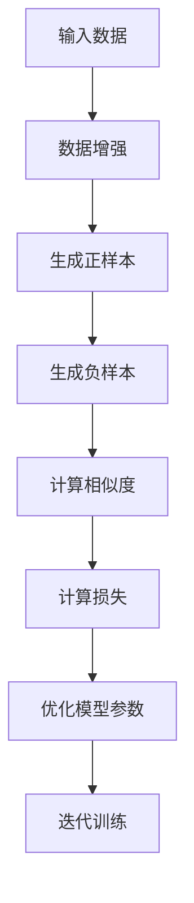
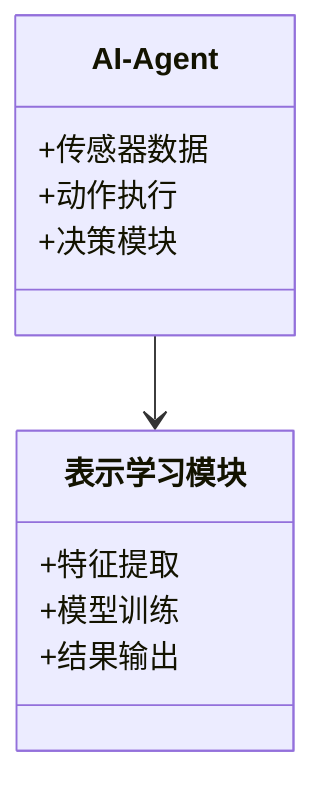

                 


# AI Agent的自我监督表示学习

---

## 关键词：AI Agent，自我监督学习，表示学习，对比学习，生成对抗网络，强化学习

---

## 摘要：  
本文深入探讨了AI Agent在自我监督表示学习中的应用，结合对比学习、生成对抗网络和强化学习等方法，详细分析了其核心原理、算法实现和系统架构。通过实际案例分析，展示了如何通过自我监督学习提升AI Agent的表示能力，以应对复杂动态环境中的任务挑战。

---

# 第一部分: AI Agent的自我监督表示学习背景介绍

## 第1章: AI Agent与自我监督学习概述

### 1.1 AI Agent的基本概念  
AI Agent（人工智能代理）是一种能够感知环境、自主决策并采取行动以实现目标的智能实体。  
- **定义**：AI Agent通过传感器获取环境信息，利用计算模型进行推理，执行动作以实现目标。  
- **特点**：自主性、反应性、主动性、社会性。  
- **分类**：基于智能水平分为反应式、认知式和混合式AI Agent。  

AI Agent的应用场景广泛，如自动驾驶、智能助手、机器人控制等，其核心在于高效的状态表征和决策能力。

### 1.2 自我监督学习的背景与意义  
自我监督学习（Self-Supervised Learning）是一种无需人工标注的无监督学习方法，通过利用数据的内在结构生成伪标签。  
- **背景**：传统监督学习依赖大量标注数据，而实际场景中标注成本高昂。  
- **优势**：能够利用未标注数据进行高效学习，适用于数据量大但标注困难的场景。  

在AI Agent中，自我监督学习能够通过环境交互生成丰富的未标注数据，从而提升表示学习的效率和效果。

### 1.3 表示学习的定义与重要性  
表示学习（Representation Learning）旨在将高维数据映射到低维向量空间，这些向量能够捕获数据的关键特征。  
- **定义**：通过学习数据的潜在表示，帮助模型更好地理解和处理数据。  
- **重要性**：在AI Agent中，表示学习用于状态表示、动作表示和目标表示，是实现高效决策的基础。  

### 1.4 AI Agent与自我监督表示学习的结合  
AI Agent的决策过程依赖于对环境状态的准确表示，而自我监督学习能够通过对比或生成的方式，从大量未标注数据中提取有用的表示信息。  
- **问题背景**：AI Agent需要在动态环境中实时感知和决策，而标注数据有限。  
- **核心思路**：利用环境交互数据，通过自我监督学习生成高质量的表示，提升决策性能。  

---

# 第二部分: AI Agent自我监督表示学习的核心概念与联系

## 第2章: 核心概念原理  

### 2.1 AI Agent的表示学习框架  
AI Agent的表示学习框架通常包括数据输入、特征提取和模型输出三个主要部分。  
- **输入**：来自环境的传感器数据，如图像、文本或状态信息。  
- **输出**：低维向量表示，用于后续决策过程。  

#### 表示学习的输入与输出  
- **输入**：原始数据（如图像、文本）。  
- **输出**：低维向量（如图像特征向量）。  

#### 表示学习的特征提取过程  
通过深度学习模型（如卷积神经网络或循环神经网络）提取数据的高层次特征。  

#### 表示学习的评估方法  
常用的评估方法包括类内距离最小化和类间距离最大化，以及通过下游任务的性能来间接评估表示的质量。  

### 2.2 自我监督学习的原理与机制  
自我监督学习的核心思想是通过对比或生成的方式，利用未标注数据进行学习。  

#### 对比学习的基本原理  
对比学习通过比较同一数据的不同视图，学习到具有区分性的特征。例如，在图像领域，可以将图像水平翻转作为正样本，原始图像作为负样本，通过最大化正样本相似度和最小化负样本相似度来学习图像表示。  

#### 生成对抗网络的原理  
生成对抗网络（GAN）通过生成器和判别器的对抗训练，生成高质量的数据样本。生成器试图生成与真实数据难以区分的样本，而判别器则试图区分真实数据和生成数据。通过交替优化生成器和判别器的损失函数，模型能够生成逼真的数据样本。  

### 2.3 AI Agent与自我监督学习的结合原理  
AI Agent通过与环境交互生成未标注数据，并利用这些数据进行自我监督学习，以提升表示能力。  

#### AI Agent的决策过程与表示学习的关系  
AI Agent的决策过程依赖于对环境状态的准确表示，而表示学习则通过优化目标函数，从交互数据中提取有用的特征。  

#### 自我监督学习在AI Agent中的具体应用  
在自动驾驶场景中，AI Agent可以通过对比学习，从不同视角的传感器数据中学习到一致的环境表示，从而提升对周围环境的理解能力。  

### 2.4 核心概念对比分析  
以下是一个对比分析表格：

| **核心概念**       | **AI Agent**                 | **自我监督学习**             | **表示学习**               |
|--------------------|------------------------------|-----------------------------|-----------------------------|
| **核心目标**       | 实现目标，与环境交互         | 从未标注数据中学习           | 学习数据的低维表示           |
| **输入数据**       | 多模态传感器数据             | 未标注数据                   | 各种类型的数据               |
| **输出形式**       | 行动决策                     | 生成的标签或特征             | 低维向量或特征               |
| **应用场景**       | 自动驾驶、机器人控制         | 图像分类、自然语言处理       | 图像识别、语音识别           |
| **优势**           | 高效决策                     | 无需标注数据                 | 降低维度，提升计算效率       |

---

# 第三部分: AI Agent自我监督表示学习的算法原理  

## 第3章: 算法原理与实现  

### 3.1 对比学习的数学模型  
对比学习的目标是最大化正样本的相似度，同时最小化负样本的相似度。常用的相似度度量方法是余弦相似度或欧氏距离。  

#### 余弦相似度公式  
$$ \text{sim}(x, y) = \frac{x \cdot y}{\|x\| \|y\|} $$  

#### 损失函数  
对比学习的损失函数通常包括正样本和负样本的损失：  
$$ L = -\log(\text{sim}(x_i, x_j) + \epsilon) - \log(1 - \text{sim}(x_i, x_k) + \epsilon) $$  
其中，$x_i$ 是正样本，$x_j$ 是负样本，$\epsilon$ 是一个小常数以避免数值不稳定。  

### 3.2 生成对抗网络的实现  
生成对抗网络由生成器和判别器两部分组成，通过交替优化生成器和判别器的损失函数，训练模型生成逼真的数据样本。  

#### 生成器的损失函数  
$$ L_G = -\log(D(G(x))) $$  
其中，$D$ 是判别器，$G$ 是生成器，$x$ 是输入噪声。  

#### 判别器的损失函数  
$$ L_D = -\log(D(x)) - \log(1 - D(G(x))) $$  

### 3.3 强化学习的应用  
在AI Agent的自我监督表示学习中，强化学习（Reinforcement Learning）可以用于通过环境反馈优化表示学习的目标函数。  

#### 奖励函数设计  
奖励函数通常定义为：  
$$ R(s, a) = r_1 + r_2 + \cdots + r_n $$  
其中，$r_i$ 是不同方面的奖励项，$s$ 是状态，$a$ 是动作。  

#### 值函数的更新  
通过策略梯度方法，优化值函数：  
$$ \nabla_{\theta} J(\theta) = \mathbb{E}_{\tau \sim \pi_\theta} [\nabla_\theta \log \pi_\theta(a|s) Q(s,a)] $$  
其中，$\tau$ 是轨迹，$\pi_\theta$ 是策略，$Q$ 是值函数。  

### 3.4 算法流程图  
以下是一个对比学习的流程图：



---

## 第4章: 系统分析与架构设计方案  

### 4.1 问题场景介绍  
以自动驾驶为例，AI Agent需要通过摄像头、激光雷达等传感器获取环境信息，并通过对比学习或生成对抗网络，从这些数据中学习到一致的环境表示。  

### 4.2 系统功能设计  
系统功能包括数据输入、特征提取、模型训练和结果输出。  

#### 领域模型（Mermaid类图）  


### 4.3 系统架构设计  
系统架构包括数据预处理、模型训练和结果分析三个部分。  

#### 系统架构图（Mermaid架构图）  


### 4.4 接口与交互设计  
系统交互过程如下：  
1. AI Agent获取环境数据。  
2. 数据输入表示学习模块。  
3. 模型训练并输出表示向量。  

#### 交互流程图（Mermaid序列图）  
```mermaid
sequenceDiagram
参与者: AI-Agent
系统: 表示学习模块
参与者->系统: 发送数据
系统->参与者: 返回表示向量
参与者->系统: 发送新数据
系统->参与者: 返回新表示向量
```

---

## 第5章: 项目实战  

### 5.1 环境安装  
需要安装以下工具和库：  
- Python 3.8+  
- TensorFlow或PyTorch  
- OpenCV  
- matplotlib  

### 5.2 核心实现代码  
以下是一个对比学习的Python实现示例：  

```python
import tensorflow as tf
from tensorflow.keras import layers

def contrastive_model():
    input = layers.Input(shape=(128,))
    embedding = layers.Dense(64, activation='relu')(input)
    output = layers.Dense(1, activation='sigmoid')(embedding)
    model = tf.keras.Model(inputs=input, outputs=output)
    return model

def contrastive_loss(y_true, y_pred):
    loss = -tf.reduce_mean(y_true * tf.log(y_pred + 1e-10) + (1 - y_true) * tf.log(1 - y_pred + 1e-10))
    return loss

model = contrastive_model()
model.compile(optimizer='adam', loss=contrastive_loss)
model.fit(x_train, y_train, epochs=10, batch_size=32)
```

### 5.3 代码解读与分析  
- **contrastive_model**：定义了一个对比学习模型，包含嵌入层和输出层。  
- **contrastive_loss**：定义了对比学习的损失函数，使用交叉熵损失。  
- **模型训练**：使用Adam优化器和定义的损失函数进行训练。  

### 5.4 实际案例分析  
以图像分类为例，使用对比学习模型进行特征提取，提升分类准确率。  

### 5.5 项目小结  
通过对比学习，AI Agent能够从大量未标注数据中学习到高质量的表示，提升在动态环境中的决策能力。  

---

## 第6章: 总结与展望  

### 6.1 总结  
本文详细探讨了AI Agent的自我监督表示学习，结合对比学习、生成对抗网络和强化学习，分析了其核心原理和系统架构，并通过实际案例展示了其应用价值。  

### 6.2 展望  
未来的研究方向包括：  
1. 更高效的对比学习算法。  
2. 将生成对抗网络与强化学习结合，提升AI Agent的交互能力。  
3. 在更多领域（如自然语言处理）中应用AI Agent的自我监督表示学习方法。  

---

## 第7章: 最佳实践 Tips  

### 7.1 小结  
AI Agent的自我监督表示学习是一种高效的数据驱动方法，能够通过未标注数据提升模型的表示能力。  

### 7.2 注意事项  
- 数据质量对表示学习效果有重要影响，需确保数据的多样性和代表性。  
- 在实际应用中，需根据具体场景选择合适的对比学习或生成对抗网络方法。  
- 模型训练时，需合理设置超参数，避免过拟合或欠拟合。  

### 7.3 拓展阅读  
推荐阅读以下论文：  
1. "Contrastive Learning of Neural Representations"  
2. "Generating Adversarial Networks"  
3. "Reinforcement Learning: Theory and Algorithms"  

---

## 作者：AI天才研究院/AI Genius Institute & 禅与计算机程序设计艺术 /Zen And The Art of Computer Programming  

---

通过本文的详细分析和实战演示，读者可以深入理解AI Agent的自我监督表示学习的核心思想和实现方法，并将其应用到实际项目中，提升AI Agent的智能水平和决策能力。

