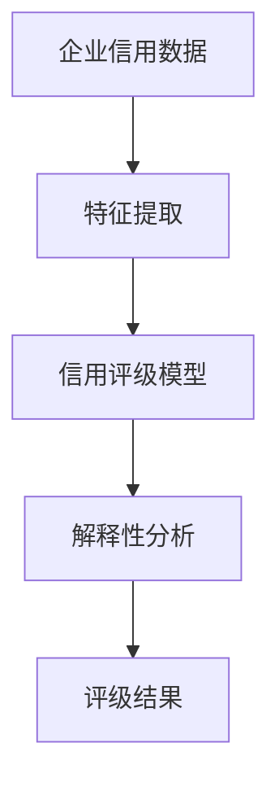
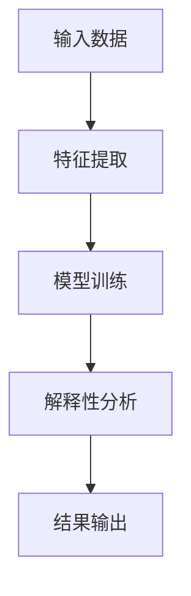
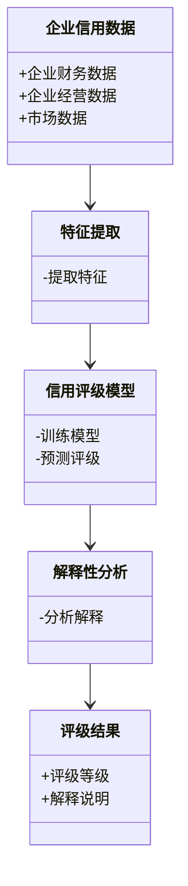
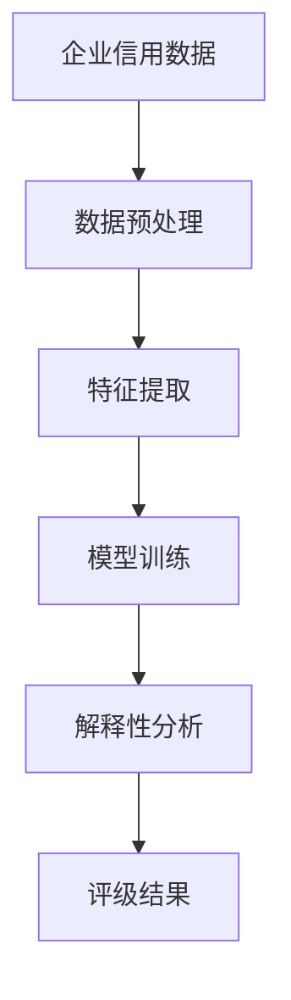
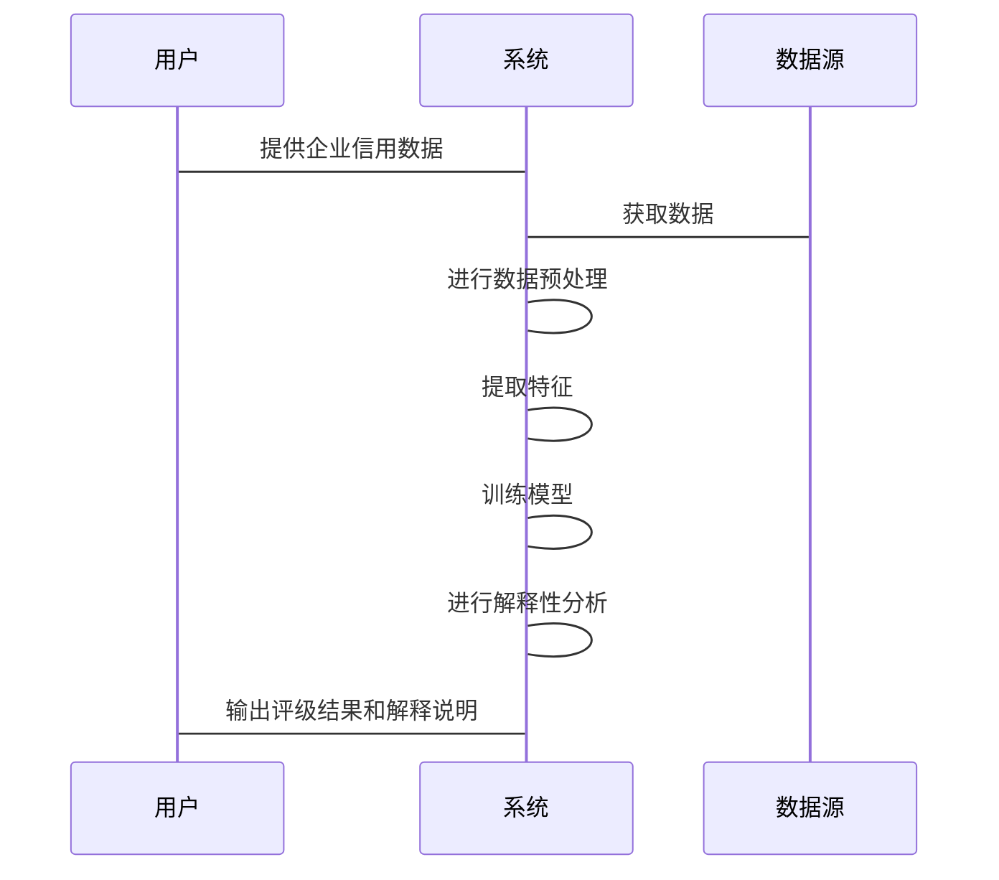

                 


# AI驱动的企业信用评级模型可解释性增强系统

---

## 关键词
企业信用评级，可解释性增强系统，AI驱动，模型可解释性，信用评估，系统架构

---

## 摘要
企业信用评级是金融领域的重要决策工具，但传统方法往往缺乏透明度和可解释性。随着人工智能技术的快速发展，基于AI的企业信用评级模型逐渐成为主流。然而，这些模型的复杂性导致了可解释性的不足，限制了其在实际应用中的信任度和合规性。本文提出了一种基于AI的可解释性增强系统，旨在提高企业信用评级模型的透明度和可解释性。通过结合先进的解释性算法、系统架构设计和实际案例分析，本文详细探讨了如何构建一个高效、可信赖的企业信用评级系统。

---

# 第1章: 企业信用评级与可解释性概述

## 1.1 企业信用评级的背景与意义
### 1.1.1 企业信用评级的定义与作用
企业信用评级是通过对企业的财务状况、经营能力和市场表现等多方面因素的综合评估，确定其信用风险等级的过程。信用评级结果直接影响企业的融资成本、投资决策以及银行贷款等重要金融活动。随着全球经济的复杂化和企业经营环境的不确定性增加，信用评级的重要性日益凸显。

### 1.1.2 传统信用评级的局限性
传统信用评级方法主要依赖于经验丰富的分析师对企业财务报表和经营状况的主观判断。这种方法不仅耗时耗力，而且容易受到人为因素的影响，导致评级结果的不一致性和不透明性。此外，传统方法难以处理海量数据和复杂关系，难以适应现代金融市场的动态变化。

### 1.1.3 可解释性在信用评级中的重要性
可解释性是信用评级系统的核心要求之一。金融机构需要通过评级结果做出决策，而缺乏可解释性的评级结果难以被决策者理解和信任。此外，可解释性还满足了监管合规的要求，尤其是在金融行业，透明性和可追溯性是合规的重要指标。

## 1.2 AI在信用评级中的应用现状
### 1.2.1 AI技术在信用评级中的优势
人工智能技术的快速发展为信用评级带来了新的可能性。通过机器学习算法，可以快速处理海量数据，发现传统方法难以察觉的模式和关系。AI还可以实时更新模型，适应市场变化，提高评级的准确性和及时性。

### 1.2.2 当前AI信用评级模型的挑战
尽管AI在信用评级中表现出色，但其模型的复杂性导致了可解释性的不足。许多深度学习模型被视为“黑箱”，难以解释其输出结果的原因。这种不可解释性限制了AI信用评级模型在实际应用中的信任度和合规性。

### 1.2.3 可解释性增强系统的必要性
可解释性增强系统的目的是在保持模型高性能的同时，提高其透明度和可解释性。通过可解释性增强系统，用户可以理解模型的决策过程，增强对评级结果的信任，同时满足监管要求。

## 1.3 本书的研究目标与内容框架
### 1.3.1 本书的研究目标
本书旨在提出一种基于AI的可解释性增强系统，解决企业信用评级模型中可解释性不足的问题。通过结合先进的解释性算法和系统架构设计，本书将提供一种高效、透明的企业信用评级解决方案。

### 1.3.2 本书的主要内容框架
本书将从理论到实践，系统地介绍可解释性增强系统的构建过程。主要内容包括：企业信用评级的背景与意义、可解释性增强系统的核心概念、基于AI的可解释性增强算法、系统的架构设计、项目实战案例分析以及最佳实践和小结。

### 1.3.3 本书的创新点
本书的创新点在于将可解释性增强技术与企业信用评级相结合，提出了一种新的系统架构和算法实现。通过结合机器学习和知识图谱技术，本书提出了一种更加透明和可信赖的信用评级解决方案。

---

# 第2章: 可解释性增强系统的核心概念

## 2.1 可解释性增强系统的定义与特征
### 2.1.1 可解释性增强系统的定义
可解释性增强系统是指通过技术手段，提高AI模型的决策过程的透明度和可理解性，使用户能够理解模型输出结果的原因和逻辑。

### 2.1.2 可解释性增强系统的属性特征对比表
| 特性 | 可解释性增强系统 | 传统AI模型 |
|------|------------------|------------|
| 解释性 | 高               | 低         |
| 透明度 | 高               | 低         |
| 可信赖性 | 高               | 中         |
| 性能 | 高               | 高         |

### 2.1.3 系统的核心要素组成
可解释性增强系统的核心要素包括：特征提取、模型训练、解释性分析和结果输出。系统通过这些要素的协同工作，实现对企业信用评级的可解释性增强。

## 2.2 企业信用评级模型的可解释性需求
### 2.2.1 信用评级模型的可解释性维度
企业信用评级模型的可解释性可以从多个维度进行衡量，包括模型的输入特征、决策逻辑、输出结果的原因等。

### 2.2.2 不同场景下的可解释性要求
在实际应用中，不同场景对可解释性的要求有所不同。例如，在银行贷款审批中，需要对评级结果进行详细解释，以满足监管要求；而在企业内部决策中，可能更关注模型的准确性和高效性。

### 2.2.3 可解释性与模型性能的平衡
可解释性增强系统需要在模型的可解释性和性能之间找到平衡。过于强调可解释性可能导致模型性能下降，而过于追求性能则可能失去可解释性。

## 2.3 可解释性增强系统的实体关系图
### 2.3.1 实体关系图的构建
通过构建实体关系图，可以清晰地展示可解释性增强系统中各实体之间的关系。



### 2.3.2 关键实体及其关系描述
- **企业信用数据**：包括企业的财务数据、经营数据、市场数据等。
- **特征提取**：将企业信用数据转化为模型可识别的特征。
- **信用评级模型**：基于特征的机器学习模型，输出信用评级结果。
- **解释性分析**：对模型输出结果进行解释，提供可理解的原因和逻辑。
- **评级结果**：最终的信用评级结果，包括评级等级和解释说明。

### 2.3.3 系统的扩展性分析
通过可解释性增强系统，可以方便地扩展模型的功能，例如增加新的特征、优化解释性算法等。

---

# 第3章: 基于可解释性增强的AI算法

## 3.1 可解释性增强算法的原理
### 3.1.1 解释性模型的分类
解释性模型可以分为基于规则的解释方法和基于模型的解释方法。

### 3.1.2 基于规则的解释方法
基于规则的解释方法通过预定义的规则来解释模型的输出。例如，可以通过决策树的规则路径来解释模型的决策过程。

### 3.1.3 基于模型的解释方法
基于模型的解释方法通过模型本身的结构和参数来解释输出结果。例如，线性回归模型的系数可以直接解释变量对结果的影响。

## 3.2 增强可解释性的AI算法实现
### 3.2.1 算法流程图
通过Mermaid流程图，可以清晰地展示算法的实现过程。



### 3.2.2 算法实现的Python代码示例
以下是一个简单的Python代码示例，展示了可解释性增强算法的实现。

```python
def explainable_model(data):
    features = extract_features(data)
    prediction = model.predict(features)
    explanation = interpret_prediction(prediction)
    return explanation
```

### 3.2.3 算法实现的数学模型和公式
通过数学公式，可以进一步理解算法的实现原理。例如，线性回归模型的解释性可以通过以下公式实现：

$$ y = \beta_0 + \beta_1x_1 + \beta_2x_2 + \dots + \beta_nx_n $$

其中，$\beta_i$ 表示各特征对模型输出的影响程度。

---

# 第4章: 系统分析与架构设计

## 4.1 系统分析
### 4.1.1 问题场景介绍
企业信用评级系统需要处理海量数据，包括企业的财务数据、市场数据、经营数据等。

### 4.1.2 系统功能设计
通过Mermaid类图，可以展示系统的功能设计。



### 4.1.3 系统架构设计
通过Mermaid架构图，可以展示系统的整体架构。



### 4.1.4 系统接口设计
系统接口设计包括数据输入接口、模型训练接口、解释性分析接口和结果输出接口。

### 4.1.5 系统交互流程
通过Mermaid序列图，可以展示系统的交互流程。



---

# 第5章: 项目实战

## 5.1 环境安装
### 5.1.1 安装Python和相关库
需要安装以下Python库：scikit-learn、xgboost、shap、mermaid、pylatex。

### 5.1.2 安装开发环境
推荐使用Jupyter Notebook作为开发环境，方便数据处理和模型训练。

## 5.2 系统核心实现
### 5.2.1 数据预处理
对企业信用数据进行清洗、归一化和特征工程处理。

### 5.2.2 模型训练
使用机器学习算法（如XGBoost）对模型进行训练，并保存模型参数。

### 5.2.3 解释性分析
使用SHAP（Shapley Additive exPlanations）等解释性工具对模型输出进行分析。

## 5.3 代码实现与解读
### 5.3.1 数据预处理代码
```python
import pandas as pd
from sklearn.preprocessing import StandardScaler

# 读取数据
data = pd.read_csv('enterprise_credit_data.csv')

# 数据清洗
data.dropna(inplace=True)

# 特征工程
features = data[['revenue', 'profit', 'debt', 'market_share']]
target = data['credit_rating']

# 归一化处理
scaler = StandardScaler()
features_scaled = scaler.fit_transform(features)
```

### 5.3.2 模型训练代码
```python
from xgboost import XGBClassifier
from sklearn.metrics import accuracy_score

# 训练模型
model = XGBClassifier()
model.fit(features_scaled, target)
```

### 5.3.3 解释性分析代码
```python
import shap

# 计算SHAP值
explainer = shap.TreeExplainer(model)
shap_values = explainer.shap_values(features_scaled)

# 可视化解释
shap.summary_plot(shap_values, features, plot_type='bar')
```

## 5.4 案例分析与实际应用
### 5.4.1 实际案例分析
通过一个实际案例，展示系统的运行过程和结果。

### 5.4.2 系统性能分析
对系统的性能进行分析，包括模型的准确率、解释性分析的效率等。

## 5.5 项目小结
总结项目的主要成果和经验教训，提出改进建议。

---

# 第6章: 最佳实践与小结

## 6.1 最佳实践
### 6.1.1 数据处理建议
数据预处理是模型训练的基础，建议对数据进行充分清洗和特征工程处理。

### 6.1.2 模型选择建议
根据具体场景选择合适的模型，并在模型性能和可解释性之间找到平衡。

### 6.1.3 解释性分析建议
使用SHAP等工具进行解释性分析，帮助理解模型的决策过程。

## 6.2 小结
通过本文的介绍，读者可以了解如何构建一个基于AI的可解释性增强系统，并将其应用于企业信用评级。系统通过结合先进的解释性算法和系统架构设计，实现了高效、透明的信用评级解决方案。

## 6.3 注意事项
在实际应用中，需要注意数据隐私和安全问题，确保系统的合规性。

## 6.4 拓展阅读
建议读者进一步阅读相关领域的最新研究，如可解释性AI的最新进展、机器学习在金融领域的应用等。

---

# 附录

## 附录A: 可解释性增强系统相关工具
列出本文中使用的主要工具和库，包括Python库、数据处理工具等。

## 附录B: 参考文献
列出本文参考的主要文献和资料。

---

# 作者

作者：AI天才研究院/AI Genius Institute & 禅与计算机程序设计艺术 /Zen And The Art of Computer Programming

