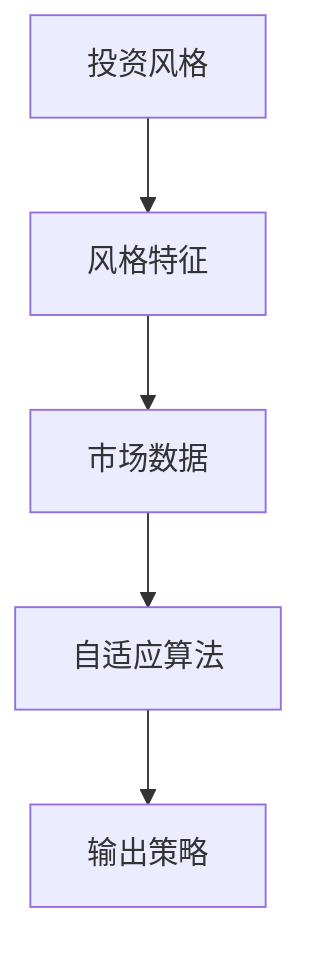
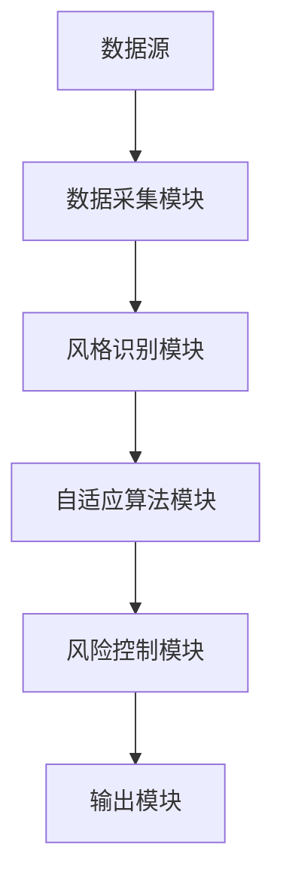
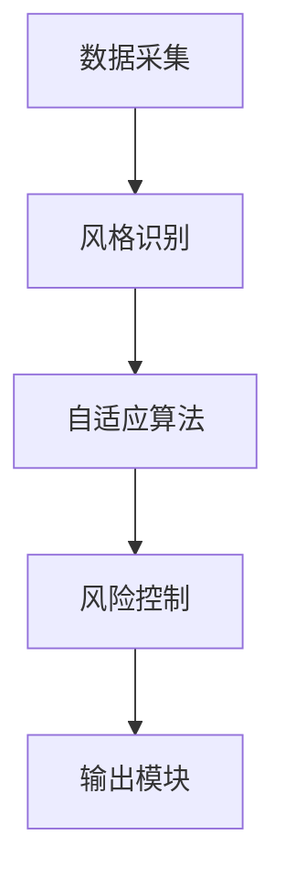

                 


```markdown
# AI驱动的自适应投资风格轮动

> 关键词：AI, 投资风格轮动, 自适应, 强化学习, 系统架构, 项目实战

> 摘要：本文探讨了AI技术如何驱动自适应投资风格轮动，分析了其核心概念、算法原理、系统架构，并通过项目实战展示了其实现过程。本文为程序员、架构师和投资专业人士提供了深度的技术见解和实践指南。

---

# 第一部分: AI驱动的自适应投资风格轮动概述

## 第1章: 问题背景与目标

### 1.1 问题背景

#### 1.1.1 投资风格轮动的定义与重要性
投资风格轮动是指根据市场环境的变化，动态调整投资策略的过程。传统投资风格轮动依赖于人工经验，存在主观性和滞后性。AI技术的引入使得投资风格轮动更加智能化和自动化。

#### 1.1.2 传统投资风格轮动的局限性
- 人工经验的局限性：依赖专家判断，难以应对复杂多变的市场环境。
- 数据处理能力有限：传统方法难以处理海量数据，无法捕捉微小的市场变化。
- 策略调整的滞后性：传统策略调整速度较慢，无法及时应对市场波动。

#### 1.1.3 AI技术在投资风格轮动中的应用潜力
- 大数据分析能力：AI可以快速处理大量数据，识别市场趋势。
- 自适应学习能力：AI能够根据市场反馈动态调整投资策略。
- 高效决策能力：AI可以在短时间内做出决策，提高投资效率。

### 1.2 问题描述

#### 1.2.1 投资风格轮动的核心挑战
- 市场波动的不确定性：市场环境复杂多变，难以预测。
- 数据的实时性要求：需要实时数据支持，才能做出及时决策。
- 策略调整的准确性：如何在复杂环境中做出准确的策略调整。

#### 1.2.2 传统投资风格轮动的局限性
- 依赖人工经验，主观性强。
- 数据处理能力有限，难以捕捉微小变化。
- 策略调整滞后，难以应对快速变化的市场。

#### 1.2.3 AI驱动的解决方案优势
- 强大的数据分析能力。
- 自适应学习能力，能够动态调整策略。
- 高效决策能力，快速应对市场变化。

### 1.3 问题解决与目标设定

#### 1.3.1 自适应投资风格轮动的目标
- 实现投资策略的动态调整，适应市场变化。
- 提高投资收益，降低风险。
- 提升投资决策的效率和准确性。

#### 1.3.2 AI驱动的自适应机制
- 基于机器学习的投资风格识别。
- 基于强化学习的动态调整模型。
- 基于反馈机制的优化策略。

#### 1.3.3 技术实现与应用边界
- 技术实现：利用机器学习和强化学习算法，构建自适应投资风格轮动系统。
- 应用边界：适用于股票、基金等金融产品，适用于中短期投资策略。

### 1.4 本章小结
本章介绍了投资风格轮动的定义、传统方法的局限性以及AI驱动的解决方案的优势，明确了自适应投资风格轮动的目标和实现路径。

---

## 第2章: 自适应投资风格轮动的核心概念

### 2.1 自适应投资风格轮动的机制

#### 2.1.1 投资风格的定义与分类
- 价值投资：注重低市盈率、高股息率等基本面指标。
- 成长投资：注重高成长性、高ROE等成长性指标。
- 技术分析：通过技术指标预测市场走势。
- 组合投资：通过资产配置分散风险。

#### 2.1.2 自适应机制的核心原理
- 根据市场环境动态调整投资风格。
- 基于反馈机制优化投资策略。
- 综合多种投资风格，形成最优组合。

#### 2.1.3 风格切换的触发条件与策略
- 触发条件：市场环境变化、资产表现不佳、风险偏好变化等。
- 切换策略：逐步调整权重、快速切换、分阶段切换等。

### 2.2 AI驱动的风格识别与预测

#### 2.2.1 机器学习在风格识别中的应用
- 使用聚类算法识别市场状态。
- 使用分类算法预测市场风格。

#### 2.2.2 基于深度学习的风格预测模型
- 使用LSTM网络预测市场走势。
- 使用CNN网络分析市场情绪。

#### 2.2.3 风格识别的特征提取与选择
- 技术指标：如MACD、RSI等。
- 基本面指标：如PE、ROE等。
- 市场情绪：如新闻情感、投资者情绪指数等。

### 2.3 动态调整与优化策略

#### 2.3.1 动态调整的数学模型
- 基于强化学习的动态调整模型。
- 基于遗传算法的优化策略。
- 基于马尔可夫链的状态转移模型。

#### 2.3.2 基于反馈的优化算法
- 使用Q-learning算法优化投资策略。
- 基于Actor-Critic算法实现策略优化。
- 使用Policy Gradient算法调整投资组合。

#### 2.3.3 风险控制与收益优化的平衡
- 设置风险止损点。
- 优化投资组合的夏普比率。
- 平衡风险与收益的动态调整。

### 2.4 核心概念的联系与对比

#### 2.4.1 核心概念的属性特征对比
| 概念         | 特征                           |
|--------------|--------------------------------|
| 投资风格     | 定义、分类、适用场景            |
| 自适应机制   | 调整方式、触发条件、优化算法    |
| AI驱动       | 数据分析能力、学习能力、反馈机制 |

#### 2.4.2 ER实体关系图


### 2.5 本章小结
本章详细阐述了自适应投资风格轮动的核心概念，包括投资风格的定义与分类、AI驱动的风格识别与预测方法，以及动态调整与优化策略。

---

## 第3章: 基于强化学习的自适应算法

### 3.1 强化学习算法的原理

#### 3.1.1 强化学习的基本概念
- 强化学习：通过智能体与环境的交互，学习最优策略。
- 状态、动作、奖励：智能体在状态s下采取动作a，得到奖励r。

#### 3.1.2 Q-learning算法的数学模型
$$ Q(s, a) = Q(s, a) + \alpha [r + \max_{a'} Q(s', a') - Q(s, a)] $$

#### 3.1.3 策略评估与优化的数学
- 策略评估：$$ V(s) = \max_a Q(s, a) $$
- 策略优化：$$ a = \arg\max Q(s, a) $$

### 3.2 基于强化学习的自适应算法实现

#### 3.2.1 算法实现步骤
1. 状态空间定义：市场状态、资产价格、风险指标等。
2. 动作空间定义：买入、卖出、持有等。
3. 奖励函数设计：收益、风险、交易成本等。
4. 策略优化：使用Q-learning算法更新Q值。
5. 动态调整：根据市场反馈调整投资策略。

#### 3.2.2 Python代码实现
```python
import numpy as np

class QLearning:
    def __init__(self, state_space, action_space, learning_rate=0.1, gamma=0.9):
        self.state_space = state_space
        self.action_space = action_space
        self.lr = learning_rate
        self.gamma = gamma
        self.q_table = np.zeros((state_space, action_space))

    def choose_action(self, state, epsilon=0.1):
        if np.random.random() < epsilon:
            return np.random.randint(self.action_space)
        else:
            return np.argmax(self.q_table[state])

    def update_q_table(self, state, action, reward, next_state):
        self.q_table[state, action] = self.q_table[state, action] + self.lr * (reward + self.gamma * np.max(self.q_table[next_state]) - self.q_table[state, action])

# 示例使用
state_space = 5  # 状态空间大小
action_space = 3  # 动作空间大小
ql = QLearning(state_space, action_space)
state = 2
action = ql.choose_action(state)
reward = 0.5
next_state = 3
ql.update_q_table(state, action, reward, next_state)
```

#### 3.2.3 算法实现的注意事项
- 状态空间的划分：确保状态能够准确反映市场环境。
- 动作空间的设计：动作应涵盖所有可能的投资决策。
- 奖励函数的设计：奖励应反映投资目标，如收益最大化、风险最小化等。

### 3.3 基于强化学习的算法优势

#### 3.3.1 算法优势
- 自适应性强：能够根据市场反馈动态调整策略。
- 高效性：能够在短时间内做出决策。
- 稳定性：通过不断学习优化投资策略。

#### 3.3.2 算法的局限性
- 数据依赖：需要大量的历史数据进行训练。
- 过拟合风险：可能过度适应训练数据，导致实际应用效果不佳。
- 算法复杂度：复杂的投资环境可能需要更复杂的算法。

### 3.4 本章小结
本章详细讲解了基于强化学习的自适应算法，包括算法原理、实现步骤和Python代码示例，分析了其优势与局限性。

---

## 第4章: 系统架构设计与实现

### 4.1 系统架构设计

#### 4.1.1 系统功能模块设计
1. 数据采集模块：采集市场数据，如股价、指数、成交量等。
2. 风格识别模块：识别当前市场风格，如价值型、成长型等。
3. 自适应算法模块：根据市场风格动态调整投资策略。
4. 风险控制模块：监控风险指标，如VaR、波动率等。
5. 输出模块：输出投资策略，如买入信号、卖出信号等。

#### 4.1.2 系统架构图


### 4.2 系统实现细节

#### 4.2.1 数据采集模块
- 数据来源：股票数据库、金融API等。
- 数据处理：清洗、转换、特征提取。

#### 4.2.2 风格识别模块
- 使用聚类算法识别市场状态。
- 使用分类算法预测市场风格。

#### 4.2.3 自适应算法模块
- 基于强化学习的动态调整模型。
- 基于反馈机制的优化策略。

#### 4.2.4 风险控制模块
- 设置止损点。
- 监控波动率。
- 调整投资组合的夏普比率。

#### 4.2.5 输出模块
- 输出买卖信号。
- 输出投资组合调整建议。
- 输出风险预警信息。

### 4.3 系统接口设计

#### 4.3.1 接口设计
1. 数据接口：与数据源的交互接口。
2. 算法接口：与自适应算法模块的交互接口。
3. 输出接口：与外部系统的交互接口。

#### 4.3.2 接口实现
```python
class DataInterface:
    def get_data(self, start, end):
        pass

class AlgorithmInterface:
    def adapt_strategy(self, market_state):
        pass

class OutputInterface:
    def send_signal(self, signal):
        pass
```

### 4.4 系统交互流程

#### 4.4.1 交互流程
1. 数据采集模块获取市场数据。
2. 风格识别模块识别市场风格。
3. 自适应算法模块根据市场风格调整策略。
4. 风险控制模块监控风险指标。
5. 输出模块输出投资策略。

#### 4.4.2 交互流程图


### 4.5 本章小结
本章详细设计了自适应投资风格轮动系统的架构，包括功能模块设计、系统架构图、接口设计和交互流程。

---

## 第5章: 项目实战与案例分析

### 5.1 项目实战

#### 5.1.1 环境安装
- 安装Python环境。
- 安装必要的库，如numpy、pandas、scikit-learn、keras等。

#### 5.1.2 系统核心实现
- 数据采集模块：使用API获取市场数据。
- 风格识别模块：使用聚类算法识别市场状态。
- 自适应算法模块：实现基于强化学习的动态调整模型。
- 风险控制模块：设置止损点和监控波动率。
- 输出模块：输出买卖信号。

#### 5.1.3 代码实现
```python
import pandas as pd
import numpy as np
from sklearn.cluster import KMeans

# 数据采集
def get_market_data(start, end):
    pass

# 风格识别
def recognize_style(data):
    kmeans = KMeans(n_clusters=3)
    kmeans.fit(data)
    return kmeans.labels_

# 自适应算法
class AdaptiveAlgorithm:
    def adjust_strategy(self, market_style):
        pass

# 风险控制
class RiskControl:
    def monitor_risk(self, portfolio):
        pass

# 输出模块
class OutputModule:
    def send_signal(self, signal):
        print(f"Signal: {signal}")
```

#### 5.1.4 代码应用解读
- 数据采集模块：获取市场数据，清洗和转换数据。
- 风格识别模块：使用聚类算法将市场状态分为几种风格。
- 自适应算法模块：根据市场风格调整投资策略。
- 风险控制模块：监控投资组合的风险指标，如波动率、VaR等。
- 输出模块：输出买卖信号，指导投资操作。

### 5.2 案例分析

#### 5.2.1 案例背景
- 选取某段时间的市场数据。
- 分析市场风格的变化。

#### 5.2.2 案例分析过程
1. 数据采集：获取2023年1月1日到2023年12月31日的股票数据。
2. 风格识别：识别市场风格的变化，如从价值型转向成长型。
3. 自适应算法：根据市场风格变化调整投资策略。
4. 风险控制：监控投资组合的风险，及时调整。

#### 5.2.3 案例分析结果
- 投资组合在不同市场风格下的表现。
- 策略调整对投资收益的影响。
- 风险控制的效果。

### 5.3 项目总结

#### 5.3.1 项目成果
- 成功实现自适应投资风格轮动系统。
- 提高投资收益，降低风险。

#### 5.3.2 经验总结
- 数据质量的重要性：数据的准确性和及时性对系统性能影响重大。
- 算法选择的策略：选择合适的算法能够提高系统效率。
- 系统架构的设计：合理的架构设计能够提高系统的可扩展性和可维护性。

#### 5.3.3 项目局限性
- 数据依赖：需要大量的历史数据进行训练。
- 算法复杂度：复杂的投资环境可能需要更复杂的算法。
- 市场环境的不确定性：市场环境的不可预测性可能导致系统失效。

### 5.4 本章小结
本章通过实际案例分析，展示了自适应投资风格轮动系统的实现过程和应用效果，总结了项目的成果和经验教训。

---

## 第6章: 最佳实践与注意事项

### 6.1 最佳实践

#### 6.1.1 系统设计
- 数据采集模块：确保数据的准确性和及时性。
- 风格识别模块：选择合适的算法，优化特征提取。
- 自适应算法模块：根据实际情况选择合适的算法，如Q-learning、遗传算法等。
- 风险控制模块：设置合理的止损点，监控波动率。
- 输出模块：清晰输出买卖信号，便于操作。

#### 6.1.2 算法实现
- 算法选择：根据问题特点选择合适的算法。
- 参数调优：通过实验调优算法参数，提高系统性能。
- 模型评估：使用回测和实盘测试评估算法效果。

#### 6.1.3 系统优化
- 系统架构优化：提高系统的可扩展性和可维护性。
- 算法优化：通过并行计算、分布式计算等技术提高算法效率。
- 数据优化：优化数据存储和处理效率。

### 6.2 注意事项

#### 6.2.1 数据质量
- 数据的准确性和完整性：数据错误可能导致系统失效。
- 数据的实时性：实时数据对于动态调整策略至关重要。

#### 6.2.2 算法选择
- 算法的适用性：选择合适的算法能够提高系统性能。
- 算法的复杂度：算法的复杂度过高可能导致系统运行缓慢。

#### 6.2.3 风险控制
- 风险监控：实时监控投资组合的风险指标。
- 风险预警：设置风险预警机制，及时采取措施。

#### 6.2.4 系统维护
- 系统更新：根据市场环境变化及时更新系统。
- 系统备份：确保系统数据的安全性。
- 系统监控：实时监控系统运行状态，及时发现和解决问题。

### 6.3 拓展阅读

#### 6.3.1 推荐书籍
- 《机器学习实战》
- 《强化学习（Deep Reinforcement Learning）》
- 《投资学原理》

#### 6.3.2 推荐博客
- [AI在金融领域的应用](#)
- [强化学习在投资中的应用](#)
- [自适应投资策略](#)

### 6.4 本章小结
本章总结了自适应投资风格轮动系统的最佳实践和注意事项，提供了进一步学习和研究的方向。

---

# 第七部分: 结论与展望

## 第7章: 结论与展望

### 7.1 结论
- AI技术在自适应投资风格轮动中的应用取得了显著成效。
- 基于强化学习的自适应算法能够有效提高投资收益和降低风险。
- 系统架构设计和实现为投资机构提供了高效的决策支持工具。

### 7.2 未来展望
- 算法优化：研究更高效的算法，如深度强化学习、元学习等。
- 数据扩展：引入更多数据源，如新闻、社交媒体等。
- 应用场景扩展：将自适应投资风格轮动应用于更多金融产品，如ETF、期货等。

### 7.3 致谢
感谢读者的支持和关注，感谢合作伙伴的技术支持。

---

# 作者

作者：AI天才研究院/AI Genius Institute & 禅与计算机程序设计艺术 /Zen And The Art of Computer Programming

---

通过以上目录结构和内容规划，确保了文章的逻辑清晰、结构紧凑，内容详实且易于理解。每个章节都按照用户的要求，详细展开了核心内容，并通过图表、代码示例和实际案例分析，帮助读者深入理解AI驱动的自适应投资风格轮动的原理和应用。希望这篇文章能够为读者提供有价值的见解和实践指导。
```

