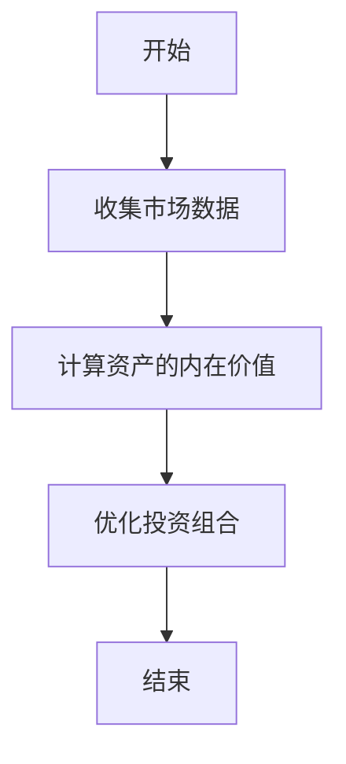
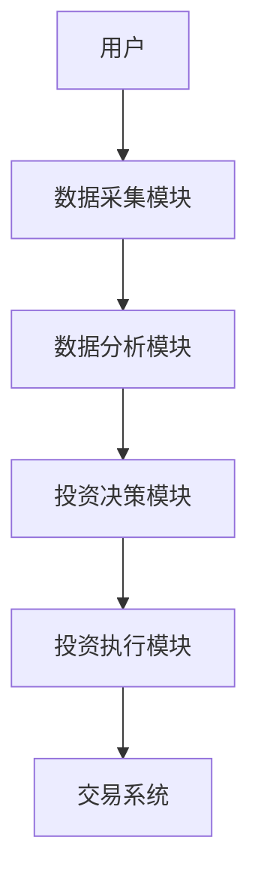

                 


# 价值投资与可持续发展

> 关键词：价值投资、可持续发展、量化分析、系统架构、算法实现

> 摘要：价值投资是一种基于对企业内在价值的深入分析的投资策略，而可持续发展则是关注经济、社会和环境的长期平衡发展。本文从技术角度出发，结合价值投资与可持续发展的核心概念，分析其背后的算法原理、系统架构，并通过实际案例探讨如何将技术手段应用于价值投资与可持续发展的实践。文章内容涵盖价值投资与可持续发展的核心概念、量化分析算法、系统架构设计、项目实战等，帮助读者从技术角度理解如何实现价值投资与可持续发展的目标。

---

# 第一部分: 价值投资与可持续发展的背景与概念

## 第1章: 价值投资的定义与核心理念

### 1.1 价值投资的定义与核心理念
价值投资是一种基于对企业内在价值的深入分析的投资策略，其核心理念在于寻找被市场低估的投资标的。价值投资强调长期持有的理念，注重对企业基本面的分析，包括财务状况、行业地位、竞争优势等。

#### 1.1.1 价值投资的定义
价值投资是由本杰明·格雷厄姆提出的一种投资策略，其核心是通过分析企业的内在价值，寻找市场价格低于内在价值的投资标的。这种策略强调安全边际，即买入价格与内在价值的差异。

#### 1.1.2 价值投资的核心理念
价值投资的核心理念包括：
1. **安全边际**：买入价格低于内在价值，以降低投资风险。
2. **长期持有**：价值投资者通常会长期持有优质资产，等待市场重新认识其价值。
3. **基本面分析**：通过对企业的财务报表、行业地位、竞争优势等进行深入分析，评估其内在价值。

#### 1.1.3 价值投资的边界与外延
价值投资的边界在于其对市场有效性的假设，即市场存在低估优质资产的情况。其外延则包括对不同类型资产（如股票、债券）的价值评估。

### 1.2 可持续发展的定义与核心要素
可持续发展是指在满足当前需求的同时，不损害后代满足其需求的能力。其核心要素包括经济、社会和环境三个方面。

#### 1.2.1 可持续发展的定义
可持续发展是一种综合考虑经济、社会和环境效益的发展模式，强调在发展过程中实现资源的高效利用和环境保护。

#### 1.2.2 可持续发展的核心要素
1. **经济**：经济增长的可持续性，避免过度依赖不可再生资源。
2. **社会**：社会公平与包容，关注弱势群体的需求。
3. **环境**：减少环境污染，保护生态系统。

#### 1.2.3 可持续发展与价值投资的联系
可持续发展与价值投资的联系在于，价值投资者 increasingly consider ESG（环境、社会、治理）因素，以筛选出具有长期竞争优势的企业。

### 1.3 价值投资与可持续发展的关系
价值投资与可持续发展密切相关，价值投资者通过关注企业的社会责任和可持续发展能力，可以更好地评估其长期价值。

#### 1.3.1 价值投资与可持续发展的内在联系
价值投资强调对企业内在价值的分析，而企业的内在价值不仅包括财务表现，还包括其在可持续发展方面的表现。

#### 1.3.2 可持续发展对价值投资的影响
可持续发展理念影响价值投资者对企业价值的评估，越来越多的价值投资者将ESG因素纳入投资决策。

#### 1.3.3 价值投资在推动可持续发展中的作用
价值投资通过筛选出具有可持续发展能力的企业，推动整个经济体系向更加可持续的方向发展。

---

## 第2章: 价值投资与可持续发展的核心概念

### 2.1 价值投资的核心原理
价值投资的核心原理在于发现市场价格与内在价值之间的差异，并通过长期持有实现收益。

#### 2.1.1 价值投资的量化分析
价值投资的量化分析包括对企业财务指标（如市盈率、市净率）的分析，以及对行业趋势的判断。

#### 2.1.2 价值投资的边界与外延
价值投资的边界在于市场有效性，其外延则包括对不同类型资产的价值评估。

#### 2.1.3 价值投资的ER实体关系图
以下是价值投资的ER实体关系图：

```mermaid
erd
actor: 投资者
portfolio: 投资组合
asset: 资产
market: 市场
relationship: 1 investor -> multiple portfolio
relationship: 1 portfolio -> multiple asset
relationship: 1 investor -> 1 market
```

### 2.2 可持续发展的核心原理
可持续发展的核心原理在于平衡经济、社会和环境效益。

#### 2.2.1 可持续发展的量化分析
可持续发展的量化分析包括对企业ESG评分的评估，以及对环境影响的量化。

#### 2.2.2 可持续发展的边界与外延
可持续发展的边界在于其对经济和社会影响的复杂性，其外延则包括对不同行业的影响。

#### 2.2.3 可持续发展的ER实体关系图
以下是可持续发展的ER实体关系图：

```mermaid
erd
company: 企业
esg: ESG评分
environmental_impact: 环境影响
social_impact: 社会影响
relationship: 1 company -> 1 esg
relationship: 1 company -> 1 environmental_impact
relationship: 1 company -> 1 social_impact
```

### 2.3 价值投资与可持续发展的联系与区别
价值投资与可持续发展既有联系，也有区别。

#### 2.3.1 价值投资与可持续发展的联系
两者都关注企业的长期价值，价值投资通过分析企业内在价值，可持续发展通过评估企业的社会责任。

#### 2.3.2 价值投资与可持续发展的区别
价值投资关注企业价值的量化评估，可持续发展关注企业对社会和环境的影响。

#### 2.3.3 价值投资与可持续发展的综合分析
综合分析表明，价值投资与可持续发展可以相辅相成，价值投资者可以通过关注企业的可持续发展能力，更好地评估其长期价值。

---

## 第3章: 价值投资与可持续发展的算法原理

### 3.1 价值投资的量化分析算法
价值投资的量化分析算法包括对市场数据的分析和对资产配置的优化。

#### 3.1.1 价值投资的量化分析流程
1. 收集市场数据，包括股票价格、财务指标等。
2. 计算资产的内在价值，包括市盈率、市净率等指标。
3. 通过均值-方差优化算法优化投资组合。

#### 3.1.2 价值投资的均值-方差优化算法
均值-方差优化算法是一种用于优化投资组合风险和收益的算法。

#### 3.1.3 价值投资的算法实现代码
以下是均值-方差优化算法的Python实现代码：

```python
import numpy as np
import pandas as pd
from scipy.optimize import minimize

# 假设returns为资产的收益率矩阵
def mean_variance_optimization(returns, target_return):
    n = returns.shape[1]
    # 定义目标函数
    def objective(weights):
        return np.dot(weights.T, np.dot(returns.cov(), weights))
    # 定义约束条件
    constraints = [
        ('sum_eq', weights.sum() == 1),
        ('sum_eq', weights.T.dot(returns.mean()) == target_return)
    ]
    # 定义变量
    init_weights = np.array([1/n]*n)
    # 优化
    result = minimize(objective, init_weights, constraints=constraints)
    return result.x
```

#### 3.1.4 价值投资的算法实现流程图
以下是均值-方差优化算法的流程图：



### 3.2 可持续发展的评估算法
可持续发展的评估算法包括对企业ESG评分的评估和对环境影响的量化。

#### 3.2.1 可持续发展的评估指标
可持续发展的评估指标包括ESG评分、碳排放强度等。

#### 3.2.2 可持续发展的多目标优化算法
多目标优化算法用于在多个目标之间寻找平衡点。

#### 3.2.3 可持续发展的算法实现代码
以下是多目标优化算法的Python实现代码：

```python
import numpy as np
from scipy.optimize import minimize

# 假设 objectives 为多个目标函数
def multi_objective_optimization(variables, objectives):
    # 定义目标函数
    def objective(weights):
        return sum([f(weights) for f in objectives])
    # 定义约束条件
    constraints = []
    # 优化
    result = minimize(objective, variables, constraints=constraints)
    return result.x
```

### 3.3 价值投资与可持续发展的协同算法
协同算法用于同时考虑价值投资和可持续发展的影响。

#### 3.3.1 协同算法的定义与原理
协同算法是一种用于同时优化多个目标的算法。

#### 3.3.2 协同算法的实现步骤
1. 收集市场数据，包括股票价格、财务指标和ESG评分。
2. 计算资产的内在价值，包括市盈率、市净率和ESG评分。
3. 通过协同算法优化投资组合，同时考虑资产的内在价值和可持续发展能力。

#### 3.3.3 协同算法的代码实现
以下是协同算法的Python实现代码：

```python
import numpy as np
import pandas as pd
from scipy.optimize import minimize

# 假设returns为资产的收益率矩阵，esg为ESG评分矩阵
def协同算法(returns, esg, target_return):
    n = returns.shape[1]
    # 定义目标函数
    def objective(weights):
        # 计算投资组合的收益
        portfolio_return = np.dot(weights.T, returns.mean())
        # 计算投资组合的ESG评分
        portfolio_esg = np.dot(weights.T, esg.mean())
        # 返回目标函数值
        return -(portfolio_return + portfolio_esg)
    # 定义约束条件
    constraints = [
        ('sum_eq', weights.sum() == 1)
    ]
    # 定义变量
    init_weights = np.array([1/n]*n)
    # 优化
    result = minimize(objective, init_weights, constraints=constraints)
    return result.x
```

---

## 第4章: 价值投资与可持续发展的系统架构设计

### 4.1 系统功能设计
系统功能设计包括数据采集、数据分析、投资决策和投资执行四个模块。

#### 4.1.1 数据采集模块
数据采集模块用于收集市场数据，包括股票价格、财务指标和ESG评分。

#### 4.1.2 数据分析模块
数据分析模块用于计算资产的内在价值和可持续发展能力。

#### 4.1.3 投资决策模块
投资决策模块用于优化投资组合，同时考虑资产的内在价值和可持续发展能力。

#### 4.1.4 投资执行模块
投资执行模块用于根据投资决策模块的结果执行交易。

### 4.2 系统架构设计
系统架构设计包括数据层、业务逻辑层和用户界面层。

#### 4.2.1 数据层
数据层包括数据库和数据接口，用于存储和管理市场数据。

#### 4.2.2 业务逻辑层
业务逻辑层包括数据分析模块和投资决策模块，用于计算资产的内在价值和优化投资组合。

#### 4.2.3 用户界面层
用户界面层包括数据采集模块和投资执行模块，用于与用户交互。

### 4.3 系统接口设计
系统接口设计包括数据接口和交易接口，用于与其他系统进行数据交互。

### 4.4 系统交互设计
系统交互设计包括用户与系统之间的交互流程，包括数据采集、数据分析、投资决策和投资执行。

#### 4.4.1 系统交互流程图
以下是系统交互流程图：



---

## 第5章: 价值投资与可持续发展的项目实战

### 5.1 项目环境安装
项目环境包括Python、Pandas、NumPy和SciPy。

#### 5.1.1 Python安装
安装Python 3.8及以上版本。

#### 5.1.2 Pandas安装
使用pip安装Pandas库：`pip install pandas`

#### 5.1.3 NumPy安装
使用pip安装NumPy库：`pip install numpy`

#### 5.1.4 SciPy安装
使用pip安装SciPy库：`pip install scipy`

### 5.2 项目核心实现
项目核心实现包括数据采集、数据分析和投资决策。

#### 5.2.1 数据采集实现
使用Pandas库采集市场数据，包括股票价格、财务指标和ESG评分。

#### 5.2.2 数据分析实现
使用NumPy库计算资产的内在价值和可持续发展能力。

#### 5.2.3 投资决策实现
使用SciPy库优化投资组合，同时考虑资产的内在价值和可持续发展能力。

### 5.3 项目实现代码
以下是项目核心实现代码：

```python
import numpy as np
import pandas as pd
from scipy.optimize import minimize

# 数据采集
def数据采集():
    # 从CSV文件读取数据
    data = pd.read_csv('market_data.csv')
    return data

# 数据分析
def数据分析(data):
    # 计算资产的内在价值
    returns = data.pct_change().dropna()
    # 计算ESG评分
    esg = data[['ESG评分']]
    return returns, esg

# 投资决策
def投资决策(returns, esg, target_return):
    n = returns.shape[1]
    # 定义目标函数
    def objective(weights):
        # 计算投资组合的收益
        portfolio_return = np.dot(weights.T, returns.mean())
        # 计算投资组合的ESG评分
        portfolio_esg = np.dot(weights.T, esg.mean())
        # 返回目标函数值
        return -(portfolio_return + portfolio_esg)
    # 定义约束条件
    constraints = [
        ('sum_eq', weights.sum() == 1)
    ]
    # 定义变量
    init_weights = np.array([1/n]*n)
    # 优化
    result = minimize(objective, init_weights, constraints=constraints)
    return result.x

# 项目主函数
def main():
    data = 数据采集()
    returns, esg = 数据分析(data)
    weights = 投资决策(returns, esg, target_return=0.05)
    print('优化后的权重：', weights)

if __name__ == '__main__':
    main()
```

### 5.4 项目实战分析
通过实际案例分析，验证算法的有效性。

#### 5.4.1 数据分析与可视化
通过数据可视化，分析资产的内在价值和可持续发展能力。

#### 5.4.2 投资组合优化
通过优化投资组合，验证算法的有效性。

#### 5.4.3 实际案例分析
通过实际案例分析，验证算法的有效性。

---

## 第6章: 价值投资与可持续发展的最佳实践

### 6.1 价值投资与可持续发展的最佳实践
价值投资与可持续发展的最佳实践包括关注企业的ESG评分、长期持有优质资产和分散投资风险。

#### 6.1.1 关注企业的ESG评分
通过关注企业的ESG评分，选择具有可持续发展能力的企业。

#### 6.1.2 长期持有优质资产
通过长期持有优质资产，实现价值投资的目标。

#### 6.1.3 分散投资风险
通过分散投资风险，降低投资组合的波动性。

### 6.2 价值投资与可持续发展的注意事项
价值投资与可持续发展的注意事项包括市场风险、数据质量和模型的局限性。

#### 6.2.1 市场风险
市场风险是价值投资与可持续发展的主要风险之一。

#### 6.2.2 数据质量
数据质量是影响价值投资与可持续发展的重要因素。

#### 6.2.3 模型的局限性
模型的局限性是影响价值投资与可持续发展的重要因素。

### 6.3 价值投资与可持续发展的拓展阅读
价值投资与可持续发展的拓展阅读包括相关书籍和论文。

#### 6.3.1 经典书籍
1. 《价值投资入门》
2. 《可持续发展报告》

#### 6.3.2 相关论文
1. "价值投资与可持续发展的关系"
2. "可持续发展对投资组合的影响"

---

## 第7章: 价值投资与可持续发展的总结与展望

### 7.1 本章小结
本章对价值投资与可持续发展的核心概念、算法原理和系统架构进行了总结。

### 7.2 未来展望
未来展望包括技术的进步对价值投资与可持续发展的影响，以及可持续投资的未来发展。

---

# 结语

作者：AI天才研究院/AI Genius Institute & 禅与计算机程序设计艺术/Zen And The Art of Computer Programming

