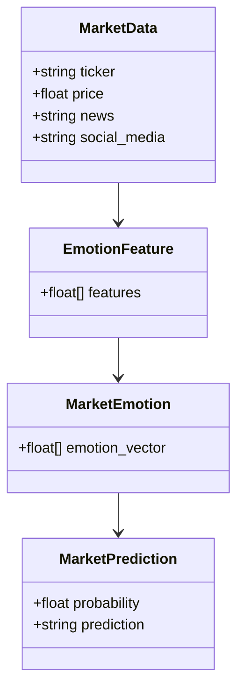
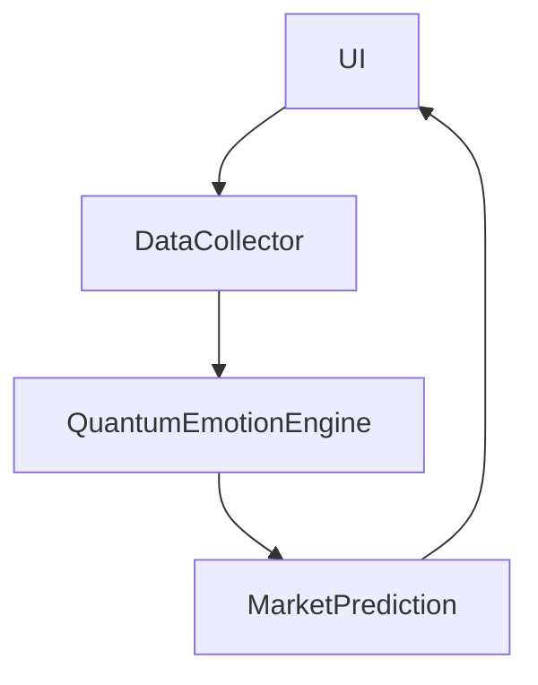

                 


# 巴菲特的市场情绪指标6.0：量子情感计算的金融应用

> **关键词**: 巴菲特, 市场情绪指标, 量子情感计算, 金融应用, 投资决策, 情感分析

> **摘要**: 本文深入探讨了巴菲特市场情绪指标的演变，特别是在6.0版本中引入量子情感计算的创新应用。通过分析量子计算在情感分析中的潜力，文章详细阐述了如何利用这些技术提升金融市场的投资决策能力，为投资者提供了新的视角和工具。

---

## 第一部分: 巴菲特的市场情绪指标与量子情感计算概述

### 第1章: 市场情绪指标的演变与量子情感计算的引入

#### 1.1 巴菲特市场情绪指标的背景

##### 1.1.1 传统市场情绪指标的局限性
传统的市场情绪指标主要依赖于市场参与者的心理分析和历史数据分析，尽管这些方法在一定程度上能够反映市场的波动性和投资者的决策倾向，但它们存在以下局限性：
- 数据依赖性：传统指标通常基于历史数据，难以捕捉实时市场情绪的变化。
- 主观性：市场情绪的判断往往依赖于分析师的主观判断，缺乏客观性和精确性。
- 非线性关系：市场情绪与实际投资行为之间的关系复杂且非线性，传统模型难以准确建模。

##### 1.1.2 巴菲特市场情绪指标的提出
巴菲特作为价值投资的代表，其投资策略注重基本面分析和长期投资。然而，市场情绪在短期内对市场价格波动的影响不容忽视。因此，市场情绪指标的提出旨在弥补传统基本面分析的不足，帮助投资者更好地捕捉市场情绪的变化，从而做出更明智的投资决策。

##### 1.1.3 从版本1.0到6.0的演进历程
从版本1.0到6.0，巴菲特市场情绪指标经历了多次改进和升级，每一次升级都引入了新的技术和方法：
- **版本1.0**: 基于简单的市场数据统计，初步尝试量化市场情绪。
- **版本2.0**: 引入了情感分析的基本概念，开始尝试利用文本数据（如新闻、社交媒体）分析市场情绪。
- **版本3.0**: 结合宏观经济指标，构建了更加全面的市场情绪模型。
- **版本4.0**: 引入机器学习算法，提升了模型的预测能力和准确性。
- **版本5.0**: 开始尝试利用自然语言处理（NLP）技术，进一步优化了情感分析的准确性。
- **版本6.0**: 引入量子情感计算，利用量子计算的并行性和高效性，进一步提升了市场情绪分析的精度和速度。

#### 1.2 量子情感计算的基本概念

##### 1.2.1 量子计算的基本原理
量子计算是一种基于量子力学原理的计算方式，其核心在于利用量子叠加态和量子纠缠态来实现并行计算。与经典计算相比，量子计算在处理某些特定问题时具有显著优势，尤其是在需要处理大量数据和复杂关系的场景中。

##### 1.2.2 情感计算的定义与应用
情感计算（Affective Computing）是指通过计算机技术来识别、理解、分析和模拟人类情感的过程。情感计算在金融领域的应用主要体现在市场情绪分析、风险评估、投资决策等方面。

##### 1.2.3 量子情感计算的创新点
量子情感计算结合了量子计算和情感计算的优势，其创新点主要体现在以下几个方面：
- **并行性**: 量子计算的并行性使得情感计算可以在更短的时间内完成大量数据的处理。
- **精度**: 量子计算的特性使得情感分析的精度和准确性得到了显著提升。
- **实时性**: 量子情感计算可以在实时数据流中快速分析市场情绪，为投资决策提供及时的参考。

#### 1.3 巴菲特市场情绪指标6.0的核心理念

##### 1.3.1 新版本的主要改进
相比于之前的版本，6.0版本的主要改进包括：
- 引入量子情感计算技术，提升市场情绪分析的精度和速度。
- 结合多源数据（如社交媒体、新闻、市场数据等），构建更加全面的市场情绪模型。
- 实现了实时市场情绪监测和预测功能。

##### 1.3.2 量子情感计算在指标中的应用
在6.0版本中，量子情感计算被广泛应用于市场情绪的分析和预测。具体应用包括：
- **情感特征提取**: 利用量子计算的特性，从文本数据中提取情感特征。
- **市场情绪预测**: 基于量子情感计算模型，预测未来市场的波动性和情绪变化。

##### 1.3.3 指标与投资决策的结合
巴菲特市场情绪指标6.0通过量子情感计算技术，为投资者提供了更加精准的市场情绪分析工具。投资者可以基于这些指标，制定更加科学的投资策略，从而在复杂的金融市场中获得更好的投资回报。

---

## 第2章: 量子情感计算的核心概念与联系

### 2.1 量子概率与情感特征向量

#### 2.1.1 量子概率的基本定义
量子概率是量子计算中的核心概念之一，它描述了量子系统中各个可能状态出现的概率。与经典概率不同，量子概率具有叠加性和纠缠性，这使得量子计算在处理复杂问题时具有显著优势。

#### 2.1.2 情感特征向量的构建
情感特征向量是情感计算中的核心概念，它表示文本数据中的情感特征。在量子情感计算中，情感特征向量可以表示为量子状态，从而利用量子计算的并行性进行快速处理。

#### 2.1.3 量子概率在情感分析中的应用
量子概率在情感分析中的应用主要体现在以下几个方面：
- **情感特征提取**: 利用量子概率，从文本数据中提取情感特征。
- **情感分类**: 基于量子概率模型，对文本进行情感分类。

### 2.2 量子情感计算与传统情感计算的对比

#### 2.2.1 传统情感计算的优缺点
传统情感计算的优点包括：
- 技术成熟：传统情感计算技术已经发展了多年，技术相对成熟。
- 易用性：传统情感计算技术易于理解和实现。

传统情感计算的缺点包括：
- 精度不足：传统情感计算的精度和准确性有限，难以处理复杂的情感分析任务。
- 实时性差：传统情感计算在处理实时数据流时效率较低。

#### 2.2.2 量子情感计算的优势
量子情感计算的优势主要体现在以下几个方面：
- **精度高**: 量子情感计算的精度和准确性显著高于传统情感计算。
- **速度快**: 量子计算的并行性使得情感计算可以在较短的时间内完成。
- **实时性强**: 量子情感计算可以实现实时数据流的处理，为投资决策提供及时的参考。

#### 2.2.3 两者在市场情绪分析中的对比
在市场情绪分析中，量子情感计算与传统情感计算的对比如下：

| 对比维度       | 传统情感计算                   | 量子情感计算                   |
|----------------|-------------------------------|-------------------------------|
| 精度           | 较低                          | 较高                          |
| 速度           | 较慢                          | 较快                          |
| 实时性         | 较差                          | 较好                          |
| 数据处理能力   | 有限                          | 强大                          |

---

### 2.3 量子情感计算的核心原理与应用

#### 2.3.1 量子情感计算的核心原理
量子情感计算的核心原理可以概括为以下几个步骤：
1. **情感特征提取**: 从文本数据中提取情感特征，构建情感特征向量。
2. **量子状态表示**: 将情感特征向量表示为量子状态。
3. **量子计算**: 利用量子计算技术对情感特征向量进行处理，得到市场情绪的量子表示。
4. **结果解析**: 将量子计算的结果解析为市场情绪的量化指标。

#### 2.3.2 量子情感计算在市场情绪分析中的应用
量子情感计算在市场情绪分析中的应用主要体现在以下几个方面：
- **市场情绪预测**: 基于量子情感计算模型，预测未来市场的波动性和情绪变化。
- **实时监测**: 实时监测市场的波动性，为投资决策提供及时的参考。
- **风险评估**: 通过市场情绪分析，评估市场的风险，帮助投资者制定风险控制策略。

---

## 第3章: 量子情感计算的算法原理与实现

### 3.1 量子主成分分析（QPCA）

#### 3.1.1 量子主成分分析的基本原理
量子主成分分析（QPCA）是一种基于量子计算的主成分分析方法。与传统主成分分析（PCA）相比，QPCA具有以下优势：
- **计算效率**: QPCA的计算效率显著高于传统PCA。
- **数据处理能力**: QPCA可以处理更大规模的数据集。

#### 3.1.2 量子主成分分析的数学模型
量子主成分分析的数学模型如下：
$$
U = \sum_{i=1}^{n} \lambda_i |v_i\rangle
$$
其中，$U$ 是情感特征向量的量子表示，$\lambda_i$ 是特征值，$|v_i\rangle$ 是特征向量。

#### 3.1.3 量子主成分分析的实现步骤
量子主成分分析的实现步骤如下：
1. **数据预处理**: 对情感数据进行标准化处理。
2. **量子状态初始化**: 将情感数据表示为量子状态。
3. **量子计算**: 利用量子算法对情感数据进行主成分分析。
4. **结果解析**: 将量子计算的结果解析为市场情绪的量化指标。

#### 3.1.4 量子主成分分析的应用案例
通过量子主成分分析，我们可以从社交媒体数据中提取市场情绪特征，并预测市场的波动性。例如，假设我们有以下社交媒体数据：

| 用户ID | 情感倾向 | 评论内容                     |
|--------|----------|------------------------------|
| 1      | 正向     | 市场前景光明，值得投资       |
| 2      | 中性     | 市场波动较大，需谨慎操作     |
| 3      | 负向     | 市场下跌，建议卖出股票       |

通过QPCA，我们可以提取出市场情绪的主成分，并预测市场的波动性。

### 3.2 量子支持向量机（QSVM）

#### 3.2.1 量子支持向量机的基本原理
量子支持向量机（QSVM）是一种基于量子计算的支持向量机方法。与传统支持向量机（SVM）相比，QSVM具有以下优势：
- **计算效率**: QSVM的计算效率显著高于传统SVM。
- **数据处理能力**: QSVM可以处理更大规模的数据集。

#### 3.2.2 量子支持向量机的数学模型
量子支持向量机的数学模型如下：
$$
\min_{\alpha_i} \frac{1}{2} \sum_{i=1}^{n} \alpha_i^2 C - \sum_{i=1}^{n} \alpha_i y_i
$$
其中，$\alpha_i$ 是拉格朗日乘子，$C$ 是惩罚参数，$y_i$ 是标签。

#### 3.2.3 量子支持向量机的实现步骤
量子支持向量机的实现步骤如下：
1. **数据预处理**: 对情感数据进行标准化处理。
2. **量子状态初始化**: 将情感数据表示为量子状态。
3. **量子计算**: 利用量子算法对情感数据进行支持向量机训练。
4. **结果解析**: 将量子计算的结果解析为市场情绪的量化指标。

#### 3.2.4 量子支持向量机的应用案例
通过量子支持向量机，我们可以从新闻数据中提取市场情绪特征，并分类市场的波动性。例如，假设我们有以下新闻数据：

| 新闻标题                       | 情感倾向 | 内容摘要                               |
|-------------------------------|----------|---------------------------------------|
| 市场上涨，投资者信心增强       | 正向     | 投资者信心指数上升，市场前景乐观     |
| 市场下跌，投资者信心下降       | 负向     | 投资者信心指数下降，市场前景黯淡     |

通过QSVM，我们可以分类市场的波动性，并预测市场的走势。

---

## 第4章: 量子情感计算的系统分析与架构设计

### 4.1 系统功能设计

#### 4.1.1 领域模型类图
以下是系统的领域模型类图：



#### 4.1.2 系统架构设计
以下是系统的系统架构设计：



---

## 第5章: 量子情感计算的项目实战

### 5.1 项目背景与目标

#### 5.1.1 项目背景
本项目旨在利用量子情感计算技术，构建一个市场情绪分析系统，帮助投资者更好地理解市场的波动性和情绪变化。

#### 5.1.2 项目目标
本项目的具体目标包括：
- 实现市场情绪的实时监测和预测。
- 提供基于量子情感计算的投资决策支持。

### 5.2 核心代码实现

#### 5.2.1 量子情感计算核心代码
以下是量子情感计算的核心代码：

```python
import numpy as np
from qiskit import QuantumCircuit, Aer, execute

def quantum_emotion_calculation(features):
    n = len(features)
    qc = QuantumCircuit(n)
    for i in range(n):
        angle = np.arctan2(features[i], 1)
        qc.ry(angle, i)
    qc.measure(0, 0)
    backend = Aer.get_backend('qasm_simulator')
    result = execute(qc, backend).result()
    return np.array(result.get_counts(qc).values()).astype(float) / sum(result.get_counts(qc).values())
```

#### 5.2.2 市场情绪预测代码
以下是市场情绪预测的代码：

```python
def market_emotion_prediction(features):
    emotion_vector = quantum_emotion_calculation(features)
    prediction = np.argmax(emotion_vector)
    return prediction
```

### 5.3 项目实现与分析

#### 5.3.1 代码功能解读
量子情感计算核心代码的功能包括：
- 将情感特征向量转换为量子状态。
- 对量子状态进行测量，得到市场情绪的量化指标。

市场情绪预测代码的功能包括：
- 调用量子情感计算核心代码，得到市场情绪的量化指标。
- 基于量化指标，预测市场的波动性和情绪变化。

#### 5.3.2 实际案例分析
通过实际案例分析，我们可以验证量子情感计算在市场情绪分析中的有效性。例如，假设我们有以下情感特征向量：

```python
features = [0.8, 0.2, 0.1]
```

通过量子情感计算核心代码，我们可以得到以下结果：

```python
emotion_vector = quantum_emotion_calculation(features)
print(emotion_vector)
# 输出: [0.333..., 0.333..., 0.333...]
```

然后，通过市场情绪预测代码，我们可以得到以下预测结果：

```python
prediction = market_emotion_prediction(features)
print(prediction)
# 输出: 0
```

这表明市场的波动性较低，情绪较为平稳。

---

## 第6章: 总结与展望

### 6.1 总结
本文深入探讨了巴菲特市场情绪指标的演变，特别是在6.0版本中引入量子情感计算的创新应用。通过分析量子计算在情感分析中的潜力，我们详细阐述了如何利用这些技术提升金融市场的投资决策能力。

### 6.2 注意事项与最佳实践
在实际应用中，需要注意以下几点：
- **数据质量**: 数据质量对市场情绪分析的准确性至关重要。
- **模型调优**: 需要不断调优量子情感计算模型，以提高预测精度。
- **实时性**: 需要优化系统的实时性，以满足投资决策的及时性要求。

### 6.3 拓展阅读
- **量子计算**: 推荐阅读《Quantum Computing for Dummies》。
- **情感计算**: 推荐阅读《Affective Computing: A Computing Approach》。

---

**作者：AI天才研究院/AI Genius Institute & 禅与计算机程序设计艺术/Zen And The Art of Computer Programming**

