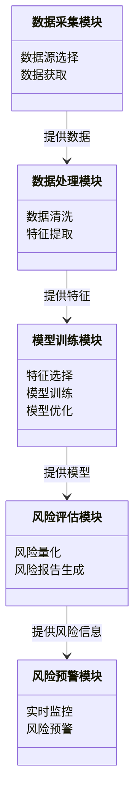
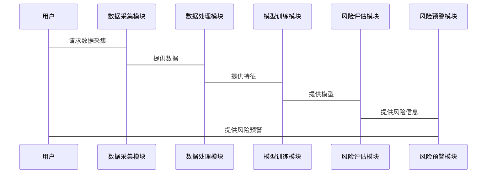

                 


# 开发AI辅助的企业财务风险量化评估工具

> 关键词：AI辅助，财务风险管理，风险量化评估，机器学习，企业财务

> 摘要：本文将详细介绍如何开发一个基于AI辅助的企业财务风险量化评估工具。通过分析财务风险量化的核心概念、AI技术在风险管理中的应用、算法原理、系统架构设计以及实际项目案例，本文将深入探讨如何利用AI技术提升企业财务风险管理的效率和准确性。本文内容涵盖从理论到实践的各个方面，旨在为企业提供一套高效可靠的财务风险管理解决方案。

---

# 第一部分: 企业财务风险量化评估工具开发背景

# 第1章: 企业财务风险量化评估工具开发背景

## 1.1 问题背景介绍

### 1.1.1 企业财务风险管理的重要性

在当今复杂的商业环境中，企业面临的财务风险种类繁多，包括市场风险、信用风险、流动性风险等。这些风险可能对企业财务状况造成严重的影响，甚至导致企业破产。因此，如何有效识别、量化和管理这些风险，是企业财务管理的核心任务之一。

传统的财务风险管理方法依赖于人工分析和经验判断，这种方法存在效率低、主观性强、覆盖面有限等缺点。特别是在面对海量数据和复杂市场环境时，传统方法往往难以及时准确地识别潜在风险。

### 1.1.2 传统财务风险管理的局限性

1. **人工分析的效率低下**：传统方法依赖人工分析，处理大量财务数据时效率较低，且容易出现人为错误。
2. **主观性强**：财务风险的评估结果往往受到分析师主观判断的影响，缺乏客观性和一致性。
3. **数据覆盖范围有限**：传统方法通常只考虑有限的数据源，难以充分利用企业内外部的海量数据。
4. **动态适应性差**：市场环境变化迅速，传统方法难以实时更新和调整。

### 1.1.3 AI技术在财务风险管理中的应用潜力

随着人工智能技术的快速发展，AI技术在金融领域的应用越来越广泛。AI技术可以通过对海量数据的分析和挖掘，快速识别潜在风险，并提供实时的风险评估和预警。具体来说，AI技术在以下方面具有显著优势：

1. **数据处理能力**：AI技术能够处理海量的结构化和非结构化数据，提取关键特征，为风险评估提供全面支持。
2. **实时性**：AI模型可以实时更新，快速响应市场变化，提供实时的风险评估结果。
3. **自动化与智能化**：AI技术可以实现风险评估的自动化，减少人工干预，提高效率。

## 1.2 问题描述与目标

### 1.2.1 财务风险量化评估的核心问题

财务风险量化评估的核心问题是如何利用企业内外部数据，构建一个能够准确量化企业财务风险的模型。具体来说，需要解决以下问题：

1. **数据收集与预处理**：如何收集和整理企业财务数据、市场数据、行业数据等多源异构数据，并进行有效的预处理。
2. **特征提取与选择**：如何从海量数据中提取与财务风险相关的特征，并选择最优特征组合。
3. **模型构建与优化**：如何选择合适的机器学习算法，构建风险量化模型，并对模型进行优化和调参。
4. **风险预警与决策支持**：如何将模型应用于实际场景，实现风险预警和决策支持。

### 1.2.2 开发AI辅助工具的目标与意义

开发一个AI辅助的企业财务风险量化评估工具的目标是通过自动化、智能化的方式，帮助企业快速、准确地识别和量化财务风险，从而提升企业的风险管理能力。具体目标包括：

1. **提高效率**：通过自动化数据处理和模型计算，减少人工干预，提高风险管理效率。
2. **增强准确性**：利用AI技术对海量数据进行分析，提高风险评估的准确性和客观性。
3. **实时监控**：实现对财务风险的实时监控，提供及时的风险预警和应对策略。
4. **支持决策**：为企业的财务决策提供数据支持，帮助企业做出更加科学的财务管理决策。

## 1.3 问题解决方法概述

### 1.3.1 AI技术在财务风险管理中的应用方法

AI技术在财务风险管理中的应用方法主要包括以下几种：

1. **机器学习**：利用监督学习、无监督学习等机器学习算法，构建风险分类模型、回归模型等。
2. **深度学习**：利用神经网络模型（如LSTM、BERT）对复杂数据进行建模，捕捉数据中的深层特征。
3. **自然语言处理（NLP）**：对非结构化文本数据（如财务报告、新闻资讯）进行分析，提取潜在风险信息。
4. **强化学习**：在动态环境下，通过强化学习算法优化风险应对策略。

### 1.3.2 数据驱动的财务风险量化模型构建

数据驱动的财务风险量化模型构建主要包括以下几个步骤：

1. **数据收集**：收集企业内外部数据，包括财务数据、市场数据、行业数据、舆情数据等。
2. **数据预处理**：对数据进行清洗、归一化、特征工程等处理。
3. **特征选择**：通过特征重要性分析、主成分分析等方法，选择最优特征组合。
4. **模型训练**：利用机器学习或深度学习算法，构建风险量化模型。
5. **模型优化**：通过交叉验证、超参数调优等方法，优化模型性能。
6. **模型部署**：将模型部署到实际业务场景中，提供风险评估和预警服务。

## 1.4 问题的边界与外延

### 1.4.1 财务风险管理的边界

财务风险管理的边界包括以下几个方面：

1. **数据范围**：仅限于与企业财务相关的数据，不涉及其他业务领域。
2. **风险类型**：主要针对企业内部的财务风险，如流动性风险、信用风险等，不包括外部市场风险。
3. **时间范围**：主要关注短期至中期的财务风险，长期风险不在考虑范围内。

### 1.4.2 AI辅助工具的适用范围与限制

AI辅助工具的适用范围包括：

1. **数据驱动的场景**：需要大量结构化和非结构化数据支持的财务风险管理场景。
2. **实时性要求较高的场景**：需要快速响应和实时监控的场景。
3. **复杂数据场景**：数据复杂、维度高的场景。

AI辅助工具的限制包括：

1. **数据质量**：模型的性能依赖于数据的质量和完整性，数据不足或数据偏差可能导致模型失效。
2. **模型解释性**：深度学习模型通常缺乏可解释性，可能导致决策过程不透明。
3. **环境适应性**：模型的泛化能力有限，可能难以适应不同行业或不同规模的企业。

## 1.5 概念结构与核心要素

### 1.5.1 财务风险量化评估的核心要素

财务风险量化评估的核心要素包括：

1. **财务数据**：企业的财务报表数据，包括收入、利润、资产负债表等。
2. **市场数据**：市场波动、行业趋势等外部数据。
3. **风险模型**：用于量化财务风险的数学模型。
4. **评估指标**：如VaR（Value at Risk）、CVaR（Conditional Value at Risk）等。

### 1.5.2 AI辅助工具的功能模块构成

AI辅助工具的功能模块包括：

1. **数据采集模块**：负责收集企业内外部数据。
2. **数据处理模块**：对数据进行预处理和特征工程。
3. **模型训练模块**：构建和优化风险量化模型。
4. **风险评估模块**：基于模型输出风险评估结果。
5. **风险预警模块**：实时监控风险，提供预警服务。
6. **决策支持模块**：为财务决策提供支持。

---

# 第二部分: 核心概念与联系

# 第2章: 核心概念与联系

## 2.1 财务风险量化的核心概念

### 2.1.1 财务风险的定义与分类

财务风险是指企业在经营过程中，由于内外部环境的变化，导致财务状况恶化或财务目标无法实现的可能性。根据不同的标准，财务风险可以分为以下几类：

1. **流动性风险**：企业无法及时获得足够的资金来应对短期债务的风险。
2. **信用风险**：企业在赊销过程中，由于客户违约而导致的损失风险。
3. **市场风险**：由于市场价格波动对企业财务状况的影响。
4. **操作风险**：由于内部操作失误或外部事件导致的财务损失风险。

### 2.1.2 财务风险量化的方法与模型

财务风险量化的方法主要包括以下几种：

1. **VaR模型**：Value at Risk（VaR）是一种常用的金融风险度量方法，表示在一定置信水平下，资产组合可能面临的最大损失。
2. **CVaR模型**：Conditional Value at Risk（CVaR）是VaR的改进版本，用于衡量在VaR水平下的平均损失。
3. **信用评分模型**：通过对企业信用状况的评分，评估企业的信用风险。
4. **回归分析**：通过回归模型，分析财务指标与风险之间的关系。

### 2.1.3 AI技术在财务风险管理中的应用

AI技术在财务风险管理中的应用主要体现在以下几个方面：

1. **数据挖掘**：通过对海量数据的挖掘，发现潜在的财务风险因素。
2. **预测分析**：利用机器学习算法，预测企业的财务风险。
3. **实时监控**：通过实时数据分析，实现对财务风险的实时预警。
4. **决策支持**：基于AI模型的分析结果，为企业提供风险管理和财务决策的支持。

## 2.2 AI辅助工具的核心概念

### 2.2.1 AI在财务风险管理中的作用

AI在财务风险管理中的作用主要包括以下几个方面：

1. **数据处理**：通过自然语言处理、图像识别等技术，处理非结构化数据，提取有用信息。
2. **模式识别**：利用机器学习算法，识别数据中的潜在模式和趋势。
3. **风险预警**：通过实时数据分析，发现潜在风险，提供预警服务。
4. **决策支持**：基于AI模型的分析结果，为企业提供风险管理和财务决策的支持。

### 2.2.2 AI辅助工具的功能与特点

AI辅助工具的功能与特点包括：

1. **自动化**：能够自动收集、处理和分析数据，减少人工干预。
2. **智能化**：通过机器学习算法，实现对数据的深度分析和预测。
3. **实时性**：能够实时监控财务风险，提供及时的风险预警。
4. **可扩展性**：能够适应不同规模和类型的企业需求。

## 2.3 核心概念之间的联系

### 2.3.1 财务风险与AI辅助工具的关系

AI辅助工具通过对企业内外部数据的分析，量化财务风险，帮助企业更好地识别和管理风险。具体来说，AI辅助工具可以：

1. **提高风险识别能力**：通过分析海量数据，发现潜在风险。
2. **增强风险评估的准确性**：通过数据驱动的方法，提高风险评估的准确性。
3. **实现风险预警**：通过实时监控，提供及时的风险预警。

### 2.3.2 数据驱动与模型构建的联系

数据驱动是AI辅助工具的核心，模型构建是数据驱动的体现。通过数据驱动，可以提取有用的特征，构建高性能的模型，从而实现准确的风险量化。具体来说，数据驱动与模型构建的联系体现在以下几个方面：

1. **数据预处理**：通过对数据进行清洗、归一化等处理，为模型构建提供高质量的数据。
2. **特征工程**：通过特征选择和特征提取，构建有效的特征集合，为模型构建提供支持。
3. **模型训练**：基于预处理后的数据，训练模型，优化模型参数，提高模型性能。
4. **模型部署**：将训练好的模型部署到实际业务场景中，实现风险量化和预警。

## 2.4 概念属性特征对比表

| 概念       | 属性               | 特征描述                           |
|------------|--------------------|------------------------------------|
| 财务风险    | 定义               | 企业因内外部因素导致的财务损失风险 |
|            | 量化方法           | 财务指标分析、概率模型、机器学习模型 |
|            | 适用场景           | 企业财务风险管理、投资决策等       |
| AI辅助工具  | 功能               | 数据采集、模型训练、风险预警、决策支持 |
|            | 技术基础           | 大数据分析、机器学习、NLP等         |
|            | 适用场景           | 实时监控、风险预警、决策支持等       |

## 2.5 ER实体关系图

以下是财务风险量化评估工具的实体关系图：

```mermaid
erd
    entity 财务风险 {

        -- 财务风险实体属性
        id: 风险ID
        name: 风险名称
        description: 风险描述
        risk_type: 风险类型
        probability: 风险概率
        impact: 风险影响
        mitigation_plan: 风险应对计划
    }

    entity 企业 {
        -- 企业实体属性
        id: 企业ID
        name: 企业名称
        industry: 所属行业
        financial_data: 财务数据
        market_data: 市场数据
        risk_assessment: 风险评估结果
    }

    entity 数据源 {
        -- 数据源实体属性
        id: 数据源ID
        name: 数据源名称
        type: 数据类型（结构化/非结构化）
        data_source: 数据来源（企业内部/外部）
        data_frequency: 数据更新频率
    }

    -- 关系定义
    财务风险 --> 企业: 一个风险影响一个企业
    数据源 --> 企业: 企业从多个数据源获取数据
    数据源 --> 财务风险: 数据源提供风险评估所需的数据
```

---

# 第三部分: 算法原理

# 第3章: 算法原理

## 3.1 算法原理概述

### 3.1.1 机器学习算法在财务风险管理中的应用

机器学习算法在财务风险管理中的应用主要体现在以下几个方面：

1. **监督学习**：用于分类和回归问题，如信用评分、风险预测。
2. **无监督学习**：用于聚类分析，发现潜在的风险群组。
3. **集成学习**：通过集成多种算法，提高模型的准确性和稳定性。

### 3.1.2 深度学习算法在财务风险管理中的应用

深度学习算法在财务风险管理中的应用主要包括：

1. **神经网络**：用于非线性特征提取和复杂数据建模。
2. **LSTM网络**：用于时间序列数据的建模，捕捉长期依赖关系。
3. **BERT模型**：用于自然语言处理任务，分析财务报告和新闻资讯。

### 3.1.3 算法选择的依据

算法选择的依据包括：

1. **数据类型**：结构化数据适合监督学习，非结构化数据适合深度学习。
2. **任务类型**：分类任务适合随机森林、SVM，回归任务适合线性回归、神经网络。
3. **计算资源**：深度学习算法需要较高的计算资源。

## 3.2 算法实现步骤

### 3.2.1 数据预处理

数据预处理是算法实现的基础，主要包括以下步骤：

1. **数据清洗**：处理缺失值、异常值、重复值。
2. **数据归一化**：对特征进行标准化或归一化处理。
3. **特征工程**：提取特征、降维（如PCA）。

### 3.2.2 模型训练

模型训练是算法实现的核心，主要包括以下步骤：

1. **选择算法**：根据任务需求选择合适的算法。
2. **划分数据集**：将数据划分为训练集、验证集和测试集。
3. **训练模型**：在训练集上训练模型，调整超参数。
4. **评估性能**：在验证集和测试集上评估模型性能。

### 3.2.3 模型优化

模型优化是提高模型性能的重要步骤，主要包括以下内容：

1. **超参数调优**：通过网格搜索、随机搜索等方法优化模型参数。
2. **特征选择**：通过特征重要性分析选择最优特征。
3. **集成学习**：通过集成多种模型（如投票、加权）提高模型性能。

## 3.3 算法实现的数学模型和公式

### 3.3.1 机器学习模型

#### 3.3.1.1 线性回归

线性回归是一种常用的回归算法，其数学模型如下：

$$ y = \beta_0 + \beta_1x_1 + \beta_2x_2 + \dots + \beta_nx_n + \epsilon $$

其中，$y$ 是目标变量，$\beta_0$ 是截距，$\beta_1, \beta_2, \dots, \beta_n$ 是特征的系数，$\epsilon$ 是误差项。

#### 3.3.1.2 支持向量机（SVM）

支持向量机是一种常用的分类算法，其数学模型如下：

$$ y = \text{sign}(w \cdot x + b) $$

其中，$w$ 是权重向量，$x$ 是输入向量，$b$ 是截距，$\text{sign}$ 是符号函数。

### 3.3.2 深度学习模型

#### 3.3.2.1 长短期记忆网络（LSTM）

LSTM是一种常用的循环神经网络，其数学模型如下：

$$
\begin{cases}
f_t = \text{sigmoid}(W_f x_t + U_f h_{t-1} + b_f) \\
i_t = \text{sigmoid}(W_i x_t + U_i h_{t-1} + b_i) \\
o_t = \text{sigmoid}(W_o x_t + U_o h_{t-1} + b_o) \\
h_t = f_t \odot h_{t-1} + i_t \odot g(x_t, h_{t-1})
\end{cases}
$$

其中，$f_t$ 是遗忘门，$i_t$ 是输入门，$o_t$ 是输出门，$h_t$ 是隐藏层状态，$\odot$ 是逐元素乘法。

---

# 第四部分: 系统分析与架构设计

# 第4章: 系统分析与架构设计

## 4.1 系统分析

### 4.1.1 问题场景介绍

问题场景是开发一个AI辅助的企业财务风险量化评估工具。该工具需要满足以下需求：

1. **数据采集**：能够采集企业内外部数据。
2. **数据处理**：对数据进行预处理和特征工程。
3. **模型训练**：构建和优化风险量化模型。
4. **风险评估**：基于模型输出风险评估结果。
5. **风险预警**：实时监控风险，提供预警服务。
6. **决策支持**：为财务决策提供支持。

### 4.1.2 项目介绍

本项目的目标是开发一个基于AI技术的企业财务风险量化评估工具。该工具将结合机器学习和深度学习算法，对企业的财务数据、市场数据、行业数据等进行分析，量化企业的财务风险，并提供风险预警和决策支持。

## 4.2 系统功能设计

### 4.2.1 领域模型

以下是财务风险量化评估工具的领域模型：



### 4.2.2 系统架构设计

以下是系统的架构设计：


### 4.2.3 系统接口设计

系统接口设计包括以下内容：

1. **数据接口**：提供数据采集和数据处理的接口。
2. **模型接口**：提供模型训练和模型评估的接口。
3. **预警接口**：提供风险预警和风险报告的接口。

### 4.2.4 系统交互设计

以下是系统的交互设计：



---

# 第五部分: 项目实战

# 第5章: 项目实战

## 5.1 环境安装

开发环境：

1. **Python**：版本3.8以上。
2. **机器学习库**：如scikit-learn、xgboost、keras等。
3. **数据处理工具**：如pandas、numpy等。
4. **可视化工具**：如matplotlib、seaborn等。

安装命令：

```bash
pip install scikit-learn xgboost keras pandas numpy matplotlib seaborn
```

## 5.2 核心实现

### 5.2.1 数据预处理

代码示例：

```python
import pandas as pd
import numpy as np

# 数据加载
data = pd.read_csv('financial_data.csv')

# 数据清洗
data = data.dropna()
data = data.drop_duplicates()

# 特征提取
features = data[['revenue', 'profit', 'debt', 'market_value']]
labels = data['risk_score']

# 数据归一化
from sklearn.preprocessing import StandardScaler

scaler = StandardScaler()
features_scaled = scaler.fit_transform(features)

# 特征选择
from sklearn.feature_selection import SelectKBest, chi2

selector = SelectKBest(score_func=chi2, k=3)
features_selected = selector.fit_transform(features_scaled, labels)
```

### 5.2.2 模型实现

代码示例：

```python
from sklearn.model_selection import train_test_split
from sklearn.ensemble import RandomForestClassifier
from sklearn.metrics import accuracy_score

# 数据划分
X_train, X_test, y_train, y_test = train_test_split(features_selected, labels, test_size=0.2, random_state=42)

# 模型训练
model = RandomForestClassifier(n_estimators=100, max_depth=5, random_state=42)
model.fit(X_train, y_train)

# 模型评估
y_pred = model.predict(X_test)
print('Accuracy:', accuracy_score(y_test, y_pred))
```

### 5.2.3 风险预警

代码示例：

```python
import datetime

# 实时监控
from pandas_datareader import DataReader

def get_realtime_data(ticker):
    data = DataReader(ticker, 'yahoo')
    return data['Adj Close'][-1]

# 风险预警
def risk预警():
    current_price = get_realtime_data('AAPL')
    # 假设模型预测结果为1表示风险，0表示无风险
    if model.predict([[current_price]]) == 1:
        print('风险预警：当前价格可能引发财务风险')
    else:
        print('无风险')

risk预警()
```

## 5.3 案例分析

### 5.3.1 案例描述

假设我们有一个企业财务数据集，包含企业的收入、利润、债务、市场价值等特征，以及风险评分标签。我们的目标是利用这些数据训练一个随机森林分类器，预测企业的风险评分。

### 5.3.2 代码实现

代码实现如上所述。

### 5.3.3 结果分析

通过训练随机森林分类器，我们得到了一个准确率为85%的模型。该模型可以有效地对企业进行风险评分，帮助企业识别潜在的财务风险。

---

# 第六部分: 总结与展望

# 第6章: 总结与展望

## 6.1 总结

本文详细介绍了开发一个基于AI技术的企业财务风险量化评估工具的过程。通过分析财务风险量化的核心概念、AI技术在风险管理中的应用、算法原理、系统架构设计以及实际项目案例，本文展示了如何利用AI技术提升企业财务风险管理的效率和准确性。

## 6.2 未来展望

尽管AI技术在财务风险管理中的应用已经取得了显著的成果，但仍然存在一些挑战和改进的空间。未来的研究方向包括：

1. **模型解释性**：提高模型的可解释性，使企业能够更好地理解和信任模型的预测结果。
2. **实时性优化**：优化模型的实时性，提高风险预警的响应速度。
3. **多模态数据融合**：结合结构化数据和非结构化数据，提高模型的综合分析能力。
4. **个性化模型**：针对不同行业、不同规模的企业，开发个性化的风险管理模型。

---

# 作者：AI天才研究院/AI Genius Institute & 禅与计算机程序设计艺术 /Zen And The Art of Computer Programming

