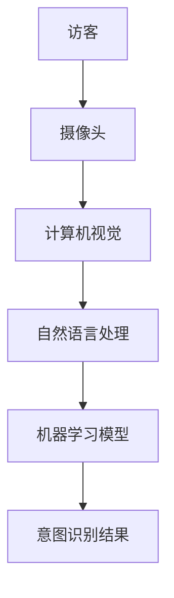
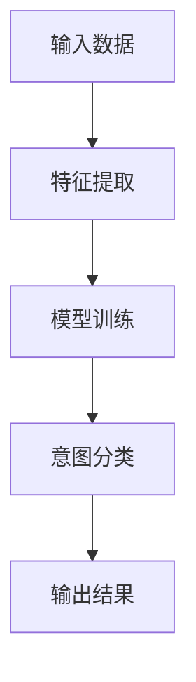
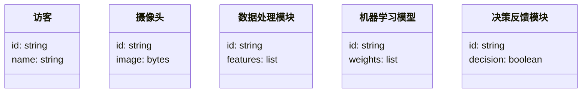
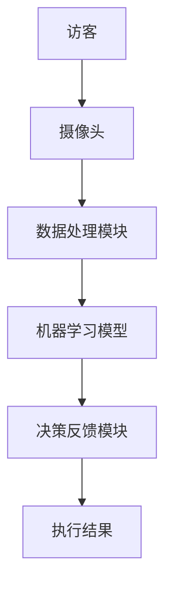

                 


# 智能门禁：AI Agent的访客意图识别

> 关键词：智能门禁、AI Agent、访客意图识别、计算机视觉、自然语言处理、深度学习

> 摘要：本文详细探讨了智能门禁系统中AI Agent的访客意图识别技术。通过分析问题背景、技术基础、核心概念和系统架构，结合实际项目案例，全面阐述了AI Agent在访客意图识别中的实现原理、算法设计和系统实现。本文旨在为读者提供一份从理论到实践的完整指南，帮助读者理解并掌握智能门禁中的访客意图识别技术。

---

## 第一部分: 智能门禁与AI Agent概述

### 第1章: 问题背景与技术基础

#### 1.1 问题背景

##### 1.1.1 智能门禁系统的发展历程

智能门禁系统是一种通过技术手段实现对出入口控制的自动化系统。最初，门禁系统主要依赖于机械锁和钥匙，后来逐步引入了电子锁、卡片识别技术（如RFID）和生物识别技术（如指纹、人脸识别）。随着人工智能技术的快速发展，智能门禁系统开始融入更多智能化功能，如访客意图识别、行为分析等。

##### 1.1.2 访客意图识别的挑战与需求

在传统的门禁系统中，访客的身份验证主要依赖于卡片或密码，这种方式无法有效识别访客的意图。例如，访客可能在未经授权的情况下试图强行进入，或者在合法访问时表现出异常行为。因此，如何通过技术手段准确识别访客的意图，成为智能门禁系统的一个重要挑战。

##### 1.1.3 AI Agent在智能门禁中的作用

AI Agent（智能代理）是一种能够感知环境、自主决策并执行任务的智能实体。在智能门禁系统中，AI Agent可以实时分析访客的行为、语言和环境信息，从而准确识别访客的意图，并做出相应的决策。例如，当访客试图强行进入时，AI Agent可以触发报警机制；当访客表现出异常行为时，AI Agent可以提醒安保人员进行干预。

#### 1.2 技术基础

##### 1.2.1 计算机视觉与图像处理

计算机视觉是AI Agent实现访客意图识别的重要技术之一。通过摄像头采集访客的图像信息，AI Agent可以识别人脸、行为和表情，从而判断访客的意图。例如，通过人脸识别技术，AI Agent可以验证访客的身份；通过行为分析技术，AI Agent可以识别访客是否试图强行进入。

##### 1.2.2 自然语言处理与意图识别

自然语言处理（NLP）是AI Agent实现意图识别的另一个重要技术。通过分析访客的语言表达，AI Agent可以理解访客的意图。例如，当访客说“我需要进入公司”时，AI Agent可以通过语义分析理解访客的意图，并结合其他信息（如时间、地点）做出决策。

##### 1.2.3 机器学习与深度学习基础

机器学习和深度学习是AI Agent的核心技术。通过训练模型，AI Agent可以学习访客的行为模式和语言表达，从而实现意图识别。例如，使用深度学习模型（如卷积神经网络CNN和循环神经网络RNN）对访客的图像和语言信息进行分析，从而实现高精度的意图识别。

---

### 第2章: AI Agent与访客意图识别的核心概念

#### 2.1 AI Agent的基本原理

##### 2.1.1 AI Agent的定义与分类

AI Agent是一种能够感知环境、自主决策并执行任务的智能实体。根据功能和应用场景的不同，AI Agent可以分为多种类型，如基于规则的AI Agent、基于模型的AI Agent、基于学习的AI Agent等。

##### 2.1.2 AI Agent的核心属性与特征

AI Agent的核心属性包括感知能力、决策能力、执行能力、学习能力和自适应能力。通过这些能力，AI Agent可以实现对环境的感知、意图的识别、决策的制定和任务的执行。

##### 2.1.3 AI Agent与传统算法的区别

与传统算法相比，AI Agent具有更强的自主性和适应性。传统算法通常需要明确的规则和输入条件，而AI Agent可以通过学习和自适应不断优化自身的性能。此外，AI Agent可以同时处理多种任务，并在复杂环境中做出实时决策。

#### 2.2 访客意图识别的实现原理

##### 2.2.1 访客行为分析的基本流程

访客意图识别的基本流程包括数据采集、数据处理、意图分析和决策反馈。通过摄像头和传感器采集访客的图像、声音和行为数据，然后通过计算机视觉和自然语言处理技术进行数据处理，最后通过机器学习模型进行意图分析，并根据分析结果做出决策反馈。

##### 2.2.2 意图识别的关键步骤

意图识别的关键步骤包括数据预处理、特征提取、意图分类和结果反馈。通过预处理数据，提取有效的特征，然后使用分类模型对意图进行分类，最后根据分类结果进行决策反馈。

##### 2.2.3 意图识别的数学模型与算法

意图识别的数学模型可以采用概率模型、决策树模型、支持向量机（SVM）和深度学习模型（如卷积神经网络CNN、循环神经网络RNN）等。例如，使用概率模型进行意图分类的公式如下：

$$ P(y|x) = \frac{P(x|y)P(y)}{P(x)} $$

其中，$P(y|x)$ 是后验概率，表示在输入$x$的情况下，目标类别$y$的概率。

---

### 第3章: 核心概念与系统架构

#### 3.1 核心概念对比分析

##### 3.1.1 不同AI模型的特征对比

不同AI模型的特征对比可以通过表格形式展示，如下：

| 模型类型 | 特征 | 优点 | 缺点 |
|----------|------|------|------|
| 基于规则的模型 | 需要明确的规则 | 实现简单，可解释性高 | 难以应对复杂场景 |
| 基于模型的模型 | 基于数学模型 | 精度高 | 实现复杂，可解释性低 |
| 基于学习的模型 | 基于数据学习 | 适应性强，精度高 | 实现复杂，需要大量数据 |

##### 3.1.2 不同意图识别方法的优劣势分析

不同的意图识别方法可以通过对比分析来展示，如下：

| 方法类型 | 优劣势 | 适用场景 |
|----------|--------|----------|
| 基于规则的方法 | 实现简单，可解释性高 | 简单场景 |
| 基于机器学习的方法 | 精度高，适应性强 | 复杂场景 |
| 基于深度学习的方法 | 精度极高，适应性极强 | 高精度需求场景 |

##### 3.1.3 系统架构的对比与选择

不同的系统架构可以通过Mermaid图展示，如下：



---

#### 3.2 系统架构设计

##### 3.2.1 系统功能模块划分

智能门禁系统的功能模块可以划分为以下部分：

1. 数据采集模块：通过摄像头和传感器采集访客的图像、声音和行为数据。
2. 数据处理模块：对采集的数据进行预处理和特征提取。
3. 意图分析模块：通过机器学习模型对意图进行分类。
4. 决策反馈模块：根据意图分类结果做出相应的决策，如开门、报警等。

##### 3.2.2 系统架构的ER图与数据流分析

系统的ER图可以通过Mermaid展示，如下：

```mermaid
er
actor 访客 {
  id: string
  name: string
}
actor 系统 {
  id: string
  decision: boolean
}
```

数据流分析如下：

1. 访客触发数据采集模块。
2. 数据采集模块将数据传输到数据处理模块。
3. 数据处理模块将数据传输到意图分析模块。
4. 意图分析模块将结果传输到决策反馈模块。
5. 决策反馈模块做出相应的决策。

##### 3.2.3 系统交互的Mermaid序列图

系统的交互流程可以通过Mermaid序列图展示，如下：

```mermaid
sequenceDiagram
actor 访客 -> 摄像头: 采集图像
摄像头 -> 数据处理模块: 传输图像
数据处理模块 -> 机器学习模型: 输入特征
机器学习模型 -> 决策反馈模块: 输出意图分类结果
决策反馈模块 -> 访客: 执行决策
```

---

## 第四部分: 算法原理与数学模型

### 第4章: 算法原理与数学模型

#### 4.1 意图识别算法原理

##### 4.1.1 基于概率的意图分类算法

基于概率的意图分类算法是一种经典的分类方法，其核心思想是通过计算后验概率来判断访客的意图。公式如下：

$$ P(y|x) = \frac{P(x|y)P(y)}{P(x)} $$

其中，$P(y|x)$ 是后验概率，$P(x|y)$ 是似然概率，$P(y)$ 是先验概率，$P(x)$ 是边缘概率。

##### 4.1.2 基于深度学习的意图识别模型

基于深度学习的意图识别模型通常采用卷积神经网络（CNN）或循环神经网络（RNN）进行特征提取和分类。例如，使用CNN对图像进行特征提取，然后使用RNN对序列数据进行分类。

##### 4.1.3 算法流程的Mermaid流程图

算法流程可以通过Mermaid流程图展示，如下：



---

#### 4.2 数学模型与公式

##### 4.2.1 概率分类模型的数学公式

概率分类模型的数学公式如下：

$$ P(y|x) = \frac{P(x|y)P(y)}{P(x)} $$

##### 4.2.2 深度学习模型的数学基础

深度学习模型的数学基础包括神经网络的前向传播和反向传播算法。前向传播公式如下：

$$ y = Wx + b $$

反向传播公式如下：

$$ \frac{\partial L}{\partial W} = (x^T \delta) $$

其中，$L$ 是损失函数，$W$ 是权重矩阵，$x$ 是输入数据，$b$ 是偏置项，$\delta$ 是误差信号。

##### 4.2.3 模型优化的数学推导

模型优化的数学推导包括梯度下降算法，如下：

$$ W = W - \eta \frac{\partial L}{\partial W} $$

其中，$\eta$ 是学习率，$\frac{\partial L}{\partial W}$ 是权重的梯度。

---

## 第五部分: 系统分析与架构设计

### 第5章: 系统分析与架构设计

#### 5.1 问题场景分析

##### 5.1.1 智能门禁系统的工作流程

智能门禁系统的工作流程包括以下步骤：

1. 访客触发数据采集模块。
2. 数据采集模块将数据传输到数据处理模块。
3. 数据处理模块将数据传输到意图分析模块。
4. 意图分析模块将结果传输到决策反馈模块。
5. 决策反馈模块做出相应的决策，如开门、报警等。

##### 5.1.2 访客意图识别的关键问题

访客意图识别的关键问题包括数据采集、数据处理、意图分析和决策反馈。其中，数据采集是关键的第一步，数据处理是核心的第二步，意图分析是关键的第三步，决策反馈是最终的第四步。

##### 5.1.3 系统设计的目标与约束

系统设计的目标是实现高精度的访客意图识别，系统设计的约束包括硬件限制、数据隐私和系统稳定性。

#### 5.2 系统功能设计

##### 5.2.1 系统功能模块划分

系统功能模块可以划分为以下部分：

1. 数据采集模块：通过摄像头和传感器采集访客的图像、声音和行为数据。
2. 数据处理模块：对采集的数据进行预处理和特征提取。
3. 意图分析模块：通过机器学习模型对意图进行分类。
4. 决策反馈模块：根据意图分类结果做出相应的决策，如开门、报警等。

##### 5.2.2 系统功能的领域模型Mermaid类图

系统的领域模型可以通过Mermaid类图展示，如下：



##### 5.2.3 系统功能的交互流程设计

系统的交互流程可以通过Mermaid序列图展示，如下：

```mermaid
sequenceDiagram
actor 访客 -> 摄像头: 采集图像
摄像头 --> 数据处理模块: 传输图像
数据处理模块 --> 机器学习模型: 输入特征
机器学习模型 --> 决策反馈模块: 输出意图分类结果
决策反馈模块 -> 访客: 执行决策
```

#### 5.3 系统架构设计

##### 5.3.1 系统架构的Mermaid架构图

系统的架构可以通过Mermaid架构图展示，如下：



##### 5.3.2 系统接口设计

系统的接口设计包括以下部分：

1. 数据采集接口：摄像头采集图像数据。
2. 数据处理接口：数据处理模块接收图像数据并进行特征提取。
3. 意图分析接口：机器学习模型接收特征数据并进行意图分类。
4. 决策反馈接口：决策反馈模块接收意图分类结果并做出决策。

##### 5.3.3 系统交互的Mermaid序列图

系统的交互流程可以通过Mermaid序列图展示，如下：

```mermaid
sequenceDiagram
actor 访客 -> 摄像头: 采集图像
摄像头 --> 数据处理模块: 传输图像
数据处理模块 --> 机器学习模型: 输入特征
机器学习模型 --> 决策反馈模块: 输出意图分类结果
决策反馈模块 -> 访客: 执行决策
```

---

## 第六部分: 项目实战与代码实现

### 第6章: 项目实战与代码实现

#### 6.1 环境安装与配置

##### 6.1.1 开发环境的选择与安装

开发环境可以选择Python编程语言，安装以下工具：

1. Python 3.8 或更高版本。
2. 计算机视觉库：OpenCV。
3. 自然语言处理库：spaCy或NLTK。
4. 深度学习框架：TensorFlow或PyTorch。

##### 6.1.2 依赖库的安装与配置

安装依赖库的命令如下：

```bash
pip install opencv-python
pip install spacy
pip install tensorflow
```

##### 6.1.3 数据集的准备与预处理

数据集的准备与预处理包括以下步骤：

1. 数据采集：通过摄像头采集访客的图像数据。
2. 数据标注：标注访客的意图（如正常访问、强行进入等）。
3. 数据分割：将数据集分为训练集和测试集。

#### 6.2 系统核心实现

##### 6.2.1 计算机视觉部分的实现

计算机视觉部分的实现包括图像采集和特征提取。代码示例如下：

```python
import cv2

# 采集图像
cap = cv2.VideoCapture(0)
ret, frame = cap.read()
if ret:
    cv2.imwrite("visitor_image.jpg", frame)
```

##### 6.2.2 自然语言处理部分的实现

自然语言处理部分的实现包括语音识别和语义分析。代码示例如下：

```python
import spacy

# 语音识别
nlp = spacy.load("en_core_web_sm")
text = "I need to enter the building"
doc = nlp(text)
print(doc)
```

##### 6.2.3 机器学习模型的实现

机器学习模型的实现包括特征提取和意图分类。代码示例如下：

```python
import tensorflow as tf
from tensorflow.keras import layers

# 深度学习模型
model = tf.keras.Sequential([
    layers.Conv2D(32, (3,3), activation='relu', input_shape=(100, 100, 3)),
    layers.MaxPooling2D((2,2)),
    layers.Flatten(),
    layers.Dense(128, activation='relu'),
    layers.Dense(2, activation='softmax')
])
model.compile(optimizer='adam', loss='sparse_categorical_crossentropy', metrics=['accuracy'])
model.fit(x_train, y_train, epochs=10, batch_size=32)
```

#### 6.3 代码应用解读与分析

##### 6.3.1 计算机视觉部分的代码解读

计算机视觉部分的代码实现了图像采集和特征提取。首先，使用OpenCV库采集图像数据，然后将图像保存为JPEG格式。代码如下：

```python
import cv2

# 采集图像
cap = cv2.VideoCapture(0)
ret, frame = cap.read()
if ret:
    cv2.imwrite("visitor_image.jpg", frame)
```

##### 6.3.2 自然语言处理部分的代码解读

自然语言处理部分的代码实现了语音识别和语义分析。使用spaCy库加载英语模型，并对输入文本进行处理。代码如下：

```python
import spacy

# 语音识别
nlp = spacy.load("en_core_web_sm")
text = "I need to enter the building"
doc = nlp(text)
print(doc)
```

##### 6.3.3 机器学习模型的代码解读

机器学习模型的代码实现了特征提取和意图分类。使用TensorFlow库构建一个卷积神经网络模型，对图像数据进行分类。代码如下：

```python
import tensorflow as tf
from tensorflow.keras import layers

# 深度学习模型
model = tf.keras.Sequential([
    layers.Conv2D(32, (3,3), activation='relu', input_shape=(100, 100, 3)),
    layers.MaxPooling2D((2,2)),
    layers.Flatten(),
    layers.Dense(128, activation='relu'),
    layers.Dense(2, activation='softmax')
])
model.compile(optimizer='adam', loss='sparse_categorical_crossentropy', metrics=['accuracy'])
model.fit(x_train, y_train, epochs=10, batch_size=32)
```

#### 6.4 实际案例分析与详细讲解剖析

##### 6.4.1 案例分析

假设我们有一个访客试图强行进入智能门禁系统，系统会通过摄像头采集访客的图像数据，并通过自然语言处理模块分析访客的语言表达。如果访客的行为和语言表达与授权访问不符，系统会触发报警机制。

##### 6.4.2 详细讲解剖析

通过上述案例分析，我们可以看到智能门禁系统中AI Agent的访客意图识别技术的核心流程包括数据采集、数据处理、意图分析和决策反馈。通过计算机视觉和自然语言处理技术，系统可以准确识别访客的意图，并做出相应的决策。

---

## 第七部分: 总结与展望

### 第7章: 总结与展望

#### 7.1 总结

智能门禁系统中的AI Agent访客意图识别技术通过结合计算机视觉、自然语言处理和机器学习技术，实现了对访客意图的准确识别。本文从问题背景、技术基础、核心概念和系统架构等方面进行了详细分析，并通过实际案例展示了技术的应用。

#### 7.2 展望

未来，随着人工智能技术的不断发展，智能门禁系统中的访客意图识别技术将更加智能化和精准化。例如，通过多模态数据融合技术，系统可以同时分析访客的图像、语音和行为数据，从而实现更高精度的意图识别。此外，随着边缘计算技术的发展，智能门禁系统将更加实时化和本地化，进一步提升系统的安全性和响应速度。

---

## 作者信息

作者：AI天才研究院/AI Genius Institute & 禅与计算机程序设计艺术 /Zen And The Art of Computer Programming

---

以上内容是基于《智能门禁：AI Agent的访客意图识别》的技术博客文章的完整目录和部分正文内容，涵盖了从理论到实践的各个方面，希望对读者有所帮助。

