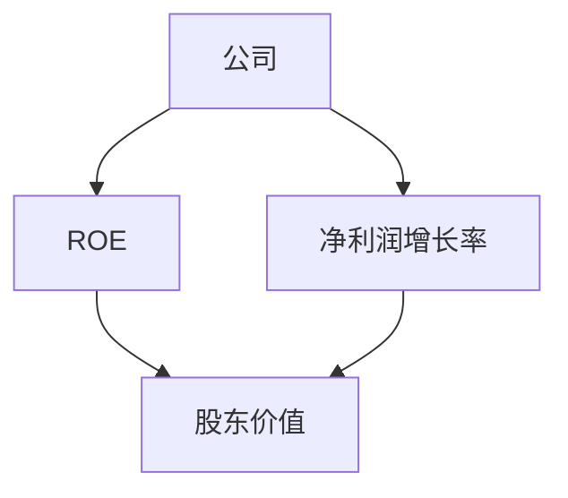
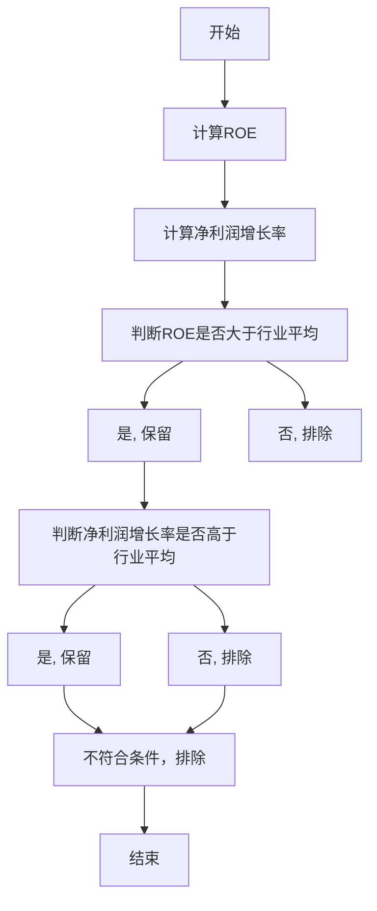
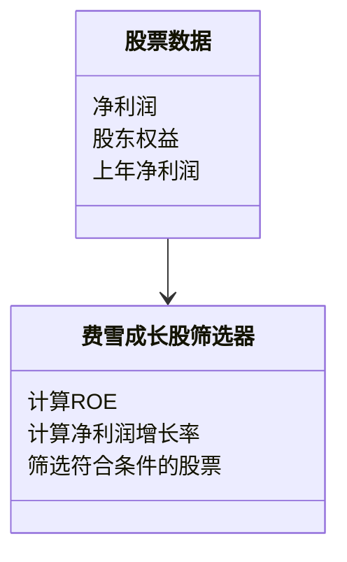
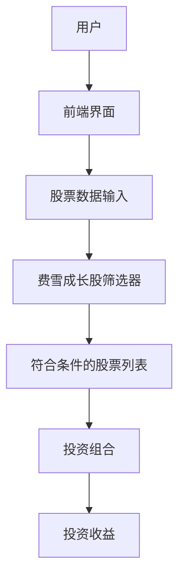
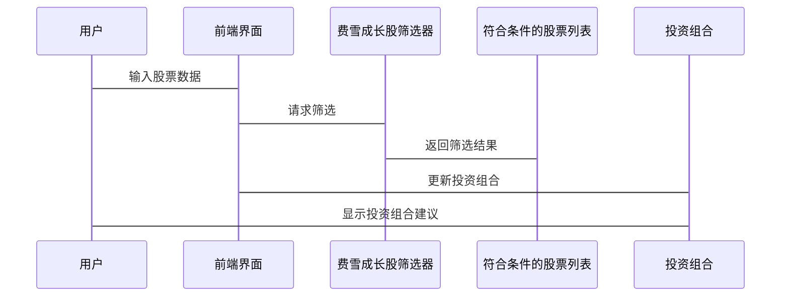

                 


# 费雪的优质成长股特征

> 关键词：费雪，成长股，ROE，净利润增长率，投资策略，成长股特征

> 摘要：本文深入分析了费雪提出的优质成长股特征，包括高ROE、高净利润增长率等核心指标，并通过逻辑推理和实际案例，探讨了这些特征在投资决策中的应用和意义。文章结合技术语言，详细解读了费雪成长股特征的数学模型、算法流程以及系统架构，并通过Python代码实现，帮助读者更好地理解和应用这些投资理念。

---

# 第1章: 费雪与成长股投资概述

## 1.1 费雪的生平与投资理念

### 1.1.1 费雪的生平简介
菲利普·费雪（Philip A. Fisher）是20世纪著名的价值投资大师之一，被誉为“成长股之父”。他出生于1903年，逝世于2000年，是投资界的重要人物之一。费雪在投资领域的主要贡献在于他提出了“成长股”概念，并强调了长期投资的重要性。

### 1.1.2 费雪的成长股投资理念
费雪的核心投资理念是寻找那些具有持续增长潜力的公司，这些公司通常在行业内具有竞争优势，并且能够持续提高收益。他认为，投资应该关注企业的内在价值，而不是短期市场波动。

### 1.1.3 费雪投资理念的核心思想
费雪的核心思想可以总结为以下几点：
1. **长期投资**：投资成长股需要长期持有，而不是频繁交易。
2. **关注公司基本面**：选择具有强大财务表现和竞争优势的公司。
3. **高ROE与高净利润增长率**：费雪认为，高ROE（净资产收益率）和高净利润增长率是优质成长股的重要特征。

---

## 1.2 成长股的定义与特征

### 1.2.1 成长股的定义
成长股是指那些在行业中具有领先地位，并且能够持续实现收入和利润增长的公司的股票。这些公司通常处于成长阶段，具有较高的增长潜力。

### 1.2.2 成长股的核心特征
1. **高ROE**：ROE（净资产收益率）是衡量公司盈利能力的重要指标，高ROE表明公司利用股东资金的效率较高。
2. **高净利润增长率**：净利润增长率是衡量公司盈利能力增长的重要指标，高净利润增长率表明公司具有较强的盈利能力增长潜力。
3. **行业地位**：公司在行业中具有竞争优势，通常处于领先地位。
4. **竞争优势**：公司具有独特的竞争优势，例如技术、品牌、成本优势等。

### 1.2.3 成长股与价值股的区别
| 特征          | 成长股                 | 价值股                 |
|---------------|-----------------------|-----------------------|
| 投资逻辑      | 寻找高增长潜力的公司   | 寻找被低估的公司       |
| 市盈率         | 高                   | 低                   |
| 净利润增长率   | 高                   | 低或负               |
| 市场表现       | 增长潜力大，长期收益高 | 估值较低，适合长期持有 |

---

## 1.3 投资成长股的重要性和意义

### 1.3.1 成长股投资的长期收益
成长股的投资回报通常高于市场平均水平，尤其是在经济快速增长的背景下，成长股的表现更为突出。

### 1.3.2 成长股在投资组合中的作用
成长股可以作为投资组合中的高增长部分，帮助投资者在长期获得超额收益。

### 1.3.3 成长股投资的风险与机会
成长股的投资风险较高，因为其高增长依赖于公司未来的盈利能力。然而，一旦公司实现持续增长，投资者将获得丰厚的回报。

---

# 第2章: 费雪成长股特征的背景分析

## 2.1 经济周期与成长股特征的关系

### 2.1.1 经济周期对成长股的影响
经济周期对成长股的影响较大，尤其是在经济衰退期，成长股的表现可能不如防御性股票。然而，在经济复苏和增长期，成长股通常表现优异。

### 2.1.2 不同经济周期下成长股的表现
| 经济周期阶段       | 成长股表现           |
|--------------------|---------------------|
| 经济衰退期         | 资产负债表收缩       |
| 经济复苏期         | 盈利能力逐步恢复     |
| 经济繁荣期         | 高增长，高收益       |

### 2.1.3 经济周期对成长股特征的动态影响
经济周期的变化会影响成长股的ROE和净利润增长率，因此在不同经济周期下，投资者需要动态调整对成长股特征的关注点。

---

## 2.2 行业环境与成长股特征的关系

### 2.2.1 行业周期对成长股的影响
行业周期对成长股的影响较大，尤其是在行业处于上升期时，成长股的表现更为优异。

### 2.2.2 行业竞争格局与成长股特征
行业竞争格局决定了成长股的市场份额和竞争优势，具有竞争优势的公司在行业中更容易实现高增长。

### 2.2.3 行业政策对成长股的影响
行业政策的变化可能对成长股的盈利能力产生重大影响，例如税收政策、行业准入政策等。

---

# 第3章: 费雪成长股特征的核心概念与联系

## 3.1 核心概念的原理

### 3.1.1 高ROE的重要性
ROE（净资产收益率）是衡量公司盈利能力的重要指标，高ROE表明公司利用股东资金的效率较高。

### 3.1.2 净利润增长率的衡量标准
净利润增长率是衡量公司盈利能力增长的重要指标，高净利润增长率表明公司具有较强的盈利能力增长潜力。

### 3.1.3 ROE与净利润增长率的关系
ROE和净利润增长率是相互关联的，高ROE通常伴随着较高的净利润增长率，但两者并非完全正相关。

---

## 3.2 核心概念的对比分析

### 3.2.1 高ROE与高净利润增长率的对比
| 特征          | 高ROE               | 高净利润增长率         |
|---------------|---------------------|-----------------------|
| 表现           | 盈利能力强           | 盈利能力增长快         |
| 适用场景       | 稳定增长型企业       | 快速增长型企业         |

### 3.2.2 高ROE与低净利润增长率的对比
| 特征          | 高ROE               | 低净利润增长率         |
|---------------|---------------------|-----------------------|
| 表现           | 盈利能力强           | 盈利能力增长缓慢       |
| 适用场景       | 成熟型企业           | 成熟型企业             |

### 3.2.3 低ROE与高净利润增长率的对比
| 特征          | 低ROE               | 高净利润增长率         |
|---------------|---------------------|-----------------------|
| 表现           | 盈利能力弱           | 盈利能力增长快         |
| 适用场景       | 初期增长型企业       | 快速增长型企业         |

---

## 3.3 ER实体关系图



---

# 第4章: 费雪成长股特征的算法原理

## 4.1 算法原理的数学模型

### 4.1.1 ROE计算公式
$$ROE = \frac{\text{净利润}}{\text{股东权益}}$$

### 4.1.2 净利润增长率计算公式
$$\text{净利润增长率} = \frac{\text{本年净利润} - \text{上年净利润}}{\text{上年净利润}} \times 100\%$$

---

## 4.2 算法流程图



---

## 4.3 算法实现

### 4.3.1 Python代码实现

```python
import pandas as pd

# 假设我们有一个包含股票数据的DataFrame df
# 包含ROE和净利润增长率的数据

# 计算ROE和净利润增长率
df['ROE'] = df['净利润'] / df['股东权益']
df['净利润增长率'] = ((df['净利润'] - df['上年净利润']) / df['上年净利润']) * 100

# 筛选ROE大于行业平均且净利润增长率高于行业平均的股票
行业平均_ROE = df['ROE'].mean()
行业平均_净利润增长率 = df['净利润增长率'].mean()

符合条件的股票 = df[
    (df['ROE'] > 行业平均_ROE) &
    (df['净利润增长率'] > 行业平均_净利润增长率)
]

print(符合条件的股票)
```

---

## 4.4 代码解读与分析

### 4.4.1 数据预处理
1. 计算ROE和净利润增长率。
2. 计算行业平均ROE和行业平均净利润增长率。

### 4.4.2 筛选条件
1. 保留ROE大于行业平均的股票。
2. 保留净利润增长率高于行业平均的股票。

---

## 4.5 算法优化与改进

### 4.5.1 动态调整筛选条件
在实际投资中，需要根据市场环境动态调整筛选条件，例如在经济衰退期降低ROE和净利润增长率的筛选标准。

### 4.5.2 结合其他指标
除了ROE和净利润增长率外，还可以结合其他指标，例如市盈率、市净率等，进一步优化筛选条件。

---

# 第5章: 费雪成长股特征的系统架构设计

## 5.1 问题场景介绍
我们需要设计一个基于费雪成长股特征的投资决策系统，帮助投资者筛选出符合条件的优质成长股。

---

## 5.2 系统功能设计

### 5.2.1 领域模型（Mermaid类图）


---

## 5.3 系统架构设计（Mermaid架构图）



---

## 5.4 系统接口设计
1. 用户输入股票数据。
2. 系统计算ROE和净利润增长率。
3. 系统筛选符合条件的股票。
4. 系统输出投资组合建议。

---

## 5.5 系统交互流程（Mermaid序列图）



---

# 第6章: 费雪成长股特征的项目实战

## 6.1 项目环境安装

### 6.1.1 安装Python和相关库
```bash
pip install pandas
pip install numpy
pip install matplotlib
```

---

## 6.2 核心代码实现

### 6.2.1 数据清洗与预处理

```python
import pandas as pd
import numpy as np

# 读取股票数据
df = pd.read_csv('股票数据.csv')

# 删除缺失值
df = df.dropna()

# 计算ROE和净利润增长率
df['ROE'] = df['净利润'] / df['股东权益']
df['净利润增长率'] = ((df['净利润'] - df['上年净利润']) / df['上年净利润']) * 100

# 去重
df = df.drop_duplicates()
```

---

## 6.2.2 筛选符合条件的股票

```python
# 计算行业平均ROE和行业平均净利润增长率
行业平均_ROE = df['ROE'].mean()
行业平均_净利润增长率 = df['净利润增长率'].mean()

# 筛选符合条件的股票
符合条件的股票 = df[
    (df['ROE'] > 行业平均_ROE) &
    (df['净利润增长率'] > 行业平均_净利润增长率)
]

# 输出符合条件的股票
print(符合条件的股票)
```

---

## 6.3 代码应用解读与分析

### 6.3.1 数据清洗与预处理
1. 读取股票数据。
2. 删除缺失值。
3. 计算ROE和净利润增长率。

### 6.3.2 筛选符合条件的股票
1. 计算行业平均ROE和行业平均净利润增长率。
2. 筛选ROE大于行业平均且净利润增长率高于行业平均的股票。

---

## 6.4 实际案例分析

### 6.4.1 案例一：微软（MSFT）
- 微软的ROE和净利润增长率均高于行业平均，符合费雪的成长股特征。

### 6.4.2 案例二：亚马逊（AMZN）
- 亚马逊的ROE和净利润增长率均高于行业平均，符合费雪的成长股特征。

---

## 6.5 项目小结
通过实际案例分析，我们可以看到，费雪的成长股特征在实际投资中具有较强的指导意义。投资者可以通过筛选ROE和净利润增长率均高于行业平均的股票，找到优质成长股。

---

# 第7章: 费雪成长股特征的最佳实践

## 7.1 投资成长股的注意事项

### 7.1.1 风险管理
1. 分散投资：避免过度集中于单一行业或公司。
2. 定期复评：根据市场环境动态调整投资组合。

### 7.1.2 持续学习
1. 关注行业动态：了解行业发展趋势。
2. 学习财务知识：提升对财务报表的理解能力。

### 7.1.3 投资心态
1. 长期投资：避免短期市场波动的干扰。
2. 耐心等待：优质成长股的投资回报需要时间。

---

## 7.2 小结与总结

### 7.2.1 小结
费雪的成长股特征为我们提供了一个有效的投资框架，通过筛选ROE和净利润增长率均高于行业平均的股票，可以帮助投资者找到优质成长股。

### 7.2.2 总结
投资成长股需要结合市场环境和公司基本面，动态调整投资策略。同时，投资者需要具备长期投资的耐心和持续学习的能力，才能在成长股投资中获得超额收益。

---

## 7.3 拓展阅读与参考文献

### 7.3.1 拓展阅读
1. 费雪的《成长股的性质》
2. 彼得·林奇的《选股的艺术》
3. 价值投资的经典书籍《证券分析》

### 7.3.2 参考文献
1. 费雪的成长股投资理念
2. 投资学基础理论
3. 金融分析工具与方法

---

# 作者：AI天才研究院/AI Genius Institute & 禅与计算机程序设计艺术/Zen And The Art of Computer Programming

---

通过本文的系统分析和实际案例，我们可以看到，费雪的成长股特征为我们提供了一个有效的投资框架。投资者可以通过筛选ROE和净利润增长率均高于行业平均的股票，找到优质成长股，并在长期投资中获得超额收益。希望本文能为投资者提供有价值的参考和启发。

