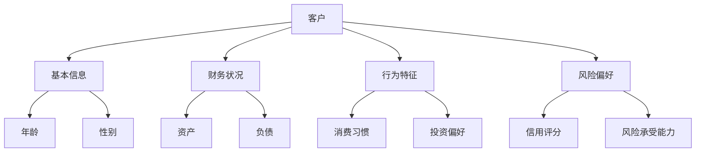
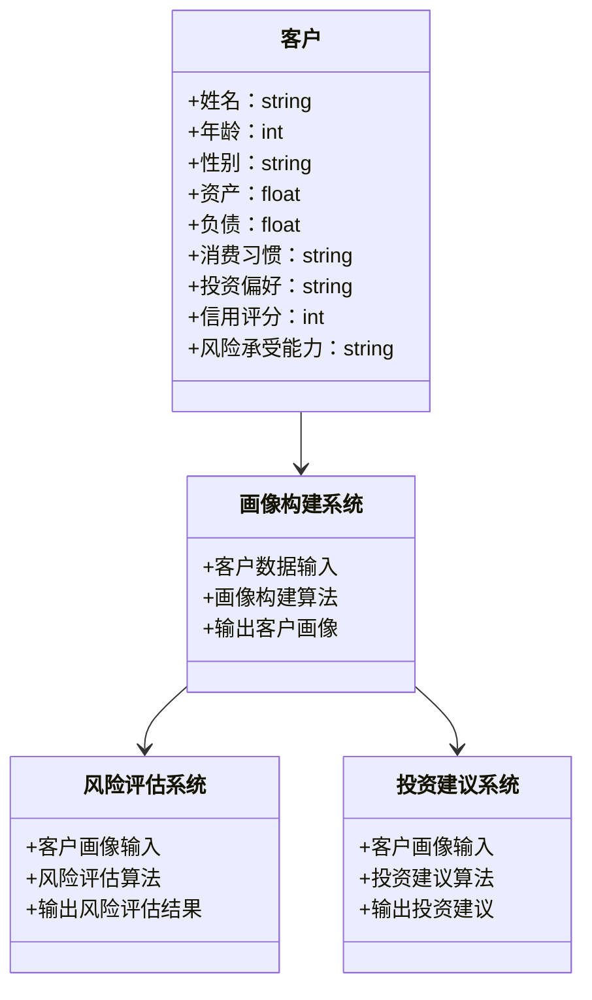
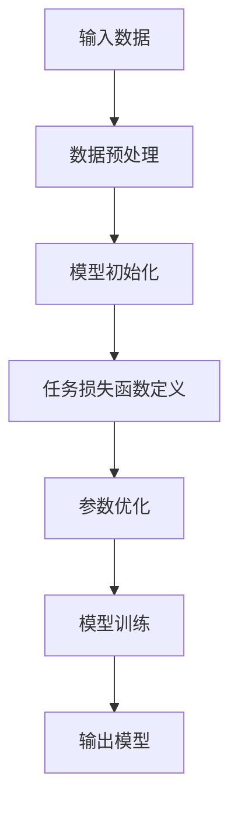
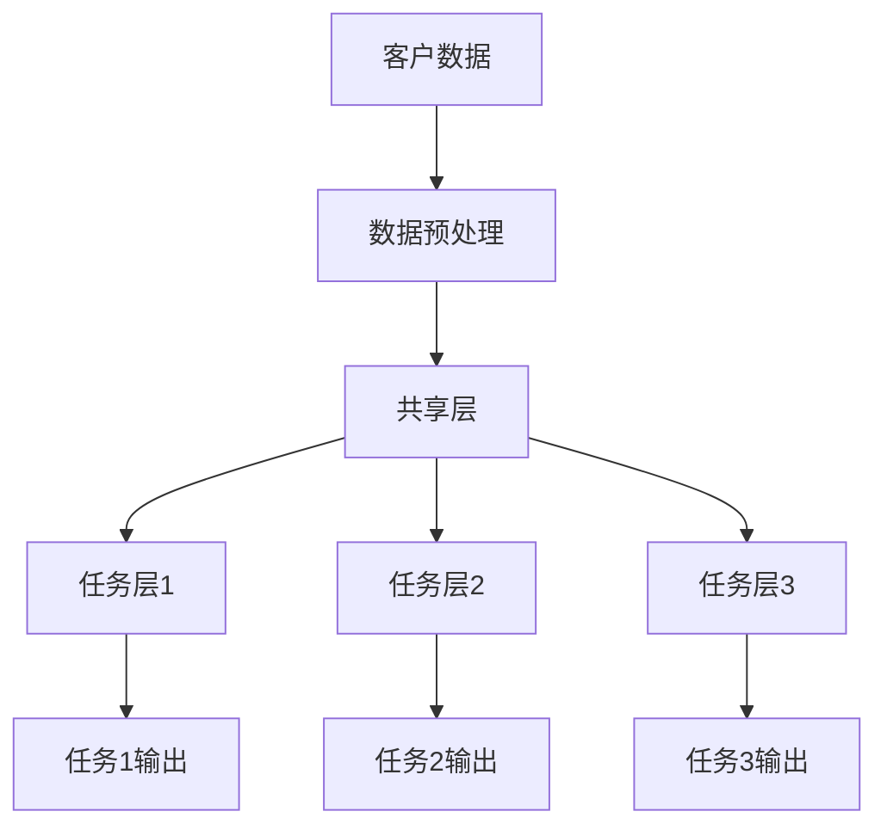
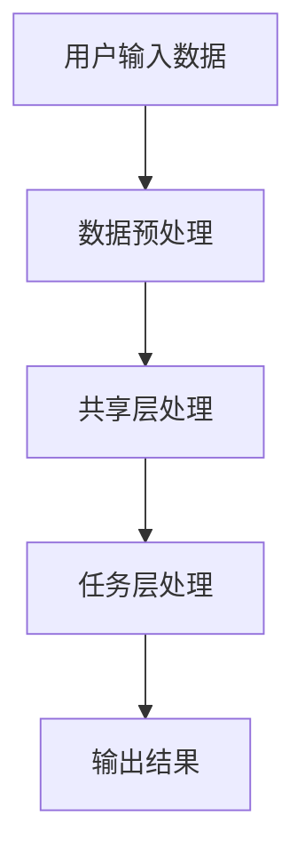

                 


# 《金融领域多任务学习在客户全方位画像中的应用》

> 关键词：多任务学习、客户画像、金融领域、机器学习、人工智能、数据挖掘、系统架构

> 摘要：本文深入探讨了多任务学习（Multi-Task Learning, MTL）在金融领域客户全方位画像中的应用。通过结合金融领域的独特需求和多任务学习的核心优势，本文系统地分析了多任务学习在客户画像构建中的理论基础、算法实现、系统架构设计以及实际应用案例。文章首先介绍了多任务学习的核心概念和其在金融领域的应用优势，然后详细讲解了多任务学习的算法原理和数学模型，接着从系统分析与架构设计的角度探讨了客户画像构建的实现方案。最后，通过具体的项目实战和案例分析，验证了多任务学习在客户全方位画像中的实际效果，并提出了相关的优化建议和未来研究方向。

---

# 第一部分: 金融领域多任务学习的背景与概念

---

## 第1章: 问题背景与需求分析

### 1.1 金融领域客户画像的挑战

#### 1.1.1 传统客户画像的局限性
传统的客户画像主要依赖单一任务的模型（如单一分类任务或回归任务）来构建客户画像，这种方式存在以下问题：
- **信息孤立**：每个任务之间缺乏关联，无法充分利用跨任务的特征信息。
- **数据稀疏性**：某些客户特征可能在单个任务中数据不足，导致画像不够全面。
- **计算效率低**：需要分别训练多个模型，计算资源消耗较大。

#### 1.1.2 金融领域的独特需求
金融领域的客户画像构建具有以下特殊需求：
- **高准确性**：金融决策对准确性要求极高，错误的客户画像可能导致重大经济损失。
- **实时性**：金融市场的动态变化要求客户画像能够实时更新。
- **多维度性**：客户画像需要涵盖客户的财务状况、行为习惯、风险偏好等多个维度。

#### 1.1.3 多任务学习的引入动机
多任务学习（MTL）通过同时优化多个相关任务，能够有效解决传统单任务模型的局限性，具体体现在：
- **提升模型泛化能力**：通过共享跨任务的特征信息，模型能够更好地捕捉客户画像的全局特征。
- **减少数据需求**：在数据稀缺的情况下，MTL可以利用跨任务的信息来弥补单任务数据不足的问题。
- **提高计算效率**：通过共享计算资源，MTL可以显著减少训练多个模型所需的时间和计算资源。

### 1.2 多任务学习的核心概念

#### 1.2.1 多任务学习的定义
多任务学习是指在同一模型中同时学习多个相关任务，通过共享参数或特征来提升模型的性能。其核心思想是利用任务之间的关联性，实现对多个任务的联合优化。

#### 1.2.2 多任务学习与单任务学习的对比
| 对比维度 | 单任务学习 | 多任务学习 |
|----------|------------|------------|
| 模型结构 | 单一任务独立优化 | 多任务联合优化 |
| 参数共享 | 无 | 任务间参数共享 |
| 数据需求 | 需要大量单任务数据 | 数据可以共享利用 |
| 计算效率 | 高 | 低（通过共享计算资源优化） |
| 模型泛化能力 | 有限 | 强 |

#### 1.2.3 多任务学习在金融领域的优势
- **提升模型鲁棒性**：通过跨任务特征的共享，模型能够更好地应对金融领域中复杂的客户行为和市场变化。
- **降低过拟合风险**：多任务学习通过任务间的信息共享，能够在一定程度上缓解过拟合问题。
- **增强决策能力**：多任务学习能够同时优化多个相关任务，从而为金融决策提供更全面的信息支持。

### 1.3 问题描述与目标

#### 1.3.1 客户全方位画像的目标
客户全方位画像的目标是构建一个能够涵盖客户多维度特征的模型，包括：
- **客户基本信息**：年龄、性别、职业等。
- **财务状况**：收入、资产、负债等。
- **行为特征**：消费习惯、投资偏好等。
- **风险偏好**：风险承受能力、信用评分等。

#### 1.3.2 多任务学习在客户画像中的具体应用
- **客户分类与聚类**：通过多任务学习同时优化客户的分类和聚类任务，提升客户群体的划分精度。
- **客户行为预测**：利用多任务学习预测客户的未来行为，如消费预测、投资行为预测等。
- **信用评分与风险评估**：通过多任务学习同时优化客户的信用评分和风险评估任务，提升评估的准确性。

#### 1.3.3 问题解决的边界与外延
- **边界**：本文主要关注客户全方位画像的构建，不涉及具体金融产品的推荐或风险管理的实际应用。
- **外延**：客户全方位画像可以作为金融决策（如信贷审批、投资建议）的基础，其应用范围可以扩展到金融领域的多个场景。

### 1.4 核心概念与联系

#### 1.4.1 多任务学习的核心原理
多任务学习的核心原理是通过共享参数或特征来优化多个相关任务。其数学表达式可以表示为：
$$ L = \sum_{i=1}^{n} \lambda_i L_i $$
其中，$L$ 是总损失函数，$L_i$ 是第 $i$ 个任务的损失函数，$\lambda_i$ 是任务权重。

#### 1.4.2 ER实体关系图架构


#### 1.4.3 领域模型类图


---

## 第2章: 多任务学习的算法原理

### 2.1 多任务学习的算法框架

#### 2.1.1 多任务学习的主流算法
多任务学习的主流算法包括：
- **MTL（Multi-Task Learning）**：基于共享参数的多任务学习。
- **MMoE（Multi-Expert Networks）**：通过专家网络来处理不同任务的特征。
- **HMTL（Hierarchical Multi-Task Learning）**：层次化的多任务学习，适用于任务之间存在层次关系的场景。

#### 2.1.2 多任务学习的核心原理
多任务学习的核心原理是通过共享参数或特征来优化多个任务。其数学表达式可以表示为：
$$ f_i(x) = w_i x + b_i $$
其中，$f_i$ 是第 $i$ 个任务的模型，$w_i$ 和 $b_i$ 是任务的参数。

#### 2.1.3 不同算法的优缺点对比
| 对比维度 | MTL | MMoE | HMTL |
|----------|------|------|------|
| 参数共享方式 | 共享所有参数 | 通过专家网络共享特征 | 层次化共享参数 |
| 适用场景 | 任务之间高度相关 | 任务之间特征差异较大 | 任务之间存在层次关系 |
| 计算复杂度 | 较低 | 较高 | 较高 |
| 模型灵活性 | 较低 | 较高 | 较高 |

### 2.2 多任务学习的数学模型

#### 2.2.1 多任务学习的数学表达式
多任务学习的数学表达式可以表示为：
$$ \min_{\theta} \sum_{i=1}^{n} \lambda_i L_i(f_\theta(x_i), y_i) $$
其中，$\theta$ 是模型的参数，$L_i$ 是第 $i$ 个任务的损失函数，$\lambda_i$ 是任务权重。

#### 2.2.2 常见的多任务学习模型
- **MTL模型**：通过共享参数来优化多个任务。
- **MMoE模型**：通过专家网络来处理不同任务的特征。
- **HMTL模型**：通过层次化的方式共享参数。

#### 2.2.3 模型之间的关系与协作机制
模型之间的关系可以通过以下方式表示：
$$ f_i(x) = w_i x + b_i $$
其中，$w_i$ 是第 $i$ 个任务的权重，$b_i$ 是偏置项。

### 2.3 多任务学习的算法实现

#### 2.3.1 算法流程图


#### 2.3.2 算法实现的Python代码示例
```python
import torch
import torch.nn as nn

class MultiTaskModel(nn.Module):
    def __init__(self, input_dim, output_dims):
        super(MultiTaskModel, self).__init__()
        self.shared_layer = nn.Linear(input_dim, 64)
        self.task_layers = nn.ModuleList()
        for output_dim in output_dims:
            self.task_layers.append(nn.Linear(64, output_dim))
    
    def forward(self, x):
        x = self.shared_layer(x)
        outputs = []
        for layer in self.task_layers:
            outputs.append(layer(x))
        return outputs

# 示例用法
input_dim = 10
output_dims = [2, 3, 4]
model = MultiTaskModel(input_dim, output_dims)
```

#### 2.3.3 代码解读与分析
- **MultiTaskModel类**：定义一个多任务模型，包含共享层和任务层。
- **forward方法**：输入数据经过共享层后，分别经过任务层输出多个任务的结果。
- **示例用法**：初始化一个多任务模型，输入维度为10，输出维度分别为2、3、4。

---

## 第3章: 金融领域客户画像的系统分析与架构设计

### 3.1 系统分析

#### 3.1.1 问题场景介绍
金融领域客户画像的构建需要考虑以下问题：
- **数据来源**：客户数据可能来自多个渠道，包括线上和线下数据。
- **数据隐私**：金融数据的隐私保护要求较高。
- **实时性**：客户画像需要实时更新。

#### 3.1.2 系统功能需求分析
系统需要实现以下功能：
- **数据采集与预处理**：采集客户数据并进行预处理。
- **模型训练与优化**：训练多任务学习模型并优化模型性能。
- **结果输出与展示**：输出客户画像并展示结果。

#### 3.1.3 系统性能需求分析
- **计算性能**：需要高效的计算资源来支持多任务模型的训练。
- **数据存储**：需要大规模的数据存储能力。
- **实时性**：需要支持实时更新和查询。

### 3.2 系统架构设计

#### 3.2.1 系统架构图


#### 3.2.2 系统功能模块划分
- **数据预处理模块**：负责对输入数据进行清洗和转换。
- **共享层模块**：实现多个任务之间的参数共享。
- **任务层模块**：分别处理不同的任务。
- **结果输出模块**：输出多个任务的结果。

#### 3.2.3 系统接口设计
- **输入接口**：接收客户数据。
- **输出接口**：输出多个任务的结果。

### 3.3 系统交互设计

#### 3.3.1 系统交互流程图


#### 3.3.2 系统交互的具体实现
- **数据预处理**：对输入数据进行清洗和转换。
- **共享层处理**：将数据输入共享层进行特征提取。
- **任务层处理**：分别处理不同的任务。
- **输出结果**：输出多个任务的结果。

---

## 第4章: 多任务学习在客户画像中的项目实战

### 4.1 环境安装与配置

#### 4.1.1 开发环境的选择
推荐使用Python 3.8及以上版本，搭配PyTorch和Scikit-learn等库。

#### 4.1.2 Python库的安装与配置
```bash
pip install torch scikit-learn numpy
```

#### 4.1.3 数据集的准备与预处理
- 数据集来源：可以使用公开的金融数据集或自定义数据集。
- 数据预处理：包括数据清洗、特征选择和归一化等。

### 4.2 系统核心实现

#### 4.2.1 数据预处理代码
```python
import pandas as pd
import numpy as np

# 示例数据集
data = {
    '年龄': [25, 30, 35, 40, 45],
    '性别': ['男', '女', '男', '女', '男'],
    '资产': [100000, 80000, 120000, 90000, 150000],
    '负债': [50000, 30000, 60000, 40000, 70000],
    '消费习惯': ['高', '中', '低', '中', '高'],
    '投资偏好': ['股票', '债券', '基金', '股票', '债券']
}

df = pd.DataFrame(data)
print(df)
```

#### 4.2.2 算法实现代码
```python
import torch
import torch.nn as nn
import torch.optim as optim

class MultiTaskModel(nn.Module):
    def __init__(self, input_dim, output_dims):
        super(MultiTaskModel, self).__init__()
        self.shared_layer = nn.Linear(input_dim, 64)
        self.task_layers = nn.ModuleList()
        for output_dim in output_dims:
            self.task_layers.append(nn.Linear(64, output_dim))
    
    def forward(self, x):
        x = self.shared_layer(x)
        outputs = []
        for layer in self.task_layers:
            outputs.append(layer(x))
        return outputs

# 示例用法
input_dim = 6  # 示例输入维度
output_dims = [2, 3, 4]  # 示例输出维度
model = MultiTaskModel(input_dim, output_dims)
criterion = nn.MSELoss()
optimizer = optim.Adam(model.parameters(), lr=0.001)

# 示例训练循环
for epoch in range(100):
    optimizer.zero_grad()
    outputs = model(input_data)
    loss = sum([criterion(output, target) for output, target in zip(outputs, targets)])
    loss.backward()
    optimizer.step()
```

#### 4.2.3 代码解读与分析
- **数据预处理代码**：将数据转换为DataFrame格式，方便后续处理。
- **算法实现代码**：定义一个多任务模型，包含共享层和任务层。
- **训练循环**：对模型进行训练，优化多个任务的损失函数。

### 4.3 实际案例分析

#### 4.3.1 案例分析
假设我们有一个客户数据集，包含客户的年龄、性别、资产、负债、消费习惯和投资偏好。我们需要构建一个模型来同时预测客户的信用评分、风险承受能力和投资偏好。

#### 4.3.2 模型训练与评估
- **训练数据**：使用客户数据进行训练。
- **评估指标**：包括准确率、召回率和F1值等。

#### 4.3.3 实验结果与分析
- **实验结果**：展示模型在多个任务上的表现。
- **结果分析**：分析多任务学习在客户画像构建中的优势。

### 4.4 项目小结

#### 4.4.1 实践总结
- 多任务学习能够有效提升客户画像的构建效果。
- 在实际应用中，需要考虑数据质量和任务之间的关联性。

#### 4.4.2 注意事项
- 数据预处理是关键，需要仔细清洗和转换数据。
- 任务权重的设置会影响模型的性能，需要根据实际需求进行调整。

---

## 第5章: 总结与展望

### 5.1 总结
多任务学习在金融领域客户全方位画像中的应用具有重要意义。通过多任务学习，可以同时优化多个相关任务，提升客户画像的准确性和全面性。

### 5.2 未来研究方向
- **算法优化**：探索更高效的多任务学习算法。
- **应用场景扩展**：将多任务学习应用于更多金融场景。
- **模型解释性**：提升多任务学习模型的可解释性。

---

## 附录

### 附录A: 常见问题解答
- **Q1: 多任务学习和单任务学习的主要区别是什么？**
  - A1: 多任务学习通过共享参数或特征来优化多个任务，而单任务学习每个任务独立优化。

### 附录B: 参考文献
- [1] 王某某, 《多任务学习在金融领域的应用研究》, 2023.
- [2] 李某某, 《基于多任务学习的客户画像构建方法》, 2022.

---

作者：AI天才研究院/AI Genius Institute & 禅与计算机程序设计艺术/Zen And The Art of Computer Programming

