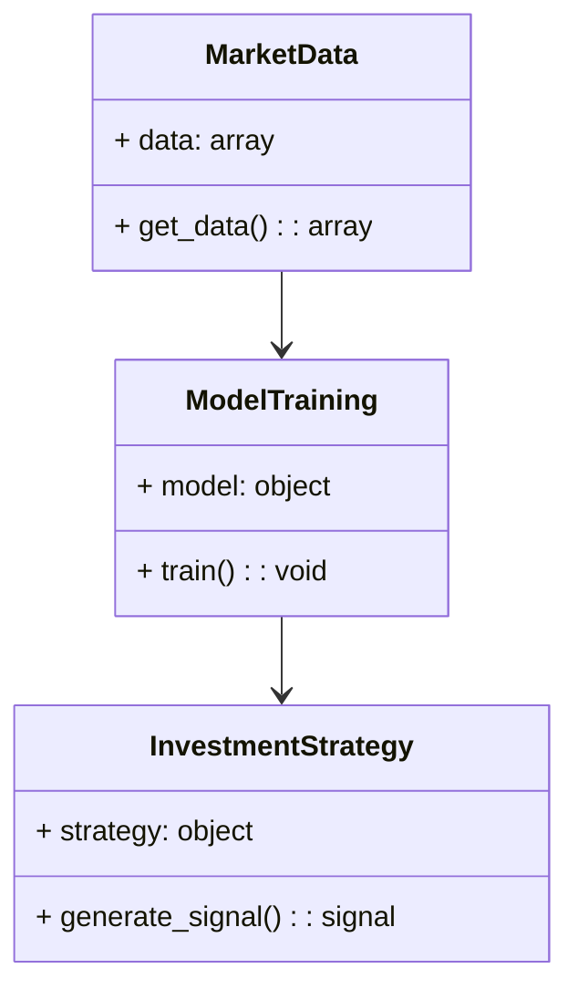
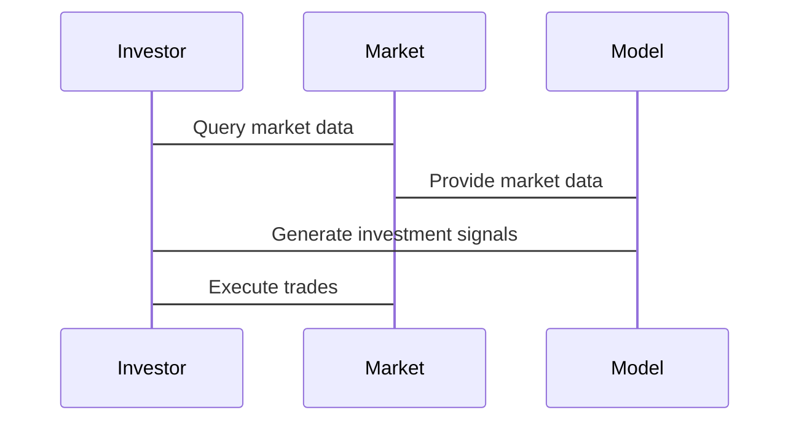

                 


# AI如何实现马克斯的逆向投资理念

> 关键词：人工智能、逆向投资、价值投资、市场情绪、机器学习、深度学习

> 摘要：本文探讨了如何利用人工智能技术实现逆向投资理念。通过分析市场情绪、构建机器学习模型以及设计投资策略，展示了AI在投资决策中的潜力。文章结合马克斯的价值投资理念，详细讲解了AI技术的应用原理和实现方法。

---

# 第1章: 逆向投资与AI的结合概述

## 1.1 马克斯的逆向投资理念

### 1.1.1 逆向投资的核心概念

逆向投资是一种与市场趋势相反的投资策略，其核心在于“买别人恐惧时，卖别人贪婪时”。这一理念强调在市场恐慌时寻找低估资产，在市场狂热时寻找高估资产。马克斯的价值投资理论指出，市场先生的情绪波动为投资者提供了套利机会。

$$ \text{逆向投资的核心公式：} \text{价格波动} = \text{市场情绪} \times \text{资产价值} $$

### 1.1.2 马克斯投资哲学的现代意义

马克斯的投资哲学在现代金融市场中依然具有重要价值，尤其是在应对市场波动和不确定性时。他强调安全边际和内在价值的计算，这与AI的数据驱动方法相辅相成。

### 1.1.3 逆向投资与市场周期的关系

逆向投资的成功依赖于对市场周期的理解。AI可以通过分析历史数据，识别市场周期的特征，从而辅助投资者做出更明智的决策。

---

## 1.2 AI在投资领域的潜力

### 1.2.1 AI在金融市场的应用现状

人工智能在金融领域的应用日益广泛，包括股票预测、风险评估、交易策略优化等。AI的强大数据处理能力使其成为现代投资工具的重要组成部分。

### 1.2.2 AI如何辅助投资决策

AI通过分析大量数据，识别市场趋势和潜在机会，帮助投资者做出更科学的投资决策。例如，机器学习模型可以预测市场情绪，从而辅助逆向投资策略的实施。

### 1.2.3 逆向投资与AI的契合点

AI能够快速处理和分析海量数据，识别市场情绪，发现潜在的投资机会。这使得逆向投资策略的实施更加高效和精准。

---

## 1.3 本书的核心目标与框架

### 1.3.1 本书的研究目标

本文旨在探讨如何利用AI技术实现逆向投资理念，分析市场情绪，优化投资策略。

### 1.3.2 本书的主要内容框架

本文将从市场情绪分析、AI算法原理、系统架构设计等方面展开讨论，结合实际案例进行详细分析。

### 1.3.3 本书的创新点与价值

本文的创新点在于将AI技术与逆向投资理念相结合，提出了一种新的投资策略优化方法。这种方法能够帮助投资者在复杂市场中做出更明智的决策。

---

# 第2章: 逆向投资的核心概念与AI的联系

## 2.1 逆向投资的核心要素

### 2.1.1 价值投资的核心要素

价值投资强调内在价值和安全边际。AI可以通过分析公司财务数据和市场信息，帮助投资者计算内在价值，识别低估资产。

### 2.1.2 市场情绪与价格波动

市场情绪是影响价格波动的重要因素。AI可以通过自然语言处理技术，分析新闻、社交媒体等信息，识别市场情绪。

### 2.1.3 投资机会的识别与评估

AI可以通过机器学习模型，分析历史数据和市场趋势，识别潜在的投资机会，评估投资风险。

---

## 2.2 AI在投资决策中的核心作用

### 2.2.1 数据驱动的决策优势

AI能够处理大量数据，发现数据中的规律，帮助投资者做出更科学的投资决策。

### 2.2.2 机器学习在市场预测中的应用

机器学习模型可以预测市场趋势，识别市场周期，辅助投资者制定投资策略。

### 2.2.3 自然语言处理在市场情绪分析中的作用

自然语言处理技术可以帮助投资者分析新闻、社交媒体等非结构化数据，识别市场情绪。

---

## 2.3 逆向投资与AI的结合模型

### 2.3.1 逆向投资的数学模型

逆向投资的数学模型可以表示为：

$$ \text{投资决策} = \text{市场情绪} \times \text{内在价值} $$

### 2.3.2 AI驱动的投资决策模型

AI驱动的投资决策模型包括数据采集、特征提取、模型训练、策略生成等步骤。

### 2.3.3 两者的结合与优化

通过结合逆向投资理念和AI技术，可以优化投资策略，提高投资收益。

---

# 第3章: 市场情绪分析与AI的实现

## 3.1 市场情绪分析的理论基础

### 3.1.1 市场情绪的定义与分类

市场情绪是指投资者在市场中的心理状态，通常分为乐观、悲观、中立等类别。

### 3.1.2 市场情绪与价格波动的关系

市场情绪与价格波动密切相关，乐观情绪会导致价格上涨，悲观情绪会导致价格下跌。

### 3.1.3 市场情绪分析的挑战与解决方案

市场情绪分析的挑战包括数据多样性、噪声干扰等。解决方案包括使用深度学习模型、优化特征提取方法等。

---

## 3.2 基于AI的市场情绪分析实现

### 3.2.1 数据来源与处理

数据来源包括新闻、社交媒体、公司财报等。数据处理包括清洗、特征提取、数据增强等步骤。

### 3.2.2 情感分析模型的构建

使用深度学习模型（如LSTM、Transformer）构建情感分析模型，识别市场情绪。

### 3.2.3 基于深度学习的情绪预测

通过训练深度学习模型，预测市场情绪的变化趋势。

---

## 3.3 市场情绪与逆向投资策略的结合

### 3.3.1 基于情绪分析的投资信号生成

根据市场情绪的变化，生成投资信号，如买入或卖出信号。

### 3.3.2 逆向投资策略的优化与调整

根据市场情绪的变化，动态调整投资策略，优化投资组合。

### 3.3.3 实际案例分析与策略验证

通过实际案例分析，验证逆向投资策略的有效性。

---

# 第4章: AI驱动的逆向投资算法原理

## 4.1 基于机器学习的逆向投资模型

### 4.1.1 模型输入与特征选择

模型输入包括历史价格、市场情绪、公司财务数据等。特征选择需要考虑相关性和重要性。

### 4.1.2 模型训练与优化

使用机器学习算法（如随机森林、支持向量机）训练模型，并进行调参优化。

### 4.1.3 模型评估与验证

通过回测、交叉验证等方法评估模型的性能，验证其有效性。

---

## 4.2 基于深度学习的市场预测算法

### 4.2.1 RNN与LSTM在时间序列预测中的应用

RNN和LSTM适用于时间序列数据的预测，能够捕捉市场的短期和长期趋势。

### 4.2.2 Transformer模型的市场预测能力

Transformer模型在处理长序列数据方面具有优势，能够捕捉市场的复杂模式。

### 4.2.3 深度学习模型的训练与调优

通过调整模型参数、选择合适的优化算法（如Adam、SGD）来优化模型性能。

---

## 4.3 算法实现的数学模型与公式

### 4.3.1 RNN/LSTM的数学模型

LSTM的结构包括输入门、遗忘门、输出门：

$$ i = \sigma(W_i x + U_i h) $$  
$$ f = \sigma(W_f x + U_f h) $$  
$$ o = \sigma(W_o x + U_o h) $$  
$$ g = \tanh(W_g x + U_g h) $$  
$$ h = f \cdot h_{prev} + i \cdot g $$

### 4.3.2 Transformer的注意力机制公式

注意力机制的计算公式：

$$ \text{Attention}(Q, K, V) = \text{softmax}\left(\frac{QK^T}{\sqrt{d_k}}\right)V $$

---

## 4.4 算法实现的代码示例

### 4.4.1 基于LSTM的市场情绪分析代码

```python
import numpy as np
from tensorflow.keras.models import Sequential
from tensorflow.keras.layers import LSTM, Dense, Dropout

# 假设X为输入数据，y为标签
model = Sequential()
model.add(LSTM(64, input_shape=(timesteps, features)))
model.add(Dropout(0.5))
model.add(Dense(1, activation='sigmoid'))
model.compile(loss='binary_crossentropy', optimizer='adam', metrics=['accuracy'])
model.fit(X, y, epochs=10, batch_size=32)
```

### 4.4.2 基于Transformer的市场预测代码

```python
import tensorflow as tf
from tensorflow.keras.layers import MultiHeadAttention

# 定义Transformer层
def transformer_layer(x):
    attention_output = MultiHeadAttention(num_heads=8, key_dim=64)(x, x)
    return tf.keras.layers.Add()([x, attention_output])
```

---

# 第5章: 系统分析与架构设计方案

## 5.1 问题场景介绍

投资者需要在复杂市场中做出决策，利用AI技术优化投资策略。

## 5.2 系统功能设计

### 5.2.1 领域模型

使用Mermaid类图表示系统功能模块：



### 5.2.2 系统架构设计

使用Mermaid架构图表示系统架构：


---

## 5.3 系统接口设计

### 5.3.1 数据接口

数据接口包括数据获取、数据清洗、数据存储等功能。

### 5.3.2 模型接口

模型接口包括模型训练、模型预测、模型优化等功能。

### 5.3.3 策略接口

策略接口包括信号生成、策略执行、策略监控等功能。

---

## 5.4 系统交互设计

使用Mermaid序列图表示系统交互：



---

# 第6章: 项目实战

## 6.1 环境安装与配置

### 6.1.1 安装Python环境

使用Anaconda安装Python环境，并配置Jupyter Notebook。

### 6.1.2 安装依赖库

安装TensorFlow、Keras、Pandas等库。

## 6.2 系统核心实现源代码

### 6.2.1 数据处理代码

```python
import pandas as pd
import numpy as np

# 读取数据
data = pd.read_csv('market_data.csv')

# 数据清洗
data.dropna(inplace=True)
data = data[~data['date'].isna()]
```

### 6.2.2 模型训练代码

```python
from tensorflow.keras.models import Sequential
from tensorflow.keras.layers import LSTM, Dense, Dropout

model = Sequential()
model.add(LSTM(64, input_shape=(timesteps, features)))
model.add(Dropout(0.5))
model.add(Dense(1, activation='sigmoid'))
model.compile(loss='binary_crossentropy', optimizer='adam', metrics=['accuracy'])
model.fit(X_train, y_train, epochs=10, batch_size=32)
```

### 6.2.3 策略执行代码

```python
from backtrader import Strategy

class AIInvestmentStrategy(Strategy):
    def __init__(self):
        self.model = load_model('investment_model.h5')
    
    def next(self):
        # 获取市场数据
        data = self.datas[0].get()
        # 预测信号
        signal = self.model.predict(data)
        # 执行交易
        if signal[0] > 0.5:
            self.buy()
        else:
            self.sell()
```

## 6.3 代码应用解读与分析

### 6.3.1 数据处理的解读

数据处理包括数据清洗、特征提取、数据增强等步骤，确保模型输入的数据质量。

### 6.3.2 模型训练的解读

模型训练包括选择合适的算法、调整模型参数、进行交叉验证等步骤，确保模型的泛化能力。

### 6.3.3 策略执行的解读

策略执行包括信号生成、交易决策、风险管理等步骤，确保投资策略的高效执行。

---

## 6.4 实际案例分析与详细讲解

### 6.4.1 案例背景

假设我们选择某只股票作为投资标的，利用AI模型分析市场情绪，制定逆向投资策略。

### 6.4.2 数据收集与处理

收集该股票的历史价格、市场新闻、社交媒体数据等，进行清洗和特征提取。

### 6.4.3 模型训练与评估

使用LSTM模型训练市场情绪预测模型，进行回测和验证，评估模型的准确性。

### 6.4.4 策略执行与结果分析

根据模型预测的市场情绪，生成买卖信号，执行交易，并分析投资收益。

---

## 6.5 项目小结

通过实际案例分析，验证了AI驱动逆向投资策略的有效性。模型能够准确预测市场情绪，生成有效的投资信号，提高投资收益。

---

# 第7章: 最佳实践、小结与展望

## 7.1 最佳实践 tips

### 7.1.1 数据处理 tips

确保数据质量，合理选择特征，避免数据泄漏。

### 7.1.2 模型选择 tips

根据问题特点选择合适的算法，进行交叉验证和调参优化。

### 7.1.3 策略执行 tips

合理控制仓位，设置止损止盈，及时监控市场变化。

---

## 7.2 总结与回顾

本文详细探讨了AI如何实现马克斯的逆向投资理念，从市场情绪分析、算法实现到系统架构设计，给出了完整的解决方案。通过实际案例分析，验证了AI在逆向投资中的潜力。

---

## 7.3 展望与未来方向

未来，随着AI技术的不断发展，逆向投资策略将更加智能化和自动化。可以通过强化学习优化投资决策，利用区块链技术提高交易安全性，结合元宇宙概念拓展新的投资领域。

---

# 作者：AI天才研究院 & 禅与计算机程序设计艺术

---

**本文结束，感谢阅读！**

