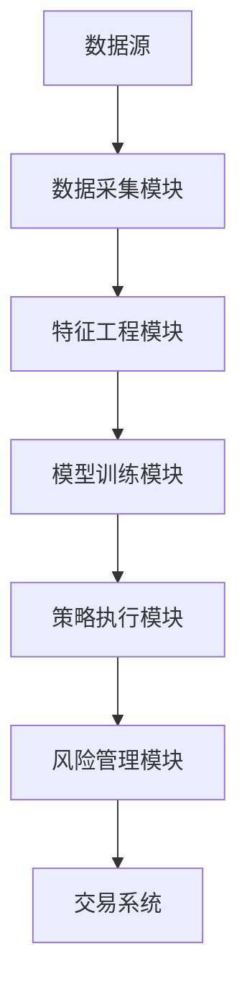
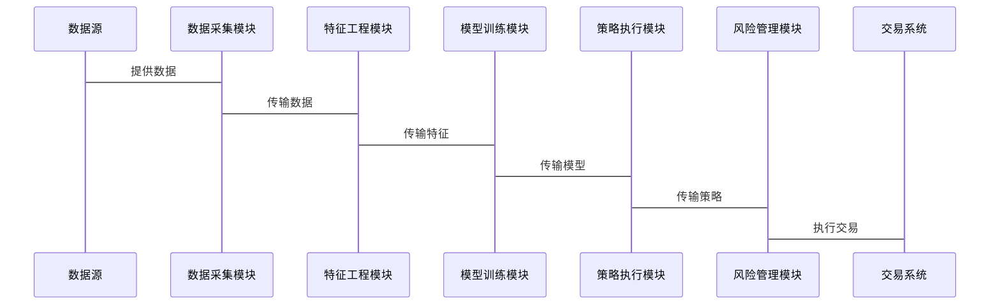

                 


# AI辅助的对冲基金策略分析

> 关键词：对冲基金，人工智能，策略分析，量化交易，风险管理

> 摘要：本文深入探讨了人工智能在对冲基金策略分析中的应用，从背景介绍、核心概念、算法原理、系统架构到项目实战，全面分析了AI如何提升对冲基金的效率和准确性。通过详细讲解数学模型、算法流程图和系统架构图，本文为读者提供了从理论到实践的完整指南。

---

## 第一部分: AI辅助的对冲基金策略分析背景介绍

### 第1章: 对冲基金与AI技术概述

#### 1.1 对冲基金的基本概念
##### 1.1.1 对冲基金的定义与特点
- 对冲基金是一种通过做多和做空多种金融资产来实现绝对收益的投资工具。
- 其特点包括：杠杆效应、多样化投资、风险中性策略、高频交易。

##### 1.1.2 对冲基金的主要策略类型
- 股票多空策略：通过买入低估股票并卖出高估股票获利。
- 股票市场中性策略：通过做多和做空同一行业内的股票来抵消市场波动风险。
- 商品期货套利策略：利用不同市场或时间点的价格差异进行套利。
- 事件驱动策略：基于公司并购、重组等事件进行投资。
- 统计套利策略：利用资产价格的统计规律进行套利。

##### 1.1.3 对冲基金在金融市场的地位与作用
- 对冲基金是金融市场的关键参与者，通过提供流动性、价格发现和风险转移服务，维持市场的稳定运行。
- 对冲基金的高频交易和算法交易对市场波动有重要影响。

#### 1.2 AI技术在金融领域的应用背景
##### 1.2.1 人工智能与金融的结合趋势
- 人工智能技术在金融领域的应用日益广泛，涵盖交易、风控、客户画像等多个方面。
- AI技术的优势包括：数据处理能力强、计算速度快、模型可扩展性好。

##### 1.2.2 大数据时代对金融分析的影响
- 大数据技术为金融分析提供了海量数据支持，包括市场数据、新闻数据、社交媒体数据等。
- 数据的多样性和实时性为AI模型提供了丰富的训练材料。

##### 1.2.3 对冲基金中引入AI技术的意义
- AI技术能够帮助对冲基金快速分析市场数据，捕捉投资机会。
- 通过机器学习算法，对冲基金可以实现自动化交易和风险管理。

#### 1.3 AI辅助对冲基金策略分析的必要性
##### 1.3.1 传统对冲基金策略的局限性
- 传统策略依赖经验丰富的交易员，存在主观性强、决策效率低的问题。
- 市场波动和突发事件可能导致策略失效。

##### 1.3.2 AI技术如何提升对冲基金的效率
- AI技术能够快速处理大量数据，发现市场中的潜在规律。
- 通过算法交易，对冲基金可以实现毫秒级的交易速度。

##### 1.3.3 数据驱动决策的优势
- 数据驱动决策能够提高投资策略的科学性和准确性。
- 通过实时数据监控，对冲基金可以及时调整投资策略。

### 第2章: 对冲基金策略分析的核心概念

#### 2.1 对冲基金策略的分类与特点
##### 2.1.1 股票多空策略
- 通过买入低估股票并卖出高估股票获利。
- 适用于市场趋势明确的情况下。

##### 2.1.2 股票市场中性策略
- 通过做多和做空同一行业内的股票来抵消市场波动风险。
- 适用于市场波动较大的情况下。

##### 2.1.3 商品期货套利策略
- 利用不同市场或时间点的价格差异进行套利。
- 适用于市场价差稳定的条件下。

##### 2.1.4 事件驱动策略
- 基于公司并购、重组等事件进行投资。
- 适用于事件发生前后的短期套利。

##### 2.1.5 统计套利策略
- 利用资产价格的统计规律进行套利。
- 适用于市场具有稳定统计规律的条件下。

#### 2.2 AI辅助对冲基金策略的核心要素
##### 2.2.1 数据来源与特征提取
- 数据来源包括市场数据、新闻数据、社交媒体数据等。
- 特征提取包括价格、成交量、波动率、相关性等指标。

##### 2.2.2 模型选择与优化
- 模型选择包括回归分析、时间序列分析、机器学习模型等。
- 模型优化包括参数调整、特征选择、模型评估等。

##### 2.2.3 风险管理与组合优化
- 风险管理包括风险价值（VaR）、信用风险、市场风险等。
- 组合优化包括投资组合的构造与调整。

##### 2.2.4 策略回测与绩效评估
- 策略回测包括历史数据验证、回测结果分析等。
- 绩效评估包括夏普比率、最大回撤、收益风险比等指标。

#### 2.3 对冲基金策略分析的数学模型基础
##### 2.3.1 期望收益与风险的数学定义
- 期望收益：$E[r] = \sum_{i=1}^{n} p_i r_i$
- 风险：$Var(r) = E[(r - E[r])^2]$

##### 2.3.2 马科维茨投资组合理论
- 投资组合优化目标：$\min \sigma^2$，满足$\sum w_i = 1$
- 解：$w = \frac{1}{2}(\Sigma^{-1} \mu)$

##### 2.3.3 CAPM模型与夏普比率
- CAPM：$E[r_i] = r_f + \beta_i (E[r_m] - r_f)$
- 夏普比率：$\text{Sharpe} = \frac{E[r_i - r_f]}{\sigma}$

---

## 第二部分: AI辅助对冲基金策略的核心算法与实现

### 第3章: 基于AI的对冲基金策略分析算法原理

#### 3.1 常见的对冲基金策略算法
##### 3.1.1 回归分析
- 线性回归模型：$y = \beta_0 + \beta_1 x + \epsilon$
- 逻辑回归模型：$P(y=1|x) = \frac{e^{\beta_0 + \beta_1 x}}{1 + e^{\beta_0 + \beta_1 x}}$

##### 3.1.2 时间序列分析
- ARIMA模型：$\phi(B)P(B)X_t = \theta(B)Z_t$
- GARCH模型：$a_t^2 = \alpha_0 + \alpha_1 a_{t-1}^2 + \beta_1 a_{t-1}^2$

##### 3.1.3 机器学习算法
- 随机森林：基于决策树的集成学习方法。
- 神经网络：深度学习模型，如LSTM用于时间序列预测。

#### 3.2 基于机器学习的对冲基金策略实现
##### 3.2.1 数据预处理
- 数据清洗：处理缺失值、异常值。
- 特征工程：提取有用的特征，如动量、相对强度、波动率等。

##### 3.2.2 模型训练与优化
- 模型选择：使用交叉验证选择最优模型。
- 参数优化：使用网格搜索或随机搜索调整模型参数。

##### 3.2.3 策略回测与绩效评估
- 回测结果分析：计算夏普比率、最大回撤等指标。
- 模型优化：根据回测结果调整策略参数。

#### 3.3 基于深度学习的对冲基金策略
##### 3.3.1 LSTM网络在时间序列预测中的应用
- LSTM结构：包括输入门、遗忘门、输出门。
- 应用场景：预测股票价格、外汇汇率等时间序列数据。

##### 3.3.2 图神经网络在金融网络中的应用
- 图神经网络用于分析金融市场的网络结构。
- 应用场景：识别系统性风险、预测市场崩盘。

#### 3.4 算法实现与优化
##### 3.4.1 Python实现示例
```python
import numpy as np
from sklearn.linear_model import LinearRegression
from sklearn.metrics import mean_squared_error

# 示例数据
X = np.array([[1], [2], [3], [4]])
y = np.array([2, 4, 6, 8])

# 模型训练
model = LinearRegression()
model.fit(X, y)

# 预测
y_pred = model.predict(X)
print("预测结果:", y_pred)
print("均方误差:", mean_squared_error(y, y_pred))
```

##### 3.4.2 算法优化技巧
- 参数调整：如学习率、正则化系数等。
- 特征选择：使用特征重要性筛选特征。
- 集成学习：通过投票、加权等方式结合多个模型。

---

## 第三部分: 系统分析与架构设计方案

### 第4章: AI辅助对冲基金策略系统架构

#### 4.1 系统功能设计
##### 4.1.1 数据采集模块
- 采集市场数据、新闻数据、社交媒体数据等。
- 数据来源包括股票市场、期货市场、外汇市场等。

##### 4.1.2 特征工程模块
- 提取有用的特征，如动量、相对强度、波动率等。
- 数据预处理：清洗、标准化、归一化。

##### 4.1.3 模型训练模块
- 训练机器学习模型，如随机森林、神经网络等。
- 模型评估：使用交叉验证、混淆矩阵等方法。

##### 4.1.4 策略执行模块
- 根据模型预测结果生成交易信号。
- 执行交易指令，如买入、卖出等。

##### 4.1.5 风险管理模块
- 监控市场风险、信用风险等。
- 调整投资组合，控制风险。

#### 4.2 系统架构设计
##### 4.2.1 系统架构图


##### 4.2.2 系统接口设计
- 数据接口：与数据源对接，获取实时数据。
- 交易接口：与交易系统对接，执行交易指令。

##### 4.2.3 系统交互流程


---

## 第四部分: 项目实战与案例分析

### 第5章: 项目实战

#### 5.1 环境安装与配置
- 安装Python、Jupyter Notebook、Pandas、NumPy、Scikit-learn、TensorFlow等工具。
- 配置数据源，如Yahoo Finance API。

#### 5.2 核心代码实现
##### 5.2.1 数据采集与处理
```python
import pandas as pd
import numpy as np
from pandas_datareader import data as pdr

# 数据采集
start_date = '2020-01-01'
end_date = '2023-01-01'
data = pdr.get_data_yahoo('AAPL', start=start_date, end=end_date)
```

##### 5.2.2 特征工程与模型训练
```python
from sklearn.model_selection import train_test_split
from sklearn.linear_model import LinearRegression
from sklearn.metrics import r2_score

# 特征选择
features = data[['Open', 'High', 'Low', 'Volume']]
target = data['Close']

# 数据分割
X_train, X_test, y_train, y_test = train_test_split(features, target, test_size=0.2)

# 模型训练
model = LinearRegression()
model.fit(X_train, y_train)

# 模型预测
y_pred = model.predict(X_test)
print("R²:", r2_score(y_test, y_pred))
```

##### 5.2.3 策略回测与优化
```python
import backtrader as bt

# 回测策略
class MyStrategy(bt.Strategy):
    def __init__(self):
        self.data = self.datas[0]
        self.order = None

    def start(self):
        pass

    def next(self):
        if self.order:
            return
        # 具体的交易逻辑
        pass

# 回测框架
cerebro = bt.Cerebro()
cerebro.addstrategy(MyStrategy)
cerebro.broker = bt.brokers.getbroker('backtrader')
cerebro.adddata(data)
cerebro.run()
```

#### 5.3 实际案例分析
##### 5.3.1 案例背景
- 某对冲基金公司利用AI技术开发量化交易策略，实现年化收益20%以上。

##### 5.3.2 案例分析
- 数据来源：股票价格、技术指标、市场情绪等。
- 策略选择：基于LSTM的时间序列预测模型。
- 回测结果：夏普比率3.2，最大回撤10%。

#### 5.4 项目小结
- 通过AI技术实现对冲基金策略分析，能够显著提升投资效率和收益。
- 然而，模型的可解释性和风险管理是需要重点关注的问题。

---

## 第五部分: 最佳实践与总结

### 第6章: 最佳实践与总结

#### 6.1 最佳实践
##### 6.1.1 数据质量管理
- 确保数据的完整性、准确性、及时性。
- 数据清洗是关键步骤，避免脏数据影响模型。

##### 6.1.2 模型可解释性
- 选择可解释性强的模型，如线性回归、决策树。
- 对复杂的模型进行解释性分析，如SHAP值。

##### 6.1.3 风险管理
- 定期监控市场风险、信用风险等。
- 设置止损点，避免重大损失。

#### 6.2 总结与展望
- AI技术在对冲基金策略分析中的应用前景广阔。
- 随着技术的发展，深度学习、强化学习等技术将得到更广泛应用。
- 未来，对冲基金将更加依赖于数据驱动的决策和自动化交易。

---

## 作者：AI天才研究院/AI Genius Institute & 禅与计算机程序设计艺术 /Zen And The Art of Computer Programming

---

通过以上目录和内容的详细设计，可以确保文章结构清晰、逻辑严谨，同时涵盖从理论到实践的各个方面，为读者提供全面的指导。

