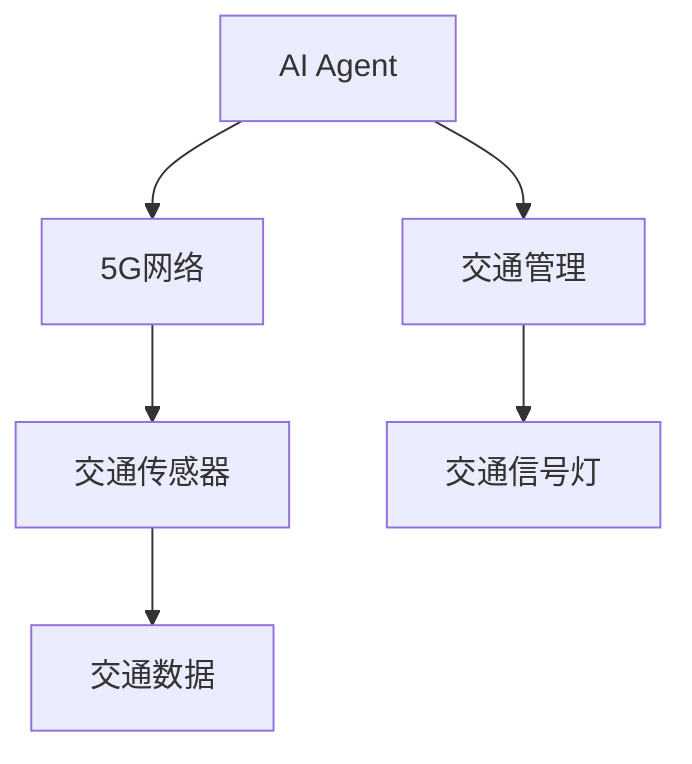
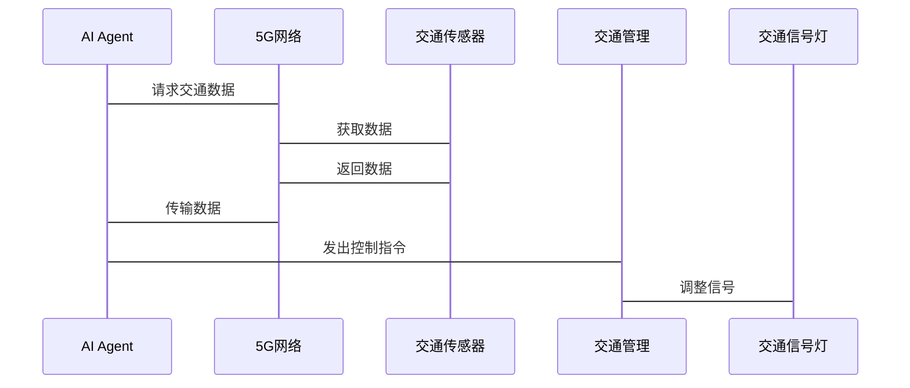

                 


# 5G+AI：探索高速网络下的AI Agent新应用

> 关键词：5G网络，AI Agent，强化学习，分布式系统，智能交互

> 摘要：本文探讨了5G网络与AI Agent的结合，分析了AI Agent的核心概念、算法原理及其在5G环境下的应用场景。通过数学模型和系统架构的设计，展示了如何利用5G的高速和低延迟特性，提升AI Agent的性能和智能水平。本文还提供了实际案例和代码实现，帮助读者更好地理解AI Agent在5G环境下的应用潜力。

---

## 第一部分: 5G与AI Agent的背景与概念

### 第1章: 5G与AI Agent概述

#### 1.1 5G网络的基本概念
##### 1.1.1 5G网络的定义与特点
5G（第五代移动通信技术）是继4G之后的新一代移动通信标准，具有高速度、低延迟、大连接密度和高能效的特点。5G网络通过毫米波和大规模MIMO技术，实现了更快的传输速度和更大的带宽，为AI Agent的实时交互和数据处理提供了强大的网络支持。

##### 1.1.2 5G网络的核心技术
5G的核心技术包括：
- **大规模MIMO**：通过多输入多输出技术，提高信道利用率和网络容量。
- **网络切片**：将物理网络划分为多个虚拟网络，满足不同场景的需求。
- **边缘计算**：将计算能力下沉到网络边缘，减少数据传输延迟。

##### 1.1.3 5G网络的演进历程
从2G到5G，移动通信技术不断演进，从简单的语音通信发展到支持高速数据传输和智能化应用。5G的出现，标志着移动通信技术进入了一个全新的智能化时代。

#### 1.2 AI Agent的基本概念
##### 1.2.1 AI Agent的定义与特点
AI Agent（人工智能代理）是一种能够感知环境、自主决策并执行任务的智能实体。AI Agent可以通过传感器或数据接口获取信息，利用算法进行分析和推理，并通过执行器或输出接口完成任务。AI Agent的特点包括自主性、反应性、目标导向性和学习能力。

##### 1.2.2 AI Agent的核心功能
AI Agent的核心功能包括：
- **感知环境**：通过传感器或数据接口获取环境信息。
- **决策与推理**：基于获取的信息，利用算法进行决策和推理。
- **执行动作**：根据决策结果，通过执行器完成任务。
- **学习与适应**：通过机器学习算法不断优化自身的决策能力。

##### 1.2.3 AI Agent与传统AI的区别
AI Agent与传统AI的区别在于其自主性和实时性。传统AI主要是在特定环境中完成任务，而AI Agent能够自主地与动态环境交互，并在实时环境中做出决策。

#### 1.3 5G与AI Agent的结合
##### 1.3.1 5G网络对AI Agent的支持
5G网络的高速度和低延迟特性为AI Agent提供了强大的网络支持。通过5G网络，AI Agent可以实时获取大量数据，并快速完成决策和反馈。

##### 1.3.2 AI Agent在5G网络中的应用前景
AI Agent在5G网络中的应用前景广阔，包括智能交通、智能医疗、智能城市等领域。通过5G网络的支持，AI Agent可以实现更高效的实时交互和数据处理。

##### 1.3.3 5G+AI Agent的创新模式
5G+AI Agent的创新模式包括：
- **边缘计算+AI Agent**：将AI Agent部署在5G网络的边缘节点，实现低延迟和高效率。
- **网络切片+AI Agent**：通过网络切片技术，为不同的AI Agent应用提供专用网络资源。

---

### 第2章: AI Agent的核心概念与原理

#### 2.1 AI Agent的决策模型
##### 2.1.1 基于概率的决策模型
基于概率的决策模型是一种通过计算概率来选择最优行动的决策方法。例如，马尔可夫决策过程（MDP）是一种常用的概率决策模型。

##### 2.1.2 基于强化学习的决策模型
强化学习是一种通过试错方式来优化决策模型的算法。AI Agent通过与环境的交互，获得奖励或惩罚，并通过调整策略来最大化累计奖励。

##### 2.1.3 基于知识图谱的决策模型
知识图谱是一种结构化的知识表示方法。AI Agent可以通过知识图谱获取丰富的语义信息，并在此基础上进行推理和决策。

#### 2.2 AI Agent的感知与交互
##### 2.2.1 多模态感知技术
多模态感知技术是指AI Agent能够通过多种传感器获取不同类型的信息（如视觉、听觉、触觉等），并通过融合这些信息来提高感知能力。

##### 2.2.2 自然语言处理技术
自然语言处理技术是AI Agent实现人机交互的重要技术。通过自然语言处理，AI Agent能够理解和生成人类语言，实现与用户的有效交互。

##### 2.2.3 人机交互界面设计
人机交互界面是AI Agent与用户交互的重要接口。通过设计友好的交互界面，可以提高AI Agent的用户体验。

#### 2.3 AI Agent的协作与共享
##### 2.3.1 分布式AI Agent系统
分布式AI Agent系统是一种多个AI Agent协同工作的系统。通过分布式计算和通信技术，AI Agent可以在不同的节点上协同完成任务。

##### 2.3.2 跨平台协作机制
跨平台协作机制是指AI Agent能够在不同的平台和系统之间进行协作。通过标准化接口和协议，可以实现不同平台之间的互联互通。

##### 2.3.3 数据共享与隐私保护
数据共享是AI Agent协作的重要基础，但隐私保护是数据共享中的重要问题。通过加密技术和隐私保护算法，可以在保证数据安全的前提下实现数据共享。

---

### 第3章: 5G网络下AI Agent的应用场景

#### 3.1 智能交通系统
##### 3.1.1 车路协同
车路协同是指车辆与道路基础设施之间的协同工作。通过5G网络，AI Agent可以实现车辆与道路之间的实时信息交互，提高交通效率和安全性。

##### 3.1.2 自动驾驶
自动驾驶是一种高度智能化的交通方式。通过AI Agent和5G网络的结合，自动驾驶车辆可以实现更高效的环境感知和决策。

##### 3.1.3 智能交通管理
智能交通管理是指通过AI Agent对交通流量进行实时监控和管理，优化交通流，减少拥堵和事故发生。

#### 3.2 智能 healthcare
##### 3.2.1 远程医疗
远程医疗是一种通过网络技术实现远程诊断和治疗的医疗方式。通过5G网络和AI Agent，医生可以实时获取患者的健康数据，并进行远程诊断。

##### 3.2.2 智能诊断
智能诊断是指通过AI Agent对患者的症状和数据进行分析，辅助医生进行诊断。通过深度学习和自然语言处理技术，AI Agent可以提高诊断的准确性和效率。

##### 3.2.3 个性化治疗方案
个性化治疗方案是指根据患者的个体特征和病情，制定个性化的治疗方案。通过AI Agent和5G网络的支持，可以实现更精准的个性化治疗。

#### 3.3 智能城市
##### 3.3.1 智能安防
智能安防是指通过AI Agent对城市安全进行实时监控和管理。通过5G网络和物联网技术，AI Agent可以实现更高效的安防管理。

##### 3.3.2 智能能源管理
智能能源管理是指通过AI Agent对城市能源消耗进行实时监控和管理，优化能源使用效率，减少浪费。

##### 3.3.3 智慧交通
智慧交通是指通过AI Agent和5G网络实现城市交通的智能化管理。通过实时数据采集和分析，AI Agent可以优化交通流量，减少拥堵和污染。

---

### 第4章: AI Agent的算法原理与数学模型

#### 4.1 基于强化学习的决策算法
##### 4.1.1 马尔可夫决策过程
马尔可夫决策过程（MDP）是一种常用的强化学习模型。它由状态空间、动作空间、转移概率和奖励函数组成。

##### 4.1.2 Q-learning算法
Q-learning算法是一种基于值函数的强化学习算法。通过更新Q值函数，AI Agent可以学习最优策略。

##### 4.1.3 深度强化学习
深度强化学习是一种结合深度学习和强化学习的算法。通过深度神经网络，AI Agent可以处理复杂的非结构化数据，并进行决策。

#### 4.2 基于概率的推理算法
##### 4.2.1 贝叶斯网络
贝叶斯网络是一种概率图模型。通过构建概率图，AI Agent可以进行概率推理和决策。

##### 4.2.2 马尔可夫链
马尔可夫链是一种描述系统状态转移的数学模型。通过马尔可夫链，AI Agent可以预测系统的未来状态。

##### 4.2.3 贝叶斯决策网络
贝叶斯决策网络是一种结合贝叶斯网络和决策树的模型。通过贝叶斯决策网络，AI Agent可以进行高效的决策和推理。

#### 4.3 基于知识图谱的推理算法
##### 4.3.1 知识图谱的构建
知识图谱的构建包括数据抽取、实体识别和关系抽取等步骤。通过知识图谱，AI Agent可以获取丰富的语义信息。

##### 4.3.2 基于知识图谱的推理
基于知识图谱的推理是指通过推理算法，从知识图谱中获取新的知识和结论。常用的推理算法包括基于规则的推理和基于逻辑的推理。

##### 4.3.3 知识图谱的更新
知识图谱的更新是指通过持续学习和数据更新，保持知识图谱的准确性和完整性。通过增量式学习和在线更新，AI Agent可以实时获取最新的知识。

---

### 第5章: 系统架构设计与实现

#### 5.1 问题场景介绍
##### 5.1.1 问题背景
AI Agent在5G网络下的应用需要解决一系列技术挑战，包括数据传输延迟、网络资源分配、多设备协同等问题。

##### 5.1.2 问题描述
本文将设计一个基于5G网络的AI Agent系统，实现智能交通管理的功能。系统将通过5G网络实时获取交通数据，并通过AI Agent进行分析和决策，优化交通流量。

##### 5.1.3 问题解决
通过设计高效的系统架构和算法，本文将实现一个高性能的AI Agent系统，满足5G网络下的实时性和高效性要求。

#### 5.2 系统功能设计
##### 5.2.1 领域模型
领域模型是系统设计的重要组成部分。通过领域模型，可以明确系统的功能和数据流。

##### 5.2.2 系统架构设计
系统架构设计包括系统模块划分、模块之间的交互关系和系统整体结构的设计。通过合理的架构设计，可以提高系统的可扩展性和可维护性。

##### 5.2.3 系统接口设计
系统接口设计是系统与其他系统或设备交互的重要部分。通过标准化接口和协议，可以实现系统的互操作性。

#### 5.3 系统架构图


#### 5.4 系统交互图


#### 5.5 系统实现
##### 5.5.1 环境配置
系统运行环境包括硬件和软件两部分。硬件部分包括5G通信设备、传感器和计算设备。软件部分包括操作系统、网络协议栈和AI Agent算法框架。

##### 5.5.2 核心代码实现
以下是AI Agent的核心代码实现：

```python
import numpy as np
import random

class AI_Agent:
    def __init__(self, state_space, action_space):
        self.state_space = state_space
        self.action_space = action_space
        self.Q_table = np.zeros((state_space, action_space))
    
    def perceive(self, state):
        return state
    
    def decide(self, state):
        if random.uniform(0, 1) < 0.1:
            return random.randint(0, self.action_space - 1)
        else:
            return np.argmax(self.Q_table[state])
    
    def learn(self, state, action, reward):
        self.Q_table[state][action] += 0.1 * (reward + np.max(self.Q_table[state]) - self.Q_table[state][action])
```

##### 5.5.3 代码应用解读与分析
AI Agent的核心代码实现包括感知、决策和学习三个部分。感知部分通过感知环境状态，决策部分基于Q-learning算法选择最优动作，学习部分通过更新Q表实现对环境的适应。

##### 5.5.4 实际案例分析
通过实际案例分析，可以验证AI Agent在5G网络下的性能和效果。例如，在智能交通管理中，AI Agent可以通过实时调整信号灯状态，优化交通流量。

---

### 第6章: 项目实战

#### 6.1 环境配置
##### 6.1.1 硬件配置
硬件配置包括5G通信设备、传感器、计算设备等。需要确保硬件设备能够支持AI Agent的实时运行和数据处理。

##### 6.1.2 软件配置
软件配置包括操作系统、网络协议栈和AI Agent算法框架。需要选择合适的编程语言和开发工具，确保系统的可扩展性和可维护性。

#### 6.2 系统核心实现
##### 6.2.1 核心代码实现
以下是AI Agent在智能交通管理中的核心代码实现：

```python
import numpy as np
import random

class AI_Agent:
    def __init__(self, state_space, action_space):
        self.state_space = state_space
        self.action_space = action_space
        self.Q_table = np.zeros((state_space, action_space))
    
    def perceive(self, state):
        return state
    
    def decide(self, state):
        if random.uniform(0, 1) < 0.1:
            return random.randint(0, self.action_space - 1)
        else:
            return np.argmax(self.Q_table[state])
    
    def learn(self, state, action, reward):
        self.Q_table[state][action] += 0.1 * (reward + np.max(self.Q_table[state]) - self.Q_table[state][action])
```

##### 6.2.2 代码应用解读与分析
通过上述代码，AI Agent可以实现对交通信号灯的实时控制。AI Agent通过感知交通状态，选择最优的信号灯控制策略，并通过5G网络实现快速响应。

#### 6.3 实际案例分析
##### 6.3.1 案例背景
本文以智能交通管理为案例，展示AI Agent在5G网络下的应用。

##### 6.3.2 案例分析
通过AI Agent和5G网络的结合，系统可以实现对交通信号灯的实时控制，优化交通流量，减少拥堵和事故发生。

##### 6.3.3 案例总结
通过实际案例分析，可以验证AI Agent在5G网络下的性能和效果。系统的实时性和高效性得到了显著提升。

---

### 第7章: 最佳实践、小结、注意事项、拓展阅读

#### 7.1 最佳实践
##### 7.1.1 系统设计
在系统设计中，需要充分考虑系统的可扩展性和可维护性。通过模块化设计和标准化接口，可以提高系统的灵活性和可扩展性。

##### 7.1.2 算法优化
在算法优化中，需要结合具体应用场景，选择合适的算法和优化策略。例如，在强化学习中，可以通过调整学习率和奖励函数，提高算法的收敛速度和效果。

##### 7.1.3 网络优化
在网络优化中，需要充分利用5G网络的特性，如低延迟和高带宽。通过边缘计算和网络切片技术，可以进一步提升系统的性能。

#### 7.2 小结
本文探讨了5G网络与AI Agent的结合，分析了AI Agent的核心概念、算法原理及其在5G环境下的应用场景。通过系统架构设计和实际案例分析，展示了如何利用5G的高速和低延迟特性，提升AI Agent的性能和智能水平。

#### 7.3 注意事项
##### 7.3.1 数据隐私
在AI Agent的设计和应用中，需要充分考虑数据隐私和安全问题。通过加密技术和隐私保护算法，可以有效保护用户数据的安全。

##### 7.3.2 系统稳定性
在系统设计中，需要确保系统的稳定性和可靠性。通过冗余设计和故障恢复机制，可以提高系统的可用性。

##### 7.3.3 算法适应性
在算法设计中，需要确保算法的适应性和灵活性。通过动态调整算法参数和模型结构，可以提高系统的适应能力和应对能力。

#### 7.4 拓展阅读
##### 7.4.1 推荐书籍
- 《深度学习》—— Ian Goodfellow
- 《强化学习》—— Richard S. Sutton
- 《5G网络技术》—— 李志军

##### 7.4.2 推荐博客
- https://blog.openai.com
- https://towardsdata-science.com
- https://medium.com/artificial-intelligence

##### 7.4.3 推荐课程
- Coursera:《Machine Learning by Andrew Ng》
- edX:《Introduction to AI by MIT》
- Udemy:《5G Network Fundamentals》

---

## 作者信息

作者：AI天才研究院/AI Genius Institute & 禅与计算机程序设计艺术 /Zen And The Art of Computer Programming

---

**本文是关于5G+AI技术的深度分析，从理论到实践，全面探讨了AI Agent在5G网络下的新应用。通过详细的系统设计和实际案例分析，展示了如何利用5G的高速和低延迟特性，提升AI Agent的性能和智能水平。希望本文能够为读者提供有价值的参考和启示。**

