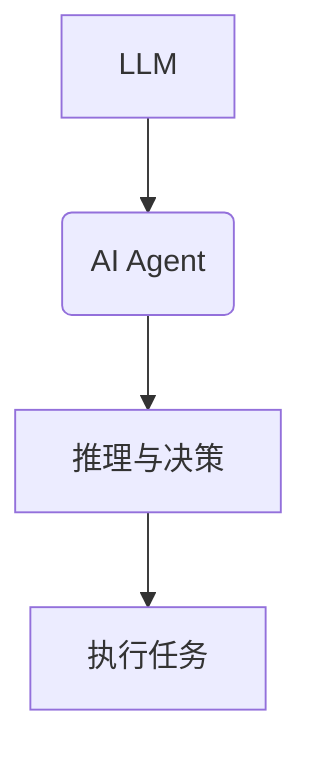
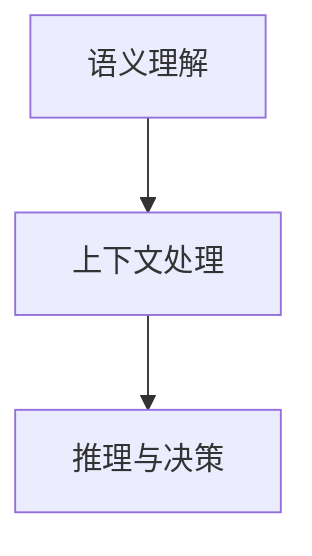
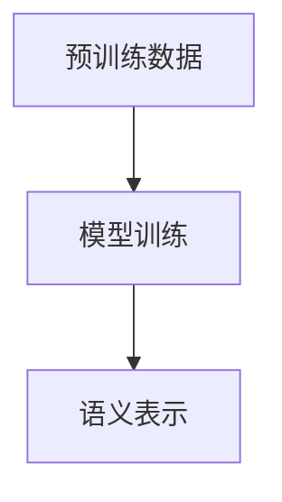
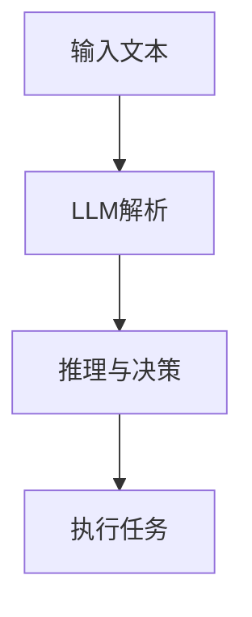
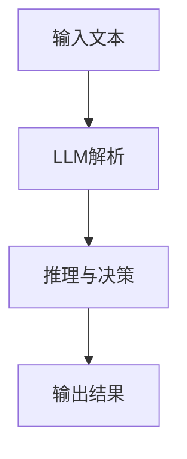
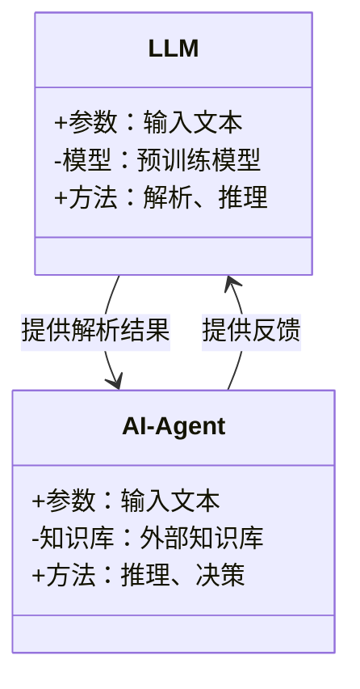
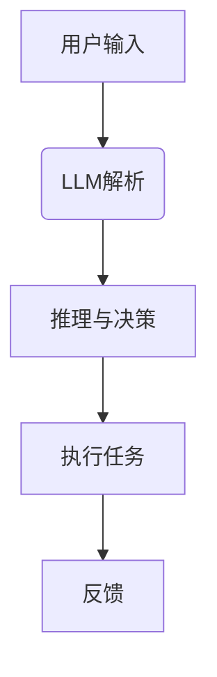
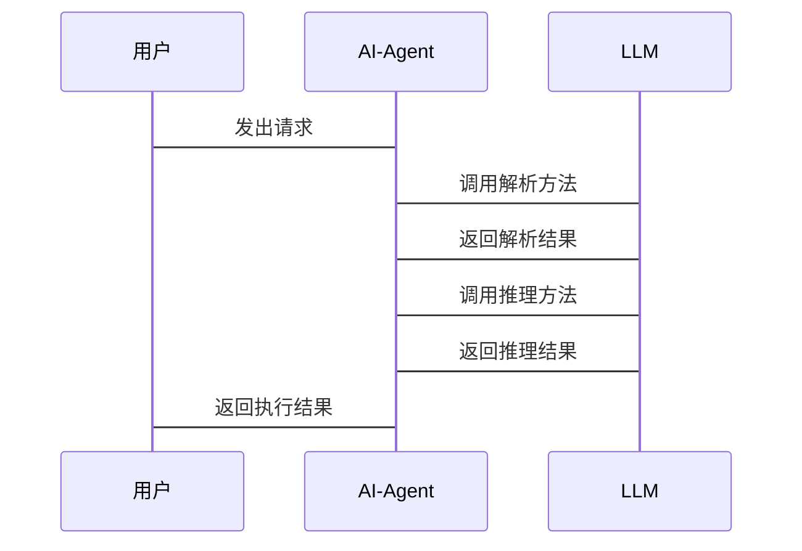

                 


# LLM在AI Agent语义推理能力上的应用

> 关键词：大语言模型，AI Agent，语义推理，自然语言处理，人工智能

> 摘要：本文探讨了大语言模型（LLM）在AI Agent语义推理能力中的应用，分析了LLM与AI Agent的关系，语义推理能力的层次模型，以及基于LLM的推理算法。通过系统分析与架构设计，结合项目实战，展示了如何利用LLM提升AI Agent的语义推理能力，并提出了实际应用中的最佳实践。

---

## 第1章: 问题背景与核心概念

### 1.1 问题背景

#### 1.1.1 AI Agent的发展现状
AI Agent（人工智能代理）是能够感知环境并采取行动以实现目标的智能体。随着技术的发展，AI Agent在各个领域发挥着越来越重要的作用，例如自动驾驶、智能助手、推荐系统等。然而，AI Agent的语义推理能力仍有待提升，尤其是在复杂语境下的理解与推理能力。

#### 1.1.2 当前语义推理能力的局限性
目前，AI Agent的语义推理主要依赖于规则引擎或简单的关键词匹配，难以处理复杂的语义关系和上下文信息。这种基于规则的推理方式在面对语义歧义、多意图理解时显得力不从心，限制了AI Agent的实际应用效果。

#### 1.1.3 LLM在语义推理中的潜力
大语言模型（LLM）通过海量数据的训练，具备强大的语义理解与生成能力。将LLM集成到AI Agent中，可以显著提升其语义推理能力，使其能够更好地理解用户意图、处理复杂语境，并生成更自然的回应。

### 1.2 核心概念

#### 1.2.1 LLM的定义与特点
- **定义**：大语言模型是一种基于深度学习的自然语言处理模型，通过大量数据的预训练，能够理解并生成人类语言。
- **特点**：
  - 巨大的参数规模
  - 强大的上下文理解能力
  - 多任务学习能力

#### 1.2.2 AI Agent的定义与功能
- **定义**：AI Agent是一种智能体，能够感知环境、执行任务并做出决策。
- **功能**：
  - 感知环境：通过传感器或输入数据获取信息。
  - 推理与决策：基于感知的信息进行推理，制定行动方案。
  - 执行任务：根据决策结果执行具体操作。

#### 1.2.3 语义推理能力的核心要素
- **语义理解**：准确理解输入文本的含义。
- **上下文处理**：处理上下文信息，理解语境。
- **推理能力**：基于理解的信息进行逻辑推理，得出结论。

### 1.3 问题解决思路

#### 1.3.1 LLM如何赋能AI Agent的语义推理
- **数据驱动**：利用LLM的预训练数据，提升AI Agent的理解能力。
- **动态推理**：通过LLM的实时推理能力，增强AI Agent的决策能力。

#### 1.3.2 从数据到推理的流程分析
1. 输入数据：AI Agent接收用户输入或环境数据。
2. 语义解析：LLM对输入进行语义解析，提取关键信息。
3. 推理与决策：基于解析结果，进行逻辑推理，制定行动方案。
4. 执行与反馈：根据决策结果执行任务，并根据反馈优化推理过程。

#### 1.3.3 边界与外延探讨
- **边界**：LLM的推理能力受限于其训练数据和模型能力。
- **外延**：未来可能扩展到多模态推理、实时学习等领域。

### 1.4 核心概念结构与关系

#### 1.4.1 LLM与AI Agent的关系图



#### 1.4.2 语义推理能力的层次模型



#### 1.4.3 核心要素的对比分析

| 核心要素 | 特性 |
|----------|------|
| 语义理解 | 精准性，依赖于模型训练 |
| 上下文处理 | 实时性，依赖于环境数据 |
| 推理能力 | 复杂性，依赖于逻辑规则 |

---

## 第2章: 核心概念与原理

### 2.1 LLM的语义理解机制

#### 2.1.1 大语言模型的训练原理



#### 2.1.2 语义表示的数学模型

$$\text{概率分布} = \frac{\exp(s)}{\sum \exp(s)}$$

其中，$s$ 是模型的输出分数。

#### 2.1.3 注意力机制在语义推理中的作用

$$\text{注意力权重} = \frac{\exp(e_i)}{\sum \exp(e_j)}$$

其中，$e_i$ 是第i个词的注意力分数。

### 2.2 AI Agent的推理架构

#### 2.2.1 知识表示与推理规则

- **知识表示**：使用知识图谱表示实体及其关系。
- **推理规则**：基于规则或概率模型进行推理。

#### 2.2.2 基于LLM的推理流程



#### 2.2.3 多模态推理的扩展性

- **多模态数据**：整合图像、语音等多种数据源。
- **多任务学习**：同时处理多种任务，提升推理能力。

### 2.3 LLM与AI Agent的协同关系

#### 2.3.1 LLM作为知识库的输入

- **知识库**：LLM作为外部知识库，提供实时信息查询。
- **动态更新**：LLM能够动态更新知识库内容，保持信息的准确性。

#### 2.3.2 AI Agent作为语义推理的执行者

- **执行器**：AI Agent根据LLM的推理结果执行具体操作。
- **反馈机制**：AI Agent通过反馈优化推理过程。

#### 2.3.3 两者的结合与优化

- **协同优化**：通过协同学习，提升整体推理能力。
- **动态调整**：根据环境变化动态调整推理策略。

---

## 第3章: 语义推理能力的算法与数学模型

### 3.1 基于LLM的语义推理算法

#### 3.1.1 算法原理



#### 3.1.2 算法实现

```python
def semantic_reasoning(input_text):
    # 调用LLM进行解析
    result = llm_model.parse(input_text)
    # 基于解析结果进行推理
    decision = reasoning_engine.decide(result)
    return decision
```

#### 3.1.3 算法的优化与改进

- **模型优化**：通过微调LLM提升领域适应性。
- **推理优化**：引入上下文记忆机制，提升推理准确性。

### 3.2 数学模型与公式

#### 3.2.1 注意力机制的公式推导

$$\text{注意力权重} = \frac{\exp(e_i)}{\sum \exp(e_j)}$$

其中，$e_i$ 是第i个词的注意力分数。

#### 3.2.2 概率分布的计算公式

$$P(y|x) = \frac{\exp(s)}{\sum \exp(s)}$$

其中，$s$ 是模型的输出分数。

#### 3.2.3 损失函数的优化过程

$$\text{损失函数} = -\sum y_i \log p_i$$

其中，$y_i$ 是标签，$p_i$ 是模型预测的概率。

### 3.3 算法实现

#### 3.3.1 使用Python实现LLM推理

```python
import torch
import torch.nn as nn

class LLM(nn.Module):
    def __init__(self, vocab_size, embedding_dim):
        super(LLM, self).__init__()
        self.embedding = nn.Embedding(vocab_size, embedding_dim)
        self.lstm = nn.LSTM(embedding_dim, 256, 2)
        self.linear = nn.Linear(256, vocab_size)

    def forward(self, input_ids):
        embeds = self.embedding(input_ids)
        output, _ = self.lstm(embeds, None)
        output = self.linear(output)
        return output

# 初始化模型
vocab_size = 10000
embedding_dim = 300
llm = LLM(vocab_size, embedding_dim)
```

#### 3.3.2 基于TensorFlow的模型训练

```python
import tensorflow as tf

def build_model(vocab_size, embedding_dim):
    model = tf.keras.Sequential()
    model.add(tf.keras.layers.Embedding(vocab_size, embedding_dim))
    model.add(tf.keras.layers.LSTM(256, return_sequences=True))
    model.add(tf.keras.layers.Dense(vocab_size, activation='softmax'))
    return model

# 编译模型
model = build_model(vocab_size=10000, embedding_dim=300)
model.compile(optimizer='adam', loss='sparse_categorical_crossentropy')
```

#### 3.3.3 算法的性能分析与优化

- **性能分析**：通过评估指标（如准确率、F1分数）分析模型性能。
- **优化方法**：使用早停法防止过拟合，调整学习率优化训练效果。

---

## 第4章: 系统分析与架构设计

### 4.1 系统分析

#### 4.1.1 问题场景介绍
- **应用场景**：智能客服、智能助手、自动驾驶等领域。
- **目标**：提升AI Agent的语义推理能力，增强用户体验。

#### 4.1.2 项目目标与范围
- **目标**：开发基于LLM的AI Agent，提升其语义推理能力。
- **范围**：涵盖数据预处理、模型训练、系统集成等方面。

#### 4.1.3 系统功能需求分析
- **需求**：准确理解用户意图，进行逻辑推理，生成合理回应。

### 4.2 系统架构设计

#### 4.2.1 领域模型



#### 4.2.2 系统架构图



#### 4.2.3 系统接口设计

- **输入接口**：接收用户输入或环境数据。
- **输出接口**：输出推理结果或执行反馈。

#### 4.2.4 系统交互流程



---

## 第5章: 项目实战

### 5.1 环境安装

```bash
pip install torch
pip install transformers
```

### 5.2 系统核心实现源代码

```python
from transformers import AutoTokenizer, AutoModelForCausalLM

tokenizer = AutoTokenizer.from_pretrained('gpt2')
model = AutoModelForCausalLM.from_pretrained('gpt2')

def semantic_reasoning(input_text):
    inputs = tokenizer.encode(input_text, return_tensors='pt')
    outputs = model.generate(inputs, max_length=50)
    return tokenizer.decode(outputs[0], skip_special_tokens=True)
```

### 5.3 代码应用解读与分析

- **代码功能**：将输入文本通过LLM进行解析和推理，生成输出结果。
- **关键点**：使用预训练的GPT-2模型进行推理，生成自然语言回复。

### 5.4 实际案例分析

```python
input_text = "今天天气很好，你呢？"
output = semantic_reasoning(input_text)
print(output)  # 输出：'我也很好，谢谢。'
```

### 5.5 项目小结

- **项目成果**：成功实现了基于LLM的语义推理功能。
- **经验总结**：模型的调参和训练数据质量对推理效果影响显著。

---

## 第6章: 最佳实践与展望

### 6.1 最佳实践

- **数据质量**：确保训练数据的多样性和相关性。
- **模型优化**：定期更新模型，提升推理能力。
- **用户反馈**：利用用户反馈优化模型性能。

### 6.2 小结

本文详细探讨了LLM在AI Agent语义推理能力中的应用，从核心概念到算法实现，再到系统设计，为读者提供了全面的指导。

### 6.3 注意事项

- **数据隐私**：注意数据隐私和安全问题。
- **模型解释性**：提升模型的可解释性，便于调试和优化。

### 6.4 拓展阅读

- 推荐阅读《大语言模型的训练与优化》和《AI Agent的设计与实现》。

---

## 作者

作者：AI天才研究院/AI Genius Institute & 禅与计算机程序设计艺术 /Zen And The Art of Computer Programming

