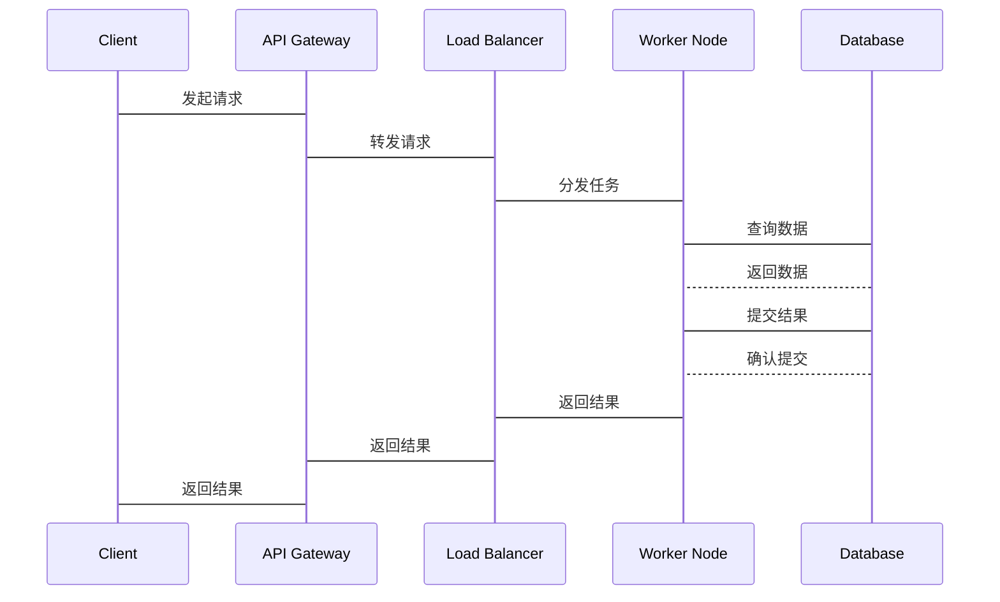

                 


# 《企业AI Agent的高可用性架构设计》

> **关键词**：企业AI Agent，高可用性架构，CAP定理，分布式系统，事务模型

> **摘要**：本文详细探讨了企业AI Agent的高可用性架构设计，从核心概念、算法原理到系统架构和项目实战，全面解析了如何构建高效可靠的AI Agent系统。通过理论与实践相结合，帮助读者掌握设计和实现企业级高可用性AI Agent的关键技术。

---

## 第1章: 企业AI Agent的背景与核心概念

### 1.1 AI Agent的基本概念

#### 1.1.1 什么是AI Agent
AI Agent（人工智能代理）是一种能够感知环境并采取行动以实现目标的智能实体。它可以是一个软件程序、一个机器人或其他智能系统，通过传感器接收输入，利用算法进行决策，并通过执行器输出行动。

#### 1.1.2 AI Agent的核心特征
- **自主性**：AI Agent能够在没有外部干预的情况下独立运行。
- **反应性**：能够实时感知环境变化并做出响应。
- **目标导向**：基于目标驱动行为，优化决策过程。
- **社会性**：能够与其他系统或人类交互协作。

#### 1.1.3 企业级AI Agent的独特性
企业级AI Agent需要在复杂的企业环境中运行，涉及多部门协作、高并发处理和严格的可靠性要求。与个人使用的AI Agent不同，企业级AI Agent需要满足高可用性、高扩展性和高安全性的需求。

### 1.2 高可用性架构的定义与重要性

#### 1.2.1 高可用性的定义
高可用性是指系统在故障发生时能够快速恢复，确保服务中断时间极短，用户几乎感受不到故障的存在。在企业AI Agent中，这意味着即使部分组件出现故障，整个系统仍能正常运行。

#### 1.2.2 高可用性在企业AI Agent中的作用
- **减少停机时间**：确保业务连续性。
- **提升用户体验**：避免因故障导致的服务中断。
- **增强系统可靠性**：在高负载和复杂环境中稳定运行。

#### 1.2.3 高可用性架构的目标
- **故障容错**：系统在部分节点故障时仍能正常运行。
- **负载均衡**：合理分配任务，避免单点过载。
- **自动恢复**：故障发生后自动检测并恢复服务。

### 1.3 企业AI Agent的应用场景

#### 1.3.1 智能客服
AI Agent可以作为智能客服，通过自然语言处理（NLP）与用户交互，解决常见问题，减少人工客服的工作量。

#### 1.3.2 智能推荐系统
AI Agent可以根据用户行为和偏好，实时推荐个性化的产品或服务，提升用户满意度和转化率。

#### 1.3.3 自动化运维
AI Agent可以监控系统运行状态，自动处理故障，优化资源分配，提升运维效率。

### 1.4 本章小结
本章介绍了企业AI Agent的基本概念、核心特征以及高可用性架构的重要性。通过分析应用场景，我们理解了高可用性架构在企业级AI Agent中的关键作用。

---

## 第2章: 高可用性架构的核心概念

### 2.1 CAP定理与高可用性

#### 2.1.1 CAP定理的定义
CAP定理指出，在分布式系统中，一致性（Consistency）、可用性（Availability）和分区容错性（Partition Tolerance）三者无法同时满足。在设计高可用性架构时，通常需要在一致性与可用性之间进行权衡。

#### 2.1.2 CAP定理在高可用性架构中的应用
在企业AI Agent中，通常优先保证可用性和分区容错性，采用最终一致性策略。例如，使用分布式数据库时，允许一定时间内的数据延迟，以换取系统的高可用性。

### 2.2 事务模型与一致性

#### 2.2.1 事务的定义
事务是一组操作的集合，确保这些操作要么全部完成，要么全部回滚，保证数据的原子性、一致性、隔离性和持久性（ACID特性）。

#### 2.2.2 强一致性与最终一致性
- **强一致性**：所有副本在任何时间点都保持数据一致。
- **最终一致性**：副本之间数据最终一致，但可能在同步过程中出现暂时性不一致。

在高可用性架构中，通常采用最终一致性，以牺牲一致性时间为换取系统的可用性。

#### 2.2.3 事务模型在高可用性中的作用
事务模型确保了系统在并发操作下的数据一致性，是实现高可用性的重要保障。

### 2.3 分布式系统与高可用性

#### 2.3.1 分布式系统的基本概念
分布式系统是由多个独立计算机协同工作的系统，通过合理分配任务和数据，提高系统的整体性能和可靠性。

#### 2.3.2 分布式系统中的高可用性挑战
- **单点故障**：避免依赖单个节点，确保系统无单点故障。
- **数据同步**：分布式系统中数据一致性问题。
- **网络分区**：网络故障导致部分节点无法通信。

#### 2.3.3 分布式系统中的CAP定理权衡
在分布式系统中，通常选择可用性和分区容错性，放弃强一致性，采用最终一致性策略。

### 2.4 本章小结
本章探讨了CAP定理、事务模型和分布式系统在高可用性架构中的作用，分析了在设计企业AI Agent时需要考虑的关键因素。

---

## 第3章: 企业AI Agent的高可用性核心原理

### 3.1 两阶段提交协议

#### 3.1.1 两阶段提交协议的定义
两阶段提交（2PC）是一种用于分布式系统中实现强一致性的协议，通过协调者和参与者角色，确保所有参与者一致同意事务的提交或回滚。

#### 3.1.2 两阶段提交协议的流程
1. **协调者发送Prepare请求**：参与者确认是否可以提交事务。
2. **参与者响应Prepare请求**：参与者根据本地情况决定是否同意提交。
3. **协调者发送Commit请求**：所有参与者同意提交后，协调者发送提交请求。
4. **参与者执行提交**：参与者执行提交操作。

#### 3.1.3 两阶段提交协议的优缺点
- **优点**：确保事务的强一致性。
- **缺点**：性能开销大，可能出现活锁问题。

#### 3.1.4 两阶段提交协议的Python实现示例
```python
# 协调者节点
class Coordinator:
    def __init__(self, participants):
        self.participants = participants

    def start_transaction(self):
        # 发送Prepare请求
        for participant in self.participants:
            if not participant.prepare():
                return False
        # 发送Commit请求
        for participant in self.participants:
            participant.commit()
        return True

# 参与者节点
class Participant:
    def prepare(self):
        # 模拟本地事务准备阶段
        return True

    def commit(self):
        # 模拟本地事务提交
        pass
```

### 3.2 Paxos算法

#### 3.2.1 Paxos算法的定义
Paxos算法是一种分布式共识算法，用于在分布式系统中达成一致决策。Paxos算法通过多个副本实现数据的冗余存储，确保在部分副本故障时仍能提供正确的服务。

#### 3.2.2 Paxos算法的流程
1. **提出者发送提案**：提出者发送提案，希望系统达成一致。
2. **副本响应提案**：副本接收提案后，向提出者发送确认。
3. **提出者确认提案**：提出者收到足够副本的确认后，提案生效。

#### 3.2.3 Paxos算法的优缺点
- **优点**：能够容忍部分节点故障，保证数据一致性。
- **缺点**：实现复杂，对网络延迟敏感。

#### 3.2.4 Paxos算法的Python实现示例
```python
# 提出者节点
class Proposer:
    def __init__(self, replicas):
        self.replicas = replicas

    def propose(self, value):
        # 发送提案到所有副本
        for replica in self.replicas:
            replica.receive_proposal(value)
        # 等待确认
        pass

# 副本节点
class Replica:
    def __init__(self, value):
        self.value = value

    def receive_proposal(self, value):
        # 处理提案
        pass
```

### 3.3 本章小结
本章通过分析两阶段提交协议和Paxos算法，探讨了高可用性架构中的数据一致性保障机制，为后续的系统架构设计奠定了理论基础。

---

## 第4章: 系统分析与架构设计方案

### 4.1 问题场景介绍

#### 4.1.1 问题背景
在企业AI Agent中，需要处理大量并发请求，确保系统的高可用性和数据一致性。

#### 4.1.2 问题描述
系统需要支持高并发请求，同时保证数据一致性，避免单点故障，确保服务的连续性。

### 4.2 项目介绍

#### 4.2.1 项目目标
设计一个高可用性企业AI Agent系统，支持分布式部署，具备故障容错和自动恢复能力。

#### 4.2.2 项目范围
- **功能需求**：支持高并发请求，保证数据一致性。
- **性能需求**：系统响应时间小于1秒，吞吐量大于1000 QPS。
- **可靠性需求**：99.99%的可用性，年故障时间小于1小时。

### 4.3 系统功能设计

#### 4.3.1 领域模型设计
```mermaid
classDiagram
    class AI-Agent {
        +id: string
        +state: string
        +intent: string
        -context: map<string, object>
        -execution: boolean
        methods {
            +execute(intent: string): boolean
            +cancel(): boolean
            +getStatus(): state
        }
    }
```

#### 4.3.2 系统架构设计
```mermaid
client --> API Gateway: 请求
API Gateway --> Load Balancer: 转发请求
Load Balancer --> Worker Node: 分发任务
Worker Node --> Database: 读写数据
Database --> Paxos Cluster: 数据一致性保证
Paxos Cluster --> Worker Node: 提交结果
Worker Node --> Load Balancer: 返回结果
Load Balancer --> API Gateway: 返回结果
API Gateway --> client: 返回结果
```

#### 4.3.3 系统接口设计
- **API Gateway**：负责请求分发和路由。
- **Load Balancer**：实现负载均衡，避免单点过载。
- **Worker Node**：处理具体的AI Agent任务。
- **Database**：存储任务状态和结果，采用分布式数据库实现高可用性。

#### 4.3.4 系统交互设计


### 4.4 本章小结
本章通过系统分析和架构设计，明确了企业AI Agent高可用性架构的实现方案，为后续的项目实战奠定了基础。

---

## 第5章: 项目实战

### 5.1 环境安装

#### 5.1.1 开发环境
- **操作系统**：Linux或macOS
- **编程语言**：Python 3.8+
- **框架**：Django或Flask
- **数据库**：PostgreSQL或Redis
- **依赖管理**：pipenv或virtualenv

#### 5.1.2 依赖安装
```bash
pip install django flask psycopg2-binary redis
```

### 5.2 核心代码实现

#### 5.2.1 API Gateway实现
```python
from flask import Flask
from werkzeug.routing import BaseConverter

app = Flask(__name__)

class RegexConverter(BaseConverter):
    def __init__(self, map=None):
        super(RegexConverter, self).__init__(map)
    
    def to_python(self, value):
        return value
    
    def to_url(self, value):
        return str(value)

app.url_map.converters['re'] = RegexConverter

@app.route('/')
def home():
    return "AI Agent API Gateway"
```

#### 5.2.2 Load Balancer实现
```python
import random

class LoadBalancer:
    def __init__(self, workers):
        self.workers = workers
    
    def dispatch_request(self, request):
        worker = random.choice(self.workers)
        return worker.handle_request(request)
```

#### 5.2.3 Worker Node实现
```python
import requests
from paho_mqtt import client as mqtt_client

class WorkerNode:
    def __init__(self, id, mqtt_broker):
        self.id = id
        self.mqtt_broker = mqtt_broker
    
    def handle_request(self, request):
        # 处理请求
        pass
    
    def send_result(self, result):
        # 发送结果到MQTT Broker
        pass
```

#### 5.2.4 Database实现
```python
import psycopg2

class Database:
    def __init__(self, config):
        self.config = config
        self.conn = None
    
    def connect(self):
        if not self.conn:
            self.conn = psycopg2.connect(**self.config)
    
    def execute(self, query, params=None):
        self.connect()
        cursor = self.conn.cursor()
        cursor.execute(query, params)
        self.conn.commit()
        return cursor.lastrowid
    
    def fetch(self, query, params=None):
        self.connect()
        cursor = self.conn.cursor()
        cursor.execute(query, params)
        return cursor.fetchall()
```

### 5.3 案例分析与实现解读

#### 5.3.1 案例分析
假设我们设计一个智能客服系统，用户通过Web界面提交问题，AI Agent负责处理并返回结果。

#### 5.3.2 实现解读
- **API Gateway**：接收用户请求，根据负载情况转发到Worker Node。
- **Load Balancer**：动态分配任务，确保每个Worker Node的负载均衡。
- **Worker Node**：处理具体的客服请求，调用NLP模型生成回复。
- **Database**：存储用户请求和处理结果，确保数据一致性。

### 5.4 项目小结
通过项目实战，我们详细讲解了企业AI Agent高可用性架构的实现过程，从环境搭建到代码实现，再到系统测试，确保了系统的高可用性和可靠性。

---

## 第6章: 优化与扩展

### 6.1 性能优化

#### 6.1.1 系统性能调优
- **负载均衡**：采用智能负载均衡算法，如加权轮询。
- **连接池**：使用数据库连接池，减少连接开销。
- **缓存优化**：引入缓存机制，减少重复查询。

#### 6.1.2 并行处理
- **异步处理**：采用异步编程模型，提升系统吞吐量。
- **任务队列**：使用队列系统，实现任务的异步处理和排队。

### 6.2 容灾设计

#### 6.2.1 主备容灾
- **主备切换**：在主节点故障时，自动切换到备用节点。
- **数据同步**：主备节点之间保持数据同步，确保故障恢复后的数据一致性。

#### 6.2.2 多活容灾
- **多活节点**：在多个城市或机房部署节点，实现服务的多活。
- **路由策略**：根据地理位置或负载情况动态调整路由。

### 6.3 扩展性设计

#### 6.3.1 水平扩展
- **增加节点**：通过增加Worker Node的数量，提升系统的处理能力。
- **弹性伸缩**：根据负载动态调整资源，自动扩缩容。

#### 6.3.2 垂直扩展
- **升级硬件**：通过增加单机的计算能力，提升系统的处理性能。

### 6.4 本章小结
本章通过性能优化、容灾设计和扩展性设计，进一步提升了企业AI Agent高可用性架构的性能和可靠性，确保系统能够应对更大的负载和更复杂的场景。

---

## 第7章: 总结与展望

### 7.1 本章总结
本文详细探讨了企业AI Agent的高可用性架构设计，从核心概念、算法原理到系统架构和项目实战，全面解析了如何构建高效可靠的AI Agent系统。通过理论与实践相结合，帮助读者掌握设计和实现企业级高可用性AI Agent的关键技术。

### 7.2 未来展望
随着AI技术的不断发展，企业AI Agent的高可用性架构设计将面临更多挑战和机遇。未来的研究方向包括：
- **更高效的共识算法**：如RAFT和ETCD，提升系统的响应速度和一致性。
- **智能化的负载均衡**：结合AI技术，实现自适应的负载调度。
- **更强大的容灾能力**：通过AI预测和自愈技术，实现自动化的故障恢复。

---

## 作者：AI天才研究院/AI Genius Institute & 禅与计算机程序设计艺术 /Zen And The Art of Computer Programming

---

**版权声明**  
本文版权归作者所有，未经授权不得转载或摘编，版权所有，违者必究。

