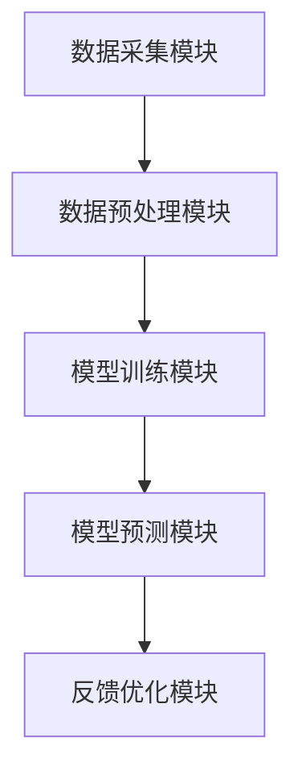

                 


# 利用AI agents构建自适应型估值模型：应对市场变化

---

## 关键词：
- AI agents, 自适应估值模型, 市场变化, 机器学习, 自适应算法, 动态优化

---

## 摘要：
随着市场的快速变化，传统的静态估值模型难以满足实时性和精准性的需求。本文将深入探讨如何利用AI代理（AI agents）构建自适应型估值模型，以应对市场变化带来的挑战。通过分析AI代理的核心原理、自适应估值模型的构建方法以及实际应用场景，本文将为读者提供一套高效、灵活的解决方案，帮助企业在复杂多变的市场环境中保持竞争优势。

---

# 第一部分: AI代理与自适应估值模型基础

## 第1章: AI代理与自适应估值模型概述

### 1.1 AI代理的核心概念
#### 1.1.1 AI代理的定义与特点
AI代理（AI Agent）是指能够感知环境、做出决策并采取行动的智能实体。其特点包括：
- **自主性**：能够在没有外部干预的情况下独立运行。
- **反应性**：能够实时感知环境变化并做出响应。
- **学习能力**：通过数据和经验不断优化自身的决策能力。

#### 1.1.2 自适应估值模型的定义
自适应估值模型是一种能够根据市场变化动态调整参数和假设的估值模型。其核心在于通过实时数据反馈和机器学习算法，实现对模型的持续优化。

#### 1.1.3 AI代理在估值模型中的作用
AI代理通过实时数据处理、动态参数调整和预测模型优化，为自适应估值模型提供强大的技术支持。

### 1.2 市场变化与估值模型的挑战
#### 1.2.1 市场变化对企业估值的影响
市场的波动性、政策变化和经济环境的不确定性都会对企业的估值产生重大影响。传统的静态估值模型难以应对这些动态变化。

#### 1.2.2 传统估值模型的局限性
传统估值模型通常基于固定的假设和历史数据，难以适应市场的快速变化。其局限性包括：
- **静态假设**：无法动态调整模型参数。
- **计算复杂度高**：难以实时处理海量数据。
- **缺乏反馈机制**：无法根据市场反馈快速优化模型。

#### 1.2.3 自适应估值模型的必要性
自适应估值模型通过动态调整参数和实时反馈优化，能够更好地应对市场变化，提高估值的准确性和及时性。

### 1.3 本书的核心目标与内容
#### 1.3.1 本书的核心目标
通过AI代理构建自适应型估值模型，帮助企业应对市场变化，提高估值的准确性和实时性。

#### 1.3.2 本书的主要内容框架
- 第一部分：AI代理与自适应估值模型的基础知识。
- 第二部分：AI代理的核心概念与原理。
- 第三部分：自适应估值模型的构建方法。
- 第四部分：AI代理在自适应估值模型中的具体应用。
- 第五部分：系统架构设计与实现。
- 第六部分：项目实战与案例分析。
- 第七部分：优化与扩展。
- 第八部分：总结与展望。

#### 1.3.3 本书的读者群体
- 金融从业者、数据科学家、软件工程师。
- 对AI代理和自适应估值模型感兴趣的学术研究者。
- 企业决策者和技术创新领导者。

---

## 第2章: AI代理的核心概念与原理

### 2.1 AI代理的基本原理
#### 2.1.1 AI代理的定义与分类
AI代理可以根据智能水平分为：
- **反应式代理**：基于当前环境输入做出实时反应。
- **基于模型的代理**：通过内部模型和知识库进行决策。
- **学习型代理**：通过机器学习算法不断优化自身的决策能力。

#### 2.1.2 AI代理的核心算法
AI代理的核心算法包括：
- **强化学习**：通过奖励机制优化决策。
- **监督学习**：基于历史数据进行预测。
- **无监督学习**：发现数据中的隐含模式。

#### 2.1.3 AI代理的优缺点对比
| 特性           | 优点                               | 缺点                               |
|----------------|------------------------------------|------------------------------------|
| **自主性**      | 可以独立运行                       | 需要复杂的初始化和配置             |
| **实时性**      | 能够快速响应环境变化               | 处理复杂环境时计算资源消耗大       |
| **学习能力**    | 可以通过数据优化决策               | 需要大量的训练数据和计算资源       |

---

## 第3章: 自适应估值模型的构建方法

### 3.1 数据采集与预处理
#### 3.1.1 数据来源与采集方法
- **内部数据**：企业的财务数据、销售数据等。
- **外部数据**：市场数据、行业数据、宏观经济数据等。
- **数据采集方法**：API接口、爬虫技术、数据库查询等。

#### 3.1.2 数据清洗与特征提取
- **数据清洗**：去除噪声数据、填补缺失值、处理异常值。
- **特征提取**：通过主成分分析（PCA）等方法提取关键特征。

#### 3.1.3 数据标注与格式化
- **数据标注**：根据业务需求对数据进行标签化处理。
- **数据格式化**：将数据转换为模型所需的格式。

### 3.2 模型设计与训练
#### 3.2.1 模型架构设计
- **神经网络模型**：如LSTM、GRU等，适用于时间序列数据。
- **决策树模型**：如随机森林、梯度提升树等，适用于分类和回归问题。

#### 3.2.2 模型训练方法
- **监督学习**：基于标注数据进行训练。
- **无监督学习**：发现数据中的隐含模式。
- **半监督学习**：结合少量标注数据和大量无标签数据进行训练。

#### 3.2.3 模型评估与优化
- **评估指标**：均方误差（MSE）、R²分数、准确率等。
- **模型优化**：通过交叉验证和超参数调优提升模型性能。

### 3.3 模型的自适应优化策略
#### 3.3.1 在线学习与增量训练
- **在线学习**：模型在实时数据流中不断更新。
- **增量训练**：定期添加新数据进行模型微调。

#### 3.3.2 动态参数调整
- **动态学习率**：根据训练过程中的损失函数变化自动调整学习率。
- **动态权重更新**：通过反馈机制实时调整模型权重。

#### 3.3.3 模型版本控制与迭代
- **版本控制**：记录每个模型版本的性能和参数。
- **迭代优化**：定期对模型进行版本升级和性能优化。

---

## 第4章: AI代理在自适应估值模型中的应用

### 4.1 AI代理的基本功能
#### 4.1.1 数据监控与反馈
- **实时监控**：通过API接口实时获取市场数据。
- **反馈机制**：根据市场反馈调整模型参数。

#### 4.1.2 模型参数调整
- **动态调整**：根据市场变化实时调整模型参数。
- **参数优化**：通过强化学习优化模型参数。

#### 4.1.3 实时预测与决策
- **实时预测**：基于最新数据进行实时估值预测。
- **决策优化**：通过强化学习优化决策策略。

### 4.2 AI代理在自适应估值模型中的具体应用
#### 4.2.1 动态调整模型参数
- **动态调整**：根据市场变化实时调整模型参数。
- **参数优化**：通过强化学习优化模型参数。

#### 4.2.2 实时数据处理与预测
- **实时数据处理**：通过流处理技术实时处理数据。
- **实时预测**：基于最新数据进行实时估值预测。

#### 4.2.3 模型性能优化与提升
- **性能优化**：通过反馈机制优化模型性能。
- **模型提升**：通过模型集成技术提升预测精度。

### 4.3 案例分析: AI代理在金融领域的应用
#### 4.3.1 金融市场的动态变化
- **市场波动**：股票价格的实时波动。
- **政策变化**：宏观经济政策的变化对企业估值的影响。

#### 4.3.2 案例分析: 股票价格预测
- **数据来源**：历史股价数据、市场情绪数据、宏观经济指标。
- **模型构建**：使用LSTM网络进行股票价格预测。
- **AI代理应用**：通过强化学习优化交易策略。

---

## 第5章: 系统架构设计与实现

### 5.1 系统功能设计
#### 5.1.1 系统功能模块
- **数据采集模块**：实时采集市场数据。
- **模型训练模块**：训练自适应估值模型。
- **模型预测模块**：基于实时数据进行估值预测。
- **反馈优化模块**：根据预测结果优化模型。

#### 5.1.2 系统功能流程
1. 数据采集模块获取实时市场数据。
2. 模型训练模块对数据进行预处理和特征提取。
3. 模型预测模块基于预处理后的数据进行估值预测。
4. 反馈优化模块根据预测结果优化模型参数。

### 5.2 系统架构设计
#### 5.2.1 系统架构图


#### 5.2.2 系统接口设计
- **数据接口**：API接口用于数据的输入和输出。
- **模型接口**：API接口用于模型的训练和预测。

#### 5.2.3 系统交互流程
1. 用户通过API接口提交数据请求。
2. 数据采集模块获取实时数据并返回给数据预处理模块。
3. 数据预处理模块对数据进行清洗和特征提取后传递给模型训练模块。
4. 模型训练模块训练模型并返回预测结果。
5. 反馈优化模块根据预测结果优化模型参数。

### 5.3 代码实现与应用解读
#### 5.3.1 环境安装
```bash
pip install numpy pandas scikit-learn tensorflow
```

#### 5.3.2 核心代码实现
```python
import numpy as np
import pandas as pd
from sklearn.model_selection import train_test_split
from tensorflow.keras.models import Sequential
from tensorflow.keras.layers import LSTM, Dense

# 数据预处理
data = pd.read_csv('market_data.csv')
features = data.drop('target', axis=1).values
labels = data['target'].values

# 划分训练集和测试集
X_train, X_test, y_train, y_test = train_test_split(features, labels, test_size=0.2)

# 模型构建
model = Sequential()
model.add(LSTM(64, input_shape=(X_train.shape[1], 1)))
model.add(Dense(1))
model.compile(optimizer='adam', loss='mean_squared_error')

# 模型训练
model.fit(X_train, y_train, epochs=10, batch_size=32, validation_data=(X_test, y_test))

# 模型预测
 predictions = model.predict(X_test)
```

#### 5.3.3 案例分析与详细解读
- **案例分析**：股票价格预测。
- **代码解读**：使用LSTM网络进行时间序列预测，通过实时数据优化模型参数。

---

## 第6章: 项目实战与案例分析

### 6.1 项目实战
#### 6.1.1 项目背景
- **项目目标**：构建一个基于AI代理的自适应估值模型，用于股票价格预测。
- **项目需求**：实现数据采集、模型训练、实时预测和反馈优化。

#### 6.1.2 项目实现
- **数据采集**：通过API接口实时获取股票价格数据。
- **模型训练**：使用LSTM网络进行模型训练。
- **实时预测**：基于实时数据进行股票价格预测。
- **反馈优化**：根据预测结果优化模型参数。

#### 6.1.3 代码实现
```python
import numpy as np
import pandas as pd
from sklearn.model_selection import train_test_split
from tensorflow.keras.models import Sequential
from tensorflow.keras.layers import LSTM, Dense

# 数据预处理
data = pd.read_csv('market_data.csv')
features = data.drop('target', axis=1).values
labels = data['target'].values

# 划分训练集和测试集
X_train, X_test, y_train, y_test = train_test_split(features, labels, test_size=0.2)

# 模型构建
model = Sequential()
model.add(LSTM(64, input_shape=(X_train.shape[1], 1)))
model.add(Dense(1))
model.compile(optimizer='adam', loss='mean_squared_error')

# 模型训练
model.fit(X_train, y_train, epochs=10, batch_size=32, validation_data=(X_test, y_test))

# 模型预测
predictions = model.predict(X_test)
```

#### 6.1.4 项目总结
- **项目成果**：成功构建了一个基于AI代理的自适应估值模型。
- **经验总结**：AI代理的应用能够显著提高估值模型的准确性和实时性。

---

## 第7章: 优化与扩展

### 7.1 模型优化方法
#### 7.1.1 参数优化
- **超参数调优**：通过网格搜索和随机搜索优化模型参数。
- **学习率调整**：使用学习率衰减策略优化训练过程。

#### 7.1.2 模型扩展
- **模型集成**：通过集成学习提高模型的预测精度。
- **多任务学习**：同时优化多个相关任务，提高模型的泛化能力。

### 7.2 模型扩展应用
#### 7.2.1 行业扩展
- **金融行业**：股票价格预测、风险评估。
- **制造业**：设备故障预测、生产优化。

#### 7.2.2 技术扩展
- **强化学习**：通过强化学习优化决策策略。
- **图神经网络**：通过图神经网络处理复杂关系数据。

---

## 第8章: 总结与展望

### 8.1 总结
通过AI代理构建自适应型估值模型，能够有效应对市场变化，提高估值的准确性和实时性。本文详细探讨了AI代理的核心原理、自适应估值模型的构建方法以及实际应用场景，为读者提供了一套完整的解决方案。

### 8.2 展望
未来，随着AI技术的不断发展，自适应估值模型将更加智能化和自动化。结合强化学习、图神经网络等前沿技术，AI代理将在更多领域发挥重要作用。

---

## 作者：AI天才研究院/AI Genius Institute & 禅与计算机程序设计艺术 /Zen And The Art of Computer Programming

--- 

本文通过详细分析AI代理的核心原理和自适应估值模型的构建方法，为读者提供了一套应对市场变化的高效解决方案。希望本文能够为相关领域的从业者和研究者提供有价值的参考和启发。

