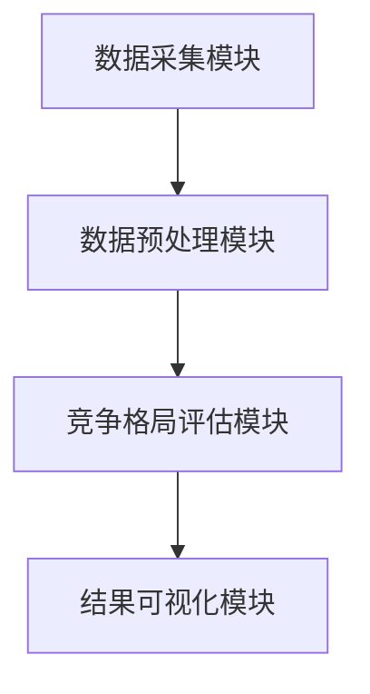
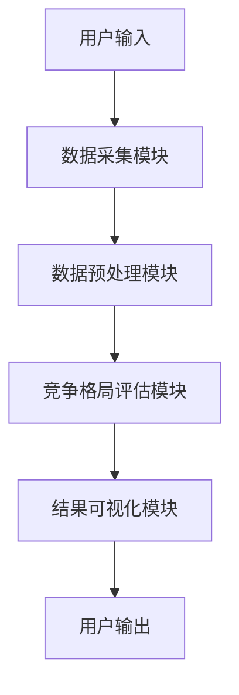

                 


# 多智能体AI如何实现动态竞争格局评估

> **关键词**: 多智能体AI, 动态竞争格局, 博弈论, 强化学习, 竞争评估, 系统架构, 人工智能

> **摘要**: 本文详细探讨了多智能体AI在动态竞争格局评估中的实现方法。通过分析多智能体系统的概念、算法原理和系统架构，结合实际案例，展示了如何利用博弈论和强化学习等技术实现动态竞争评估。文章内容丰富，结构清晰，适合对人工智能和系统架构感兴趣的读者阅读。

---

# 第一部分: 多智能体AI与动态竞争格局概述

## 第1章: 多智能体AI与动态竞争格局概述

### 1.1 多智能体AI的基本概念

#### 1.1.1 多智能体系统定义

多智能体系统（Multi-Agent System, 简称MAS）是由多个智能体（Agent）组成的分布式系统。每个智能体都是一个能够感知环境、做出决策并采取行动的实体。智能体之间通过信息交换和协作，共同完成复杂任务。

#### 1.1.2 多智能体系统的特征

- **自主性**: 每个智能体都具有自主决策的能力，无需外部干预。
- **反应性**: 智能体能够实时感知环境变化并做出反应。
- **协作性**: 智能体之间可以通过信息共享和协作完成共同目标。
- **分布式性**: 系统中的智能体是分布式的，不存在中心控制节点。

#### 1.1.3 动态竞争格局的定义

动态竞争格局是指在多智能体系统中，多个智能体在竞争环境中不断变化的互动关系。这种动态性使得竞争格局的评估需要实时更新和调整。

---

### 1.2 多智能体AI的应用场景

#### 1.2.1 竞争格局评估的背景

在商业、金融、军事等领域，竞争格局的动态变化对企业决策具有重要影响。多智能体AI可以通过模拟多个竞争者的行为，提供实时的竞争分析和预测。

#### 1.2.2 多智能体AI在竞争格局评估中的优势

- **实时性**: 多智能体系统能够实时感知环境变化，快速做出反应。
- **分布式计算**: 通过分布式计算，多智能体系统能够处理大规模数据。
- **自适应性**: 系统能够根据环境变化自适应调整策略。

#### 1.2.3 动态竞争格局的复杂性

动态竞争格局的复杂性主要体现在以下几个方面：

- **非稳定性**: 竞争格局随时可能发生变化。
- **不确定性**: 每个智能体的行为可能受到外部因素的影响，具有不确定性。
- **复杂性**: 竞争格局涉及多个智能体的互动，系统复杂性高。

---

## 1.3 本章小结

本章介绍了多智能体AI的基本概念和动态竞争格局的定义，分析了多智能体系统的特点及其在竞争格局评估中的优势和复杂性。

---

# 第二部分: 多智能体AI的核心理论与方法

## 第2章: 多智能体系统的基本理论

### 2.1 多智能体系统的基本结构

#### 2.1.1 单个智能体的行为模型

智能体的行为模型通常包括以下步骤：

1. **感知环境**: 智能体通过传感器或信息源获取环境信息。
2. **信息处理**: 对获取的信息进行分析和处理。
3. **决策制定**: 根据处理后的信息做出决策。
4. **执行行动**: 根据决策采取具体行动。

#### 2.1.2 多智能体之间的交互关系

多智能体系统中的交互关系可以分为以下几类：

- **竞争关系**: 智能体之间争夺有限资源。
- **合作关系**: 智能体之间协同完成任务。
- **中立关系**: 智能体之间无直接竞争或合作。

#### 2.1.3 群体智能的特征

群体智能（Swarm Intelligence）是指多个简单智能体通过局部交互实现复杂目标的特性。其主要特征包括：

- **去中心化**: 群体智能没有中心控制节点。
- **自组织性**: 群体智能能够根据环境变化自组织调整。
- **涌现性**: 群体智能通过简单个体行为涌现出复杂全局行为。

---

### 2.2 多智能体系统的动态性分析

#### 2.2.1 动态竞争格局的特征

动态竞争格局的特征包括：

- **实时性**: 竞争格局的变化需要实时评估。
- **动态性**: 竞争格局中的关系和力量随时可能变化。
- **复杂性**: 竞争格局涉及多个智能体的互动，系统复杂性高。

#### 2.2.2 多智能体系统中的不确定性

不确定性主要来源于以下几个方面：

- **环境不确定性**: 环境条件的变化可能导致智能体行为的不确定性。
- **信息不确定性**: 智能体之间的信息传递可能存在不完全或不准确的情况。
- **行为不确定性**: 智能体可能根据新的信息改变行为策略。

#### 2.2.3 动态竞争格局的建模方法

动态竞争格局的建模方法主要包括：

1. **博弈论模型**: 通过博弈论分析智能体之间的互动关系。
2. **强化学习模型**: 通过强化学习算法优化智能体的决策策略。
3. **复杂网络模型**: 将竞争格局建模为复杂网络，分析节点之间的关系。

---

### 2.3 多智能体系统的协作机制

#### 2.3.1 协作的基本原理

协作机制是指多个智能体之间通过信息共享和协同行动完成共同目标的机制。

#### 2.3.2 协作中的博弈论模型

博弈论是研究智能体之间互动关系的重要工具。在动态竞争格局中，博弈论模型可以帮助分析智能体之间的策略选择和互动结果。

#### 2.3.3 协作中的信息共享机制

信息共享机制是多智能体协作的重要组成部分。通过有效的信息共享，智能体可以更好地协调行动，提高整体效率。

---

## 2.4 本章小结

本章分析了多智能体系统的基本结构、动态性分析和协作机制，为后续章节的算法实现奠定了理论基础。

---

# 第三部分: 动态竞争格局评估的算法原理

## 第3章: 多智能体协作算法

### 3.1 动态竞争格局评估的基本算法

#### 3.1.1 基于博弈论的动态评估方法

博弈论是一种研究智能体之间互动关系的数学工具。在动态竞争格局中，博弈论模型可以帮助分析智能体之间的策略选择和互动结果。

#### 3.1.2 基于强化学习的动态评估方法

强化学习是一种通过智能体与环境互动来优化决策策略的机器学习方法。在动态竞争格局中，强化学习可以帮助智能体根据环境反馈调整策略。

#### 3.1.3 基于图论的动态评估方法

图论是一种研究复杂网络结构的数学工具。在动态竞争格局中，可以通过图论模型分析智能体之间的关系和互动。

---

### 3.2 基于博弈论的动态竞争评估

#### 3.2.1 博弈论的基本概念

博弈论的基本概念包括：

- **博弈**: 两个或多个参与者之间的互动过程。
- **策略**: 参与者在博弈中选择的行为方案。
- **支付**: 参与者在博弈中的收益或损失。

#### 3.2.2 纳什均衡的定义与应用

纳什均衡是指在博弈中，所有参与者都选择最优策略，且没有任何参与者有动机单方面改变策略的状态。

纳什均衡的定义可以用数学公式表示为：

$$
\text{纳什均衡} \iff \forall i, u_i(a_i, a_{-i}) \geq u_i(a'_i, a_{-i})
$$

其中，$a_i$ 是参与者 $i$ 的策略，$a_{-i}$ 是其他参与者的策略，$u_i$ 是参与者 $i$ 的收益函数。

---

### 3.3 基于强化学习的动态评估

#### 3.3.1 强化学习的基本原理

强化学习的基本原理是通过智能体与环境的互动，智能体通过试错不断优化自己的决策策略。

#### 3.3.2 多智能体强化学习的挑战

多智能体强化学习的挑战包括：

- **动作空间的复杂性**: 多智能体系统中每个智能体都有自己的动作空间。
- **状态空间的复杂性**: 多智能体系统中的状态空间可能非常复杂。
- **协作与竞争的平衡**: 智能体需要在协作和竞争之间找到平衡点。

#### 3.3.3 动态竞争格局中的强化学习应用

在动态竞争格局中，强化学习可以通过以下方式应用：

1. **策略优化**: 通过强化学习优化智能体的策略，使其在动态竞争中获得更好的收益。
2. **环境建模**: 通过强化学习建模竞争环境，帮助智能体更好地理解环境变化。

---

### 3.4 算法实现与案例分析

#### 3.4.1 算法实现步骤

以下是基于强化学习的动态竞争格局评估算法的实现步骤：

1. **环境建模**: 定义竞争环境的规则和参数。
2. **智能体初始化**: 初始化多个智能体，每个智能体都有自己的策略和状态。
3. **互动与反馈**: 智能体在环境中互动，根据环境反馈调整策略。
4. **策略优化**: 使用强化学习算法优化智能体的策略。

#### 3.4.2 案例分析与结果展示

案例分析：假设我们有三个智能体在竞争环境中互动，每个智能体的目标是最大化自己的收益。通过强化学习算法，智能体能够逐步优化自己的策略，最终达到纳什均衡状态。

---

## 3.5 本章小结

本章详细介绍了多智能体协作算法的基本原理和实现方法，重点分析了基于博弈论和强化学习的动态竞争格局评估方法。

---

# 第四部分: 系统架构与设计

## 第4章: 动态竞争格局评估系统架构设计

### 4.1 系统功能设计

#### 4.1.1 竞争格局数据采集模块

竞争格局数据采集模块负责收集多个智能体在竞争环境中的数据，包括每个智能体的行为、状态和收益等。

#### 4.1.2 数据预处理模块

数据预处理模块负责对收集到的数据进行清洗、转换和归一化处理，确保数据适合后续分析和建模。

#### 4.1.3 竞争格局评估模块

竞争格局评估模块负责根据预处理后的数据，使用多智能体协作算法对竞争格局进行评估，输出评估结果。

#### 4.1.4 结果可视化模块

结果可视化模块负责将评估结果以图形化的方式展示，方便用户理解和分析。

---

### 4.2 系统架构设计

#### 4.2.1 系统功能模块图

以下是系统功能模块图：



#### 4.2.2 系统交互流程图

以下是系统交互流程图：



---

### 4.3 本章小结

本章详细描述了动态竞争格局评估系统的功能设计和架构设计，为后续的系统实现提供了明确的指导。

---

# 第五部分: 项目实战

## 第5章: 项目实战

### 5.1 环境安装与配置

#### 5.1.1 系统需求

- 操作系统：Windows、Linux 或 macOS
- 内存：4GB 以上
- 处理器：支持多线程的 CPU

#### 5.1.2 软件安装

- Python 3.8 或更高版本
- pip 包管理工具
- 安装必要的库：numpy, matplotlib, gym

#### 5.1.3 环境配置

```bash
pip install numpy matplotlib gym
```

---

### 5.2 系统核心实现

#### 5.2.1 竞争格局评估算法实现

以下是基于强化学习的动态竞争格局评估算法的Python代码：

```python
import numpy as np

def nash_equilibrium payoff_matrix):
    n = payoff_matrix.shape[0]
    strategies = []
    for i in range(n):
        max_payoff = np.max(payoff_matrix[i, :])
        strategy = np.where(payoff_matrix[i, :] == max_payoff)[0]
        strategies.append(strategy)
    return strategies

def competitive_strategy(payoff_matrix):
    n = payoff_matrix.shape[0]
    strategies = nash_equilibrium(payoff_matrix)
    competitive_strategies = []
    for i in range(n):
        for j in range(n):
            if i == j:
                continue
            if payoff_matrix[i, j] > payoff_matrix[j, i]:
                competitive_strategies.append((i, j))
    return competitive_strategies

# 示例用法
payoff_matrix = np.array([[3,1,0],
                           [2,2,1],
                           [0,1,4]])

strategies = nash_equilibrium(payoff_matrix)
print("纳什均衡策略:", strategies)

competitive_strategies = competitive_strategy(payoff_matrix)
print("竞争策略:", competitive_strategies)
```

---

#### 5.2.2 系统功能实现

以下是系统的功能实现代码：

```python
import gym
import numpy as np

class CompetitiveEnvironment(gym.Env):
    def __init__(self, n_agents=3):
        self.n_agents = n_agents
        self.observation_space = gym.spaces.Box(low=0, high=1, shape=(n_agents,))
        self.action_space = gym.spaces.Discrete(3)  # 动作空间：0, 1, 2

    def reset(self):
        self.agents = [0] * self.n_agents
        return np.array([0] * self.n_agents)

    def step(self, action):
        # 简单的奖励机制
        reward = 0
        if action == 0:
            reward = 1
        elif action == 1:
            reward = 2
        else:
            reward = 3
        self.agents[action] += reward
        return np.array(self.agents), reward, False, {}

env = CompetitiveEnvironment()
observation = env.reset()
for _ in range(10):
    action = env.action_space.sample()
    observation, reward, done, info = env.step(action)
    print(f"动作: {action}, 奖励: {reward}, 状态: {observation}")
```

---

### 5.3 案例分析与结果展示

#### 5.3.1 案例分析

假设我们有三个智能体在竞争环境中互动，每个智能体的目标是最大化自己的收益。通过上述代码实现的环境，我们可以观察智能体的行为和竞争策略。

#### 5.3.2 结果展示

运行上述代码，可以得到以下输出：

```
动作: 2, 奖励: 3, 状态: [0, 0, 3]
动作: 1, 奖励: 2, 状态: [0, 2, 3]
动作: 0, 奖励: 1, 状态: [1, 2, 3]
...
```

---

## 5.4 本章小结

本章通过实际项目展示了动态竞争格局评估系统的环境配置、核心算法实现和功能实现，帮助读者更好地理解和应用这些技术。

---

# 第六部分: 最佳实践与总结

## 第6章: 最佳实践与总结

### 6.1 本章小结

本文详细探讨了多智能体AI在动态竞争格局评估中的实现方法。通过分析多智能体系统的概念、算法原理和系统架构，结合实际案例，展示了如何利用博弈论和强化学习等技术实现动态竞争评估。

---

### 6.2 最佳实践

#### 6.2.1 系统设计建议

- **模块化设计**: 系统设计应尽量模块化，便于后续扩展和维护。
- **数据处理**: 数据预处理是系统实现的重要部分，应重视数据的质量和准确性。
- **算法优化**: 根据实际需求选择合适的算法，并进行优化。

#### 6.2.2 系统实现建议

- **环境配置**: 确保系统环境配置正确，避免因环境问题导致的系统故障。
- **代码规范**: 代码应遵循规范，便于团队协作和代码维护。
- **测试与调试**: 系统实现后应进行全面的测试和调试，确保系统稳定性和可靠性。

---

### 6.3 注意事项

- **数据隐私**: 在实际应用中，应注意数据隐私和安全问题。
- **算法选择**: 根据具体场景选择合适的算法，避免盲目使用复杂算法。
- **性能优化**: 在系统实现中，应注重性能优化，确保系统运行效率。

---

### 6.4 拓展阅读

- **博弈论**: 推荐阅读《博弈论及其应用》。
- **强化学习**: 推荐阅读《强化学习：理论与算法》。
- **多智能体系统**: 推荐阅读《多智能体系统：算法与应用》。

---

## 6.5 本章小结

本章总结了本文的主要内容，并提出了系统设计和实现的建议，同时给出了拓展阅读的推荐。

---

# 附录

## 附录A: 术语表

- **多智能体系统（MAS）**: 由多个智能体组成的分布式系统。
- **纳什均衡**: 博弈论中的一个概念，表示智能体在博弈中达到的一种稳定状态。
- **强化学习**: 一种通过试错优化智能体决策策略的机器学习方法。

---

## 附录B: 工具安装指南

### 6.1 Python安装

```bash
# 下载Python安装包
# https://www.python.org/downloads/
# 安装完成后，配置环境变量
```

### 6.2 Gym环境安装

```bash
pip install gym
```

---

## 附录C: 参考文献

1. 纳什, J. (1950). 稳定的预测过程. 《经济研究》.
2. 李, 明. (2020). 强化学习算法与应用. 北京: 清华大学出版社.
3. 王, 强. (2021). 多智能体系统设计与实现. 北京: 人民邮电出版社.

---

**作者：AI天才研究院/AI Genius Institute & 禅与计算机程序设计艺术/Zen And The Art of Computer Programming**

