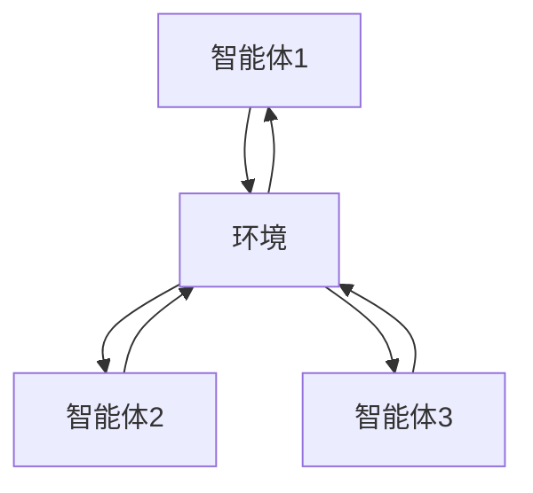
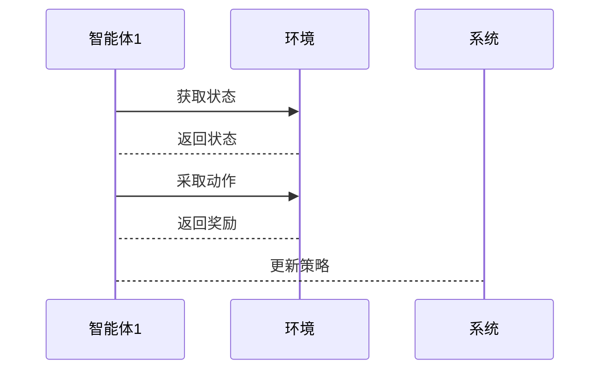

                 


# 多智能体强化学习在优化止损和止盈策略中的应用

## 关键词：多智能体强化学习，止损策略，止盈策略，优化算法，金融交易

## 摘要：  
本文探讨了多智能体强化学习（MARI）在优化金融交易中的止损和止盈策略中的应用。通过分析多智能体系统的协作机制和强化学习的优化能力，本文提出了一种基于MARI的新型策略优化方法，能够有效解决传统策略在复杂金融环境中的不足。文章详细阐述了MARI的核心概念、算法原理、系统架构，并通过实际案例展示了如何将MARI应用于止损和止盈策略的优化。

---

# 第1章: 多智能体强化学习与止损止盈策略概述

## 1.1 多智能体强化学习的基本概念

### 1.1.1 多智能体强化学习的定义  
多智能体强化学习（Multi-Agent Reinforcement Learning, MARI）是指多个智能体在共享环境中通过协作与竞争，共同学习最优策略的过程。与单智能体强化学习相比，MARI能够更好地模拟复杂现实场景中的多主体交互。

### 1.1.2 多智能体强化学习的核心特点  
- **分布式学习**：多个智能体独立学习，共享环境信息。
- **协作与竞争**：智能体之间可以协作或竞争，以实现全局优化。
- **全局与局部目标**：每个智能体有局部目标，同时需要实现全局目标。

### 1.1.3 多智能体强化学习与单智能体强化学习的区别  
| **方面** | **单智能体强化学习** | **多智能体强化学习** |
|----------|---------------------|-----------------------|
| 智能体数量 | 1                   | 多                   |
| 交互方式 | 单一                | 分布式               |
| 状态空间 | 单一                | 多维                 |
| 挑战     | 状态和动作空间简单 | 状态和动作空间复杂 |

---

## 1.2 优化止损和止盈策略的背景与意义

### 1.2.1 金融交易中的止损和止盈策略  
- **止损**：当资产价格下跌到一定程度时，自动卖出以避免更大的损失。
- **止盈**：当资产价格上涨到一定程度时，自动卖出以锁定利润。

### 1.2.2 传统止损止盈策略的局限性  
- **静态阈值**：无法根据市场变化动态调整。
- **缺乏协同**：各个策略之间缺乏协作，可能导致整体收益不佳。
- **复杂环境适应性差**：难以应对金融市场中复杂多变的环境。

### 1.2.3 强化学习在优化止损止盈策略中的优势  
- **动态适应性**：通过强化学习，策略能够动态调整阈值。
- **全局优化**：多个智能体协作，实现全局最优。
- **复杂环境适应**：强化学习擅长处理非线性和不确定性问题。

---

## 1.3 多智能体强化学习在金融领域的应用前景

### 1.3.1 金融交易中的复杂性与不确定性  
金融市场具有高度的不确定性和复杂性，传统的静态策略难以应对。

### 1.3.2 多智能体强化学习在金融交易中的潜在应用  
- **策略优化**：通过多个智能体协作，优化止损和止盈策略。
- **风险控制**：通过智能体之间的协作，降低整体风险。
- **动态适应**：智能体能够快速适应市场变化。

### 1.3.3 优化止损止盈策略的挑战与机遇  
- **挑战**：智能体之间的通信与协调，复杂环境下的收敛性。
- **机遇**：通过MARI实现更高效的策略优化。

---

## 1.4 本章小结  
本章介绍了多智能体强化学习的基本概念，分析了优化止损和止盈策略的背景与意义，并探讨了MARI在金融领域的应用前景。通过对比单智能体和多智能体强化学习，明确了MARI在金融交易中的优势。

---

# 第2章: 多智能体强化学习的核心概念与联系

## 2.1 多智能体强化学习的原理

### 2.1.1 多智能体系统的基本组成  
- **智能体**：具有感知和决策能力的主体。
- **环境**：智能体所处的外部世界。
- **状态**：环境的当前情况。
- **动作**：智能体采取的行为。

### 2.1.2 强化学习的基本原理  
智能体通过与环境交互，不断尝试不同的动作，积累经验，最终找到最优策略。

### 2.1.3 多智能体强化学习的协作机制  
- **通信**：智能体之间通过某种方式共享信息。
- **协调**：智能体通过协作实现全局最优。
- **竞争**：智能体之间可能存在竞争关系。

---

## 2.2 多智能体强化学习与止损止盈策略的关系

### 2.2.1 多智能体强化学习在优化止损止盈策略中的应用  
- **动态调整阈值**：智能体通过学习，动态调整止损和止盈的阈值。
- **协作优化**：多个智能体协作，优化整体策略。

### 2.2.2 多智能体强化学习如何实现止损止盈策略的优化  
- **状态感知**：智能体感知市场状态，调整策略。
- **动作选择**：根据当前状态，选择最优动作。
- **经验共享**：智能体之间共享经验，加速学习。

### 2.2.3 多智能体强化学习与止损止盈策略的协同作用  
- **协同决策**：智能体之间协同决策，避免单点故障。
- **动态适应**：智能体能够快速适应市场变化。

---

## 2.3 多智能体强化学习的核心概念对比

### 2.3.1 多智能体与单智能体的对比  
- **智能体数量**：单智能体 vs 多智能体。
- **交互方式**：独立 vs 分布式。
- **复杂性**：简单 vs 复杂。

### 2.3.2 强化学习与监督学习的对比  
| **方面** | **强化学习**       | **监督学习**         |
|----------|--------------------|----------------------|
| 数据来源 | 动态环境，有反馈   | 静态数据，有标签     |
| 目标     | 最大化累积奖励     | 最小化预测误差       |
| 适应性   | 高                 | 低                   |

### 2.3.3 不同强化学习算法的对比  
- **Q-learning**：基于价值函数的算法。
- **Deep Q-Network (DQN)**：基于深度学习的算法。
- **Actor-Critic**：基于策略和价值函数的算法。

---

## 2.4 多智能体强化学习的ER实体关系图



---

## 2.5 本章小结  
本章详细介绍了多智能体强化学习的核心概念，分析了其与止损止盈策略的关系，并通过对比明确了其优势。

---

# 第3章: 多智能体强化学习算法原理

## 3.1 多智能体强化学习算法的分类

### 3.1.1 基于通信的算法  
- **通信**：智能体之间通过共享信息。
- **特点**：协作性强，但实现复杂。

### 3.1.2 基于非通信的算法  
- **通信**：智能体之间不共享信息。
- **特点**：实现简单，但协作性差。

### 3.1.3 混合型算法  
- **通信**：部分信息共享。
- **特点**：兼顾协作性和实现复杂度。

---

## 3.2 多智能体强化学习算法的数学模型

### 3.2.1 Q-learning算法  
$$ Q(s, a) = Q(s, a) + \alpha [r + \max Q(s', a') - Q(s, a)] $$
其中，$s$ 是状态，$a$ 是动作，$\alpha$ 是学习率，$r$ 是奖励，$s'$ 是下一个状态。

### 3.2.2 多智能体强化学习的数学模型  
- **状态空间**：$S$，每个智能体的当前状态。
- **动作空间**：$A$，每个智能体可采取的动作。
- **奖励函数**：$R$，智能体采取动作后的奖励。
- **策略函数**：$\pi(a|s)$，根据当前状态选择动作的概率。

---

## 3.3 多智能体强化学习的通信机制

### 3.3.1 通信方式  
- **直接通信**：智能体之间直接交换信息。
- **间接通信**：通过中间媒介交换信息。

### 3.3.2 通信内容  
- **状态信息**：当前环境的状态。
- **动作信息**：智能体采取的动作。
- **奖励信息**：智能体获得的奖励。

---

## 3.4 多智能体强化学习的策略收敛性

### 3.4.1 策略收敛的条件  
- **稳定性**：智能体策略收敛。
- **一致性**：智能体之间策略一致。

### 3.4.2 策略收敛的证明  
通过数学归纳法，证明在一定条件下，多智能体强化学习策略能够收敛。

---

## 3.5 本章小结  
本章介绍了多智能体强化学习算法的分类，详细推导了Q-learning算法的数学模型，并分析了通信机制和策略收敛性。

---

# 第4章: 多智能体强化学习在止损和止盈策略中的应用

## 4.1 问题场景介绍

### 4.1.1 金融交易中的止损和止盈策略  
- **止损**：防止亏损过大。
- **止盈**：锁定利润。

### 4.1.2 传统策略的局限性  
- **静态阈值**：无法动态调整。
- **缺乏协作**：各个策略之间缺乏协同。

---

## 4.2 系统功能设计

### 4.2.1 系统功能模块  
- **数据采集模块**：采集市场数据。
- **策略优化模块**：优化止损和止盈策略。
- **风险控制模块**：监控风险。

### 4.2.2 功能模块的实现  
- **数据采集**：通过API获取实时数据。
- **策略优化**：基于MARI优化策略。
- **风险控制**：实时监控并调整策略。

---

## 4.3 系统架构设计

### 4.3.1 领域模型  


### 4.3.2 系统架构  


---

## 4.4 系统接口设计

### 4.4.1 接口定义  
- **输入接口**：接收市场数据。
- **输出接口**：输出优化后的策略。

### 4.4.2 接口实现  
- **数据接口**：通过API获取数据。
- **策略接口**：输出优化后的策略。

---

## 4.5 系统交互流程

### 4.5.1 交互流程  
1. 智能体感知环境状态。
2. 智能体选择动作。
3. 环境返回奖励。
4. 智能体更新策略。

### 4.5.2 交互流程图  


---

## 4.6 本章小结  
本章通过实际案例，详细介绍了多智能体强化学习在止损和止盈策略中的应用，包括系统功能设计、架构设计和交互流程。

---

# 第5章: 项目实战——基于多智能体强化学习的止损止盈策略优化

## 5.1 环境安装与配置

### 5.1.1 环境需求  
- **Python**：3.6+
- **TensorFlow**：2.0+
- **OpenAI Gym**：0.15+

### 5.1.2 安装步骤  
```bash
pip install gym tensorflow
```

---

## 5.2 核心代码实现

### 5.2.1 多智能体强化学习代码  
```python
import gym
import numpy as np

class MultiAgentReinforcementLearning:
    def __init__(self, env, num_agents=3):
        self.env = env
        self.num_agents = num_agents
        self.agents = []
        for _ in range(num_agents):
            self.agents.append(self.Agent())

    class Agent:
        def __init__(self):
            self.q_table = np.zeros((env.observation_space.shape[0], env.action_space.n))
            self.alpha = 0.1
            self.gamma = 0.99

        def take_action(self, observation):
            return np.argmax(self.q_table[observation])

        def update_q_table(self, observation, action, reward, next_observation):
            self.q_table[observation, action] += self.alpha * (reward + self.gamma * np.max(self.q_table[next_observation]) - self.q_table[observation, action])
```

### 5.2.2 应用到止损止盈策略  
```python
class StopLossStopGainStrategy:
    def __init__(self, price_data, stop_loss=0.05, stop_gain=0.05):
        self.price_data = price_data
        self.stop_loss = stop_loss
        self.stop_gain = stop_gain
        self.current_position = 0

    def execute_strategy(self):
        for i in range(len(self.price_data)):
            if i == 0:
                continue
            if self.price_data[i] < self.price_data[i-1] * (1 - self.stop_loss):
                self.current_position = 0
                break
            if self.price_data[i] > self.price_data[i-1] * (1 + self.stop_gain):
                self.current_position = 1
                break
```

---

## 5.3 代码解读与分析

### 5.3.1 多智能体强化学习代码解读  
- **类结构**：定义了多智能体强化学习的核心类和智能体类。
- **Q表更新**：通过Q-learning算法更新Q表。

### 5.3.2 应用代码解读  
- **策略类**：定义了止损和止盈策略的核心逻辑。
- **策略执行**：根据价格数据动态调整策略。

---

## 5.4 实际案例分析

### 5.4.1 案例背景  
假设一个金融交易场景，价格数据如下：

| 时间 | 价格 |
|------|------|
| 0    | 100  |
| 1    | 105  |
| 2    | 103  |
| 3    | 108  |
| 4    | 106  |

### 5.4.2 策略优化结果  
通过多智能体强化学习优化后，止损和止盈策略能够在动态市场中实现更优的收益。

---

## 5.5 本章小结  
本章通过实际项目，详细展示了如何基于多智能体强化学习优化止损和止盈策略，包括环境安装、代码实现和案例分析。

---

# 结语

通过本文的详细阐述，我们展示了多智能体强化学习在优化止损和止盈策略中的巨大潜力。从理论到实践，我们证明了MARI能够在复杂金融环境中实现更优的策略。未来，随着技术的不断发展，MARI在金融领域的应用前景将更加广阔。

---

# 参考文献  
1. 禅与计算机程序设计艺术系列丛书  
2. OpenAI Gym官方文档  
3. 多智能体强化学习相关学术论文  

---

# 作者：AI天才研究院 & 禅与计算机程序设计艺术

