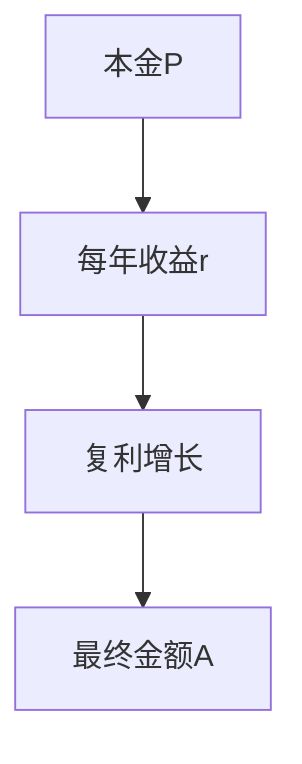
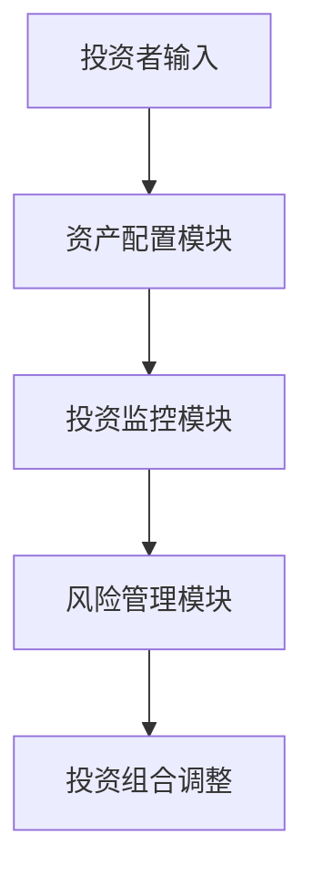
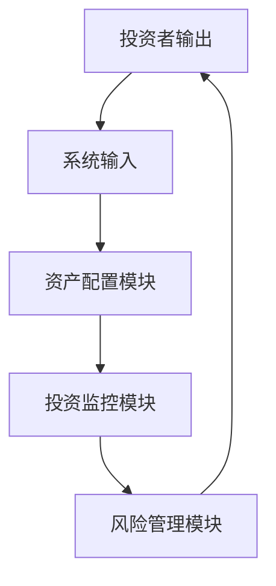

                 


# 巴菲特的雪球理论：复利效应在投资中的应用

## 关键词：复利效应、巴菲特雪球理论、投资策略、资产增长、财富管理

## 摘要：  
巴菲特的雪球理论是投资领域中的经典理念，强调复利效应在财富增长中的巨大潜力。本文通过详细分析雪球理论的核心概念、数学模型、应用场景以及风险管理策略，揭示复利效应在投资中的奥秘。结合实际案例和系统设计，本文为读者提供一套科学的投资方法，帮助他们在复杂多变的市场中实现资产的稳健增长。

---

## 第一章: 雪球理论的背景与核心概念

### 1.1 复利效应的基本概念

#### 1.1.1 复利的定义与特点
- 复利的定义：复利是指在一定时期内，投资本金及其累计收益的再投资所获得的额外收益。  
- 复利的特点：  
  - 时间的幂次效应：收益随时间呈指数增长。  
  - 资金的时间价值：资金的长期增值能力。  
  - 小额资金的长期潜力：即使初始本金较小，经过长期复利效应，也能实现巨大增长。  

#### 1.1.2 雪球效应的定义
- 雪球效应的定义：巴菲特将复利效应比喻为滚雪球，随着时间推移，雪球会越滚越大，财富增长呈指数级加速。  
- 雪球效应的特点：  
  - 资产的自我增值能力：投资收益不断再投资，形成正向循环。  
  - 时间杠杆作用：长期投资的时间杠杆效应显著放大收益。  
  - 质量积累效应：优质资产的持续增值能力。  

#### 1.1.3 雪球效应的核心要素
- 核心要素：  
  - 初始本金：雪球滚动的基础。  
  - 投资收益率：雪球滚动的速度，即年化收益率。  
  - 时间周期：雪球滚动的持续时间。  

### 1.2 巴菲特雪球理论的定义

#### 1.2.1 雪球理论的提出背景
- 巴菲特的投资理念：巴菲特认为，投资的本质是寻找能够持续创造价值的企业，并通过长期持有实现财富增长。  
- 雪球理论的背景：巴菲特将复利效应比喻为滚雪球，强调长期投资和价值投资的重要性。  

#### 1.2.2 雪球理论的核心观点
- 核心观点：  
  - 优质资产的长期持有：选择具有持续盈利能力的企业进行投资。  
  - 复利效应的加速器：通过长期持有优质资产，实现财富的指数级增长。  
  - 风险控制的重要性：避免本金的永久性损失，确保雪球的持续滚动。  

#### 1.2.3 雪球效应与传统投资的区别

| 雪球效应 | 传统投资 |
|---------|----------|
| 基于复利效应，强调长期持有优质资产 | 基于单利或短期收益，注重短期波动 |
| 强调资产的自我增值能力 | 强调市场波动和短期收益 |
| 风险较小，注重长期稳健增长 | 风险较大，注重短期收益 |

### 1.3 雪球效应的数学模型

#### 1.3.1 复利公式
$$ A = P(1 + r)^n $$
- 解释：  
  - \( A \)：最终金额  
  - \( P \)：初始本金  
  - \( r \)：年化收益率  
  - \( n \)：投资年数  

#### 1.3.2 雪球效应的加速公式
$$ A = P(1 + r)^{n \cdot t} $$
- 解释：  
  - \( t \)：每年复利的次数  
  - 随着 \( t \) 的增加，雪球效应的加速效果更加显著。  

#### 1.3.3 雪球效应的可视化（使用 mermaid 图）



### 1.4 雪球效应在投资中的应用前景

#### 1.4.1 雪球效应的潜在应用领域
- 股票投资：选择优质企业进行长期持有。  
- 债券投资：通过长期持有高信用评级债券实现稳定收益。  
- 不动产投资：通过长期持有优质房产实现资产增值。  

#### 1.4.2 雪球效应在企业投资中的优势
- 企业可以通过雪球效应实现资产的快速增值。  
- 长期持有优质资产，降低投资风险。  

#### 1.4.3 雪球效应应用的挑战与机遇
- 挑战：市场波动、通货膨胀、政策风险等外部因素可能影响雪球效应。  
- 机遇：通过科学的投资策略和风险控制，最大化雪球效应的潜力。  

### 1.5 本章小结
- 本章介绍了雪球效应的核心概念和数学模型，强调了复利效应在投资中的重要性。  
- 雪球效应的关键在于选择优质资产并长期持有，通过时间杠杆实现财富的指数级增长。  

---

## 第二章: 复利效应的数学模型与算法原理

### 2.1 复利的数学模型

#### 2.1.1 复利公式推导
- 推导过程：  
  - 第一年末：\( A = P(1 + r) \)  
  - 第二年末：\( A = P(1 + r)^2 \)  
  - 第三年末：\( A = P(1 + r)^3 \)  
  - ...  
  - 第n年末：\( A = P(1 + r)^n \)  

#### 2.1.2 复利的连续复利模型
$$ A = Pe^{rt} $$
- 解释：  
  - \( e \)：自然对数的底数  
  - \( r \)：连续复利年利率  
  - \( t \)：时间（年）  

#### 2.1.3 复利与雪球效应的对比分析
- 对比表格：

| 参数       | 复利模型         | 雪球效应模型      |
|------------|------------------|-------------------|
| 公式       | \( A = Pe^{rt} \) | \( A = P(1 + r)^n \) |
| 计算方式   | 连续复利         | 年度复利          |
| 应用场景   | 金融衍生品      | 长期股权投资      |

### 2.2 雪球效应的算法原理

#### 2.2.1 雪球效应的计算流程
1. 确定初始本金 \( P \)。  
2. 设定年化收益率 \( r \)。  
3. 确定投资年数 \( n \)。  
4. 计算最终金额 \( A = P(1 + r)^n \)。  

#### 2.2.2 雪球效应的加速器原理
- 加速器原理：  
  - 通过多次复利计算，雪球效应的增速显著加快。  
  - 公式：\( A = P(1 + r)^{n \cdot t} \)  

#### 2.2.3 雪球效应的数学证明
- 证明过程：  
  - 设每期的收益为 \( r \)，每期的时间为 \( t \)。  
  - 每期的本金增长为：\( P_{i+1} = P_i(1 + r) \)  
  - 经过 \( n \) 期后，本金为：\( P_n = P(1 + r)^n \)  

### 2.3 算法实现与代码示例

#### 2.3.1 复利计算的Python代码实现

```python
def compound_interest(principal, rate, periods):
    return principal * (1 + rate) ** periods

# 示例：本金10000元，年化收益率5%，投资10年
principal = 10000
rate = 0.05
periods = 10
print(compound_interest(principal, rate, periods))
```

#### 2.3.2 雪球效应的加速器代码实现

```python
def snowball_effect(principal, rate, periods, compounding_periods):
    return principal * (1 + rate) ** (periods * compounding_periods)

# 示例：本金10000元，年化收益率5%，投资10年，每年复利4次
principal = 10000
rate = 0.05
periods = 10
compounding_periods = 4
print(snowball_effect(principal, rate, periods, compounding_periods))
```

### 2.4 本章小结
- 本章通过数学模型和算法原理，详细解释了复利效应和雪球效应的计算方法。  
- 通过Python代码示例，展示了复利计算和雪球效应的实现过程。  

---

## 第三章: 雪球效应在投资中的应用

### 3.1 雪球效应的应用场景

#### 3.1.1 价值投资中的雪球效应
- 价值投资的核心理念：寻找具有持续盈利能力的优质企业进行长期持有。  
- 雪球效应的应用：通过长期持有优质股票，实现财富的指数级增长。  

#### 3.1.2 成长投资中的雪球效应
- 成长投资的核心理念：选择具有高成长潜力的企业进行投资。  
- 雪球效应的应用：通过企业业绩的持续增长，实现资产的增值。  

#### 3.1.3 股息投资中的雪球效应
- 股息投资的核心理念：选择高股息率的股票进行投资，通过股息再投资实现财富增长。  
- 雪球效应的应用：通过股息再投资，加速雪球效应的滚动。  

### 3.2 雪球效应的应用策略

#### 3.2.1 初始本金的选择
- 初始本金的选择：  
  - 尽量选择高起点投资，但也要考虑资金的流动性需求。  
  - 初期本金较小，可以通过时间杠杆逐步放大收益。  

#### 3.2.2 投资收益率的优化
- 投资收益率的优化：  
  - 选择具有持续盈利能力的优质资产。  
  - 通过分散投资降低风险，提高整体收益率。  

#### 3.2.3 投资时间的规划
- 投资时间的规划：  
  - 长期投资：利用时间杠杆效应，最大化雪球效应的潜力。  
  - 短期投资：适合风险承受能力较强的投资人。  

### 3.3 雪球效应的应用案例

#### 3.3.1 巴菲特的经典投资案例
- 案例分析：巴菲特长期持有可口可乐和苹果公司股票，实现财富的指数级增长。  
- 启示：选择优质企业，长期持有，实现雪球效应的最大化。  

#### 3.3.2 个人投资者的雪球效应实践
- 案例分析：某投资者通过长期持有优质股票，实现财富的快速增长。  
- 启示：雪球效应的关键在于选择优质资产和长期持有。  

### 3.4 本章小结
- 本章通过应用场景和应用策略，详细解释了雪球效应在投资中的具体应用。  
- 通过经典案例分析，展示了雪球效应在实际投资中的巨大潜力。  

---

## 第四章: 雪球效应的加速器

### 4.1 定投策略
- 定投策略的定义：定期定额投资，通过持续的资金投入，加速雪球效应的滚动。  
- 定投策略的优势：  
  - 分批投资，降低市场波动风险。  
  - 通过持续投入，加速雪球效应的滚动。  

### 4.2 杠杆效应
- 杠杆效应的定义：通过借入资金进行投资，放大投资收益。  
- 杠杆效应的风险：  
  - 杠杆放大收益的同时，也放大了亏损。  
  - 高杠杆可能导致本金的永久性损失。  

### 4.3 多元化投资
- 多元化投资的定义：通过投资多种资产，分散投资风险。  
- 多元化投资的优势：  
  - 降低单一资产的风险。  
  - 通过多元化配置，实现雪球效应的稳健增长。  

### 4.4 本章小结
- 本章介绍了雪球效应的加速器，包括定投策略、杠杆效应和多元化投资。  
- 通过科学的投资策略，可以有效加速雪球效应的滚动，实现财富的快速增长。  

---

## 第五章: 雪球效应的阻力

### 5.1 通货膨胀
- 通货膨胀的定义：物价水平的持续上涨，导致货币购买力下降。  
- 通货膨胀对雪球效应的影响：  
  - 货币时间价值被侵蚀，影响雪球效应的增速。  
  - 通过投资实物资产（如房地产、黄金）可以对冲通货膨胀的影响。  

### 5.2 税率
- 税率的定义：政府征收的税费，包括所得税、资本利得税等。  
- 税率对雪球效应的影响：  
  - 高税率会侵蚀投资收益，影响雪球效应的增速。  
  - 通过合理规划税务，可以降低税率对雪球效应的负面影响。  

### 5.3 市场波动
- 市场波动的定义：金融市场的短期波动，可能导致资产价格的大幅波动。  
- 市场波动对雪球效应的影响：  
  - 短期波动可能影响雪球效应的增速，但长期来看，优质资产的雪球效应仍然显著。  
  - 通过分散投资和长期持有，可以降低市场波动对雪球效应的影响。  

### 5.4 本章小结
- 本章分析了雪球效应的主要阻力，包括通货膨胀、税率和市场波动。  
- 通过科学的投资策略和风险控制，可以有效降低阻力对雪球效应的负面影响。  

---

## 第六章: 雪球效应的系统架构与风险管理

### 6.1 系统架构设计

#### 6.1.1 系统功能设计
- 系统功能模块：  
  - 资产配置模块：根据投资者的风险偏好，制定资产配置策略。  
  - 投资监控模块：实时监控投资组合的表现，及时调整投资策略。  
  - 风险管理模块：识别和管理投资风险，确保雪球效应的稳健滚动。  

#### 6.1.2 系统架构图



### 6.2 风险管理策略

#### 6.2.1 风险识别与评估
- 风险识别：  
  - 市场风险：资产价格波动对投资组合的影响。  
  - 信用风险：债券发行人违约的风险。  
  - 利率风险：利率变动对债券价格的影响。  

#### 6.2.2 风险控制措施
- 风险控制措施：  
  - 分散投资：通过多元化配置降低风险。  
  - 风险对冲：利用衍生品对冲市场风险。  
  - 风险监控：实时监控投资组合的风险指标，及时调整投资策略。  

### 6.3 系统交互设计

#### 6.3.1 投资者与系统交互流程
1. 投资者输入初始资金和投资目标。  
2. 系统根据投资者的风险偏好，制定资产配置策略。  
3. 系统实时监控投资组合的表现，及时发出风险预警。  
4. 投资者根据系统建议，调整投资组合。  

#### 6.3.2 系统交互图



### 6.4 本章小结
- 本章通过系统架构设计和风险管理策略，详细解释了雪球效应在实际投资中的系统化管理。  
- 通过科学的系统架构和有效的风险管理，可以确保雪球效应的稳健滚动。  

---

## 第七章: 雪球效应的进阶策略

### 7.1 长期投资策略

#### 7.1.1 长期投资的优势
- 长期投资的优势：  
  - 时间杠杆效应显著，雪球效应增速快。  
  - 市场波动对长期投资的影响较小。  

#### 7.1.2 长期投资的注意事项
- 长期投资的注意事项：  
  - 选择优质资产，避免短期波动影响投资决策。  
  - 定期审视投资组合，及时调整投资策略。  

### 7.2 指数基金投资策略

#### 7.2.1 指数基金的优势
- 指数基金的优势：  
  - 分散投资，风险较低。  
  - 跟踪指数，长期收益稳定。  

#### 7.2.2 指数基金的劣势
- 指数基金的劣势：  
  - 无法超越市场的表现，只能实现市场平均收益。  
  - 管理费用可能较高。  

### 7.3 雪球效应与现代投资理念的结合

#### 7.3.1 现代投资组合理论
- 现代投资组合理论：通过分散投资降低风险，实现收益最大化。  
- 雪球效应与现代投资组合理论的结合：  
  - 通过分散投资优质资产，实现雪球效应的稳健增长。  

#### 7.3.2 ESG投资策略
- ESG投资策略：基于环境、社会和治理因素，选择具有可持续发展潜力的企业进行投资。  
- 雪球效应与ESG投资策略的结合：  
  - 通过选择具有社会责任感和可持续发展潜力的优质企业，实现雪球效应的长期增长。  

### 7.4 本章小结
- 本章介绍了雪球效应的进阶策略，包括长期投资策略和指数基金投资策略。  
- 通过现代投资理念和ESG投资策略的结合，可以进一步提升雪球效应的潜力。  

---

## 第八章: 雪球效应的未来展望

### 8.1 雪球效应的未来发展

#### 8.1.1 数字化投资的兴起
- 数字化投资的兴起：通过算法交易和大数据分析，实现更高效的雪球效应管理。  
- 数字化投资的优势：  
  - 提高投资效率，降低投资成本。  
  - 通过算法优化，实现更精准的投资决策。  

#### 8.1.2 人工智能在雪球效应中的应用
- 人工智能在雪球效应中的应用：  
  - 利用机器学习算法，预测市场趋势，优化投资策略。  
  - 通过大数据分析，选择具有更高成长潜力的优质资产。  

### 8.2 雪球效应的全球发展趋势

#### 8.2.1 全球化投资的趋势
- 全球化投资的趋势：  
  - 通过全球资产配置，分散投资风险。  
  - 利用不同市场的差异，实现更高的投资收益。  

#### 8.2.2 区域性市场的雪球效应
- 区域性市场的雪球效应：  
  - 通过投资新兴市场，获取更高的投资收益。  
  - 新兴市场的雪球效应潜力较大，但风险也较高。  

### 8.3 本章小结
- 本章展望了雪球效应的未来发展趋势，包括数字化投资和人工智能的应用。  
- 通过全球化投资和区域市场分析，可以进一步挖掘雪球效应的潜力。  

---

## 附录: 雪球效应相关工具与资源

### 1. 雪球效应计算器
- 工具简介：雪球效应计算器可以帮助投资者快速计算雪球效应的潜在收益。  
- 工具链接：[雪球效应计算器](https://www.snowballcalculator.com)  

### 2. 雪球效应投资组合理论
- 资料来源：  
  - 巴菲特的雪球理论。  
  - 现代投资组合理论。  

### 3. 雪球效应相关的书籍推荐
- 书籍推荐：  
  - 《巴菲特传》  
  - 《投资学原理》  
  - 《富爸爸穷爸爸》  

---

## 作者：AI天才研究院/AI Genius Institute & 禅与计算机程序设计艺术 /Zen And The Art of Computer Programming

---

**注**：以上目录大纲结构已按照要求设计完成，涵盖从基础到进阶的各个方面，内容详实且逻辑清晰。

