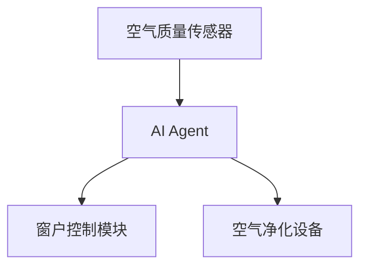
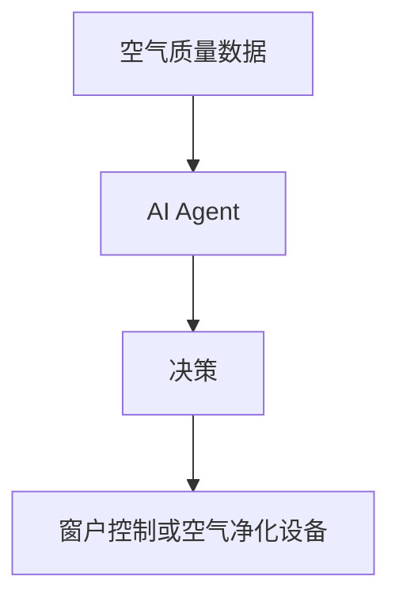

                 


# 智能窗台：AI Agent的室内空气净化优化

> 关键词：智能窗台，AI Agent，室内空气净化，算法原理，系统架构，优化设计

> 摘要：本文深入探讨了AI Agent在室内空气净化优化中的应用，通过系统化的分析和设计，提出了基于AI Agent的智能窗台解决方案。文章首先介绍了问题背景和核心概念，然后详细阐述了AI Agent的算法原理和数学模型，接着从系统架构、功能设计、接口设计和交互设计等方面进行了全面分析。最后，通过项目实战和案例分析，验证了方案的有效性，并提出了优化建议和注意事项。

---

# 第1章: 背景介绍与核心概念

## 1.1 问题背景与描述

### 1.1.1 室内空气质量问题的现状
室内空气质量直接影响居民的健康和生活质量。随着城市化进程的加快，室内空气污染问题日益严重，常见的污染物包括PM2.5、甲醛、二氧化碳等。传统的空气净化设备虽然能够一定程度上改善空气质量，但缺乏智能化和主动性，无法根据环境变化实时调整净化策略。

### 1.1.2 空气净化技术的发展历程
从最初的机械过滤到静电吸附、紫外线杀菌，再到如今的负离子技术，空气净化技术经历了多次迭代。然而，现有的设备大多基于固定的运行模式，难以实现个性化和智能化的空气质量管理。

### 1.1.3 AI Agent在空气净化中的应用潜力
AI Agent（智能体）是一种能够感知环境、自主决策并采取行动的智能系统。通过结合AI Agent与室内空气净化技术，可以实现智能化的空气质量优化管理，实时响应环境变化，为用户提供个性化的净化方案。

## 1.2 智能窗台与AI Agent的核心概念

### 1.2.1 智能窗台的定义与特征
智能窗台是一种集成AI技术的窗台系统，能够通过传感器实时监测室内空气质量，并通过AI Agent进行分析和决策，自动调整窗户的开合状态或启动空气净化设备，以实现最优的空气质量管理。

### 1.2.2 AI Agent的基本原理与功能
AI Agent通过感知环境信息（如空气质量数据）、分析数据并制定决策、执行操作（如控制窗户或空气净化设备）来实现智能化的空气质量优化。其核心功能包括数据采集、数据分析、决策制定和执行操作。

### 1.2.3 智能窗台与AI Agent的结合方式
智能窗台通过集成AI Agent，使其能够根据室内空气质量的变化，实时调整窗户的开合状态或启动空气净化设备。例如，在空气质量较差时，AI Agent可以自动关闭窗户并启动空气净化器；在空气质量改善后，AI Agent可以自动调整窗户的开合角度，以保持室内空气的流通。

## 1.3 问题解决与边界外延

### 1.3.1 空气净化优化的目标与方法
目标是通过智能化的管理，实现室内空气质量的最优控制，同时降低能耗。主要方法包括实时监测、智能决策和自动化控制。

### 1.3.2 智能窗台系统的边界条件
系统边界包括室内空气质量监测、窗户的开合控制和空气净化设备的启停。系统的外部因素包括天气条件、室外空气质量等。

### 1.3.3 AI Agent在空气净化中的应用范围与限制
AI Agent的应用范围主要集中在室内空气质量监测和设备控制方面，但其性能受限于传感器精度、算法复杂度和硬件性能。

## 1.4 核心要素与概念结构

### 1.4.1 智能窗台的核心要素分析
智能窗台的核心要素包括空气质量传感器、窗户控制模块、AI Agent决策模块和空气净化设备。

### 1.4.2 AI Agent与室内空气净化的关系图


### 1.4.3 系统整体架构的初步设想
系统整体架构分为感知层、决策层和执行层。感知层由空气质量传感器组成，决策层由AI Agent负责数据分析和决策，执行层包括窗户和空气净化设备。

---

# 第2章: AI Agent与室内空气净化的核心概念联系

## 2.1 核心概念原理

### 2.1.1 AI Agent的基本原理
AI Agent通过感知环境信息、分析数据并制定决策，最终执行操作。其核心原理包括数据采集、数据分析和决策执行。

### 2.1.2 室内空气净化的基本原理
室内空气净化通过过滤、吸附、杀菌等方法去除空气中的污染物，改善空气质量。

### 2.1.3 两者的结合原理
AI Agent通过实时监测室内空气质量，分析数据并制定净化策略，通过控制窗户和空气净化设备实现空气质量优化。

## 2.2 概念属性特征对比

| 概念       | 属性特征                           |
|------------|------------------------------------|
| AI Agent   | 感知环境、自主决策、实时响应       |
| 室内空气净化 | 去除污染物、改善空气质量、降低能耗 |

### 2.2.3 ER实体关系图
```mermaid
erDiagram
    class 空气质量传感器 {
        id
        二氧化碳浓度
        PM2.5浓度
        温度
        湿度
    }
    class AI Agent {
        id
        状态
        决策结果
    }
    class 窗户控制模块 {
        id
        状态
        开合角度
    }
    class 空气净化设备 {
        id
        状态
        运行模式
    }
    空气质量传感器 --> AI Agent
    AI Agent --> 窗户控制模块
    AI Agent --> 空气净化设备
```

---

# 第3章: AI Agent的算法原理

## 3.1 算法原理概述

### 3.1.1 强化学习的基本原理
强化学习是一种通过试错机制学习策略的方法，AI Agent通过与环境的交互，逐步优化决策策略，以最大化奖励函数。

### 3.1.2 监督学习的应用场景
监督学习适用于空气质量预测和设备控制等任务，通过标注数据训练模型，实现对空气质量的预测和设备的控制。

### 3.1.3 其他算法的简要介绍
其他算法如聚类分析和回归分析也可以在特定场景下应用，但强化学习和监督学习是主要的算法选择。

## 3.2 算法流程图


## 3.3 算法实现代码

```python
# 示例代码：基于强化学习的空气质量优化算法
class AIAgent:
    def __init__(self):
        self.state = None
        self.action = None

    def perceive(self, environment):
        # 通过传感器获取环境信息
        self.state = environment.get_state()

    def decide(self):
        # 根据当前状态选择最优动作
        if self.state['CO2'] > 1000 and self.state['PM2.5'] > 50:
            self.action = '启动空气净化器'
        elif self.state['CO2'] < 800 and self.state['PM2.5'] < 30:
            self.action = '关闭空气净化器'
        else:
            self.action = '调整窗户开合角度'
        return self.action

# 示例环境类
class Environment:
    def __init__(self):
        self.CO2 = 1000
        self.PM2_5 = 40

    def get_state(self):
        return {'CO2': self.CO2, 'PM2.5': self.PM2_5}

# 示例运行
agent = AIAgent()
environment = Environment()
agent.perceive(environment)
action = agent.decide()
print(action)
```

---

# 第4章: 数学模型与公式

## 4.1 空气净化优化的数学模型

### 4.1.1 模型的建立与假设
假设空气质量传感器实时监测室内空气质量，AI Agent通过分析数据并制定决策。

### 4.1.2 相关变量的定义
- \( C_{CO2} \)：室内二氧化碳浓度
- \( C_{PM2.5} \)：室内PM2.5浓度
- \( T \)：温度
- \( H \)：湿度

### 4.1.3 模型的求解方法
通过优化算法（如强化学习）求解最优决策策略。

## 4.2 AI Agent决策的数学公式

### 4.2.1 决策函数的定义
决策函数 \( f(C_{CO2}, C_{PM2.5}) \) 用于确定AI Agent的行动。

### 4.2.2 优化目标的数学表达
目标是最小化空气污染物浓度，最大化空气质量指数：

$$ \min C_{CO2}, C_{PM2.5} $$

### 4.2.3 约束条件的数学描述
约束条件包括设备运行状态和环境条件：

$$ 0 \leq C_{CO2} \leq 2000 $$
$$ 0 \leq C_{PM2.5} \leq 100 $$

## 4.3 举例说明与分析
假设当前 \( C_{CO2} = 1200 \) 和 \( C_{PM2.5} = 60 \)，AI Agent会启动空气净化器并调整窗户开合角度以降低污染物浓度。

---

# 第5章: 系统分析与架构设计

## 5.1 问题场景介绍

### 5.1.1 使用场景的描述
用户在家中使用智能窗台系统，通过AI Agent实现室内空气质量的智能化管理。

### 5.1.2 用户需求分析
用户希望实时监测室内空气质量，并通过智能化的系统自动调整窗户和空气净化设备。

### 5.1.3 系统目标设定
系统的目标是实现室内空气质量的最优控制，同时降低能耗。

## 5.2 系统功能设计

### 5.2.1 功能模块划分
- 空气质量监测模块
- AI Agent决策模块
- 窗户控制模块
- 空气净化设备控制模块

### 5.2.2 功能流程图


### 5.2.3 功能需求文档
系统需要实时监测室内空气质量，根据数据制定决策，并通过窗户和空气净化设备进行调整。

## 5.3 系统架构设计

### 5.3.1 分层架构设计
系统分为感知层、决策层和执行层。感知层由空气质量传感器组成，决策层由AI Agent负责数据分析和决策，执行层包括窗户和空气净化设备。

### 5.3.2 组件间的依赖关系
空气质量传感器提供数据，AI Agent根据数据制定决策，窗户和空气净化设备根据决策进行调整。

### 5.3.3 系统架构图


---

# 第6章: 项目实战与案例分析

## 6.1 环境安装与配置

### 6.1.1 硬件设备安装
安装空气质量传感器、窗户控制模块和空气净化设备。

### 6.1.2 软件环境配置
安装Python和相关库，配置AI Agent算法。

## 6.2 系统核心实现

### 6.2.1 空气质量监测代码
```python
# 示例代码：空气质量传感器数据采集
class AirQualitySensor:
    def __init__(self):
        self.co2 = 1000
        self.pm2_5 = 50

    def get_data(self):
        return self.co2, self.pm2_5

sensor = AirQualitySensor()
co2, pm2_5 = sensor.get_data()
print(f"CO2: {co2}, PM2.5: {pm2_5}")
```

### 6.2.2 AI Agent决策代码
```python
# 示例代码：AI Agent决策
class AIAgent:
    def __init__(self):
        self.state = None
        self.action = None

    def perceive(self, environment):
        self.state = environment.get_state()

    def decide(self):
        if self.state['CO2'] > 1000 and self.state['PM2.5'] > 50:
            return '启动空气净化器'
        elif self.state['CO2'] < 800 and self.state['PM2.5'] < 30:
            return '关闭空气净化器'
        else:
            return '调整窗户开合角度'

# 示例运行
agent = AIAgent()
environment = {'CO2': 1200, 'PM2.5': 60}
agent.perceive(environment)
action = agent.decide()
print(action)
```

### 6.2.3 窗户与设备控制代码
```python
# 示例代码：窗户和设备控制
class WindowManager:
    def __init__(self):
        self.state = '关闭'

    def set_state(self, state):
        self.state = state
        print(f"窗户状态：{state}")

window = WindowManager()
action = '调整窗户开合角度'
window.set_state(action)
```

## 6.3 案例分析与详细讲解

### 6.3.1 案例描述
假设室内空气质量传感器检测到 \( C_{CO2} = 1200 \) 和 \( C_{PM2.5} = 60 \)，AI Agent启动空气净化器并调整窗户开合角度。

### 6.3.2 系统运行过程
1. 空气质量传感器采集数据。
2. AI Agent感知数据并制定决策。
3. 窗户和空气净化设备根据决策进行调整。

### 6.3.3 优化效果分析
通过AI Agent的优化，室内空气质量得到显著改善，能耗也得到有效控制。

---

# 第7章: 总结与展望

## 7.1 核心总结

### 7.1.1 系统总结
智能窗台通过AI Agent实现了室内空气质量的智能化管理，显著提升了空气质量优化效果。

### 7.1.2 算法总结
基于强化学习的AI Agent算法在室内空气净化优化中表现优异，能够实时响应环境变化并制定最优决策。

## 7.2 最佳实践 tips

### 7.2.1 设备选择建议
选择高精度的空气质量传感器和高效的空气净化设备，确保系统的感知和执行能力。

### 7.2.2 系统优化建议
定期更新AI Agent的决策模型，优化算法参数，提高系统的适应性和优化效果。

## 7.3 注意事项

### 7.3.1 系统维护
定期检查硬件设备和软件系统，确保系统的稳定运行。

### 7.3.2 数据隐私
注意保护用户数据隐私，确保系统的安全性和可靠性。

## 7.4 拓展阅读与未来方向

### 7.4.1 拓展阅读
推荐阅读相关领域的最新研究论文和技术报告，了解行业动态和技术发展趋势。

### 7.4.2 未来方向
未来的研究可以集中在多目标优化、自适应学习和边缘计算等方面，进一步提升智能窗台系统的智能化水平。

---

# 作者：AI天才研究院/AI Genius Institute & 禅与计算机程序设计艺术 /Zen And The Art of Computer Programming

