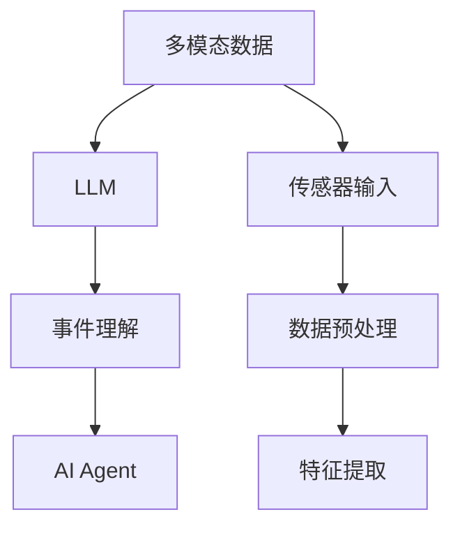
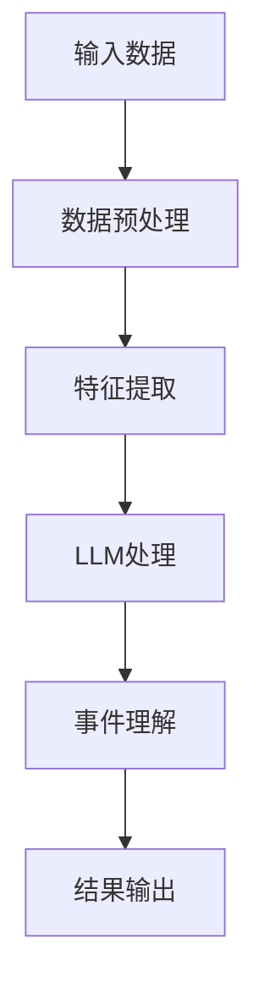
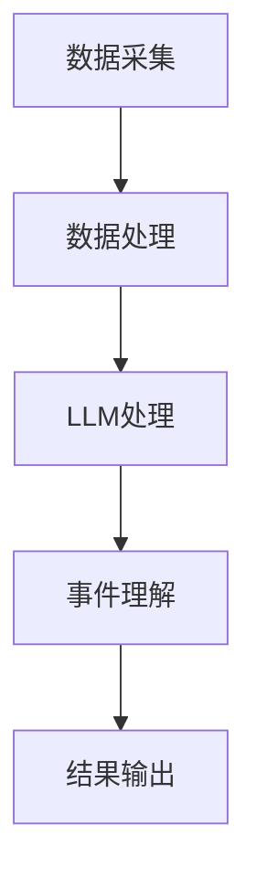

                 


# 构建LLM支持的AI Agent多模态事件理解

> 关键词：LLM, AI Agent, 多模态事件理解, 多模态数据, 事件理解, AI系统设计, 多模态融合

> 摘要：本文详细探讨了构建LLM支持的AI Agent多模态事件理解系统的各个方面。从背景介绍到核心概念，从算法原理到系统架构设计，再到项目实战和最佳实践，文章全面解析了如何设计和实现一个高效的多模态事件理解系统。通过详细的技术分析和实际案例，读者将能够理解并掌握构建此类系统的知识和技能。

---

## 第一部分：背景介绍

### 第1章：问题背景

#### 1.1 多模态事件理解的定义
多模态事件理解是指通过处理多种类型的数据（如文本、图像、语音、视频等），来识别和理解事件的发生、发展及其含义的过程。LLM（Large Language Model）在其中扮演着关键角色，能够帮助AI Agent理解和生成自然语言文本，从而增强系统的多模态处理能力。

#### 1.2 LLM在AI Agent中的作用
LLM为AI Agent提供了强大的自然语言处理能力，使其能够理解用户的输入、生成自然的回复，并与其他模态的数据（如图像、语音）进行交互。这种能力使得AI Agent能够更准确地理解复杂的多模态事件。

#### 1.3 当前技术挑战与机遇
- **挑战**：多模态数据的异构性和复杂性使得事件理解变得困难；LLM在处理多模态数据时的上下文关联性不足。
- **机遇**：随着技术的进步，结合LLM和多模态数据处理的方法能够显著提升事件理解的准确性和效率。

### 第2章：问题描述

#### 2.1 多模态数据的复杂性
多模态数据来自不同的模态（如文本、图像、语音），需要进行有效的整合和处理，以避免信息丢失或冲突。

#### 2.2 LLM在事件理解中的局限性
LLM主要擅长处理文本数据，对其他模态数据的理解能力有限，需要通过多模态融合技术来弥补这一不足。

#### 2.3 AI Agent的多模态事件理解需求
AI Agent需要能够处理和理解多模态数据，以提供更智能和个性化的服务。

### 第3章：问题解决

#### 3.1 LLM支持的AI Agent设计思路
通过将LLM与其他模态处理模块（如图像处理、语音识别）相结合，构建一个多模态数据处理框架，实现对事件的全面理解。

#### 3.2 多模态数据的整合与处理
利用数据融合技术，将不同模态的数据进行预处理和特征提取，形成统一的表示形式，以便LLM进行事件理解。

#### 3.3 事件理解的流程优化
通过优化数据处理流程和LLM的调用方式，提升事件理解的效率和准确性。

### 第4章：边界与外延

#### 4.1 多模态事件理解的边界
明确多模态事件理解的范围和限制，例如仅处理特定类型的数据或特定场景下的事件。

#### 4.2 LLM支持的范围与限制
LLM主要处理文本相关任务，对于其他模态数据的处理需要借助其他算法和工具。

#### 4.3 AI Agent的应用场景外延
AI Agent可以应用于多个领域，如智能助手、智能客服、智能家居等，每个领域都有其特定的多模态事件理解需求。

### 第5章：核心概念

#### 5.1 多模态事件理解的核心要素
- 数据源：包括文本、图像、语音等多种数据类型。
- 数据处理：数据预处理、特征提取和融合。
- 事件理解：通过LLM和多模态数据处理模块实现对事件的识别和理解。

#### 5.2 LLM支持的AI Agent组成结构
- 数据采集模块：负责采集多模态数据。
- 数据处理模块：对数据进行预处理和特征提取。
- LLM处理模块：利用LLM进行文本理解和生成。
- 事件理解模块：基于多模态数据和LLM的输出，实现对事件的理解和分类。

#### 5.3 相关概念对比表格
| 概念         | 描述                                                                 |
|--------------|----------------------------------------------------------------------|
| 多模态数据    | 包括文本、图像、语音等多种数据类型。                                     |
| 事件理解      | 识别和理解事件的发生、发展及其含义。                                   |
| LLM          | 大型语言模型，擅长处理文本数据。                                       |

## 第二部分：核心概念与联系

### 第6章：多模态事件理解的原理

#### 6.1 多模态数据的融合方法
- **特征融合**：将不同模态的特征向量进行融合，形成统一的表示形式。
- **注意力机制**：利用注意力机制对不同模态的数据进行加权处理，突出重要的信息。

#### 6.2 事件理解的层次结构
- **数据层**：采集和预处理多模态数据。
- **特征层**：提取各模态数据的特征。
- **理解层**：利用LLM对特征进行语义理解和事件分类。

#### 6.3 LLM在事件理解中的角色
LLM负责处理文本数据，并通过与多模态数据的交互，辅助AI Agent理解复杂的事件。

### 第7章：LLM支持的AI Agent架构

#### 7.1 模块化设计
- 数据采集模块：负责采集多模态数据。
- 数据处理模块：对数据进行预处理和特征提取。
- LLM处理模块：利用LLM进行文本理解和生成。
- 事件理解模块：基于多模态数据和LLM的输出，实现对事件的理解和分类。

#### 7.2 数据流与信息处理流程
1. 数据采集模块采集多模态数据。
2. 数据处理模块对数据进行预处理和特征提取。
3. LLM处理模块利用LLM对文本数据进行理解。
4. 事件理解模块结合多模态数据和LLM的输出，实现对事件的理解和分类。

#### 7.3 模块间的依赖关系
- 数据采集模块依赖于传感器和数据接口。
- 数据处理模块依赖于特征提取算法。
- LLM处理模块依赖于LLM模型。
- 事件理解模块依赖于多模态数据和LLM的输出。

### 第8章：核心概念的ER实体关系图



---

## 第三部分：算法原理讲解

### 第9章：LLM处理多模态数据的算法流程

#### 9.1 算法流程图


#### 9.2 算法实现步骤
1. 数据预处理：对多模态数据进行清洗和标准化处理。
2. 特征提取：利用深度学习模型提取各模态数据的特征向量。
3. LLM处理：将特征向量输入LLM模型，生成语义表示。
4. 事件理解：结合多模态特征和语义表示，进行事件分类和理解。

### 第10章：Python实现示例

#### 10.1 数据预处理代码
```python
def preprocess(data):
    # 数据清洗和标准化
    processed_data = data.apply(lambda x: x.strip().lower())
    return processed_data
```

#### 10.2 特征提取代码
```python
def extract_features(data):
    # 使用预训练模型提取特征
    features = model.encode(data)
    return features
```

#### 10.3 LLM处理代码
```python
def process_with_llm(features):
    # 使用LLM进行语义理解
    response = llm.generate(features)
    return response
```

#### 10.4 事件理解代码
```python
def event_understanding(response):
    # 基于LLM输出进行事件分类
    classification = classifier.predict(response)
    return classification
```

### 第11章：数学模型和公式

#### 11.1 概率分布模型
$$ P(x) = \frac{1}{\sqrt{2\pi\sigma^2}} e^{-\frac{(x-\mu)^2}{2\sigma^2}} $$

#### 11.2 损失函数
$$ \text{Loss} = -\sum_{i=1}^{n} y_i \log(p_i) + (1 - y_i) \log(1 - p_i) $$

---

## 第四部分：系统分析与架构设计

### 第12章：问题场景介绍

#### 12.1 系统应用场景
AI Agent在智能助手、智能客服、智能家居等领域广泛应用，需要处理多种模态数据，实现对复杂事件的理解和响应。

### 第13章：系统功能设计

#### 13.1 系统功能模块
- 数据采集模块
- 数据处理模块
- LLM处理模块
- 事件理解模块

#### 13.2 功能模块的交互流程
1. 数据采集模块采集多模态数据。
2. 数据处理模块对数据进行预处理和特征提取。
3. LLM处理模块利用LLM生成语义表示。
4. 事件理解模块结合多模态数据和LLM输出，实现事件分类和理解。

### 第14章：系统架构设计

#### 14.1 系统架构图


#### 14.2 模块间的依赖关系
- 数据采集模块依赖于数据接口。
- 数据处理模块依赖于特征提取算法。
- LLM处理模块依赖于LLM模型。
- 事件理解模块依赖于多模态数据和LLM输出。

### 第15章：系统接口设计

#### 15.1 系统接口描述
- 数据采集接口：负责采集多模态数据。
- 数据处理接口：对数据进行预处理和特征提取。
- LLM处理接口：利用LLM生成语义表示。
- 事件理解接口：结合多模态数据和LLM输出，实现事件分类和理解。

### 第16章：系统交互序列图

```mermaid
graph TD
    User --> A[数据采集模块]: 提供多模态数据
    A --> B[数据处理模块]: 请求数据处理
    B --> C[LLM处理模块]: 请求LLM处理
    C --> D[事件理解模块]: 请求事件理解
    D --> User: 返回事件理解结果
```

---

## 第五部分：项目实战

### 第17章：环境安装

#### 17.1 安装必要的库
```bash
pip install tensorflow==2.5.0 pytorch==1.9.0 transformers==4.25.1
```

### 第18章：系统核心实现

#### 18.1 核心代码实现
```python
# 数据采集模块
import numpy as np

def collect_data():
    data = []
    # 采集文本、图像等多模态数据
    return data

# 数据处理模块
def preprocess_data(data):
    processed_data = []
    for d in data:
        processed_d = d.strip().lower()
        processed_data.append(processed_d)
    return processed_data

# LLM处理模块
from transformers import GPT2LMHeadModel, GPT2Tokenizer

def process_with_llm(processed_data):
    model_name = 'gpt2-large'
    tokenizer = GPT2Tokenizer.from_pretrained(model_name)
    model = GPT2LMHeadModel.from_pretrained(model_name)
    inputs = tokenizer(processed_data, return_tensors='np')
    outputs = model.generate(inputs.input_ids)
    return outputs

# 事件理解模块
def event_classification(outputs):
    # 使用分类模型进行事件分类
    classifier = load_classifier()
    predictions = classifier.predict(outputs)
    return predictions
```

#### 18.2 代码解读与分析
- 数据采集模块负责收集多模态数据，包括文本、图像等。
- 数据处理模块对数据进行预处理和特征提取。
- LLM处理模块利用预训练的LLM模型生成语义表示。
- 事件理解模块结合多模态数据和LLM输出，实现事件分类和理解。

### 第19章：实际案例分析

#### 19.1 案例背景
假设我们有一个智能助手AI Agent，需要理解用户的多模态输入，如用户的语音指令和相关图像信息。

#### 19.2 系统实现
1. 数据采集模块采集用户的语音和图像数据。
2. 数据处理模块对数据进行预处理和特征提取。
3. LLM处理模块利用LLM生成语义表示。
4. 事件理解模块结合多模态数据和LLM输出，实现对用户的意图理解。

#### 19.3 系统输出
AI Agent根据用户的输入生成相应的回复或操作指令。

### 第20章：项目小结

#### 20.1 项目总结
通过本项目，我们成功构建了一个基于LLM的AI Agent多模态事件理解系统，实现了对多模态数据的有效处理和事件理解。

#### 20.2 项目意义
本项目展示了如何利用LLM和其他模态数据处理技术，构建一个多模态事件理解系统，为AI Agent的应用提供了重要的技术支撑。

---

## 第六部分：最佳实践

### 第21章：小结

#### 21.1 核心要点总结
- 多模态数据的整合与处理是关键。
- LLM在事件理解中发挥重要作用。
- 系统设计需要模块化和流程化。

### 第22章：注意事项

#### 22.1 开发注意事项
- 数据处理需要仔细清洗和预处理。
- LLM模型的选择和调优影响系统性能。
- 多模态数据的融合需要考虑数据的异构性和相关性。

### 第23章：拓展阅读

#### 23.1 推荐资源
- 《Deep Learning》
- 《Effective Python》
- 《Transformers: State-of-the-art language models》

---

## 结束语

通过本文的详细讲解，我们全面探讨了构建LLM支持的AI Agent多模态事件理解系统的各个方面。从背景介绍到核心概念，从算法原理到系统架构设计，再到项目实战和最佳实践，读者能够系统地掌握构建此类系统的知识和技能。希望本文能够为相关领域的研究和实践提供有价值的参考。

---

作者：AI天才研究院/AI Genius Institute & 禅与计算机程序设计艺术 /Zen And The Art of Computer Programming

