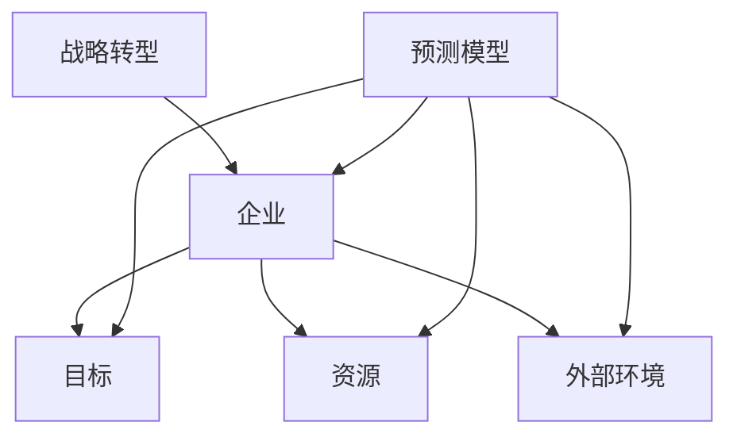
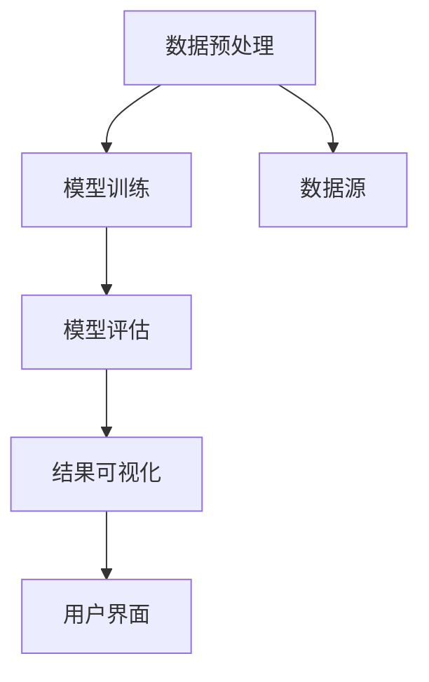
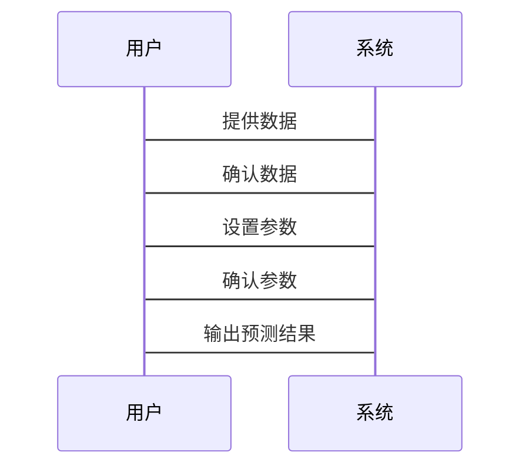

                 


# 深度学习预测公司战略转型成功率

> 关键词：深度学习，公司战略转型，成功率预测，神经网络，算法原理，数学模型，系统架构

> 摘要：本文将深入探讨如何利用深度学习技术预测公司战略转型的成功率。通过分析战略转型的关键因素，构建深度学习模型，结合实际案例，详细讲解模型的算法原理、数学基础、系统架构设计及项目实现过程。文章旨在为企业提供数据驱动的决策支持，帮助企业在复杂多变的商业环境中做出更明智的战略选择。

---

# 第一部分: 深度学习预测公司战略转型成功率的背景与核心概念

## 第1章: 公司战略转型与深度学习概述

### 1.1 公司战略转型的背景与挑战

#### 1.1.1 经济环境变化对企业战略的影响

随着全球经济的波动和市场竞争的加剧，企业需要不断调整战略以适应外部环境的变化。然而，战略转型的失败率高达70%以上，这表明企业在转型过程中面临诸多挑战，如资源分配不合理、团队协作不畅、外部环境不可预测等。

#### 1.1.2 数字化转型的必然性

在数字化浪潮的推动下，企业必须加快数字化转型的步伐。深度学习作为一种强大的技术工具，可以帮助企业在转型过程中进行数据驱动的决策，提高转型的成功率。

#### 1.1.3 战略转型失败的常见原因

- **目标不明确**：战略目标缺乏清晰的定义，导致转型过程中方向不明确。
- **资源分配不当**：资源分配不合理，导致某些关键环节无法有效推进。
- **执行力度不足**：缺乏有效的执行计划和监控机制，导致战略难以落地。
- **外部环境不可控**：市场需求变化、政策调整等外部因素对企业转型造成干扰。

### 1.2 深度学习的定义与特点

#### 1.2.1 深度学习的定义

深度学习是一种机器学习技术，通过构建多层神经网络，模拟人脑的学习机制，从数据中自动提取特征并进行模式识别。深度学习的核心在于其强大的非线性建模能力，能够处理复杂的数据关系。

#### 1.2.2 深度学习的核心特点

- **多层非线性变换**：深度学习通过多层网络结构，能够捕捉数据中的复杂模式。
- **自动特征提取**：无需手动提取特征，模型能够自动从数据中学习有用的特征。
- **强大的表示能力**：能够处理高维数据，如图像、文本、音频等。
- **数据驱动**：依赖于大量数据进行训练，模型性能随数据量的增加而提升。

#### 1.2.3 深度学习与传统机器学习的区别

| 特性                | 深度学习                          | 传统机器学习                        |
|---------------------|-----------------------------------|--------------------------------------|
| 是否需要特征工程   | 不需要                            | 需要                               |
| 模型复杂度          | 高                                | 较低                               |
| 数据处理能力        | 强大的非线性处理能力              | 线性或弱非线性处理能力                |
| 应用场景            | 复杂任务，如图像识别、自然语言处理 | 简单任务，如分类、回归               |

### 1.3 战略转型成功率预测的可行性分析

#### 1.3.1 数据驱动决策的潜力

通过收集和分析企业的历史数据，深度学习能够识别出影响战略转型成功的关键因素，并预测未来的转型成功率。这种数据驱动的方法能够为企业提供科学的决策依据。

#### 1.3.2 深度学习在企业预测中的优势

- **强大的非线性建模能力**：能够捕捉复杂的变量关系。
- **自动特征提取**：无需手动提取特征，减少人为干扰。
- **高精度预测**：通过大量的数据训练，模型具有较高的预测精度。

#### 1.3.3 预测模型的边界与外延

- **边界**：模型仅能预测战略转型的成功率，不能直接解决执行中的具体问题。
- **外延**：模型的预测结果可以为企业提供战略转型的方向和建议。

---

## 第2章: 战略转型与深度学习的核心概念联系

### 2.1 战略转型的要素分析

#### 2.1.1 企业战略目标的分解

战略目标需要分解为具体的子目标，例如从整体战略到部门目标，再到具体行动步骤。这种分解有助于明确每个环节的关键成功因素。

#### 2.1.2 关键成功因素的识别

- **内部因素**：企业内部的资源、组织结构、员工能力等。
- **外部因素**：市场需求、竞争环境、政策法规等。

#### 2.1.3 影响转型成功的内外部因素

| 因素类别 | 具体因素                  |
|----------|---------------------------|
| 内部因素 | 组织结构、资源分配、员工能力等 |
| 外部因素 | 市场需求、政策法规、竞争环境等 |

### 2.2 深度学习模型的输入与输出

#### 2.2.1 输入数据的特征分析

- **输入数据**：企业的历史数据，包括财务数据、市场数据、组织数据等。
- **特征提取**：通过深度学习模型自动提取影响战略转型成功的特征。

#### 2.2.2 输出结果的定义与解释

- **输出结果**：战略转型的成功率预测值（0-1之间）。
- **解释**：通过模型的输出结果，企业可以评估其战略转型的可能性，并制定相应的策略。

#### 2.2.3 模型的可解释性问题

深度学习模型通常被视为“黑箱”，其决策过程难以解释。然而，通过模型解释技术（如LIME、SHAP等），可以提高模型的可解释性。

### 2.3 战略转型成功率预测的实体关系图



---

## 第3章: 深度学习预测模型的算法原理

### 3.1 深度学习算法的分类与选择

#### 3.1.1 常见深度学习算法概述

- **卷积神经网络（CNN）**：适用于图像处理。
- **循环神经网络（RNN）**：适用于时间序列数据。
- **长短期记忆网络（LSTM）**：适用于长序列数据。
- **多层感知机（MLP）**：适用于一般分类任务。

#### 3.1.2 选择适合战略转型预测的算法

- **模型选择依据**：数据类型、数据量、任务类型。
- **推荐算法**：根据战略转型预测任务的特点，选择多层感知机（MLP）或长短期记忆网络（LSTM）。

#### 3.1.3 神经网络的结构特点

- **输入层**：接收输入数据。
- **隐藏层**：通过多层网络提取特征。
- **输出层**：产生预测结果。

### 3.2 深度学习模型的训练流程

#### 3.2.1 数据预处理

- **数据清洗**：去除噪声数据。
- **数据归一化**：将数据标准化，便于模型训练。

#### 3.2.2 模型训练

- **训练过程**：通过反向传播算法更新权重。
- **损失函数**：定义模型的损失函数，如交叉熵损失。
- **优化器**：使用Adam优化器优化模型参数。

#### 3.2.3 模型调优

- **超参数调整**：如学习率、批量大小等。
- **正则化**：防止模型过拟合。

### 3.3 深度学习模型的评估与优化

#### 3.3.1 评估指标的选择

- **准确率**：预测正确的比例。
- **召回率**：预测出的正样本中实际为正的比例。
- **F1分数**：综合准确率和召回率的指标。

#### 3.3.2 模型优化策略

- **早停法**：防止过拟合。
- **数据增强**：增加数据多样性。

#### 3.3.3 过拟合与欠拟合的解决方法

- **过拟合**：减少模型复杂度、增加数据量。
- **欠拟合**：增加模型复杂度、减少正则化强度。

---

## 第4章: 深度学习预测模型的数学基础

### 4.1 神经网络的数学模型

#### 4.1.1 神经网络的结构公式

$$ y = \sigma(w x + b) $$

其中，$x$ 是输入，$w$ 是权重，$b$ 是偏置，$\sigma$ 是激活函数。

#### 4.1.2 激活函数的作用与选择

- **ReLU**：常用激活函数，计算速度快。
- **Sigmoid**：输出在0-1之间，适合二分类任务。
- **Tanh**：输出在-1到1之间，适合某些网络结构。

#### 4.1.3 损失函数的定义与优化

- **交叉熵损失**：

$$ \text{Loss} = -\frac{1}{n}\sum_{i=1}^{n} y_i \log(p_i) + (1-y_i)\log(1-p_i) $$

其中，$y_i$ 是真实标签，$p_i$ 是预测概率。

### 4.2 深度学习中的优化算法

#### 4.2.1 梯度下降的原理

- **梯度下降**：通过计算损失函数的梯度，调整模型参数，使损失函数最小化。

#### 4.2.2 Adam优化器的数学公式

$$ m_t = \beta_1 m_{t-1} + (1-\beta_1)g_t $$

$$ v_t = \beta_2 v_{t-1} + (1-\beta_2)g_t^2 $$

$$ \theta_{t} = \theta_{t-1} - \alpha \frac{m_t}{\sqrt{v_t}+\epsilon} $$

其中，$m_t$ 是梯度的指数衰减平均，$v_t$ 是梯度平方的指数衰减平均，$\alpha$ 是学习率，$\epsilon$ 是防止除以零的常数。

#### 4.2.3 学习率的影响与调整

- **学习率过大**：导致模型不稳定，可能发散。
- **学习率过小**：训练时间过长，收敛缓慢。

### 4.3 深度学习中的概率与统计

#### 4.3.1 概率分布的基本概念

- **贝叶斯定理**：在深度学习中，概率论用于模型的不确定性建模。

#### 4.3.2 贝叶斯定理的应用

$$ P(A|B) = \frac{P(B|A)P(A)}{P(B)} $$

其中，$P(A|B)$ 是在B发生的条件下，A发生的概率。

#### 4.3.3 统计推断在模型评估中的作用

- **参数估计**：通过数据估计模型参数。
- **假设检验**：验证模型的显著性。

---

## 第5章: 深度学习预测模型的系统架构设计

### 5.1 问题场景介绍

#### 5.1.1 战略转型预测的目标

通过历史数据，预测企业战略转型的成功率，为企业制定战略提供数据支持。

#### 5.1.2 数据来源与特征

- **数据来源**：企业内部数据、市场数据、政策数据等。
- **特征**：财务指标、市场份额、政策环境等。

#### 5.1.3 模型部署的环境

- **硬件**：GPU加速。
- **软件**：深度学习框架（如TensorFlow、PyTorch）。

### 5.2 系统功能设计

#### 5.2.1 数据预处理模块

- **功能**：清洗、归一化数据。

#### 5.2.2 模型训练模块

- **功能**：训练深度学习模型。

#### 5.2.3 模型评估与优化模块

- **功能**：评估模型性能，优化模型参数。

#### 5.2.4 结果可视化模块

- **功能**：展示预测结果，提供直观的可视化界面。

### 5.3 系统架构设计



### 5.4 系统接口设计

#### 5.4.1 输入接口

- **数据输入**：接收企业历史数据。
- **参数设置**：设置模型训练参数。

#### 5.4.2 输出接口

- **预测结果**：输出战略转型成功率预测值。
- **日志输出**：输出训练过程中的日志信息。

### 5.5 系统交互设计



---

## 第6章: 深度学习预测模型的项目实战

### 6.1 环境安装

#### 6.1.1 安装Python

```bash
python --version
```

#### 6.1.2 安装深度学习框架

```bash
pip install tensorflow
```

### 6.2 核心代码实现

#### 6.2.1 数据预处理

```python
import numpy as np
from sklearn.preprocessing import MinMaxScaler

# 假设data是输入数据
scaler = MinMaxScaler()
data_scaled = scaler.fit_transform(data)
```

#### 6.2.2 模型训练

```python
import tensorflow as tf
from tensorflow.keras import layers

model = tf.keras.Sequential([
    layers.Dense(64, activation='relu'),
    layers.Dense(1, activation='sigmoid')
])

model.compile(optimizer='adam', loss='binary_crossentropy', metrics=['accuracy'])
model.fit(data_scaled, labels, epochs=100, batch_size=32)
```

#### 6.2.3 模型评估

```python
loss, accuracy = model.evaluate(data_scaled, labels)
print(f"Loss: {loss}, Accuracy: {accuracy}")
```

### 6.3 案例分析与结果解读

#### 6.3.1 实际案例

假设我们有一个企业的历史数据，包括财务指标、市场份额等。通过模型预测，该企业的战略转型成功率约为85%。

#### 6.3.2 结果解读

- **预测结果为高**：企业可以继续推进战略转型。
- **预测结果为低**：企业需要重新评估战略目标，调整资源分配。

### 6.4 项目总结

通过实际案例分析，验证了深度学习模型在战略转型成功率预测中的有效性。模型不仅能够提供准确的预测结果，还能够帮助企业识别关键成功因素，制定有效的战略调整计划。

---

## 第7章: 总结与展望

### 7.1 总结

本文详细介绍了如何利用深度学习技术预测公司战略转型的成功率。通过构建深度学习模型，企业可以更好地理解战略转型的关键因素，制定科学的决策策略。

### 7.2 最佳实践 tips

- **数据质量**：确保数据的准确性和完整性。
- **模型解释性**：使用模型解释技术，提高决策的透明度。
- **持续优化**：定期更新模型，适应市场变化。

### 7.3 未来研究方向

- **多任务学习**：同时预测多个战略目标的成功率。
- **强化学习**：结合强化学习，模拟战略转型的过程。
- **边缘计算**：在边缘设备上部署模型，实时进行预测。

---

## 作者

**作者：AI天才研究院/AI Genius Institute & 禅与计算机程序设计艺术 /Zen And The Art of Computer Programming**

---

以上是《深度学习预测公司战略转型成功率》的技术博客文章的完整目录大纲。希望本文能够为读者提供清晰的思路和实用的知识，帮助企业在复杂多变的商业环境中做出更明智的战略选择。

