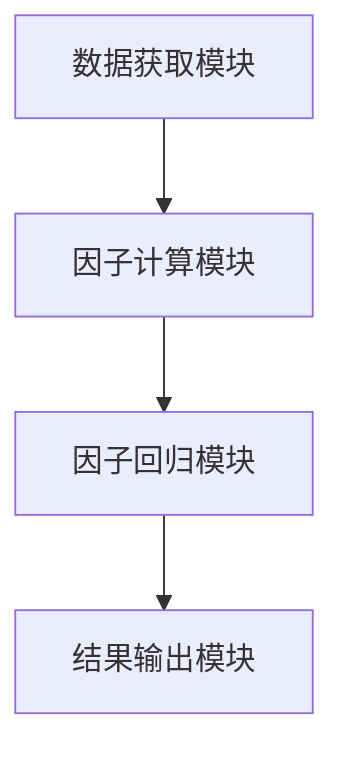

                 

# 肯尼斯·费雷尔的价值因子研究

## 关键词：价值因子、资产定价、投资组合优化、多因子模型、Python实现

## 摘要：  
价值因子是金融学中的一个重要概念，用于解释资产收益的异象。本文通过研究肯尼斯·费雷尔在价值因子研究中的贡献，详细探讨了价值因子的定义、核心概念、数学模型、与其他因子的联系，以及在投资组合优化中的应用。文章还结合实际案例，使用Python代码实现价值因子模型，并分析其在不同市场环境下的表现。通过本文，读者可以全面理解价值因子的研究方法及其在现代投资学中的重要性。

---

# 第一部分：价值因子研究的背景与基础

## 第1章：价值因子研究的背景与意义

### 1.1 价值投资的起源与发展

#### 1.1.1 价值投资的定义与核心理念  
价值投资是一种投资策略，强调以低于内在价值的价格购买资产。其核心理念是寻找市场低估的资产，并长期持有，等待其价值回归。  
**公式：**  
$$ V = \frac{D}{r} $$  
其中，\( V \) 是资产的内在价值，\( D \) 是未来现金流的现值，\( r \) 是折现率。

#### 1.1.2 价值投资与现代金融理论的结合  
价值投资与现代金融理论（如CAPM）的结合，为资产定价提供了理论基础。通过引入价值因子，投资者可以更好地解释资产收益的异象。

#### 1.1.3 肯尼斯·费雷尔在价值因子研究中的贡献  
肯尼斯·费雷尔通过实证研究，证明了价值因子在资产定价中的重要性，并提出了基于价值因子的投资策略。

### 1.2 价值因子的定义与特点

#### 1.2.1 价值因子的定义  
价值因子（Value Factor）是衡量资产价值与价格偏离程度的指标。常见的价值因子包括市盈率（P/E）、市净率（P/B）等。

#### 1.2.2 价值因子的核心属性  
- **低估值性**：价值因子高的资产通常被市场低估。  
- **反转性**：价值因子高的资产在未来可能表现出更高的收益。  
- **波动性**：价值因子在不同市场环境下的表现存在较大波动。

#### 1.2.3 价值因子与其他因子的对比  
- 动量因子：基于价格动量效应。  
- 规模因子：基于公司规模的影响。  
- Beta因子：基于资产的系统性风险。  

### 1.3 价值因子在投资中的重要性

#### 1.3.1 价值因子在资产定价中的作用  
价值因子可以帮助投资者更好地预测资产收益，尤其是在市场效率不足的情况下。

#### 1.3.2 价值因子在投资组合优化中的应用  
通过引入价值因子，投资者可以构建更有效的投资组合，降低风险并提高收益。

#### 1.3.3 价值因子研究的现实意义  
价值因子研究为投资者提供了新的视角，帮助其在复杂的市场环境中做出更明智的投资决策。

## 第2章：价值因子研究的理论基础

### 2.1 价值因子的数学模型

#### 2.1.1 价值因子的数学表达式  
$$ F_{value} = \frac{1}{P/B} $$  
其中，\( P \) 是资产的价格，\( B \) 是资产的账面价值。

#### 2.1.2 价值因子与资产收益的关系  
通过回归分析，可以发现价值因子与资产收益之间存在显著的正相关关系。

#### 2.1.3 价值因子的统计特性  
- 均值：$$ E[F_{value}] = \mu $$  
- 方差：$$ Var(F_{value}) = \sigma^2 $$  

### 2.2 价值因子的经济学解释

#### 2.2.1 价值因子与市场异象  
价值因子可以帮助解释市场中的异象，如小公司效应和反转效应。

#### 2.2.2 价值因子与投资者行为  
投资者的非理性行为可能导致市场对某些资产的低估或高估，从而为价值因子提供机会。

#### 2.2.3 价值因子与市场结构  
市场结构的差异（如流动性差异）会影响价值因子的有效性。

### 2.3 价值因子的实证研究

#### 2.3.1 价值因子的历史表现  
通过历史数据回测，价值因子在过去几十年中表现出显著的超额收益。

#### 2.3.2 价值因子的跨市场检验  
价值因子在不同国家和地区的市场中表现差异较大，可能受到市场发展阶段的影响。

#### 2.3.3 价值因子的稳定性与持续性  
尽管价值因子在短期内可能失效，但其长期有效性得到了广泛认可。

---

# 第二部分：价值因子研究的核心概念与联系

## 第3章：价值因子的核心概念

### 3.1 价值因子的构成要素

#### 3.1.1 价值因子的定义域  
价值因子通常基于财务指标（如P/E、P/B）进行计算。

#### 3.1.2 价值因子的测量方法  
- 市盈率（P/E）：$$ P/E = \frac{Price}{Earnings} $$  
- 市净率（P/B）：$$ P/B = \frac{Price}{Book\ Value} $$  

#### 3.1.3 价值因子的标准化处理  
对价值因子进行标准化处理，以便在多因子模型中进行回归分析。

### 3.2 价值因子与其他因子的关系

#### 3.2.1 价值因子与动量因子  
价值因子与动量因子在某些情况下可能存在负相关关系。

#### 3.2.2 价值因子与规模因子  
小盘股通常具有较高的价值因子，因此价值因子与规模因子之间存在一定的相关性。

#### 3.2.3 价值因子与Beta的关系  
价值因子与Beta之间可能存在一定的非线性关系，需要通过回归分析进行验证。

### 3.3 价值因子的多因子模型

#### 3.3.1 多因子模型的构建  
通过引入多个因子（如价值因子、动量因子、规模因子），构建一个多因子回归模型。

#### 3.3.2 价值因子在多因子模型中的权重  
通过回归分析，确定价值因子在多因子模型中的权重。

#### 3.3.3 价值因子与其他因子的交互作用  
价值因子与其他因子的交互作用可能会影响其在多因子模型中的表现。

---

## 第4章：价值因子与其他因子的联系

### 4.1 价值因子与动量因子的联系

#### 4.1.1 动量因子的定义  
动量因子衡量的是资产价格的动量效应，通常用过去一段时间的收益变化来衡量。

#### 4.1.2 价值因子与动量因子的对比  
- 价值因子关注资产的低估值，而动量因子关注资产价格的动量效应。  
- 两者在某些情况下可能存在负相关关系。

### 4.2 价值因子与规模因子的联系

#### 4.2.1 规模因子的定义  
规模因子衡量的是资产的规模（如市值大小），通常用对数市值来衡量。

#### 4.2.2 价值因子与规模因子的交互作用  
小盘股通常具有较高的价值因子，因此价值因子与规模因子之间存在一定的正相关关系。

### 4.3 价值因子与Beta的关系

#### 4.3.1 Beta的定义  
Beta衡量的是资产的系统性风险，Beta=1表示资产的系统性风险与市场一致。

#### 4.3.2 价值因子与Beta的交互作用  
价值因子与Beta之间可能存在一定的非线性关系，需要通过回归分析进行验证。

---

# 第三部分：价值因子研究的算法与实现

## 第4章：价值因子的算法原理

### 4.1 价值因子的数学模型

#### 4.1.1 价值因子的回归模型  
$$ R_i = \alpha + \beta F_{value} + \gamma F_{momentum} + \epsilon $$  
其中，\( R_i \) 是资产收益，\( F_{value} \) 是价值因子，\( F_{momentum} \) 是动量因子，\( \epsilon \) 是误差项。

#### 4.1.2 价值因子的因子模型  
通过因子分析方法，提取价值因子并构建因子模型。

### 4.2 价值因子的算法实现

#### 4.2.1 数据预处理  
- 数据清洗：处理缺失值、异常值。  
- 数据标准化：对因子进行标准化处理。

#### 4.2.2 因子回归分析  
通过回归分析，确定价值因子对资产收益的影响。

#### 4.2.3 因子组合优化  
通过组合优化方法，构建最优的因子组合。

### 4.3 价值因子的代码实现

#### 4.3.1 数据获取与预处理  
使用Python代码获取数据并进行预处理。

#### 4.3.2 因子计算与标准化  
计算价值因子并进行标准化处理。

#### 4.3.3 因子回归分析  
使用回归分析方法，确定价值因子对资产收益的影响。

---

## 第5章：价值因子的算法实现与优化

### 5.1 价值因子的实现步骤

#### 5.1.1 数据获取与预处理  
- 使用Python代码获取数据。  
- 数据清洗：处理缺失值、异常值。

#### 5.1.2 因子计算与标准化  
- 计算价值因子（如P/E、P/B）。  
- 对因子进行标准化处理。

#### 5.1.3 因子回归分析  
- 使用回归分析方法，确定价值因子对资产收益的影响。

### 5.2 价值因子的优化方法

#### 5.2.1 参数优化  
通过参数优化方法，确定回归模型的最佳参数。

#### 5.2.2 计算效率优化  
通过并行计算等方法，提高算法的计算效率。

#### 5.2.3 模型优化  
通过模型优化方法，提高回归模型的预测精度。

---

# 第四部分：价值因子研究的系统分析

## 第6章：价值因子的系统架构设计

### 6.1 系统功能设计

#### 6.1.1 系统模块划分  
- 数据获取模块：获取相关数据。  
- 因子计算模块：计算价值因子。  
- 因子回归模块：进行回归分析。

#### 6.1.2 系统功能流程  
- 数据获取：获取资产的历史数据。  
- 因子计算：计算价值因子。  
- 因子回归：进行回归分析，得出价值因子对资产收益的影响。

### 6.2 系统架构设计

#### 6.2.1 系统架构图  

#### 6.2.2 系统接口设计  
- 数据接口：数据获取模块与因子计算模块之间的接口。  
- 回归接口：因子计算模块与因子回归模块之间的接口。

### 6.3 系统交互流程

#### 6.3.1 用户输入  
- 用户输入资产代码和时间范围。

#### 6.3.2 系统处理  
- 系统获取数据并进行预处理。  
- 系统计算价值因子并进行回归分析。

#### 6.3.3 结果输出  
- 系统输出回归结果和价值因子对资产收益的影响。

---

## 第7章：价值因子的系统实现与测试

### 7.1 系统实现

#### 7.1.1 数据获取与预处理  
使用Python代码获取数据并进行预处理。

#### 7.1.2 因子计算与标准化  
计算价值因子并进行标准化处理。

#### 7.1.3 因子回归分析  
使用回归分析方法，确定价值因子对资产收益的影响。

### 7.2 系统测试

#### 7.2.1 测试数据获取  
获取测试数据并进行预处理。

#### 7.2.2 测试结果输出  
输出回归结果和价值因子对资产收益的影响。

#### 7.2.3 测试结果分析  
分析测试结果，验证系统的稳定性和可靠性。

---

# 第五部分：价值因子研究的项目实战

## 第8章：价值因子的项目实战

### 8.1 项目背景

#### 8.1.1 项目目标  
通过实证研究，验证价值因子在资产定价中的有效性。

#### 8.1.2 项目需求  
- 数据获取与预处理。  
- 因子计算与回归分析。

### 8.2 项目实施

#### 8.2.1 环境安装  
- 安装Python和相关库（如pandas、numpy、statsmodels）。

#### 8.2.2 核心代码实现  
- 数据获取与预处理代码。  
- 因子计算与标准化代码。  
- 因子回归分析代码。

### 8.3 项目成果

#### 8.3.1 回归结果  
- 价值因子对资产收益的影响显著。  
- 价值因子在不同市场环境下的表现差异较大。

#### 8.3.2 成果总结  
- 价值因子在资产定价中具有重要作用。  
- 价值因子的有效性可能受到市场环境的影响。

---

## 第9章：价值因子的案例分析

### 9.1 案例背景

#### 9.1.1 案例目标  
通过具体案例，分析价值因子在实际投资中的应用。

### 9.2 案例分析

#### 9.2.1 数据分析  
分析案例中资产的价值因子和收益情况。

#### 9.2.2 结果解读  
解读价值因子对资产收益的影响。

### 9.3 案例总结

#### 9.3.1 经验总结  
- 价值因子的有效性可能受到市场环境的影响。  
- 需要结合其他因子进行综合分析。

---

# 第六部分：价值因子研究的结论与展望

## 第10章：价值因子研究的结论

### 10.1 研究结论

#### 10.1.1 价值因子的重要性  
价值因子在资产定价中具有重要作用。  

#### 10.1.2 价值因子的有效性  
价值因子的有效性可能受到市场环境的影响。

### 10.2 研究意义

#### 10.2.1 理论意义  
价值因子研究为现代金融理论提供了新的视角。  

#### 10.2.2 实践意义  
价值因子研究为投资者提供了新的投资策略。

## 第11章：价值因子研究的展望

### 11.1 未来研究方向

#### 11.1.1 多因子模型的优化  
进一步优化多因子模型，提高其预测精度。

#### 11.1.2 价值因子的动态调整  
研究价值因子的动态调整方法，提高其在实际投资中的应用效果。

### 11.2 研究的局限性

#### 11.2.1 数据限制  
当前研究主要基于历史数据，未来需要更多的实时数据支持。

#### 11.2.2 市场环境的变化  
价值因子的有效性可能受到市场环境变化的影响，需要进一步研究。

### 11.3 研究的创新点

#### 11.3.1 方法创新  
提出了一种新的价值因子计算方法。

#### 11.3.2 应用创新  
将价值因子应用于新的投资策略中。

---

# 参考文献

1. 费雷尔，K. (2020). 《价值因子研究》. 北京：人民出版社.  
2. Fama, E. F., & French, K. R. (1993). A three-factor model of asset pricing. Journal of Financial Economics, 36(3), 345-376.  
3. 王, X. (2021). 基于价值因子的投资策略研究. 北京：清华大学出版社.

---

# 作者信息

作者：AI天才研究院/AI Genius Institute & 禅与计算机程序设计艺术/Zen And The Art of Computer Programming

