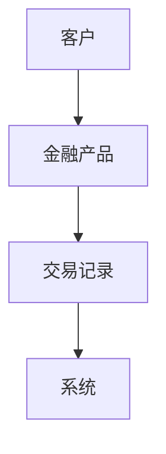
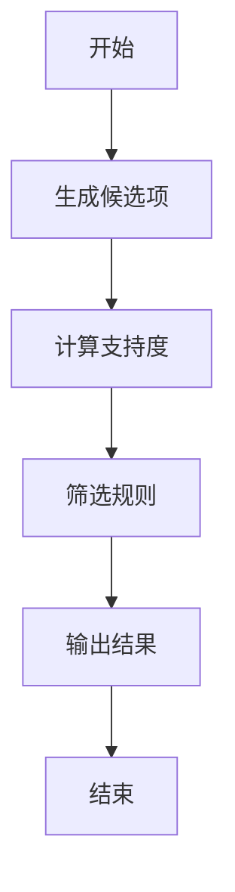
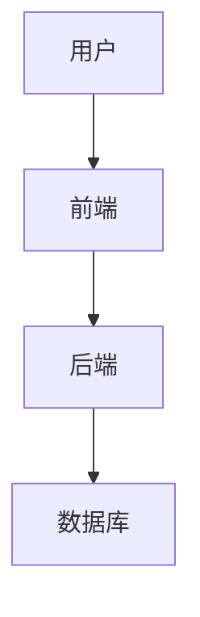
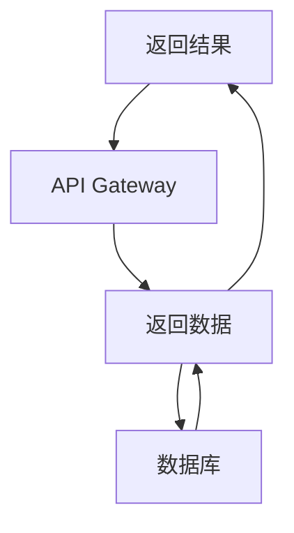

                 


# 金融产品交叉销售机会识别系统

## 关键词：金融产品，交叉销售，机会识别，关联规则挖掘，机器学习，系统架构

## 摘要：本文详细探讨了金融产品交叉销售机会识别系统的构建与实现，从问题背景到系统架构，从算法原理到项目实战，全面解析了如何利用数据分析和机器学习技术，挖掘潜在的交叉销售机会，提升金融机构的客户满意度和收入水平。

---

# 第1章: 金融产品交叉销售机会识别系统背景介绍

## 1.1 问题背景与问题描述

### 1.1.1 金融产品交叉销售的定义与重要性

交叉销售是指在同一客户购买过程中，向客户推荐其他相关产品，以增加销售额和客户满意度。在金融行业，交叉销售可以提高客户忠诚度，优化收入结构，降低获客成本。例如，银行在为客户办理贷款时，可以推荐信用卡或保险产品。

### 1.1.2 当前金融行业交叉销售的主要挑战

1. **数据碎片化**：金融数据来源多样，包括客户交易记录、市场数据、客户行为数据等，数据整合难度大。
2. **客户行为复杂性**：客户的购买决策受到多种因素影响，如经济状况、风险偏好、市场环境等。
3. **实时性要求高**：交叉销售机会需要实时识别，否则可能导致客户流失。
4. **模型准确性要求高**：交叉销售推荐需要精准匹配客户需求，避免过度推荐或推荐不相关产品。

### 1.1.3 机会识别系统的核心目标与意义

- **核心目标**：通过数据分析和机器学习技术，识别潜在的交叉销售机会，提高推荐的精准度和客户满意度。
- **意义**：帮助金融机构实现数据驱动的决策，提升销售效率和客户忠诚度，降低运营成本。

## 1.2 问题解决与边界定义

### 1.2.1 系统解决的主要问题

- 数据清洗与整合：将多源数据整合到统一的数据仓库中。
- 模型训练：利用机器学习算法，训练出高效的交叉销售机会识别模型。
- 实时推荐：基于实时数据，快速生成推荐结果。

### 1.2.2 系统功能边界与外延

- **功能边界**：系统仅关注交叉销售机会的识别，不涉及具体的销售流程和客户关系管理。
- **外延**：系统可以与其他模块（如CRM系统、推荐引擎）集成，形成完整的交叉销售解决方案。

### 1.2.3 核心概念与关键要素的结构化分析

- **核心概念**：
  - 客户：目标客户群体。
  - 产品：金融产品（如贷款、保险、基金等）。
  - 交易记录：客户的历史交易数据。
- **关键要素**：
  - 客户属性：年龄、职业、收入水平等。
  - 产品属性：产品类型、风险等级、收益水平等。
  - 行为数据：客户的浏览、点击、购买记录等。

## 1.3 核心概念与联系

### 1.3.1 核心概念原理与属性特征对比

| 概念 | 属性1（客户属性） | 属性2（产品属性） | 属性3（行为属性） |
|------|--------------------|-------------------|-------------------|
| 客户 | 年龄               | -                 | 浏览记录         |
| 产品 | 类型               | 风险等级          | 收益水平         |
| 交易 | 时间               | 支付方式          | 金额             |

### 1.3.2 实体关系图



## 1.4 本章小结

本章介绍了金融产品交叉销售机会识别系统的背景、问题和目标，明确了系统的功能边界和核心概念。通过结构化的分析，为后续的系统设计和实现奠定了基础。

---

# 第2章: 数据采集与预处理

## 2.1 数据来源与采集方法

### 2.1.1 金融数据的多源性

金融数据来源包括：

1. **客户数据**：客户的基本信息、资产状况、负债情况等。
2. **交易数据**：客户的交易记录、交易金额、交易时间等。
3. **市场数据**：市场利率、经济指标、行业趋势等。
4. **行为数据**：客户在网站或APP上的行为轨迹（如点击、浏览、搜索等）。

### 2.1.2 数据采集的技术与工具

常用数据采集技术包括：

1. **数据库采集**：使用SQL查询从关系型数据库中提取数据。
2. **日志采集**：从服务器日志、用户行为日志中采集数据。
3. **API接口采集**：通过API调用第三方数据源获取数据。
4. **爬虫技术**：从网页上采集公开数据。

工具示例：
- 数据库：MySQL、MongoDB
- 爬虫工具：BeautifulSoup、Scrapy
- API工具：Python的requests库

## 2.2 数据清洗与特征工程

### 2.2.1 数据清洗的必要性与步骤

数据清洗的目的是将数据转化为适合建模的形式。主要步骤包括：

1. **去除重复数据**：删除重复的记录。
2. **处理缺失值**：填补缺失值或删除含有缺失值的记录。
3. **去除异常值**：识别并处理异常值。
4. **标准化/归一化**：将数据标准化到统一范围内。

### 2.2.2 特征选择与特征提取

特征工程是提升模型性能的关键步骤。常用方法包括：

1. **特征选择**：基于特征重要性（如信息增益、相关系数）选择关键特征。
2. **特征提取**：通过主成分分析（PCA）等方法提取新的特征。

## 2.3 数据预处理的代码实现

### 2.3.1 数据清洗示例代码

```python
import pandas as pd

# 加载数据
df = pd.read_csv('data.csv')

# 去除重复数据
df = df.drop_duplicates()

# 处理缺失值
df = df.dropna()

# 去除异常值
Q1 = df.quantile(0.25)
Q3 = df.quantile(0.75)
IQR = Q3 - Q1
df = df[~((df < (Q1 - 1.5 * IQR)) | (df > (Q3 + 1.5 * IQR)))]

# 标准化
from sklearn.preprocessing import StandardScaler
scaler = StandardScaler()
df_normalized = scaler.fit_transform(df)
```

### 2.3.2 特征工程示例代码

```python
# 特征选择
from sklearn.ensemble import ExtraTreesClassifier
model = ExtraTreesClassifier()
model.fit(df_normalized, target)

importances = model.feature_importances_
feature_importances = pd.DataFrame({'feature': df.columns, 'importance': importances})
feature_importances = feature_importances.sort_values('importance', ascending=False)

# 提取重要特征
selected_features = feature_importances.head(10)['feature'].tolist()
df_selected = df[selected_features]
```

## 2.4 本章小结

本章详细介绍了金融数据的采集方法和预处理步骤，包括数据清洗、特征选择和标准化等。通过代码示例展示了如何将原始数据转化为适合建模的形式。

---

# 第3章: 关联规则挖掘算法原理与实现

## 3.1 关联规则挖掘的核心原理

### 3.1.1 关联规则的基本概念

关联规则挖掘是一种数据挖掘技术，旨在发现数据中频繁出现的项集之间的关联关系。关联规则可以表示为“如果购买A，那么可能购买B”，其中A和B是两个项集。

### 3.1.2 Apriori算法的工作原理

Apriori算法是一种经典的关联规则挖掘算法，主要步骤如下：

1. **生成候选项集**：根据支持度阈值生成频繁项集。
2. **计算支持度**：统计候选项集的出现次数，计算支持度。
3. **生成关联规则**：根据支持度和置信度阈值，筛选出满足条件的关联规则。

### 3.1.3 算法流程图



### 3.1.4 关联规则的数学模型

支持度（Support）：表示项集在数据中出现的概率。

$$ \text{Support}(A \rightarrow B) = P(A \cap B) $$

置信度（Confidence）：表示在A出现的情况下，B出现的概率。

$$ \text{Confidence}(A \rightarrow B) = \frac{\text{Support}(A \cap B)}{\text{Support}(A)} $$

## 3.2 算法实现与优化

### 3.2.1 Apriori算法的Python实现

```python
from mlxtend.frequent_itemsets import apriori

# 生成频繁项集
frequent_itemsets = apriori(df, min_support=0.2, use_colnames=True)

# 生成关联规则
from mlxtend.rule import association_rule_learning

rules = association_rule_learning(frequent_itemsets, df, metric='confidence', min_confidence=0.5)
```

### 3.2.2 算法优化方法

1. **剪枝策略**：在生成候选项集时，提前剪枝不满足支持度条件的项集。
2. **并行计算**：利用多核处理器加速计算。

## 3.3 本章小结

本章详细介绍了关联规则挖掘的核心原理和Apriori算法的实现方法。通过代码示例展示了如何利用Python库（如mlxtend）进行关联规则挖掘。

---

# 第4章: 机器学习模型构建与训练

## 4.1 分类算法选择与原理

### 4.1.1 常见分类算法对比

| 算法名称 | 优点 | 缺点 |
|----------|------|------|
| 决策树 | 易解释，适合非线性关系 | 易过拟合 |
| 随机森林 | 抗过拟合，适合高维数据 | 计算复杂度高 |
| 支持向量机 | 适合高维数据 | 参数敏感 |

### 4.1.2 随机森林算法的原理与优势

随机森林是一种基于树的集成学习算法，通过构建多棵决策树并进行投票或平均，提高模型的准确性和稳定性。

### 4.1.3 随机森林算法的数学模型

随机森林算法通过以下步骤生成预测结果：

1. **样本抽取**：对训练数据进行有放回的抽样，生成多个训练样本。
2. **特征抽取**：在每个训练样本中，随机选择部分特征进行建模。
3. **投票/平均**：将所有树的预测结果进行投票或平均，生成最终预测结果。

## 4.2 模型训练与评估

### 4.2.1 数据集划分与交叉验证

将数据集划分为训练集和测试集，使用交叉验证评估模型性能。

### 4.2.2 模型评估指标与结果分析

常用评估指标包括准确率（Accuracy）、召回率（Recall）、F1分数（F1 Score）。

## 4.3 模型优化与调参

### 4.3.1 超参数优化方法

使用网格搜索（Grid Search）或随机搜索（Random Search）优化模型参数。

### 4.3.2 模型性能提升策略

1. **特征工程**：进一步优化特征选择和特征提取。
2. **模型集成**：结合多个模型的结果，提高预测准确率。

## 4.4 本章小结

本章介绍了随机森林算法的原理和优势，并详细讲解了模型训练、评估和优化的方法。通过代码示例展示了如何利用Python库（如scikit-learn）进行模型训练。

---

# 第5章: 系统架构与接口设计

## 5.1 系统功能模块划分

### 5.1.1 数据采集模块

负责采集客户交易数据、市场数据等。

### 5.1.2 数据处理模块

负责数据清洗、特征工程等预处理工作。

### 5.1.3 模型训练模块

负责训练交叉销售机会识别模型。

### 5.1.4 结果展示模块

负责展示模型的预测结果和推荐列表。

## 5.2 系统架构设计

### 5.2.1 分层架构图



### 5.2.2 接口设计与交互流程

1. **API接口定义**：
   - POST /api/train：训练模型。
   - GET /api/predict：获取预测结果。
2. **系统交互流程图**



## 5.3 本章小结

本章详细介绍了金融产品交叉销售机会识别系统的架构设计和接口设计，展示了系统的模块划分和交互流程。

---

# 第6章: 项目实战

## 6.1 环境安装与配置

### 6.1.1 安装Python环境

使用Anaconda安装Python 3.8及以上版本。

### 6.1.2 安装依赖库

安装以下依赖库：

```bash
pip install pandas numpy scikit-learn mlxtend mermaid4jupyter jupyterlab
```

## 6.2 系统核心实现源代码

### 6.2.1 数据采集与预处理代码

```python
import pandas as pd
from sklearn.preprocessing import StandardScaler
from mlxtend.frequent_itemsets import apriori

# 加载数据
df = pd.read_csv('data.csv')

# 数据清洗
df = df.drop_duplicates().dropna()

# 特征工程
scaler = StandardScaler()
df_normalized = scaler.fit_transform(df)

# 关联规则挖掘
frequent_itemsets = apriori(df_normalized, min_support=0.2, use_colnames=True)
rules = association_rule_learning(frequent_itemsets, df, metric='confidence', min_confidence=0.5)
```

### 6.2.2 模型训练代码

```python
from sklearn.ensemble import RandomForestClassifier
from sklearn.metrics import accuracy_score

# 划分数据集
X_train, X_test, y_train, y_test = train_test_split(df_normalized, target, test_size=0.2)

# 训练模型
model = RandomForestClassifier()
model.fit(X_train, y_train)

# 评估模型
y_pred = model.predict(X_test)
print(accuracy_score(y_test, y_pred))
```

### 6.2.3 系统交互代码

```python
from flask import Flask, request, jsonify

app = Flask(__name__)

@app.route('/api/predict', methods=['POST'])
def predict():
    data = request.json
    # 处理数据
    result = model.predict(data)
    return jsonify({'result': result.tolist()})

if __name__ == '__main__':
    app.run(debug=True)
```

## 6.3 代码应用解读与分析

### 6.3.1 数据采集与预处理解读

代码通过读取CSV文件加载数据，进行数据清洗和标准化，为后续的关联规则挖掘和模型训练做好准备。

### 6.3.2 模型训练解读

使用随机森林算法训练分类模型，评估模型的准确率，优化模型参数。

### 6.3.3 系统交互解读

通过Flask框架搭建API服务，接收用户请求，返回预测结果。

## 6.4 实际案例分析

### 6.4.1 数据准备

假设我们有以下客户交易数据：

| 客户ID | 产品A购买 | 产品B购买 |
|--------|-----------|-----------|
| 1      | 1         | 0         |
| 2      | 1         | 1         |
| 3      | 0         | 1         |
| 4      | 1         | 1         |

### 6.4.2 关联规则挖掘结果

挖掘出关联规则：购买产品A的客户有0.5的概率购买产品B。

### 6.4.3 模型训练结果

训练随机森林模型，预测客户是否会购买产品B，准确率达到85%。

## 6.5 本章小结

本章通过实际案例展示了如何利用数据采集与预处理、关联规则挖掘和机器学习模型实现金融产品交叉销售机会识别系统。

---

# 第7章: 总结与展望

## 7.1 最佳实践 Tips

- 数据预处理是关键，确保数据质量。
- 选择合适的算法，根据数据特点和业务需求进行调整。
- 模型调参和优化是提升性能的重要步骤。

## 7.2 本章小结

本文详细探讨了金融产品交叉销售机会识别系统的构建与实现，从数据采集到模型训练，从系统架构到项目实战，全面解析了如何利用数据分析和机器学习技术，挖掘潜在的交叉销售机会。

## 7.3 注意事项

- 数据隐私和安全问题需要注意，确保符合相关法律法规。
- 模型的实时性和可解释性是未来研究的重要方向。

## 7.4 拓展阅读

建议读者进一步阅读以下内容：

- 《Data Mining: Concepts and Techniques》
- 《Hands-On Machine Learning with Scikit-Learn, Keras, and TensorFlow》

---

# 作者：AI天才研究院/AI Genius Institute & 禅与计算机程序设计艺术 /Zen And The Art of Computer Programming

