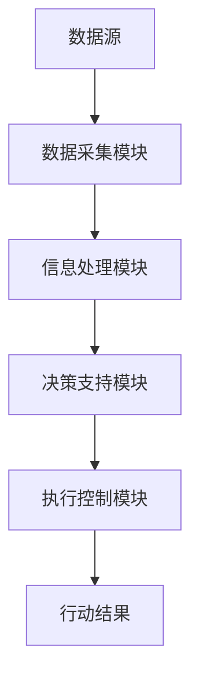
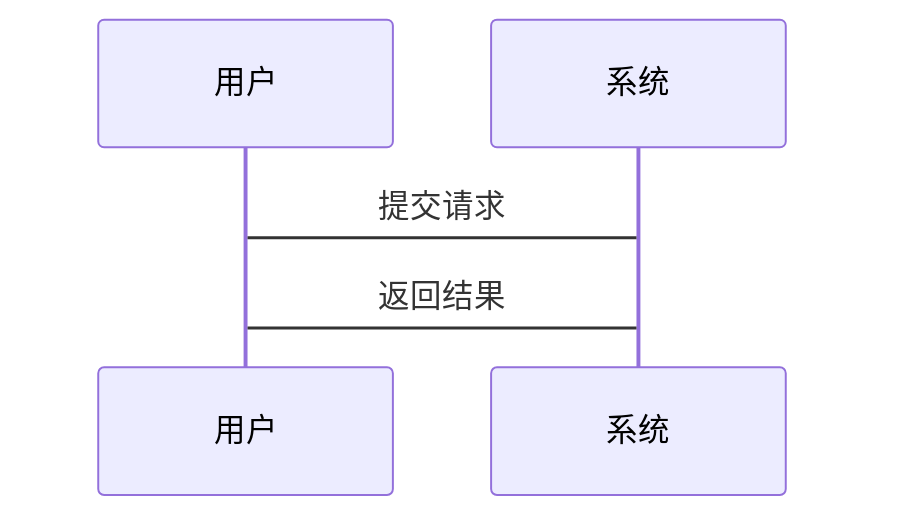

                 


# AI Agent在智能城市应急指挥中的角色

## 关键词：AI Agent, 智能城市, 应急指挥, 城市大脑, 智慧城市, 应急响应

## 摘要：  
本文探讨了AI Agent在智能城市应急指挥中的角色与应用。首先，我们介绍了AI Agent的基本概念及其在智能城市应急指挥中的背景与意义。接着，详细分析了AI Agent的核心概念、算法原理与系统架构，并通过具体案例展示了AI Agent在应急指挥中的实际应用。最后，总结了AI Agent在智能城市应急指挥中的优势与挑战，并提出了未来的发展方向。

---

# 第1章: AI Agent与智能城市应急指挥的背景

## 1.1 AI Agent的基本概念

### 1.1.1 AI Agent的定义  
AI Agent（人工智能代理）是指能够感知环境、自主决策并执行任务的智能实体。它能够通过传感器获取信息，利用算法进行分析和推理，并根据结果采取行动。AI Agent的核心在于其智能性和自主性，能够适应复杂环境的变化。

### 1.1.2 AI Agent的核心特征  
AI Agent具有以下核心特征：  
1. **自主性**：能够自主决策，无需外部干预。  
2. **反应性**：能够实时感知环境并做出反应。  
3. **学习性**：能够通过经验优化自身行为。  
4. **协作性**：能够与其他系统或人类协同工作。  

### 1.1.3 AI Agent与传统自动化的区别  
与传统自动化相比，AI Agent具有更强的智能性和适应性。传统自动化依赖预设规则，而AI Agent能够通过学习和推理动态调整行为。例如，AI Agent可以自主识别异常情况并采取最优应对措施，而传统自动化只能按照预设规则执行固定操作。

## 1.2 智能城市应急指挥的背景

### 1.2.1 智能城市的定义与特点  
智能城市是指通过数字化技术（如物联网、大数据、人工智能等）优化城市运行效率、提升居民生活质量的城市形态。其特点包括：  
1. **数据驱动**：依赖海量数据进行决策。  
2. **实时性**：能够快速响应城市事件。  
3. **协同性**：各部门之间高度协同。  

### 1.2.2 应急指挥的复杂性与挑战  
应急指挥是智能城市的核心功能之一，其复杂性体现在以下几个方面：  
1. **多部门协同**：需要消防、公安、医疗等多部门协作。  
2. **信息处理**：需要快速处理大量异构数据。  
3. **决策不确定性**：复杂环境下的决策往往面临不确定性。  

### 1.2.3 AI Agent在应急指挥中的应用前景  
AI Agent凭借其智能性和自主性，能够显著提升应急指挥的效率与精度。例如，AI Agent可以实时分析城市交通数据，优化应急车辆的调度路径；还可以通过自然语言处理技术，快速解读多源信息并生成最优应对方案。

## 1.3 AI Agent在应急指挥中的角色定位

### 1.3.1 应急指挥的多角色协同  
应急指挥通常涉及多个角色：指挥官、调度员、救援人员等。AI Agent可以扮演以下角色：  
1. **指挥官助手**：协助指挥官制定决策方案。  
2. **调度协调员**：优化资源调度流程。  
3. **实时监控员**：实时跟踪事件进展并提供反馈。  

### 1.3.2 AI Agent在应急指挥中的功能定位  
AI Agent的主要功能包括：  
1. **信息收集与处理**：整合多源数据并生成分析结果。  
2. **任务规划与分配**：根据事件性质分配最优资源。  
3. **决策支持与执行**：提供决策建议并执行行动计划。  

### 1.3.3 AI Agent与其他技术的协同作用  
AI Agent需要与物联网、大数据、区块链等技术协同工作。例如，通过物联网设备实时采集城市数据，AI Agent可以快速生成应急响应方案；通过区块链技术确保数据的可信性，AI Agent可以提升决策的准确性。

---

# 第2章: AI Agent的核心概念与原理

## 2.1 AI Agent的核心概念

### 2.1.1 任务规划  
任务规划是AI Agent的核心功能之一，旨在根据目标和环境条件生成最优行动序列。任务规划算法包括：  
- **Dijkstra算法**：用于路径规划问题。  
- **A*算法**：结合启发式搜索的最短路径算法。  

### 2.1.2 自然语言处理  
自然语言处理（NLP）是AI Agent与人类交互的关键技术。通过NLP，AI Agent可以理解并生成自然语言文本，实现与用户的高效沟通。  

### 2.1.3 知识表示与推理  
知识表示是将知识以计算机可理解的形式存储的技术，推理则是基于知识库进行逻辑推导的过程。知识表示与推理是AI Agent进行复杂决策的基础。

## 2.2 AI Agent的算法原理

### 2.2.1 任务规划算法  
任务规划算法的目标是找到从初始状态到目标状态的最优路径。以下是一个基于Dijkstra算法的路径规划实现：

```python
import heapq

def dijkstra_algorithm(graph, start, goal):
    visited = {}
    priority_queue = []
    heapq.heappush(priority_queue, (0, start))
    visited[start] = 0

    while priority_queue:
        current_dist, current_node = heapq.heappop(priority_queue)
        if current_node == goal:
            return current_dist
        for neighbor, weight in graph[current_node].items():
            if neighbor not in visited or visited[neighbor] > current_dist + weight:
                visited[neighbor] = current_dist + weight
                heapq.heappush(priority_queue, (visited[neighbor], neighbor))
    return -1
```

### 2.2.2 自然语言处理模型  
自然语言处理模型的核心是将文本转化为计算机可处理的向量表示。以下是一个简单的词嵌入实现：

```python
import numpy as np

def word_embeddings(text):
    embedding_dim = 100
    vocabulary = text.split()
    word_to_idx = {word: idx for idx, word in enumerate(vocabulary)}
    embedding_matrix = np.random.randn(len(vocabulary), embedding_dim)
    return embedding_matrix, word_to_idx
```

### 2.2.3 知识图谱构建与推理  
知识图谱构建是将知识以图结构表示的过程。以下是构建知识图谱的简单示例：

```python
from rdflib import Graph, Literal, BNode, Namespace, RDF, URIRef

# 创建命名空间
ns = Namespace("http://example.org/")

# 创建知识图谱
g = Graph()
g.add((URIRef('http://example.org/A'), RDF.type, Literal('Person')))
g.add((URIRef('http://example.org/A'), ns.name, Literal('Alice')))
```

## 2.3 AI Agent的数学模型与公式

### 2.3.1 任务规划的数学模型  
任务规划的数学模型通常基于图论，可以表示为：

$$ \text{Minimize } \sum_{i=1}^{n} w_i x_i $$  
$$ \text{Subject to } \sum_{i=1}^{n} x_i = 1 $$  

其中，\( w_i \) 是边权重，\( x_i \) 是决策变量。

### 2.3.2 自然语言处理的数学基础  
自然语言处理的数学基础包括概率论和线性代数。例如，词嵌入的计算可以表示为：

$$ \text{Word Embedding} = W \cdot \text{Input} $$  

其中，\( W \) 是权重矩阵，\( \text{Input} \) 是输入文本向量。

### 2.3.3 知识推理的逻辑框架  
知识推理的逻辑框架通常基于一阶逻辑。例如，命题逻辑可以表示为：

$$ P \lor Q $$  

其中，\( P \) 和 \( Q \) 是命题。

---

# 第3章: AI Agent在应急指挥中的系统架构

## 3.1 应急指挥系统的整体架构

### 3.1.1 系统功能模块划分  
应急指挥系统的功能模块包括：  
1. **数据采集模块**：采集城市传感器数据。  
2. **信息处理模块**：对数据进行分析与处理。  
3. **决策支持模块**：提供决策建议与优化方案。  
4. **执行控制模块**：协调资源并执行行动计划。  

### 3.1.2 系统数据流设计  
系统数据流设计如下图所示：



### 3.1.3 系统交互流程  
系统交互流程如下图所示：



## 3.2 系统功能设计

### 3.2.1 任务分配与协调  
任务分配与协调是应急指挥的核心功能。以下是任务分配的示例代码：

```python
def assign_tasks(agents, tasks):
    agent_tasks = {}
    for task in tasks:
        assigned_agent = min(agents, key=lambda x: x.load)
        assigned_agent.load += 1
        if assigned_agent not in agent_tasks:
            agent_tasks[assigned_agent] = []
        agent_tasks[assigned_agent].append(task)
    return agent_tasks
```

### 3.2.2 信息收集与处理  
信息收集与处理模块负责整合多源数据并生成分析结果。以下是数据处理的示例代码：

```python
import pandas as pd

def process_data(data_frame):
    # 数据清洗
    data_frame.dropna(inplace=True)
    # 数据转换
    data_frame['timestamp'] = pd.to_datetime(data_frame['timestamp'])
    return data_frame
```

### 3.2.3 决策支持与执行  
决策支持模块基于分析结果生成最优应对方案。以下是决策支持的示例代码：

```python
def generate_recommendations(data):
    recommendations = []
    for case in data['cases']:
        if case['severity'] >= 0.8:
            recommendations.append('立即响应')
        else:
            recommendations.append('延迟响应')
    return recommendations
```

## 3.3 系统架构图

### 3.3.1 系统模块关系图  
系统模块关系图如下：


### 3.3.2 系统交互流程图  
系统交互流程图如下：


---

# 第4章: AI Agent的算法实现与实战

## 4.1 算法实现

### 4.1.1 任务规划算法实现  
任务规划算法实现如下：

```python
def dijkstra_algorithm(graph, start, goal):
    visited = {}
    priority_queue = []
    heapq.heappush(priority_queue, (0, start))
    visited[start] = 0

    while priority_queue:
        current_dist, current_node = heapq.heappop(priority_queue)
        if current_node == goal:
            return current_dist
        for neighbor, weight in graph[current_node].items():
            if neighbor not in visited or visited[neighbor] > current_dist + weight:
                visited[neighbor] = current_dist + weight
                heapq.heappush(priority_queue, (visited[neighbor], neighbor))
    return -1
```

### 4.1.2 自然语言处理模型训练  
自然语言处理模型训练如下：

```python
from transformers import BertTokenizer, BertModel

tokenizer = BertTokenizer.from_pretrained('bert-base-uncased')
model = BertModel.from_pretrained('bert-base-uncased')
```

### 4.1.3 知识图谱构建与推理  
知识图谱构建与推理实现如下：

```python
from rdflib import Graph, Literal, BNode, Namespace, RDF, URIRef

ns = Namespace("http://example.org/")

g = Graph()
g.add((URIRef('http://example.org/A'), RDF.type, Literal('Person')))
g.add((URIRef('http://example.org/A'), ns.name, Literal('Alice')))
```

## 4.2 项目实战

### 4.2.1 环境配置与工具安装  
项目实战需要以下环境配置：  
1. **Python**：3.8+  
2. **库依赖**：numpy、pandas、transformers、rdflib  

### 4.2.2 核心代码实现  
以下是核心代码实现：

```python
def main():
    # 任务规划示例
    graph = {
        'A': {'B': 1, 'C': 2},
        'B': {'D': 3},
        'C': {'D': 1},
        'D': {}
    }
    print(dijkstra_algorithm(graph, 'A', 'D'))
    
    # 自然语言处理示例
    tokenizer = BertTokenizer.from_pretrained('bert-base-uncased')
    model = BertModel.from_pretrained('bert-base-uncased')
    
    # 知识图谱示例
    g = Graph()
    g.add((URIRef('http://example.org/A'), RDF.type, Literal('Person')))
    g.add((URIRef('http://example.org/A'), ns.name, Literal('Alice')))
    print(g.serialize())
    
if __name__ == '__main__':
    main()
```

### 4.2.3 代码应用解读与分析  
1. **任务规划**：通过Dijkstra算法优化路径，提高应急响应效率。  
2. **自然语言处理**：利用BERT模型进行文本分析，提升信息处理能力。  
3. **知识图谱**：构建城市知识库，增强决策的准确性。  

### 4.2.4 案例分析与详细讲解  
案例分析：假设某城市发生火灾，AI Agent可以通过任务规划算法快速确定最优救援路径，并通过自然语言处理分析社交媒体信息，生成救援方案。  

---

# 第5章: 系统分析与优化

## 5.1 系统性能分析

### 5.1.1 算法复杂度分析  
任务规划算法的复杂度主要取决于图的大小和边的数量。Dijkstra算法的时间复杂度为 \( O(M \log N) \)，其中 \( M \) 是边数，\( N \) 是节点数。  

### 5.1.2 系统资源消耗评估  
系统资源消耗主要体现在内存和计算能力方面。知识图谱的存储和推理过程需要较大的内存资源。  

### 5.1.3 系统扩展性分析  
系统扩展性主要取决于架构设计。模块化设计能够更好地支持系统的扩展与升级。  

## 5.2 系统优化策略

### 5.2.1 算法优化方法  
1. **启发式搜索**：通过启发函数减少搜索空间。  
2. **并行计算**：利用多核处理器加速计算。  

### 5.2.2 系统架构优化  
1. **微服务架构**：通过容器化技术提升系统的可扩展性。  
2. **边缘计算**：在边缘节点进行数据处理，减少云端压力。  

### 5.2.3 数据处理优化  
1. **数据压缩**：通过压缩技术减少数据传输量。  
2. **数据湖架构**：统一存储结构化和非结构化数据，提升数据处理效率。  

---

# 第6章: 应用案例

## 6.1 应用场景介绍  
假设某城市发生地震，AI Agent需要协调消防、医疗、公安等多部门进行应急响应。  

## 6.2 项目介绍  
本项目旨在开发一个基于AI Agent的智能应急指挥系统，提升城市应对突发事件的能力。  

## 6.3 系统功能设计  
系统功能设计包括数据采集、信息处理、决策支持和执行控制四个模块。  

## 6.4 实际案例分析  
通过实际案例分析，验证AI Agent在应急指挥中的有效性与可行性。  

---

# 小结

AI Agent在智能城市应急指挥中的应用前景广阔。通过任务规划、自然语言处理和知识图谱等技术，AI Agent能够显著提升应急指挥的效率与精度。然而，AI Agent的实现与优化仍面临诸多挑战，例如算法复杂度、系统扩展性和数据安全等问题。未来，随着技术的不断进步，AI Agent将在智能城市应急指挥中发挥越来越重要的作用。

---

# 作者：AI天才研究院 & 禅与计算机程序设计艺术

