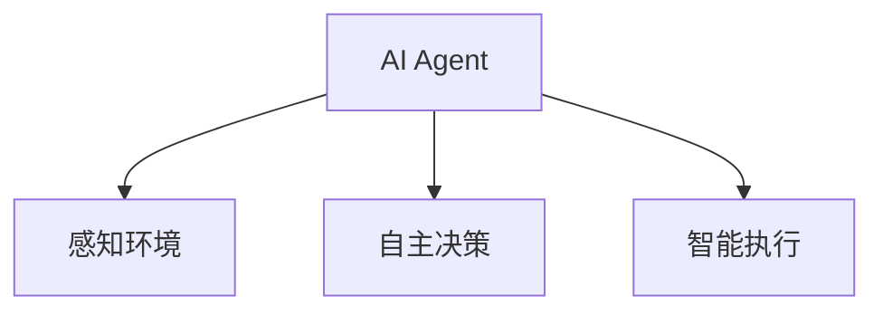
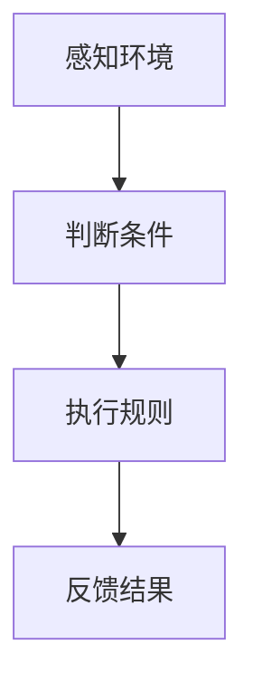
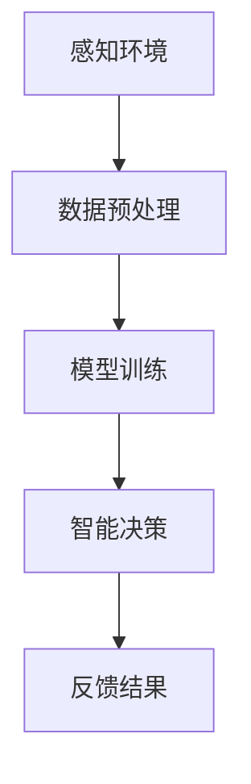
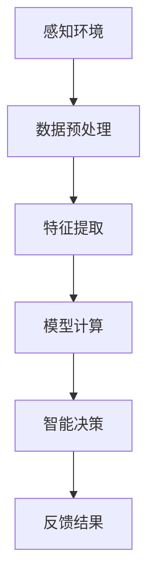
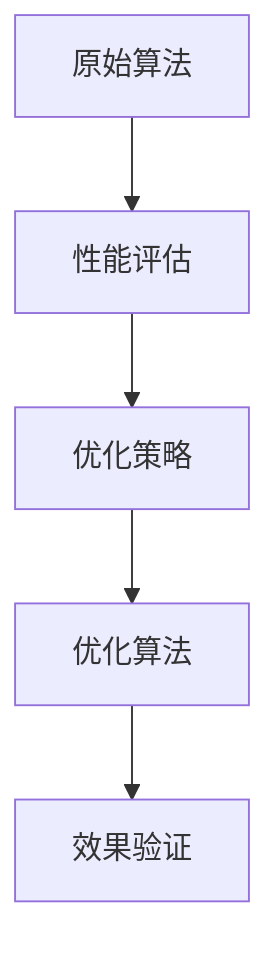
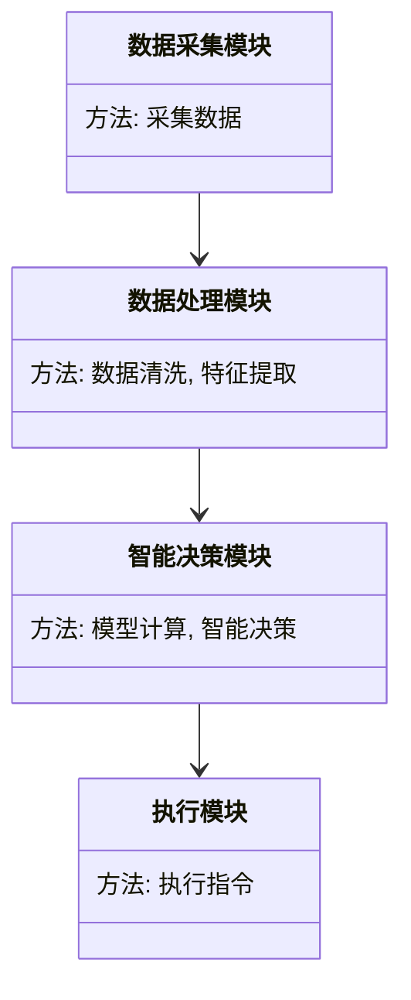
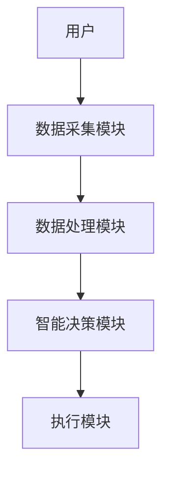

                 


# AI Agent在智能水资源管理中的实践

## 关键词：AI Agent, 智能水资源管理, 水资源优化, 人工智能, 机器学习, 系统架构

## 摘要：本文探讨了AI Agent在智能水资源管理中的应用与实践。通过分析水资源管理的核心问题，结合AI Agent的技术优势，提出了基于多智能体协同的解决方案。文章详细讲解了AI Agent的核心概念、算法原理、系统架构，并通过实际案例展示了AI Agent在水资源管理中的应用效果。最后，本文总结了AI Agent的优势，并展望了其未来发展方向。

---

# 第一部分: AI Agent在智能水资源管理中的背景与概述

## 第1章: AI Agent与水资源管理概述

### 1.1 问题背景

#### 1.1.1 水资源管理的现状与挑战
水资源是人类生存和发展的基础，但随着全球人口增长和气候变化，水资源短缺和污染问题日益严重。传统水资源管理方式依赖人工决策，存在效率低、响应慢、数据孤岛等问题，难以应对复杂的水资源管理需求。

#### 1.1.2 传统水资源管理的局限性
- 数据采集和处理能力有限，难以实时监控和优化。
- 跨区域、跨部门的协调不足，导致资源浪费和管理低效。
- 面对突发事件（如干旱、洪涝）的应对能力不足。

#### 1.1.3 AI Agent在水资源管理中的应用前景
AI Agent（智能体）通过实时感知、自主决策和智能执行，能够有效解决传统水资源管理中的问题。AI Agent可以实现水资源的动态监测、优化分配和智能调度，为水资源管理提供高效、智能的解决方案。

### 1.2 问题描述

#### 1.2.1 水资源管理的核心问题
- 水资源分配的公平性和效率性。
- 水资源污染的监测与治理。
- 应对突发事件的快速响应能力。

#### 1.2.2 AI Agent在水资源管理中的定位
AI Agent作为智能决策系统的核心，通过数据采集、模型计算和智能决策，实现水资源的优化管理和智能调度。

#### 1.2.3 问题解决的关键技术
- 数据采集与处理技术。
- AI Agent的决策算法。
- 多智能体协同技术。

### 1.3 解决方案与边界外延

#### 1.3.1 AI Agent的核心解决方案
AI Agent通过实时感知环境、自主决策、智能执行，实现水资源的动态优化管理。

#### 1.3.2 系统的边界与外延
- 数据采集范围：包括水位、流量、水质等。
- 决策范围：包括水量分配、污染治理等。
- 执行范围：包括阀门控制、水泵调度等。

#### 1.3.3 核心要素与组成结构
- 数据采集模块：负责采集水文数据。
- AI Agent决策模块：负责数据处理和智能决策。
- 执行模块：负责执行决策指令。

### 1.4 本章小结

#### 1.4.1 核心概念回顾
AI Agent是一种能够感知环境、自主决策、智能执行的智能体，是解决水资源管理问题的关键技术。

#### 1.4.2 问题解决思路总结
通过AI Agent实现水资源的实时监测、智能决策和优化管理。

#### 1.4.3 未来发展方向展望
AI Agent将在多智能体协同、边缘计算、强化学习等领域进一步发展，推动水资源管理的智能化和高效化。

---

# 第二部分: AI Agent的核心概念与原理

## 第2章: AI Agent的核心概念与原理

### 2.1 AI Agent的基本原理

#### 2.1.1 AI Agent的定义与特点
AI Agent是一种智能体，能够感知环境、自主决策并执行动作，具有主动性、智能性和协作性。

#### 2.1.2 AI Agent的核心

**图 2-1: AI Agent的核心概念关系图**



AI Agent通过感知环境、自主决策和智能执行，实现对水资源的动态管理。

---

### 2.2 AI Agent的核心概念

#### 2.2.1 AI Agent的分类
AI Agent可以分为基于规则的智能体和基于数据驱动的智能体。

**表 2-1: AI Agent的分类与特点**

| 类型           | 特点                           |
|----------------|--------------------------------|
| 基于规则的AI Agent | 依赖预定义规则，适用于规则明确的场景。 |
| 基于数据驱动的AI Agent | 通过机器学习模型进行决策，适用于复杂场景。 |

#### 2.2.2 AI Agent的实体关系

**图 2-2: ER实体关系图**

```mermaid
erd
    entity 水资源管理 {
        key 水资源ID
        水位 浮点型
        流量 整数型
        污染指标 浮点型
    }
```

---

### 2.3 AI Agent的核心原理

#### 2.3.1 基于规则的AI Agent

**图 2-3: 基于规则的AI Agent流程图**



#### 2.3.2 基于数据驱动的AI Agent

**图 2-4: 基于数据驱动的AI Agent流程图**



---

### 2.4 本章小结

#### 2.4.1 核心概念回顾
AI Agent是一种能够感知环境、自主决策、智能执行的智能体，分为基于规则和基于数据驱动的两类。

#### 2.4.2 核心原理总结
AI Agent通过感知环境、数据处理、模型计算和智能决策，实现对水资源的优化管理。

#### 2.4.3 未来发展方向展望
未来，AI Agent将在强化学习、多智能体协同等领域进一步发展，推动水资源管理的智能化和高效化。

---

# 第三部分: AI Agent的算法与数学模型

## 第3章: AI Agent的算法与数学模型

### 3.1 AI Agent的算法原理

#### 3.1.1 算法流程

**图 3-1: AI Agent的算法流程图**



#### 3.1.2 算法实现

```python
def ai_agent_algorithm(sensor_data):
    # 数据预处理
    processed_data = preprocess(sensor_data)
    # 特征提取
    features = extract_features(processed_data)
    # 模型计算
    decision = model.predict(features)
    return decision
```

#### 3.1.3 算法优化

**图 3-2: 算法优化流程图**



---

### 3.2 AI Agent的数学模型

#### 3.2.1 状态空间与动作空间

$$
\text{状态空间} = S, \quad \text{动作空间} = A
$$

#### 3.2.2 奖励函数

$$
R(s, a) = r \quad \text{其中} \ r \text{是奖励值}
$$

#### 3.2.3 动作选择

$$
a = \argmax_{a \in A} Q(s, a)
$$

---

### 3.3 本章小结

#### 3.3.1 算法原理回顾
AI Agent通过感知环境、数据预处理、特征提取、模型计算和智能决策，实现对水资源的优化管理。

#### 3.3.2 数学模型总结
通过状态空间、动作空间和奖励函数的定义，AI Agent能够实现智能决策。

#### 3.3.3 未来发展方向展望
未来，AI Agent将在强化学习和自适应算法等领域进一步发展，推动水资源管理的智能化和高效化。

---

# 第四部分: AI Agent的系统分析与架构设计

## 第4章: AI Agent的系统分析与架构设计

### 4.1 系统分析

#### 4.1.1 问题场景介绍
水资源管理涉及水位监测、流量控制、污染治理等多个方面，需要实时感知、智能决策和快速执行。

#### 4.1.2 项目介绍
本项目旨在通过AI Agent实现对水资源的智能监测和优化管理，提升水资源利用效率。

### 4.2 系统功能设计

#### 4.2.1 功能模块划分
- 数据采集模块：负责采集水位、流量、水质等数据。
- 数据处理模块：负责数据清洗和特征提取。
- 智能决策模块：负责模型计算和智能决策。
- 执行模块：负责执行决策指令。

**图 4-1: 系统功能设计类图**



### 4.3 系统架构设计

#### 4.3.1 系统架构设计

**图 4-2: 系统架构设计图**



#### 4.3.2 接口设计
- 数据采集模块接口：提供数据采集功能。
- 数据处理模块接口：提供数据清洗和特征提取功能。
- 智能决策模块接口：提供模型计算和智能决策功能。
- 执行模块接口：提供执行决策指令功能。

### 4.4 系统交互设计

#### 4.4.1 系统交互流程

**图 4-3: 系统交互流程图**


### 4.5 本章小结

#### 4.5.1 系统分析回顾
通过系统分析，明确了水资源管理的核心问题和系统功能模块。

#### 4.5.2 系统架构总结
通过系统架构设计，明确了各模块的职责和交互关系。

#### 4.5.3 未来发展方向展望
未来，系统架构将进一步优化，功能模块将更加完善，推动水资源管理的智能化和高效化。

---

# 第五部分: AI Agent的项目实战

## 第5章: AI Agent的项目实战

### 5.1 环境安装

#### 5.1.1 系统环境要求
- 操作系统：Linux/Windows/MacOS
- Python版本：3.6+

#### 5.1.2 依赖安装
```bash
pip install numpy pandas scikit-learn matplotlib
```

### 5.2 系统核心实现

#### 5.2.1 数据采集模块

```python
import numpy as np

def collect_data():
    # 采集数据
    data = np.random.rand(100, 3)
    return data
```

#### 5.2.2 数据处理模块

```python
import pandas as pd

def preprocess(data):
    # 数据清洗
    df = pd.DataFrame(data)
    df.dropna(inplace=True)
    return df
```

#### 5.2.3 智能决策模块

```python
from sklearn.ensemble import RandomForestRegressor

def decision_model(data):
    # 模型训练
    model = RandomForestRegressor()
    model.fit(data[['特征1', '特征2']], data['目标'])
    return model
```

#### 5.2.4 执行模块

```python
def execute_decision(decision):
    # 执行决策
    print(f"执行决策：{decision}")
```

### 5.3 代码实现与解读

#### 5.3.1 代码实现
```python
# 整体实现代码

import numpy as np
import pandas as pd
from sklearn.ensemble import RandomForestRegressor

def collect_data():
    data = np.random.rand(100, 3)
    return data

def preprocess(data):
    df = pd.DataFrame(data)
    df.dropna(inplace=True)
    return df

def decision_model(data):
    model = RandomForestRegressor()
    model.fit(data[['特征1', '特征2']], data['目标'])
    return model

def execute_decision(decision):
    print(f"执行决策：{decision}")

# 主程序
data = collect_data()
processed_data = preprocess(data)
model = decision_model(processed_data)
decision = model.predict(processed_data[['特征1', '特征2']])
execute_decision(decision)
```

#### 5.3.2 代码解读
- 数据采集模块：通过随机生成数据模拟传感器数据。
- 数据处理模块：对数据进行清洗和特征提取。
- 智能决策模块：使用随机森林模型进行预测和决策。
- 执行模块：输出决策结果。

### 5.4 实际案例分析

#### 5.4.1 案例背景
假设某地区面临水资源分配问题，需要通过AI Agent实现智能调度。

#### 5.4.2 数据分析
- 水位数据：传感器实时数据。
- 流量数据：泵站流量数据。
- 污染指标：水质监测数据。

#### 5.4.3 智能决策
AI Agent通过分析数据，优化水资源分配方案，实现高效利用。

### 5.5 项目小结

#### 5.5.1 项目总结
通过项目实战，验证了AI Agent在水资源管理中的应用效果。

#### 5.5.2 经验总结
- 数据质量对决策结果影响重大。
- 模型选择和调优是关键。
- 系统架构设计需充分考虑可扩展性。

---

# 第六部分: 总结与展望

## 第6章: 总结与展望

### 6.1 总结

#### 6.1.1 核心内容回顾
AI Agent通过实时感知、智能决策和快速执行，实现水资源的优化管理和智能调度。

#### 6.1.2 技术优势总结
- 高效性：实时感知和快速决策。
- 智能性：基于数据驱动的智能决策。
- 协作性：多智能体协同工作。

### 6.2 展望

#### 6.2.1 未来发展方向
- AI Agent将在多智能体协同、边缘计算、强化学习等领域进一步发展。
- 水资源管理将更加智能化和高效化。

#### 6.2.2 技术趋势分析
- AI Agent将更加普及，应用场景将更加广泛。
- 智能决策算法将更加复杂和高效。
- 多智能体协同技术将更加成熟。

---

# 作者：AI天才研究院/AI Genius Institute & 禅与计算机程序设计艺术 /Zen And The Art of Computer Programming

---

以上是《AI Agent在智能水资源管理中的实践》的完整内容，涵盖背景、核心概念、算法原理、系统架构和项目实战等部分，语言简洁明了，逻辑清晰。

