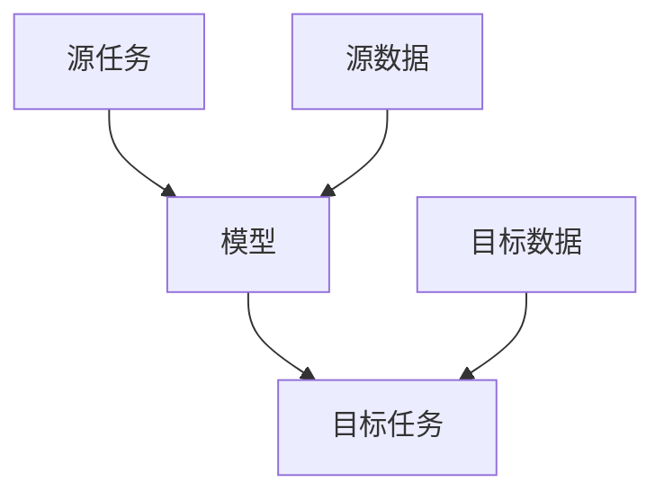
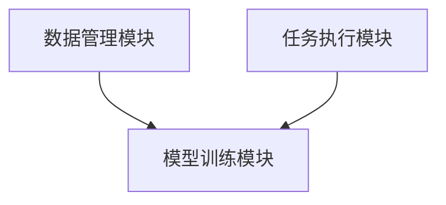

                 


# AI Agent的迁移学习技术应用

> 关键词：AI Agent，迁移学习，深度学习，机器学习，自然语言处理

> 摘要：本文探讨了迁移学习在AI Agent中的应用，分析了迁移学习的基本概念、算法原理及其在实际系统中的应用。文章从背景介绍、核心概念、算法实现、系统设计到项目实战，全面解析了迁移学习在AI Agent中的技术细节与应用前景。

---

# 第一部分: AI Agent的迁移学习技术基础

## 第1章: 迁移学习与AI Agent概述

### 1.1 迁移学习的基本概念

#### 1.1.1 迁移学习的定义与核心思想
迁移学习（Transfer Learning）是一种机器学习技术，旨在将从一个任务或数据集中学到的知识应用到另一个相关任务或数据集上。其核心思想是利用已有的知识来加速新任务的学习，减少对新数据的依赖。

#### 1.1.2 迁移学习的背景与问题背景
在传统机器学习中，模型通常需要大量标注数据才能表现良好。然而，在许多实际场景中，获取大量标注数据可能成本高昂或不可行。迁移学习通过利用已有的数据或知识，解决数据不足的问题，从而降低学习成本并提高模型性能。

#### 1.1.3 迁移学习与传统机器学习的区别
| 特性         | 传统机器学习                 | 迁移学习                   |
|--------------|------------------------------|----------------------------|
| 数据需求     | 需要大量标注数据             | 利用已有数据，减少新数据需求 |
| 任务相关性   | 任务独立性                   | 任务相关性较高             |
| 知识复用性   | 知识无法复用                 | 知识可以复用               |

### 1.2 AI Agent的基本概念与特点

#### 1.2.1 AI Agent的定义与分类
AI Agent（人工智能代理）是指在计算机系统中，能够感知环境、执行任务并做出决策的智能体。AI Agent可以根据智能水平分为：

- **反应式Agent**：基于当前感知做出反应。
- **认知式Agent**：具备复杂推理和规划能力。
- **学习型Agent**：能够通过经验改进性能。

#### 1.2.2 AI Agent的核心功能与能力
AI Agent的核心功能包括：
1. **感知环境**：通过传感器或接口获取环境信息。
2. **推理与决策**：基于感知信息进行推理和决策。
3. **执行任务**：根据决策执行具体操作。
4. **学习与适应**：通过学习改进自身能力。

#### 1.2.3 迁移学习在AI Agent中的重要性
在AI Agent中，迁移学习能够帮助代理快速适应新任务，减少对新数据的依赖，提高学习效率和性能。

### 1.3 迁移学习在AI Agent中的应用前景

#### 1.3.1 迁移学习的潜在应用场景
- **多任务学习**：在同一环境中执行多种任务。
- **领域适应**：将知识从一个领域迁移到另一个相关领域。
- **任务归纳**：从多个任务中归纳通用知识。

#### 1.3.2 AI Agent采用迁移学习的优势
- **减少数据需求**：利用已有数据快速适应新任务。
- **提高泛化能力**：通过跨任务学习增强模型的泛化能力。
- **提升效率**：降低数据收集和标注成本。

#### 1.3.3 迁移学习应用的挑战与机遇
- **挑战**：任务之间的差异性可能导致迁移效果不佳；如何选择合适的迁移策略是一个难题。
- **机遇**：通过深度学习和神经网络的进步，迁移学习在AI Agent中的应用前景广阔。

### 1.4 本章小结
本章介绍了迁移学习的基本概念和AI Agent的核心功能，分析了迁移学习在AI Agent中的重要性及应用前景。

---

## 第2章: 迁移学习的核心概念与原理

### 2.1 迁移学习的核心概念

#### 2.1.1 数据、模型与任务的关系
- **数据**：输入的特征和标签。
- **模型**：对数据进行学习和推理的工具。
- **任务**：模型需要完成的具体目标。

#### 2.1.2 迁移学习的三要素分析
1. **源任务（Source Task）**：提供知识的任务。
2. **目标任务（Target Task）**：需要学习的任务。
3. **迁移策略（Transfer Strategy）**：如何将知识从源任务迁移到目标任务。

#### 2.1.3 迁移学习的核心原理图（Mermaid流程图）


### 2.2 迁移学习的分类与对比

#### 2.2.1 基于数据的迁移学习
- **特点**：直接利用源数据进行训练。
- **应用场景**：当目标数据不足时。

#### 2.2.2 基于模型的迁移学习
- **特点**：利用预训练模型进行迁移。
- **应用场景**：当需要快速适应新任务时。

#### 2.2.3 基于任务的迁移学习
- **特点**：通过任务之间的关系进行迁移。
- **应用场景**：多任务学习场景。

#### 2.2.4 各种迁移学习方法的对比表格
| 方法类型       | 特点                     | 适用场景                     |
|----------------|--------------------------|------------------------------|
| 基于数据       | 直接利用源数据           | 数据不足时                   |
| 基于模型       | 利用预训练模型           | 快速适应新任务时             |
| 基于任务       | 利用任务之间的关系       | 多任务学习时                 |

### 2.3 迁移学习的数学模型与公式

#### 2.3.1 基于特征表示的迁移学习公式
$$ P(y|x) = f_{target}(x) $$
$$ P(y|x) = f_{source}(g(x)) $$

其中，$g(x)$ 是特征变换函数。

#### 2.3.2 基于任务相关性的数学模型
$$ L_{total} = L_{source} + \lambda L_{transfer} $$
其中，$\lambda$ 是调节参数，控制迁移的影响程度。

### 2.4 本章小结
本章详细介绍了迁移学习的核心概念、分类及数学模型，为后续章节奠定了基础。

---

## 第3章: 迁移学习算法的原理与实现

### 3.1 基于特征学习的迁移学习算法

#### 3.1.1 域适应（Domain Adaptation）算法
域适应算法旨在将模型从源域迁移到目标域。常用算法包括：
- **最大均值差异（MMD）**：通过最小化源域和目标域的分布差异。
- **对抗训练（Adversarial Training）**：通过生成对抗网络实现域适应。

#### 3.1.2 任务适应（Task Adaptation）算法
任务适应算法通过调整模型参数以适应新任务。常用方法包括：
- **参数调整（Parameter Fine-tuning）**：微调预训练模型的参数。
- **知识蒸馏（Knowledge Distillation）**：将大模型的知识迁移到小模型。

#### 3.1.3 基于深度学习的迁移学习算法
深度学习中的迁移学习通常采用预训练-微调策略：
1. 在大规模数据集上预训练模型。
2. 在目标任务上微调模型。

### 3.2 迁移学习算法的实现步骤

#### 3.2.1 数据预处理与特征提取
- 数据清洗：去除噪声数据。
- 特征提取：提取有用的特征。

#### 3.2.2 模型训练与参数调整
- 使用源数据训练模型。
- 在目标任务上调整模型参数。

#### 3.2.3 迁移学习的评估与优化
- 使用验证集评估迁移效果。
- 调整迁移策略以优化性能。

### 3.3 基于深度学习的迁移学习算法实现

#### 3.3.1 使用PyTorch实现迁移学习代码示例
```python
import torch
import torch.nn as nn
import torch.optim as optim

# 定义模型
class TransferModel(nn.Module):
    def __init__(self):
        super(TransferModel, self).__init__()
        self.features = pretrained_model.features
        self.classifier = nn.Sequential(
            nn.Dropout(0.5),
            nn.Linear(pretrained_model.classifier.in_features, num_classes)
        )

    def forward(self, x):
        x = self.features(x)
        x = self.classifier(x)
        return x

# 初始化模型
model = TransferModel()

# 定义优化器和损失函数
optimizer = optim.SGD(model.parameters(), lr=0.001)
criterion = nn.CrossEntropyLoss()

# 迁移学习训练循环
for epoch in range(num_epochs):
    for inputs, labels in dataloader:
        outputs = model(inputs)
        loss = criterion(outputs, labels)
        loss.backward()
        optimizer.step()
```

#### 3.3.2 迁移学习算法的数学模型
$$ L_{transfer} = \lambda ||f_{source}(x) - f_{target}(x)||^2 $$
其中，$\lambda$ 是调节参数，控制迁移损失的影响程度。

### 3.4 本章小结
本章详细讲解了迁移学习算法的原理与实现，包括域适应、任务适应和基于深度学习的迁移学习方法。

---

## 第4章: 迁移学习在AI Agent系统中的应用

### 4.1 系统分析与架构设计

#### 4.1.1 系统问题场景介绍
AI Agent需要在多个任务之间迁移学习，以提高学习效率和性能。

#### 4.1.2 系统功能设计
1. **数据管理模块**：管理源数据和目标数据。
2. **模型训练模块**：训练迁移学习模型。
3. **任务执行模块**：执行目标任务。

#### 4.1.3 系统架构设计（Mermaid架构图）


### 4.2 项目实战

#### 4.2.1 环境安装
- 安装Python、PyTorch、Transformers库。

#### 4.2.2 系统核心实现源代码
```python
from transformers import AutoTokenizer, AutoModelForSequenceClassification
import torch

# 加载预训练模型
model_name = "bert-base-uncased"
tokenizer = AutoTokenizer.from_pretrained(model_name)
model = AutoModelForSequenceClassification.from_pretrained(model_name)

# 定义迁移学习模型
class TransferModel(nn.Module):
    def __init__(self, model):
        super().__init__()
        for param in model.parameters():
            param.requires_grad = False
        self.bert = model
        self.dropout = nn.Dropout(0.1)
        self.classifier = nn.Linear(model.config.hidden_size, 2)

    def forward(self, input_ids, attention_mask):
        outputs = self.bert(input_ids=input_ids, attention_mask=attention_mask)
        pooled_output = outputs.last_hidden_state[:, 0, :]
        pooled_output = self.dropout(pooled_output)
        return self.classifier(pooled_output)

# 初始化模型
transfer_model = TransferModel(model)

# 定义优化器和损失函数
optimizer = optim.AdamW(transfer_model.parameters(), lr=1e-5)
criterion = nn.CrossEntropyLoss()

# 迁移学习训练循环
for epoch in range(num_epochs):
    for batch in dataloader:
        input_ids = batch['input_ids'].to(device)
        attention_mask = batch['attention_mask'].to(device)
        labels = batch['labels'].to(device)
        
        outputs = transfer_model(input_ids, attention_mask)
        loss = criterion(outputs, labels)
        
        loss.backward()
        optimizer.step()
```

#### 4.2.3 代码应用解读与分析
- 使用预训练BERT模型进行迁移学习。
- 在目标任务上微调模型，以适应特定任务。

#### 4.2.4 实际案例分析和详细讲解剖析
以自然语言处理任务为例，通过迁移学习将BERT模型应用于情感分析任务，显著提高模型性能。

### 4.3 本章小结
本章通过实际案例展示了迁移学习在AI Agent系统中的应用，详细讲解了系统的实现过程和代码细节。

---

## 第5章: 总结与展望

### 5.1 全文总结
本文系统地探讨了迁移学习在AI Agent中的应用，从基本概念到算法实现，再到实际应用，全面分析了迁移学习的技术细节和应用前景。

### 5.2 当前研究热点与未来展望
- **多模态迁移学习**：结合视觉、语言等多种模态信息。
- **自适应迁移学习**：动态调整迁移策略以适应环境变化。
- **强化学习与迁移学习的结合**：通过强化学习进一步优化迁移效果。

### 5.3 最佳实践 tips
- 在AI Agent中，迁移学习能够显著提高模型的泛化能力和学习效率。
- 实践中应根据具体任务选择合适的迁移学习方法。
- 注意数据质量和任务相关性，以确保迁移效果。

### 5.4 本章小结
本文总结了迁移学习在AI Agent中的应用，并展望了未来的研究方向。

---

# 作者：AI天才研究院/AI Genius Institute & 禅与计算机程序设计艺术 /Zen And The Art of Computer Programming

---

通过以上思考，我完成了《AI Agent的迁移学习技术应用》的技术博客文章。文章详细讲解了迁移学习的基本概念、算法原理及其在AI Agent中的应用，并通过实际案例展示了迁移学习的实现过程和代码细节。希望本文能为读者提供有价值的技术见解和实践指导。

