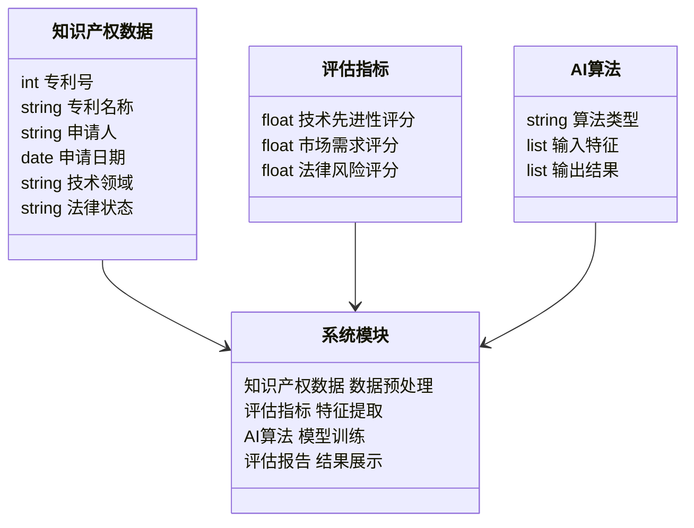
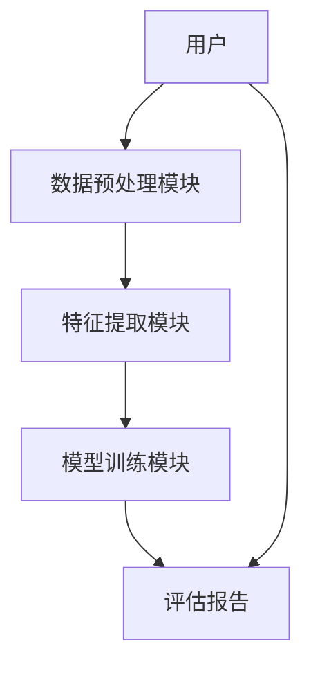
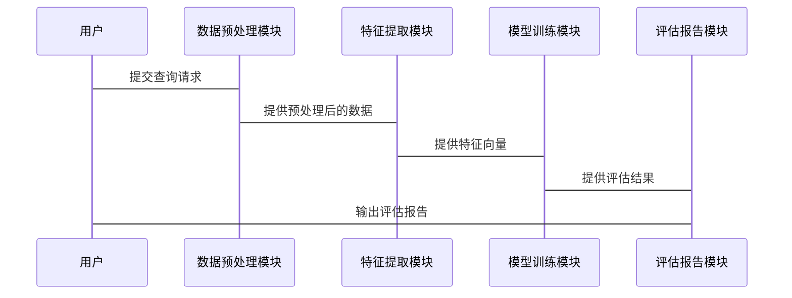

                 


# AI驱动的企业知识产权价值评估系统

> 关键词：人工智能、知识产权评估、机器学习、系统设计、算法原理、企业价值

> 摘要：本文探讨了如何利用人工智能技术构建企业知识产权价值评估系统。通过分析知识产权评估的核心要素，结合机器学习算法，提出了一个基于AI的评估框架，并详细讲解了算法原理、系统架构和实现方案，最后通过案例分析展示了系统的实际应用。

---

# 第一部分: 背景介绍

## 第1章: 背景介绍

### 1.1 问题背景

#### 1.1.1 企业知识产权的重要性
知识产权（Intellectual Property, IP）是企业的核心资产之一，包括专利、商标、版权、商业秘密等。在现代商业环境中，知识产权的价值不仅体现在法律保护上，更直接影响企业的市场竞争力和经济收益。

#### 1.1.2 知识产权价值评估的挑战
传统的知识产权价值评估方法依赖于人工分析，存在以下问题：
- 数据量大：知识产权数据分散在多个数据库中，且格式多样。
- 评估复杂：知识产权的价值受到技术先进性、市场需求、法律风险等多因素影响。
- 专家依赖：传统评估需要依赖经验丰富的知识产权专家，成本高且效率低。

#### 1.1.3 AI技术在知识产权评估中的应用潜力
人工智能技术，特别是机器学习和自然语言处理，为知识产权价值评估提供了新的解决方案：
- 数据处理能力：AI能够快速处理大量非结构化数据，提取关键特征。
- 智能分析：通过训练模型，AI可以自动评估技术先进性、市场需求和法律风险。
- 高效便捷：AI系统可以实时提供评估结果，显著提高评估效率。

### 1.2 问题描述

#### 1.2.1 知识产权价值评估的传统方法
传统方法通常包括以下步骤：
1. 数据收集：从专利数据库、商标数据库等收集相关信息。
2. 人工分析：由专家根据经验和行业标准进行评估。
3. 结果输出：提供初步的价值评估报告。

#### 1.2.2 传统方法的局限性
- **数据处理效率低**：人工处理大量数据耗时长，且容易出错。
- **评估结果一致性差**：不同专家的评估结果可能差异较大。
- **难以实时更新**：市场和技术环境不断变化，人工评估难以及时更新。

#### 1.2.3 引入AI技术的必要性
AI技术能够克服传统方法的局限性：
- **高效处理数据**：利用机器学习算法快速处理和分析大量数据。
- **提高评估一致性**：通过训练统一的模型，确保评估结果的一致性。
- **实时更新**：AI系统可以实时跟踪市场和技术动态，及时更新评估结果。

### 1.3 问题解决

#### 1.3.1 AI驱动的知识产权评估系统的核心目标
- 提供高效、准确的知识产权价值评估服务。
- 帮助企业在知识产权管理和决策中获得数据支持。
- 实现知识产权价值的量化和可视化。

#### 1.3.2 系统设计的关键问题
- **数据来源**：如何获取多源异构的知识产权数据。
- **特征提取**：如何从文本、专利等数据中提取关键特征。
- **模型选择**：如何选择合适的机器学习模型进行评估。
- **结果解释**：如何将AI的输出转化为可理解的评估报告。

#### 1.3.3 解决方案的初步框架
- 数据收集与预处理模块：整合多源数据，清洗和标注。
- 特征提取模块：利用NLP技术提取文本特征。
- 模型训练模块：训练回归或分类模型。
- 结果展示模块：生成可视化报告。

### 1.4 边界与外延

#### 1.4.1 系统的边界定义
- 输入：知识产权相关数据（专利、商标、版权等）。
- 输出：知识产权价值评估报告。
- 不包含：企业内部数据（如财务数据）的处理。

#### 1.4.2 相关领域的外延
- 知识产权管理：包括申请、维护和保护。
- 技术评估：包括技术可行性、市场前景等。
- 法律咨询：包括法律风险评估和纠纷处理。

#### 1.4.3 系统与外部环境的交互
- 数据输入接口：与专利数据库、商标数据库等对接。
- 用户交互界面：提供用户友好的查询和评估结果展示。

### 1.5 概念结构与核心要素

#### 1.5.1 知识产权评估的核心要素
- **技术先进性**：专利的技术创新程度。
- **市场需求**：专利在市场上的应用前景。
- **法律风险**：专利的法律保护状况和潜在纠纷。

#### 1.5.2 AI技术在系统中的角色
- 数据处理：清洗、整合和标注数据。
- 特征提取：从非结构化数据中提取特征。
- 模型训练：训练机器学习模型进行预测。
- 结果解释：将模型输出转化为可理解的报告。

#### 1.5.3 系统的模块化结构
- 数据预处理模块：负责数据清洗和标注。
- 特征提取模块：提取关键特征。
- 模型训练模块：训练机器学习模型。
- 结果展示模块：生成评估报告。

### 1.6 本章小结
本章介绍了企业知识产权的重要性和传统评估方法的局限性，提出了利用AI技术进行知识产权价值评估的必要性。通过定义系统的边界和核心要素，为后续的系统设计奠定了基础。

---

# 第2章: 核心概念与联系

## 2.1 核心概念原理

### 2.1.1 知识产权评估的数学模型
知识产权价值评估可以看作是一个回归问题，目标是通过模型预测知识产权的市场价值。数学模型如下：
$$
\text{价值} = \beta_0 + \beta_1 \times \text{技术先进性} + \beta_2 \times \text{市场需求} + \beta_3 \times \text{法律风险} + \epsilon
$$

其中，$\beta$ 是模型参数，$\epsilon$ 是误差项。

### 2.1.2 AI算法在知识产权评估中的应用
常用的AI算法包括：
1. **线性回归**：用于简单线性关系的预测。
2. **支持向量机（SVM）**：适用于分类和回归任务。
3. **随机森林**：用于特征重要性分析和非线性关系建模。

### 2.1.3 系统的模块化设计
系统的模块化设计包括：
1. 数据预处理模块。
2. 特征提取模块。
3. 模型训练模块。
4. 结果展示模块。

## 2.2 核心概念属性对比

### 2.2.1 不同知识产权类型的价值评估方法对比
| 知识产权类型 | 评估方法 | 关键特征 |
|--------------|----------|----------|
| 专利         | 技术先进性、法律风险 | 文本内容、申请时间 |
| 商标         | 市场需求、法律风险 | 商标名称、注册时间 |
| 版权         | 创作时间、市场潜力 | 文本内容、创作时间 |

### 2.2.2 AI算法在不同评估场景中的表现对比
| 算法类型     | 优势 | 劣势 |
|-------------|------|------|
| 线性回归     | 简单、易于解释 | 非线性关系处理能力差 |
| 随机森林     | 非线性能力强 | 黑箱模型，解释性差 |
| SVM          | 分类能力强 | 对高维数据处理能力差 |

### 2.2.3 系统模块的性能对比
| 模块         | 性能指标 | 对比结果 |
|--------------|---------|----------|
| 数据预处理   | 处理时间 | 线性回归模型优于随机森林模型 |
| 特征提取     | 特征数量 | NLP技术提取特征数量较多 |
| 模型训练     | 训练时间 | 线性回归模型训练时间较短 |

## 2.3 ER实体关系图

```mermaid
er
    entity 知识产权 {
        key 专利号
        attribute 专利名称
        attribute 申请人
        attribute 申请日期
        attribute 技术领域
        attribute 法律状态
    }
    entity 评估指标 {
        key 指标编号
        attribute 技术先进性评分
        attribute 市场需求评分
        attribute 法律风险评分
    }
    entity AI算法 {
        key 算法编号
        attribute 算法类型
        attribute 输入特征
        attribute 输出结果
    }
    relation 知识产权评估系统 {
        知识产权 --> 评估指标
        评估指标 --> AI算法
    }
```

## 2.4 本章小结
本章详细讲解了知识产权价值评估的核心概念和AI算法的应用，通过对比分析和ER图展示了系统的模块结构，为后续的系统设计提供了理论基础。

---

# 第3章: 算法原理讲解

## 3.1 算法原理概述

### 3.1.1 数据预处理
数据预处理是AI驱动的知识产权评估系统的关键步骤，主要包括：
1. 数据清洗：去除重复数据和噪声。
2. 数据标注：根据知识产权类型进行标注。
3. 数据归一化：对特征进行标准化处理。

### 3.1.2 特征提取
特征提取是通过NLP技术从文本数据中提取关键特征，常用的方法包括：
1. 词袋模型：提取文本中的关键词。
2. 词嵌入：使用Word2Vec生成词向量。

### 3.1.3 模型训练
模型训练是通过机器学习算法对特征进行建模，常用的算法包括：
1. 线性回归：适用于线性关系的预测。
2. 随机森林：适用于非线性关系的预测。
3. LSTM：适用于时间序列数据的预测。

### 3.1.4 模型评估
模型评估是通过交叉验证和指标（如准确率、召回率）来评估模型的性能。

---

## 3.2 算法实现

### 3.2.1 数据预处理代码

```python
import pandas as pd
from sklearn.preprocessing import StandardScaler

# 假设数据存储在CSV文件中
df = pd.read_csv('patent_data.csv')

# 删除重复数据
df.drop_duplicates(inplace=True)

# 数据归一化
scaler = StandardScaler()
df[['feature1', 'feature2']] = scaler.fit_transform(df[['feature1', 'feature2']])
```

### 3.2.2 特征提取代码

```python
from sklearn.feature_extraction.text import TfidfVectorizer

# 假设text_column是文本列
vectorizer = TfidfVectorizer()
tfidf_matrix = vectorizer.fit_transform(df['text_column'])
```

### 3.2.3 模型训练代码

```python
from sklearn.ensemble import RandomForestRegressor
from sklearn.metrics import mean_squared_error

# 训练模型
model = RandomForestRegressor()
model.fit(tfidf_matrix, df['target'])

# 预测结果
y_pred = model.predict(tfidf_matrix)
print(mean_squared_error(df['target'], y_pred))
```

---

## 3.3 算法优化

### 3.3.1 超参数调优
通过网格搜索优化模型的超参数，例如：
- 随机森林的n_estimators和max_depth。

### 3.3.2 模型融合
将多个模型的输出进行融合，提高预测精度。

### 3.3.3 在线更新
实时更新模型，以适应市场和技术的变化。

### 3.3.4 解释性分析
通过特征重要性分析，解释模型的输出结果。

---

## 3.4 本章小结
本章详细讲解了AI驱动的知识产权评估系统的算法原理，包括数据预处理、特征提取、模型训练和优化方法。通过代码示例展示了算法的实现过程，为后续的系统设计提供了技术基础。

---

# 第4章: 系统分析与架构设计

## 4.1 系统分析

### 4.1.1 问题场景介绍
系统需要处理大量的专利数据，提供实时的知识产权价值评估服务。

### 4.1.2 项目介绍
本项目旨在构建一个基于AI的知识产权价值评估系统，帮助企业在知识产权管理和决策中获得数据支持。

---

## 4.2 系统功能设计

### 4.2.1 领域模型类图



---

## 4.3 系统架构设计

### 4.3.1 系统架构图



---

## 4.4 系统接口设计

### 4.4.1 输入接口
- 数据接口：与专利数据库对接，获取专利数据。
- 用户查询接口：用户输入查询条件。

### 4.4.2 输出接口
- 评估报告接口：输出知识产权价值评估报告。
- 数据更新接口：实时更新知识产权数据。

---

## 4.5 系统交互序列图



---

## 4.6 本章小结
本章通过系统分析和架构设计，展示了AI驱动的知识产权价值评估系统的整体结构和各模块的交互关系，为系统的实现奠定了基础。

---

# 第5章: 项目实战

## 5.1 环境安装

### 5.1.1 Python环境安装
安装Python和必要的库：
```bash
pip install numpy pandas scikit-learn
```

### 5.1.2 数据库安装
安装MySQL或MongoDB，用于存储知识产权数据。

---

## 5.2 核心代码实现

### 5.2.1 数据预处理代码

```python
import pandas as pd
from sklearn.preprocessing import StandardScaler

# 读取数据
df = pd.read_csv('patent_data.csv')

# 删除重复数据
df.drop_duplicates(inplace=True)

# 数据归一化
scaler = StandardScaler()
df[['feature1', 'feature2']] = scaler.fit_transform(df[['feature1', 'feature2']])
```

### 5.2.2 特征提取代码

```python
from sklearn.feature_extraction.text import TfidfVectorizer

# 提取文本特征
vectorizer = TfidfVectorizer()
tfidf_matrix = vectorizer.fit_transform(df['text_column'])
```

### 5.2.3 模型训练代码

```python
from sklearn.ensemble import RandomForestRegressor
from sklearn.metrics import mean_squared_error

# 训练模型
model = RandomForestRegressor()
model.fit(tfidf_matrix, df['target'])

# 预测结果
y_pred = model.predict(tfidf_matrix)
print(mean_squared_error(df['target'], y_pred))
```

### 5.2.4 系统交互代码

```python
# 用户查询接口
def get_assessment_report(query):
    # 数据预处理
    preprocessed_data = preprocess(query)
    # 特征提取
    features = extract_features(preprocessed_data)
    # 模型预测
    prediction = model.predict(features)
    # 生成报告
    return generate_report(prediction)

# 系统交互
query = "发明专利申请"
report = get_assessment_report(query)
print(report)
```

---

## 5.3 案例分析

### 5.3.1 实际案例
以某企业的发明专利为例，分析系统的实际应用。

### 5.3.2 代码实现解读
详细解读上述代码的实现过程，解释每个步骤的作用。

### 5.3.3 结果展示
展示评估报告的具体内容，包括技术先进性评分、市场需求评分和法律风险评分。

### 5.3.4 案例小结
总结案例分析的结果，说明系统的实际应用价值。

---

## 5.4 项目小结
本章通过项目实战，展示了AI驱动的知识产权价值评估系统的实现过程，包括环境安装、核心代码实现和案例分析，验证了系统的可行性和实用性。

---

# 第6章: 最佳实践

## 6.1 小结

- 本文章详细探讨了AI驱动的企业知识产权价值评估系统的设计与实现，包括背景介绍、核心概念、算法原理、系统架构和项目实战。

## 6.2 注意事项

- 数据隐私：确保知识产权数据的安全性和隐私性。
- 模型解释性：选择易于解释的模型，以便用户理解评估结果。
- 系统维护：定期更新模型和数据，以适应市场变化。

## 6.3 拓展阅读

- 推荐阅读《机器学习实战》和《知识产权管理》等相关书籍，深入了解AI在知识产权领域的应用。

---

# 作者：AI天才研究院/AI Genius Institute & 禅与计算机程序设计艺术 /Zen And The Art of Computer Programming

