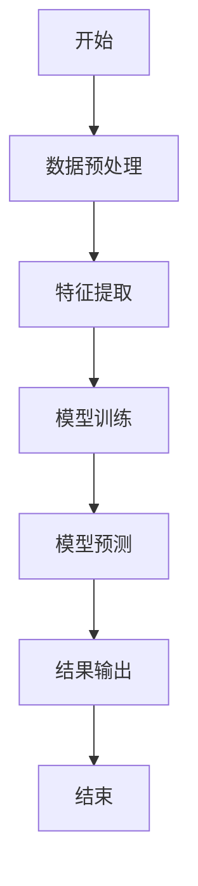
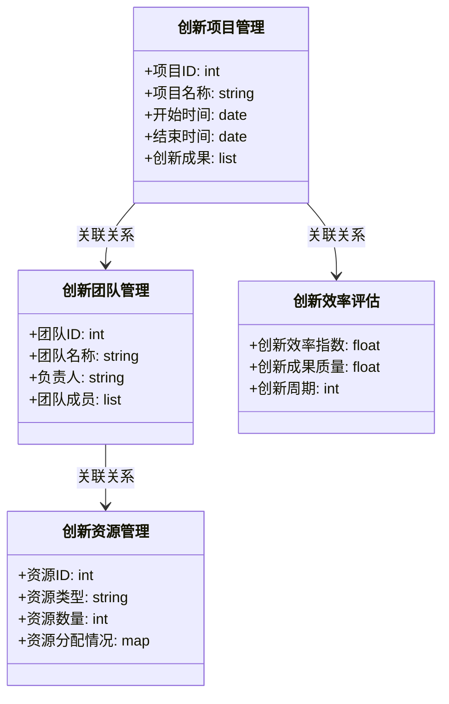
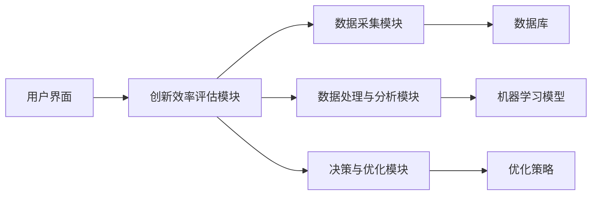

                 


# 利用智能体系统进行全面的公司创新效率评估

**关键词：** 智能体系统, 创新效率, 企业创新, 算法原理, 系统架构

**摘要：**  
随着企业竞争的加剧，创新效率成为企业生存和发展的关键因素。本文将介绍如何利用智能体系统进行全面的公司创新效率评估。通过分析智能体系统的原理、算法、架构以及实际案例，探讨如何有效提升企业的创新能力。文章内容涵盖从理论到实践的各个方面，为读者提供全面的解决方案。

---

## 第1章: 智能体系统与公司创新效率评估概述

### 1.1 智能体系统的基本概念

#### 1.1.1 智能体的定义与特点
智能体（Agent）是指能够感知环境、自主决策并采取行动的实体。它具备以下特点：
- **自主性**：无需外部干预，自主完成任务。
- **反应性**：能够实时感知环境变化并做出反应。
- **协作性**：能够与其他智能体或系统协同工作。

#### 1.1.2 智能体在企业中的应用
智能体在企业中的应用广泛，包括：
- **自动化决策支持**：通过智能体分析数据，提供最优决策建议。
- **实时监控与优化**：智能体能够实时监控企业运营情况，并自动优化资源配置。
- **创新过程管理**：智能体可以协助企业发现创新机会，优化创新流程。

#### 1.1.3 公司创新效率的定义与衡量标准
创新效率是指企业在一定时间内实现创新成果的能力。衡量标准包括：
- **创新周期**：从创意到产品的时间长度。
- **创新质量**：创新成果的市场价值和用户满意度。
- **创新成本**：创新过程中投入的资源和成本。

### 1.2 公司创新效率评估的背景与意义

#### 1.2.1 当前企业创新面临的挑战
企业在创新过程中面临以下挑战：
- **资源分配不当**：创新资源（如资金、人才）难以有效配置。
- **创新过程复杂**：从创意到商业化的过程涉及多个环节，容易出现瓶颈。
- **外部环境变化快**：市场和技术的快速变化要求企业不断创新。

#### 1.2.2 创新效率评估的重要性
创新效率评估能够帮助企业：
- **识别瓶颈**：找到创新过程中的瓶颈，优化资源配置。
- **提升效率**：通过数据分析，提高创新过程的效率。
- **增强竞争力**：在竞争激烈的市场中保持优势。

#### 1.2.3 智能体系统在创新效率评估中的作用
智能体系统能够：
- **实时监控**：实时跟踪创新过程中的关键指标。
- **智能优化**：根据数据分析结果，自动优化创新流程。
- **预测未来趋势**：通过机器学习模型，预测未来的创新趋势。

### 1.3 传统评估方法的局限性

#### 1.3.1 传统评估方法的不足
传统评估方法主要依赖于事后统计和人工分析，存在以下问题：
- **滞后性**：评估结果往往滞后于创新过程。
- **主观性**：依赖于人的经验和判断，缺乏客观性。
- **复杂性**：创新过程涉及多个环节，传统方法难以全面覆盖。

#### 1.3.2 智能体系统的优势
与传统方法相比，智能体系统的优势在于：
- **实时性**：能够实时采集和分析数据。
- **客观性**：基于数据和算法，评估结果更具客观性。
- **全面性**：能够覆盖创新过程的各个环节，提供全面的评估。

#### 1.3.3 智能体系统与传统方法的对比
以下是智能体系统与传统评估方法的对比表格：

| **评估方法** | **优点**                        | **缺点**                          |
|--------------|---------------------------------|-----------------------------------|
| 传统方法    | 简单易懂，成本低               | 滞后性、主观性强，覆盖不全面     |
| 智能体系统   | 实时性、客观性、全面性          | 实施成本高，技术门槛高           |

---

## 第2章: 智能体系统的核心概念与原理

### 2.1 智能体系统的基本原理

#### 2.1.1 智能体的感知与决策机制
智能体通过以下步骤实现感知与决策：
1. **数据采集**：通过传感器或数据接口获取环境数据。
2. **数据处理**：对数据进行清洗、转换和分析。
3. **决策制定**：基于分析结果，制定最优决策。
4. **行动执行**：根据决策结果，采取相应行动。

#### 2.1.2 智能体的自主性与协作性
智能体的自主性使其能够在无外部干预的情况下完成任务，而其协作性则使其能够与其他智能体或系统协同工作，实现更复杂的任务。

#### 2.1.3 智能体的实时反馈与优化
智能体通过实时反馈机制，不断优化自身的决策和行动，从而提高整体效率。

### 2.2 智能体系统的核心模块

#### 2.2.1 数据采集模块
数据采集模块负责从企业内部和外部获取相关数据，例如：
- **内部数据**：员工绩效、项目进度、研发投入等。
- **外部数据**：市场需求、竞争环境、技术趋势等。

#### 2.2.2 数据处理与分析模块
数据处理与分析模块负责对采集到的数据进行清洗、转换和分析，例如：
- **数据清洗**：去除噪声数据，确保数据质量。
- **数据分析**：使用统计分析和机器学习算法，挖掘数据中的有价值信息。

#### 2.2.3 决策与优化模块
决策与优化模块基于分析结果，制定最优决策，并优化创新过程，例如：
- **优化创新流程**：通过算法优化，缩短创新周期。
- **资源分配优化**：合理分配创新资源，提高效率。

### 2.3 智能体系统的属性特征对比

#### 2.3.1 属性特征对比表格
以下是智能体系统的属性特征对比表格：

| **属性**      | **传统方法** | **智能体系统** |
|---------------|--------------|----------------|
| 数据处理能力 | 简单          | 强大            |
| 决策能力      | 低            | 高              |
| 实时性        | 低            | 高              |
| 成本           | 低            | 中              |

#### 2.3.2 ER实体关系图架构
以下是智能体系统的ER实体关系图：

```mermaid
erd
  entity 创新项目 {
    key 项目ID
   属性 项目名称, 开始时间, 结束时间, 创新成果
  }
  entity 创新团队 {
    key 团队ID
    属性 团队名称, 负责人, 团队成员
  }
  entity 创新资源 {
    key 资源ID
    属性 资源类型, 资源数量, 资源分配情况
  }
  relationship 创新项目与创新团队的关系 {
    关联方式：每个创新项目可以有多个创新团队参与
  }
  relationship 创新项目与创新资源的关系 {
    关联方式：每个创新项目可以使用多种创新资源
  }
```

---

## 第3章: 智能体系统评估创新效率的算法原理

### 3.1 创新效率评估模型的数学模型

#### 3.1.1 创新效率指数计算公式
创新效率指数（Innovation Efficiency Index, IEI）的计算公式如下：
$$
IEI = \frac{I + O}{T}
$$
其中，$I$ 表示创新成果的数量，$O$ 表示创新成果的质量，$T$ 表示时间周期。

### 3.2 基于机器学习的预测模型

#### 3.2.1 算法流程图
以下是基于机器学习的创新效率预测模型的流程图：



#### 3.2.2 算法实现代码示例
以下是数据预处理和模型训练的代码示例：

```python
# 数据预处理
import pandas as pd
data = pd.read_csv('innovation_data.csv')
data = data.dropna()  # 去除缺失值

# 特征提取
from sklearn.preprocessing import StandardScaler
scaler = StandardScaler()
X_scaled = scaler.fit_transform(data[['项目ID', '团队ID', '资源ID']])

# 模型训练
from sklearn.ensemble import RandomForestRegressor
model = RandomForestRegressor(n_estimators=100, random_state=42)
model.fit(X_scaled, data['创新效率'])

# 模型预测
import numpy as np
new_data = np.array([[1, 2, 3]])
predicted Efficiency = model.predict(scaler.transform(new_data))
```

---

## 第4章: 系统分析与架构设计

### 4.1 系统分析

#### 4.1.1 问题场景介绍
假设某科技公司希望优化其创新过程，需要一个智能系统来实时监控和优化创新效率。

#### 4.1.2 系统功能设计
以下是系统的功能设计：



### 4.2 系统架构设计

#### 4.2.1 系统架构图
以下是系统的架构图：



---

## 第5章: 项目实战

### 5.1 环境安装与配置

#### 5.1.1 环境要求
- 操作系统：Linux/Windows/MacOS
- Python版本：3.6以上
- 额外依赖：pandas、scikit-learn、mermaid、graphviz

#### 5.1.2 安装依赖
```bash
pip install pandas scikit-learn mermaid graphviz
```

### 5.2 系统核心实现

#### 5.2.1 数据采集模块
```python
import requests
import json

url = 'https://api.example.com/innovation_data'
response = requests.get(url)
data = json.loads(response.text)
```

#### 5.2.2 数据处理与分析模块
```python
import pandas as pd
from sklearn.preprocessing import StandardScaler
from sklearn.ensemble import RandomForestRegressor

# 数据预处理
data = pd.DataFrame(data)
data = data.dropna()

# 特征提取
X = data[['项目ID', '团队ID', '资源ID']]
scaler = StandardScaler()
X_scaled = scaler.fit_transform(X)

# 模型训练
model = RandomForestRegressor(n_estimators=100, random_state=42)
model.fit(X_scaled, data['创新效率'])
```

#### 5.2.3 决策与优化模块
```python
import numpy as np

# 预测创新效率
new_data = np.array([[1, 2, 3]])
predicted_efficiency = model.predict(scaler.transform(new_data))
print(f'预测创新效率为: {predicted_efficiency[0]:.2f}')
```

---

## 第6章: 最佳实践与总结

### 6.1 最佳实践

#### 6.1.1 数据质量管理
- 确保数据的完整性和准确性。
- 定期更新和维护数据。

#### 6.1.2 模型优化
- 使用交叉验证优化模型参数。
- 定期重新训练模型，确保模型的准确性。

### 6.2 小结
智能体系统在公司创新效率评估中具有重要作用。通过实时监控和智能优化，企业能够显著提升创新效率，缩短创新周期，降低创新成本。

### 6.3 注意事项
- 确保系统的安全性和稳定性。
- 遵守相关法律法规，保护数据隐私。

### 6.4 拓展阅读
- 推荐阅读《智能系统与企业创新》。
- 参考相关技术文档和开源项目。

---

## 作者：AI天才研究院/AI Genius Institute & 禅与计算机程序设计艺术 /Zen And The Art of Computer Programming

