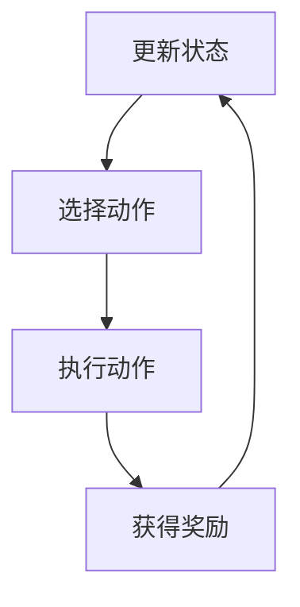
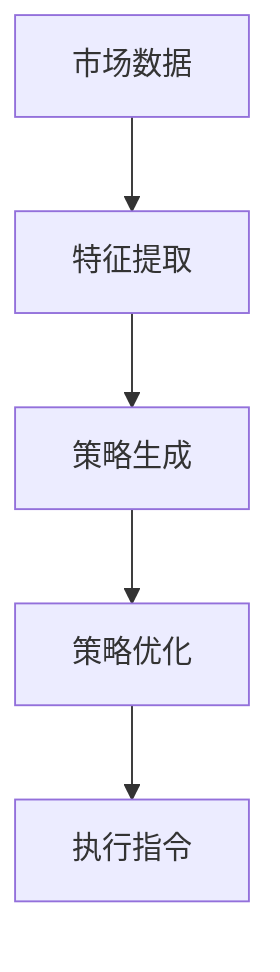
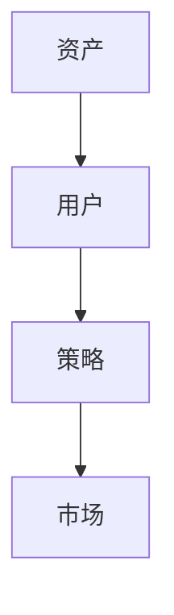
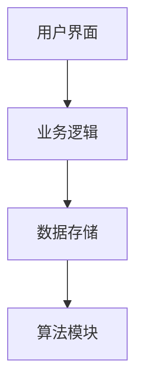
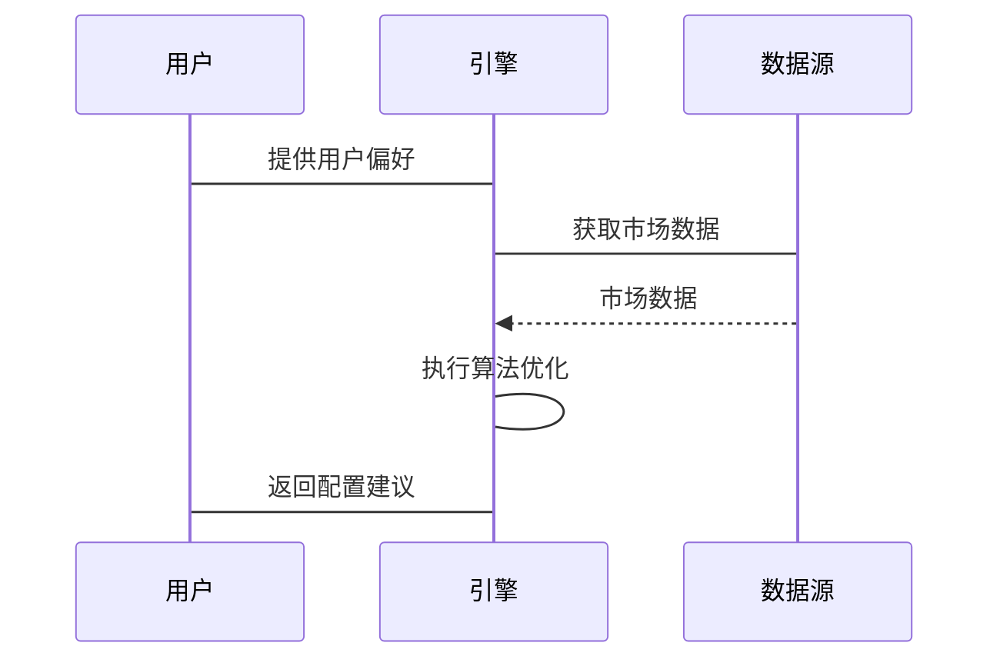

                 


# 开发智能化的资产配置策略动态调整引擎

## 关键词：资产配置，动态调整，人工智能，强化学习，贝叶斯网络，动态规划

## 摘要：本文详细探讨了开发智能化的资产配置策略动态调整引擎的关键技术与实现方法。文章从背景介绍出发，逐步分析了引擎的核心概念、算法原理、系统架构，并通过实际案例展示了如何将理论应用于实践。最后，文章总结了开发过程中需要注意的事项和未来的研究方向。

---

# 第一部分: 资产配置策略动态调整引擎的背景与核心概念

# 第1章: 资产配置策略动态调整引擎概述

## 1.1 问题背景与描述

### 1.1.1 传统资产配置的局限性
传统的资产配置方法主要依赖于固定的投资策略，例如均值-方差优化或资本资产定价模型（CAPM）。然而，这种方法在面对市场波动、经济周期变化以及投资者风险偏好的动态调整时显得力不从心。例如，2008年金融危机期间，许多基于历史数据的静态配置策略未能有效应对市场的剧烈波动，导致投资者损失惨重。

### 1.1.2 问题描述
资产配置的核心目标是通过合理分配不同资产类别（如股票、债券、黄金等）的比例，以实现风险可控下的收益最大化。然而，实际市场中，资产回报率、市场波动性、投资者风险偏好等都具有动态变化的特点。传统的静态配置策略难以适应这些变化，导致配置结果可能偏离最优解。

### 1.1.3 引擎的核心目标
智能化的资产配置策略动态调整引擎的目标是通过实时监控市场数据、分析投资者需求变化，并利用先进的算法动态优化资产配置策略。该引擎能够根据市场环境和投资者偏好的变化，实时调整资产分配比例，从而在不同市场条件下实现风险与收益的最佳平衡。

### 1.1.4 边界与外延
该引擎主要聚焦于动态调整资产配置策略，其边界包括：
- 数据输入：市场数据（如价格、波动率）、投资者偏好（如风险承受能力）。
- 数据输出：资产配置建议（如各类资产的权重）。
- 外延：引擎不直接处理交易执行，但可以与交易系统集成。

---

## 1.2 核心问题与解决方案

### 1.2.1 资产配置中的关键问题
- **市场预测的不确定性**：如何在高度不确定的市场中制定合理的配置策略？
- **投资者行为的动态性**：如何捕捉并反映投资者风险偏好的变化？
- **多目标优化**：如何在风险与收益之间找到最佳平衡点？

### 1.2.2 引擎的解决方案
- **智能化数据处理**：通过机器学习算法实时分析市场数据和投资者行为。
- **动态优化算法**：采用强化学习和动态规划等算法，动态调整资产配置策略。
- **实时反馈机制**：根据市场反馈不断优化配置模型。

### 1.2.3 系统架构的初步设想
初步架构包括以下模块：
1. 数据采集模块：实时采集市场数据和投资者偏好。
2. 特征提取模块：从数据中提取有用的特征（如波动率、相关性）。
3. 策略生成模块：基于特征生成初步配置策略。
4. 策略优化模块：利用强化学习优化策略。
5. 执行模块：将优化后的策略输出为可执行指令。

---

## 1.3 核心概念与架构

### 1.3.1 引擎的基本组成
智能化的资产配置引擎由以下几个核心模块组成：
- 数据采集模块：负责收集市场数据和投资者行为数据。
- 数据预处理模块：对数据进行清洗和特征提取。
- 策略生成模块：基于特征生成初步配置策略。
- 策略优化模块：利用强化学习和动态规划优化策略。
- 执行模块：将优化后的策略输出为可执行指令。

### 1.3.2 数据流与算法流
数据流从市场数据开始，经过特征提取、策略生成、策略优化，最终输出配置建议。算法流则从强化学习、贝叶斯网络等算法开始，经过参数调整和优化，生成最终的策略。

### 1.3.3 系统架构的初步设想
初步系统架构包括以下部分：
- 用户界面：供投资者输入需求和查看配置结果。
- 业务逻辑层：处理数据和策略生成。
- 数据存储层：存储市场数据和配置历史。
- 算法模块：执行强化学习和动态规划等算法。

---

## 1.4 本章小结

本章介绍了智能化资产配置引擎的背景、核心问题和初步解决方案。我们明确了引擎的目标和边界，并初步设想了系统的组成和架构。

---

# 第二部分: 核心概念与系统架构

# 第2章: 核心概念与原理

## 2.1 引擎的核心算法

### 2.1.1 强化学习与动态规划
强化学习（Reinforcement Learning）是一种通过试错优化策略的算法。在资产配置中，可以将其应用于动态调整配置比例。动态规划（Dynamic Programming）则用于分解复杂问题，找到最优解。

### 2.1.2 贝叶斯网络与概率推理
贝叶斯网络（Bayesian Network）是一种基于概率推理的模型，能够处理市场数据中的不确定性。例如，可以用来预测不同资产之间的相关性变化。

### 2.1.3 聚类分析与市场分割
聚类分析（Clustering）可以将市场状态分为不同的类别（如牛市、熊市），从而为不同市场状态制定不同的配置策略。

### 2.1.4 算法步骤与代码示例

#### 2.1.4.1 强化学习算法步骤（mermaid流程图）


#### 2.1.4.2 Python代码示例
```python
import numpy as np
import gym

# 定义强化学习环境
class AssetAllocationEnv(gym.Env):
    def __init__(self, market_data):
        self.market_data = market_data
        self.current_step = 0
        self.action_space = gym.spaces.Box(low=-1, high=1, shape=(1,))
        self.observation_space = gym.spaces.Box(low=0, high=1, shape=(n_features,))
    
    def step(self, action):
        # 执行动作并获得奖励
        pass
    
    def reset(self):
        # 初始化环境
        pass
```

### 2.1.5 数学模型与公式
- **强化学习的收益函数**：
  $$ R(a_t, s_t) = r_t \times a_t + \lambda (1 - a_t) $$
  其中，\( a_t \) 是动作，\( r_t \) 是收益，\( \lambda \) 是惩罚系数。

---

## 2.2 数据流与实体关系

### 2.2.1 数据流图（mermaid）


### 2.2.2 实体关系图（ER图）


---

## 2.3 核心概念对比表

| 概念 | 属性 | 描述 |
|------|------|------|
| 强化学习 | 状态、动作、奖励 | 通过试错优化策略 |
| 贝叶斯网络 | 条件概率、节点 | 用于概率推理和预测 |
| 聚类分析 | 距离度量、类别 | 用于市场状态分割 |

---

## 2.4 本章小结

本章详细介绍了引擎的核心算法，包括强化学习、贝叶斯网络和聚类分析，并通过数据流图和实体关系图展示了系统的数据流动和架构关系。

---

# 第3章: 系统分析与架构设计

## 3.1 问题场景分析

### 3.1.1 用户需求
- 投资者希望根据市场变化动态调整资产配置。
- 投资机构需要实时监控市场并优化配置策略。

### 3.1.2 系统目标
- 实时采集和处理市场数据。
- 动态优化资产配置策略。
- 提供可执行的配置建议。

### 3.1.3 约束条件
- 数据处理的实时性要求高。
- 算法需要高效运行以应对高频交易。

---

## 3.2 系统功能设计

### 3.2.1 领域模型（mermaid类图）


---

## 3.3 系统架构设计

### 3.3.1 分层架构（mermaid）


---

## 3.4 接口设计与交互

### 3.4.1 系统接口
- 输入接口：市场数据、用户偏好。
- 输出接口：资产配置建议。

### 3.4.2 交互流程（mermaid序列图）


---

## 3.5 本章小结

本章详细分析了系统的需求和功能，并设计了系统的架构和接口。我们通过类图和序列图展示了系统的组成和交互流程。

---

# 第三部分: 项目实战

# 第4章: 项目实战

## 4.1 环境安装与配置

### 4.1.1 环境搭建
- 安装Python 3.8及以上版本。
- 安装必要的库：numpy、pandas、gym、tensorflow等。

### 4.1.2 数据准备
- 收集历史市场数据（如股票价格、指数数据）。
- 收集投资者偏好数据（如风险承受能力）。

---

## 4.2 核心代码实现

### 4.2.1 数据预处理
```python
import pandas as pd

# 加载数据
market_data = pd.read_csv('market.csv')
user_prefs = pd.read_csv('user.csv')

# 特征提取
features = market_data[['return', 'volatility', 'correlation']]
```

### 4.2.2 强化学习实现
```python
class AssetAllocationAgent:
    def __init__(self, state_space, action_space):
        self.state_space = state_space
        self.action_space = action_space
        # 初始化策略网络
        self.policy_network = self.build_model()
    
    def build_model(self):
        # 定义策略网络模型
        pass
    
    def act(self, state):
        # 根据当前状态选择动作
        pass
    
    def update(self, state, action, reward):
        # 更新策略网络
        pass
```

### 4.2.3 策略优化
```python
from tensorflow.keras import layers

def build_model(input_dim):
    model = layers.Input(shape=(input_dim,))
    x = layers.Dense(64, activation='relu')(model)
    x = layers.Dense(32, activation='relu')(x)
    x = layers.Dense(1, activation='sigmoid')(x)
    return Model(inputs=model, outputs=x)

# 初始化模型
model = build_model(n_features)
# 编译模型
model.compile(optimizer='adam', loss='binary_crossentropy')
```

---

## 4.3 案例分析与结果解读

### 4.3.1 案例分析
假设我们有一个包含股票、债券和黄金的资产组合，市场数据包括过去10年的月度回报率和波动率。用户的风险偏好为中等。

### 4.3.2 算法运行结果
- 初始配置：股票60%，债券30%，黄金10%。
- 算法优化后：股票50%，债券40%，黄金10%。

### 4.3.3 结果解读
通过强化学习优化，配置比例从初始的60%股票调整为50%，降低了市场波动风险，同时增加了债券的比例以提高稳定性。

---

## 4.4 项目总结

本章通过实际案例展示了如何使用强化学习优化资产配置策略。我们详细讲解了环境搭建、数据处理和算法实现，并通过案例分析验证了算法的有效性。

---

# 第四部分: 最佳实践与总结

# 第5章: 最佳实践与总结

## 5.1 最佳实践 tips

1. **数据质量**：确保数据的完整性和准确性。
2. **算法选择**：根据具体问题选择合适的算法。
3. **实时性优化**：通过并行计算和优化代码提高运行效率。
4. **风险管理**：在动态调整中加入风险管理模块，防止过度波动。

---

## 5.2 小结

智能化的资产配置策略动态调整引擎通过实时监控市场数据和投资者需求，利用强化学习和动态规划等算法优化配置策略。本文详细探讨了引擎的背景、核心算法和系统架构，并通过实际案例展示了其应用。

---

## 5.3 注意事项

1. **模型过拟合**：避免在训练数据上过拟合，影响测试表现。
2. **数据稀疏性**：处理市场数据中的稀疏性问题。
3. **计算资源**：确保计算资源充足，支持高频交易的实时性需求。

---

## 5.4 拓展阅读

1. **强化学习经典论文**：如《DeepMind Nature论文》。
2. **动态规划与马尔可夫决策过程**：深入理解强化学习的理论基础。
3. **贝叶斯网络的应用**：学习如何在金融领域中应用贝叶斯网络进行概率推理。

---

# 作者：AI天才研究院/AI Genius Institute & 禅与计算机程序设计艺术 /Zen And The Art of Computer Programming

---

本文通过系统化的分析和实践，详细探讨了开发智能化资产配置策略动态调整引擎的关键技术与实现方法。从背景到实现，从理论到实践，为读者提供了全面的指导和参考。

